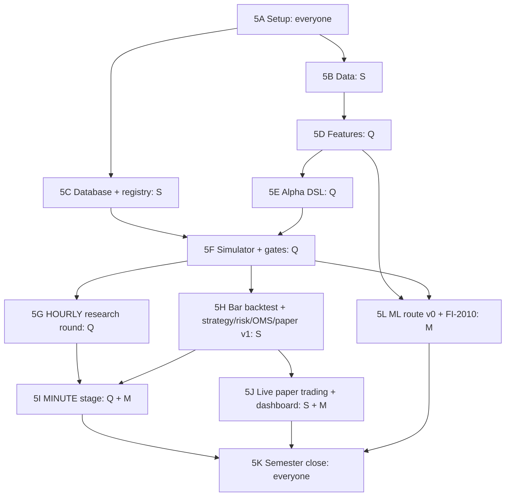

# 5th Semester Plan: Alpha Research Loop on Bar Data (HOURLY → MINUTE)

| | |
|---|---|
| **Period** | ~16 working weeks (5th sem, Jul–Dec 2026; implementation starts mid-Sep 2026). Adjust week numbers to your calendar. |
| **Priority** | Priority 1: Alpha / Quant |
| **Data** | Binance spot 1h (2017 →) and 1m klines · 5-coin universe BTC, ETH, SOL, BNB, XRP · FI-2010 (ML track) |
| **Reference** | [../ARCHITECTURE_AND_TECH_STACK.md](../ARCHITECTURE_AND_TECH_STACK.md) · spec [../docs/spec/HELIOS_SRS_and_System_Design_v1.md](../docs/spec/HELIOS_SRS_and_System_Design_v1.md) |
| **Owners** | **Q** Quant researcher · **S** Systems engineer · **M** ML engineer |

## Goal of this semester

By the end of the 5th semester HELIOS must run **one complete loop on bar data**:

```
Binance bars → features → alpha (formula or ML) → simulator → gates → registry
→ PROMOTED alpha → bar backtest (strategy → risk → OMS → paper venue → P&L)
→ live paper trading on real-time bars → paper-vs-backtest report
```

It is done first for **hourly** data, then repeated for **minute** data **by changing configuration only**.

**Not in this semester:** order book, two-sided quoting, DGT, C++, Go, TLA+, cluster. Those come later on purpose (scope guard).

## How the three tracks run in parallel



Each task is meant to take **½ to 3 days** for one person. "Needs" lists the tasks that must be finished first.

---

## 5A Environment and project setup (Weeks 1–2, everyone)

| ID | Task | Owner | Needs | Done when |
|---|---|---|---|---|
| 5A-01 | Free disk space on the laptop (C: had ~10 GB free) or move work to another drive | All | — | ≥40 GB free where WSL2, Docker and data will live |
| 5A-02 | Install WSL2 Ubuntu 24.04; install git, build-essential, curl, Python 3.12, **uv** | All | 5A-01 | `uv --version` and `python3 --version` work inside WSL |
| 5A-03 | Install Docker Desktop with WSL2 backend | All | 5A-02 | `docker run hello-world` works from WSL |
| 5A-04 | Create private GitHub repo; add monorepo skeleton from architecture doc §7; `.gitignore` with `data/`, `.env`, `*.parquet` | S | 5A-02 | Repo cloned by all three members |
| 5A-05 | Move existing docs into `docs/spec/` and `docs/reports/`; move `data/` downloads into repo `data/` (gitignored) | S | 5A-04 | Folder layout matches architecture doc |
| 5A-06 | Python package `research/helios` with `pyproject.toml` (uv); add numpy, pandas, pyarrow, duckdb, pydantic, pytest, hypothesis, ruff, mypy | S | 5A-04 | `uv run pytest` passes an empty test |
| 5A-07 | pre-commit: ruff, ruff-format, end-of-file fixer, **gitleaks** | S | 5A-06 | A commit with a fake secret is blocked |
| 5A-08 | GitHub Actions `ci.yml`: install with uv → ruff → mypy → pytest | S | 5A-06 | Green CI badge on `main` |
| 5A-09 | `infra/docker-compose.yml` with PostgreSQL 16 + Adminer; `.env.example` | S | 5A-03 | Can connect to Postgres from Python |
| 5A-10 | `helios.common.config`: load YAML → pydantic model → `config_hash()` (sha256 of canonical JSON) | S | 5A-06 | Unit test: same config → same hash; key order irrelevant |
| 5A-11 | `docs/TEAM.md`: assign names to Q / S / M roles, module owners, branch + PR rules, task IDs in commits | All | 5A-04 | File merged; every module has one owner |
| 5A-12 | **Decision ADRs:** ADR-001 stack (point to architecture doc) · ADR-002 **Fitness formula** (recommended: `Sharpe × sqrt(|annual_return| / max(turnover, floor))`, floor fixed here) · ADR-003 horizon families + periods_per_year + daily-aggregated Sharpe rule · ADR-004 split dates · ADR-005 default fees (verify on exchange fee page) | Q | 5A-11 | Five ADRs merged; `configs/gates_v1.yaml` created |
| 5A-13 | `helios.common.lineage.RunContext`: captures git commit (fail if dirty tree for reported runs), config hash, data snapshot id, seed | S | 5A-10 | Every script can call `RunContext.capture()` |

**Suggested split dates (to confirm in ADR-004)**

| Stage | TRAIN | VALID | TEST |
|---|---|---|---|
| Hourly | 2018-01-01 → 2022-12-31 | 2023-01-08 → 2024-06-30 | 2024-07-07 → 2026-08-31 |
| Minute | 2024-09-01 → 2025-08-31 | 2025-09-01 (+1 day embargo) → 2026-02-28 | 2026-03-01 (+1 day embargo) → 2026-08-31 |

---

## 5B Data layer for bars (Weeks 2–4, S)

| ID | Task | Owner | Needs | Done when |
|---|---|---|---|---|
| 5B-01 | `scripts/download_binance.py`: resumable download of monthly kline zips with **SHA256 checksum** check (Binance publishes `.CHECKSUM` files) | S | 5A-06 | Re-running skips existing verified files |
| 5B-02 | Download 1h klines for ETH, SOL, BNB, XRP (BTC already present) → 5-coin universe | S | 5B-01 | 5 folders of 1h zips |
| 5B-03 | Download 1m klines for ETH, SOL, BNB, XRP for 2024-09 → 2026-08 (~50 MB each) | S | 5B-01, 5A-01 | 5 × 24 monthly zips present |
| 5B-04 | `helios.data.binance.read_klines(zip)` → DataFrame with named columns | S | 5A-06 | Unit test on a tiny fixture zip in `tests/fixtures/` |
| 5B-05 | Timestamp normalisation: detect ms (pre-2025) vs µs (2025 →) → int64 UTC microseconds | S | 5B-04 | Test with one 2024 row and one 2025 row gives correct dates |
| 5B-06 | Row validation: prices > 0, `high ≥ max(open, close)`, `low ≤ min(open, close)`, volume ≥ 0; bad rows reported, never silently fixed | S | 5B-04 | Validation report written per file |
| 5B-07 | Gap and duplicate detection on the expected 1h / 1m grid; write `gaps.parquet`; **never fill gaps** | S | 5B-05 | Known missing bars (if any) appear in the report |
| 5B-08 | Writer: canonical Parquet `data/processed/bars/source=binance/interval=…/symbol=…/year=…` | S | 5B-06 | Parquet for all 5 coins, both intervals |
| 5B-09 | `data_snapshots` registration: id, source, interval, symbols, date range, file checksums | S | 5C-02, 5B-08 | Each processed dataset has a snapshot id |
| 5B-10 | `helios.data.load_bars(symbols, interval, start, end)` using DuckDB over Parquet | S | 5B-08 | Loads 9 years of hourly for 5 coins in < 5 s |
| 5B-11 | Sanity test: resample 1m → 1h and compare with downloaded 1h on the overlap | S | 5B-10 | Close/volume match within tolerance; mismatches listed |
| 5B-12 | `instruments` config: symbol, tick size, lot size, listing date (so the universe on a date includes only listed coins, BT-024) | S | 5C-02 | SOL is excluded before its listing date automatically |

---

## 5C Database and alpha registry (Weeks 3–5, S)

| ID | Task | Owner | Needs | Done when |
|---|---|---|---|---|
| 5C-01 | Alembic migrations set up against Docker Postgres | S | 5A-09 | `alembic upgrade head` works |
| 5C-02 | Tables: `instruments`, `data_snapshots`, `experiments` | S | 5C-01 | Migration merged |
| 5C-03 | Tables: `alpha_definitions` (PK alpha_id + version), `alpha_results`, `alpha_gate_config`, `test_set_access` | S | 5C-02 | Migration merged |
| 5C-04 | DB triggers blocking UPDATE/DELETE on `alpha_definitions` and `alpha_results` | S | 5C-03 | Test: UPDATE raises an error |
| 5C-05 | `helios.registry` API: `register_definition`, `record_result`, `get_alpha`, `list_alphas` | S | 5C-03 | Unit tests pass |
| 5C-06 | Status state machine DRAFT → SIMULATED → EVALUATED → PROMOTED / REJECTED / INVALID → RETIRED; illegal transitions raise | S | 5C-05 | Property test with random transitions |
| 5C-07 | Test-set access counter: 3rd access raises; access logged with actor and purpose | S | 5C-05 | Test proves the 3rd access fails |
| 5C-08 | Experiment pre-registration: hypothesis text + params saved **before** the run; results link to it | S | 5C-02 | A run without an experiment id is refused |
| 5C-09 | Tables for trading (used in 5H): `strategies`, `risk_limits`, `orders`, `fills`, `positions_snapshot`, `pnl_snapshots`, `risk_events`, `backtest_runs`, `audit_events` | S | 5C-01 | Migration merged |

---

## 5D Feature engine v1: bar features (Weeks 4–6, Q)

| ID | Task | Owner | Needs | Done when |
|---|---|---|---|---|
| 5D-01 | Feature registry: `@feature(name, lookback, warmup, units)` decorator; feature_set_version | Q | 5A-06 | Registry lists features with metadata |
| 5D-02 | Returns: log return over 1, 4, 24 bars | Q | 5D-01, 5B-10 | Unit test against hand calculation |
| 5D-03 | Momentum: price vs rolling mean (12, 48, 168 bars), rolling return rank | Q | 5D-02 | Tests pass |
| 5D-04 | Volatility: rolling std of returns, Parkinson and Garman–Klass (uses high/low) | Q | 5D-02 | Tests pass |
| 5D-05 | Volume: rolling volume z-score, dollar volume | Q | 5D-01 | Tests pass |
| 5D-06 | **Taker-buy ratio** = taker_buy_base / volume and its z-score (bar-level flow imbalance) | Q | 5D-01 | Tests pass |
| 5D-07 | Trade intensity: n_trades z-score; average trade size | Q | 5D-01 | Tests pass |
| 5D-08 | Calendar: hour-of-day, day-of-week (crypto is 24/7) | Q | 5D-01 | Tests pass |
| 5D-09 | Trailing standardisation helpers: `zscore(x, window)`, `rank_ts(x, window)`; **no full-sample stats anywhere** | Q | 5D-01 | Grep/lint rule + test |
| 5D-10 | Warm-up: value is UNAVAILABLE (NaN + mask) until lookback is filled | Q | 5D-09 | First `window-1` values are masked |
| 5D-11 | **Causality test:** change all data after time t → features at ≤ t must not change | Q | 5D-02..08 | Property test passes for every registered feature |
| 5D-12 | Feature writer: `data/processed/features/feature_set=v1/...` + interval as config only | Q | 5D-11 | Same code builds hourly and minute features |

---

## 5E Alpha framework (Weeks 6–7, Q)

| ID | Task | Owner | Needs | Done when |
|---|---|---|---|---|
| 5E-01 | `AlphaDefinition` YAML: alpha_id, version, provenance (QUANT/ML), horizon_family, params, expression, author | Q | 5C-05 | Loads and registers into DB |
| 5E-02 | Safe expression DSL (parse to AST, no `eval`): `+ - * /`, `zscore`, `ts_mean`, `ts_std`, `rank_ts`, `lag(x, k≥1)`, `sign`, `clip`, `where` | Q | 5E-01, 5D-12 | Evaluates example expressions |
| 5E-03 | DSL safety: reject negative lags, unknown functions, full-sample ops (ALG-003) | Q | 5E-02 | Tests: forbidden expressions raise |
| 5E-04 | Cross-sectional ops over the 5-coin universe: `cs_rank`, `cs_demean` (neutralise) | Q | 5E-02 | Tests pass |
| 5E-05 | Output bounding: final alpha clipped to [-1, 1]; scale convention stored | Q | 5E-02 | Test |
| 5E-06 | **Baseline alphas** (ALG-012): B0 = sign(24h return) momentum · B1 = −zscore(1h return) reversal · B2 = zscore(taker-buy ratio) | Q | 5E-05 | Three alphas registered as DRAFT |
| 5E-07 | Count free parameters per alpha automatically (ALG-006) | Q | 5E-02 | Stored in definition |

---

## 5F Alpha simulator, metrics and gates (Weeks 7–9, Q)

| ID | Task | Owner | Needs | Done when |
|---|---|---|---|---|
| 5F-01 | Position mapping `pos_t = clip(alpha_t / scale, −1, 1)`; return uses **pos_{t−1} × ret_t** (SIM-001) | Q | 5E-05 | Hand-calculated 5-bar example matches |
| 5F-02 | Cost model: `turnover × cost_bps`; cost_bps from `configs/fees.yaml` | Q | 5F-01 | Gross and net P&L both produced |
| 5F-03 | Metrics: return, volatility, Sharpe (per-period and **daily-aggregated**), turnover, max drawdown + duration, hit rate | Q | 5F-02 | Tests against known series |
| 5F-04 | Fitness (formula from ADR-002), stored with constants | Q | 5F-03, 5A-12 | Test |
| 5F-05 | IC: time-series IC per coin; cross-sectional IC across 5 coins; IC-IR | Q | 5F-03 | Tests; single-coin CS-IC shows N/A |
| 5F-06 | Cost sensitivity sweep (0.5×, 1×, 2×, 3×, 4× cost) | Q | 5F-02 | Curve saved in result |
| 5F-07 | Stability: Sharpe per calendar month (mean, min, % > 0); regime breakdown by volatility terciles | Q | 5F-03 | Saved in result |
| 5F-08 | Validity checks → **INVALID** (not REJECTED): constant alpha, too few observations, NaN after warm-up | Q | 5F-03 | Tests |
| 5F-09 | Split engine: TRAIN / VALID / TEST with embargo; metrics per split; TEST access goes through 5C-07 | Q | 5F-03, 5C-07 | Tests |
| 5F-10 | Gate evaluator G1–G6 from `gates_v1.yaml`; per-gate PASS/FAIL + threshold used; `gate_config_hash` saved | Q | 5F-04..07 | Tests: a crafted series passes / fails each gate |
| 5F-11 | **Simulator calibration pair:** noise alpha → Sharpe ≈ 0 (SIM-014); future-peeking alpha → very high Sharpe (SIM-015) | Q | 5F-03 | Both tests in CI |
| 5F-12 | **Leakage suite v1** (BT-031): noise, future-peek, constant → INVALID, shifted features degrade performance; pytest marker `leakage`, **merge-blocking** | Q | 5F-11 | CI job fails if any check inverts |
| 5F-13 | `helios.sim.evaluate(alpha_id)` → writes `alpha_results` row with full lineage | Q | 5F-10, 5A-13 | One call evaluates and stores a baseline |
| 5F-14 | Parallel evaluation of many alphas (process pool, no shared state) | Q | 5F-13 | 20 alphas evaluated in one command |
| 5F-15 | Alpha report (Markdown/HTML): equity curve, drawdown, cost curve, monthly stability, gate table | Q | 5F-13 | Report generated for B0–B2 |

---

## 5G HOURLY research round (Weeks 9–11, Q)

| ID | Task | Owner | Needs | Done when |
|---|---|---|---|---|
| 5G-01 | Evaluate baselines B0–B2 on TRAIN + VALID (hourly) | Q | 5F-15 | 3 results stored |
| 5G-02 | Pre-register 8–10 hourly hypotheses (momentum/reversal blends, volatility-scaled momentum, taker-flow, volume-shock, cross-sectional rank) | Q | 5C-08 | Experiments rows exist before any run |
| 5G-03 | Implement candidates as DSL YAML files | Q | 5G-02 | Files in `configs/alphas/hourly/` |
| 5G-04 | Evaluate on VALID; iterate on VALID only; log every parameter tried (ALG-005) | Q | 5G-03 | All versions stored, including failures |
| 5G-05 | Search-effort summary: number tried, best vs baseline (SIM-007) | Q | 5G-04 | Table in research note |
| 5G-06 | Final TEST run for at most 2–3 best candidates (≤2 accesses each) | Q | 5G-05 | TEST results stored; counter updated |
| 5G-07 | Promote or reject; write `docs/research/hourly_round1.md` with negatives included | Q | 5G-06 | Note merged; statuses set |

---

## 5H Bar backtester + Strategy / Risk / OMS / Paper venue v1 (Weeks 9–13, S)

| ID | Task | Owner | Needs | Done when |
|---|---|---|---|---|
| 5H-01 | Write the core **interfaces** (`MarketDataSource`, `AlphaModel`, `Strategy`, `RiskEngine`, `ExecutionVenue`) from architecture doc §8 + ADR-006 | S | 5A-12 | Merged; mypy passes |
| 5H-02 | Event/record types: Bar, AlphaValue, OrderAction, NewOrder, Order, ExecutionReport, Fill, Position, PnLSnapshot, RiskDecision (reason codes enum) | S | 5H-01 | Types merged |
| 5H-03 | Historical bar `MarketDataSource` (replays Parquet bars in time order, tie-break by symbol) | S | 5H-02, 5B-10 | Iterates 1 year hourly for 5 coins |
| 5H-04 | Event loop / clock: decide at bar close t; orders act at **bar t+1 open** (decision latency) | S | 5H-03 | Test: no order can fill at the decision bar |
| 5H-05 | Strategy v1 (bar): alpha → target position (notional per coin) → order size; **rebalance threshold** (hysteresis) | S | 5H-04 | Unit tests; small alpha changes create no orders |
| 5H-06 | Risk v1 check chain: halted? → tradable → max order size → price band vs trailing median → **projected** position limit → exposure limit → daily loss limit; fail-closed; reason codes | S | 5H-02 | Test per reason code; internal error rejects |
| 5H-07 | Kill switch v1 (manual flag) + automatic trip on loss limit; `risk_events` rows | S | 5H-06 | Test: zero orders after trip |
| 5H-08 | OMS v1: order_id + client_order_id idempotency; states CREATED → PENDING_NEW → ACCEPTED → PARTIALLY_FILLED → FILLED / CANCELLED / REJECTED; invariant filled + remaining = qty | S | 5H-02 | Hypothesis property test on random event sequences |
| 5H-09 | Bar paper venue v1 (implements `ExecutionVenue`): market order fills at next open ± slippage bps; limit order fills only if next bar **trades through** the price; maker/taker fees; `is_simulated=true` | S | 5H-08 | Unit tests |
| 5H-10 | P&L ledger (§24.5 algorithm): realised, unrealised, fees; **booked on fills only**; reconciliation invariant check at every snapshot | S | 5H-09 | Property test: ledger always reconciles |
| 5H-11 | **Hand-verified scenario** (T-20): 10 bars, 3 trades computed by hand in a spreadsheet | S | 5H-10 | Backtest equals spreadsheet exactly |
| 5H-12 | Backtest runner: config → run → `backtest_runs` + orders/fills/pnl in DB; mode = BACKTEST | S | 5H-11, 5C-09 | One command runs a backtest |
| 5H-13 | Backtest report: gross/net P&L, drawdown, exposure, trade count, fees, turnover, per-coin P&L | S | 5H-12 | Report generated |
| 5H-14 | Run backtest for the promoted hourly alpha (or best candidate if none promoted) | S+Q | 5H-13, 5G-07 | Report + note of result (honest) |

---

## 5L ML route v0 + FI-2010 preparation (Weeks 6–14, M)

| ID | Task | Owner | Needs | Done when |
|---|---|---|---|---|
| 5L-01 | Dataset builder from feature store: X = features at t, y = forward return over horizon h; **purge/embargo ≥ h** between splits (ALG-021) | M | 5D-12, 5F-09 | Test: no label window crosses a split boundary |
| 5L-02 | Baseline models: ridge / logistic regression, then LightGBM (fixed seeds) | M | 5L-01 | Validation metrics logged |
| 5L-03 | Probability calibration on VALID only (isotonic / Platt) | M | 5L-02 | Calibration curve saved |
| 5L-04 | Prediction → alpha: calibrate → expected edge → **subtract cost** → trailing z-score → clip (ALG-028) | M | 5L-03 | ML AlphaValue series produced |
| 5L-05 | Register as provenance=ML with model reference; evaluate through the **same simulator and gates** | M | 5L-04, 5F-13 | ML result rows in registry |
| 5L-06 | Shuffled-label control: performance ≈ chance (leakage suite item 4) | M | 5L-05 | Added to leakage suite |
| 5L-07 | FI-2010 loader: unzip, parse matrix (rows 1–40 LOB, 41–144 features, last 5 labels), per-day split as DeepLOB | M | 5A-06 | Shapes match paper description |
| 5L-08 | FI-2010 simple baselines (logistic, MLP) over ≥3 seeds, mean ± std | M | 5L-07 | Results table (measured only) |
| 5L-09 | Start DeepLOB re-implementation in PyTorch on FI-2010 (training runs on free GPU) | M | 5L-08 | Training loop runs; first numbers recorded |

---

## 5I MINUTE stage (Weeks 12–14, Q + M)

| ID | Task | Owner | Needs | Done when |
|---|---|---|---|---|
| 5I-01 | Build minute features with interval = 1m (**config change only**, NFR-030) | Q | 5D-12, 5B-08 | Minute feature Parquet exists without code change |
| 5I-02 | H-MINUTE family config: periods_per_year 525,600, minute split dates, gate config per family | Q | 5A-12 | Config merged |
| 5I-03 | Baselines + 6–8 pre-registered minute hypotheses evaluated on VALID | Q | 5I-02, 5G-07 | Results stored |
| 5I-04 | Minute ML alpha via 5L pipeline | M | 5L-05, 5I-01 | ML minute result stored |
| 5I-05 | Cost reality check: show edge vs fees; cost-sensitivity curves (fees matter much more at minute level) | Q | 5I-03 | Plot in note |
| 5I-06 | TEST for best 2 candidates; promote/reject; bar backtest of best minute alpha | Q+S | 5I-05, 5H-13 | Backtest report |
| 5I-07 | `docs/research/minute_round1.md`: hourly vs minute comparison using **daily-aggregated Sharpe** | Q | 5I-06 | Note merged |

---

## 5J Live paper trading on bars + dashboard (Weeks 13–15, S + M)

| ID | Task | Owner | Needs | Done when |
|---|---|---|---|---|
| 5J-01 | Live `MarketDataSource`: Binance public WebSocket kline stream (1m), reconnect + gap detection; **no API keys, no real orders** | S | 5H-03 | Runs 24 h without crash; gaps logged |
| 5J-02 | PAPER mode runner: same strategy/risk/OMS/paper venue as backtest; mode = PAPER, `is_simulated = true` | S | 5J-01, 5H-12 | Paper orders/fills appear in DB |
| 5J-03 | Deploy the paper runner on an always-on machine (small VM or a spare PC) with docker-compose | S | 5J-02 | Runs unattended |
| 5J-04 | Streamlit dashboard page 1: alpha registry browser + alpha reports | M | 5F-15 | Page shows all alphas with statuses |
| 5J-05 | Dashboard page 2: paper P&L, positions, orders, risk state, **mode badge** | M | 5J-02 | Live page updates |
| 5J-06 | Kill switch control (local) + `audit_events` row for every limit change / trip | S | 5H-07 | Test: trip from dashboard blocks orders |
| 5J-07 | Run paper trading ≥ 7 days on the promoted minute (or hourly) alpha | S | 5J-03 | 7 days of paper records |
| 5J-08 | Paper-vs-backtest comparison report over the same days | Q | 5J-07 | Divergences explained |

---

## 5K Semester close (Weeks 15–16, everyone)

| ID | Task | Owner | Needs | Done when |
|---|---|---|---|---|
| 5K-01 | Reproducibility check: pick a random stored result, re-run from lineage, get identical numbers (DAT-002) | Q | all | Identical output confirmed |
| 5K-02 | CI review: leakage suite, property tests, registry tests all merge-blocking | S | all | Branch protection shows required checks |
| 5K-03 | Update spec/SRS with decisions (crypto data, horizon progression, stack) | All | all | Docs updated |
| 5K-04 | 5th-semester report + demo video (data → alpha → gates → backtest → paper) | All | all | Submitted |
| 5K-05 | Carry-over list for 6th sem (unfinished tasks with IDs) | All | all | `6thSem/carryover_from_5th.md` written |

---

## Exit criteria for the 5th semester (all must hold)

- [ ] Hourly **and** minute data for 5 coins loaded, validated, gap-reported, snapshot-registered
- [ ] Feature engine with causality tests green
- [ ] Alpha DSL + simulator + gates G1–G6 + registry working; calibration pair and **leakage suite merge-blocking**
- [ ] ≥1 hourly and ≥1 minute research round completed and documented (including failures)
- [ ] ≥1 ML-provenance alpha evaluated through the same gates
- [ ] Bar backtester with strategy → risk → OMS → paper venue → P&L; hand-verified scenario passes
- [ ] Live paper trading ran ≥7 days; paper-vs-backtest report written
- [ ] Every stored result reproducible from lineage

## Handoff to the 6th semester

Interfaces (`ExecutionVenue`, `RiskEngine`, `Strategy`) · registry + gates · feature registry · leakage suite · risk v1 / OMS v1 / ledger · live data runner · FI-2010 loader + baseline numbers · DeepLOB training loop.
