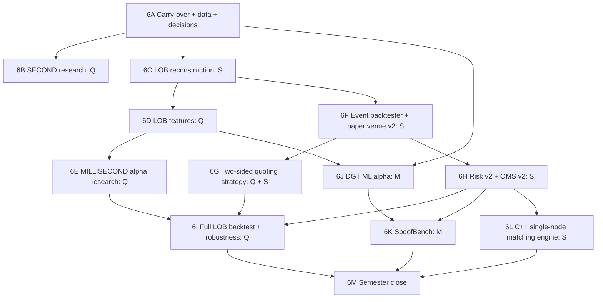

# 6th Semester Plan: Order Book, HFT Strategy and ML Alpha (SECOND → MILLISECOND)

| | |
|---|---|
| **Period** | ~16–18 working weeks (6th sem, Jan–May 2027). Adjust week numbers to your calendar. |
| **Priority** | Finish Priority 1 (alpha/quant at tick and order-book level, DGT ML alpha, SpoofBench). Start Priority 2 with a **single-node C++ matching engine**. |
| **Data** | Binance 1s klines + aggTrades · Bybit spot L2 order book (200 levels, 100 ms) · own recorded WebSocket data · FI-2010 |
| **Reference** | [../ARCHITECTURE_AND_TECH_STACK.md](../ARCHITECTURE_AND_TECH_STACK.md) · [../5thSem/5thSem_Plan.md](../5thSem/5thSem_Plan.md) |
| **Owners** | **Q** Quant researcher · **S** Systems engineer · **M** ML engineer |

## Prerequisites from the 5th semester (must be green before starting)

5F-12 leakage suite · 5C registry + state machine · 5H-01 interfaces · 5H-06 risk v1 · 5H-08 OMS v1 · 5H-10 ledger · 5J-02 PAPER runner · 5L-07 FI-2010 loader. Anything unfinished goes into `carryover_from_5th.md` and is done in week 1–2.

## Goal of this semester

```
Tick / order-book data → LOB reconstruction → microstructure features
→ second & millisecond alphas (quant + DGT) → gates
→ event-driven LOB backtest with queue-aware fills
→ two-sided inventory-aware quoting → risk v2 (breaker, kill switch) → OMS v2
→ paper venue v2 → P&L
+ SpoofBench stresses risk controls
+ C++ matching engine (single node) passes the same venue conformance suite
```

**Not in this semester:** replication/SDR, Go, TLA+, chaos, C++ hot-path porting, pinning, Kubernetes. Those come in the 7th.

## Track flow



**Scope guard:** 6L (matching engine) starts only after 6F and 6H are done.

---

## 6A Carry-over, data and decisions (Weeks 1–2)

| ID | Task | Owner | Needs | Done when |
|---|---|---|---|---|
| 6A-01 | Finish all items in `carryover_from_5th.md` | All | — | List empty or re-planned |
| 6A-02 | `scripts/download_bybit_orderbook.py`: resumable, checksum/size check, spot BTCUSDT + ETHUSDT ob200, **30 days** (~60 MB/day zipped each) | S | 5B-01 | 60 files present; disk plan documented |
| 6A-03 | Download Binance 1s klines + aggTrades for the same 30 days (BTC, ETH) | S | 5B-01 | Files present |
| 6A-04 | **ADR-007 fill model** (OPEN-05): queue-aware default, optimistic + pessimistic reported, `cancel_ahead_fraction = 0.5` default, L2 queue position is estimated (no order IDs) | Q | — | ADR merged |
| 6A-05 | **ADR-008** H-SECOND and H-MICRO families: decision intervals (1 s, 100 ms), periods_per_year, split dates for 30-day data, gate interpretation (inventory turnover + quote replacement rate reported separately) | Q | 5A-12 | ADR + `gates_v1.yaml` families |
| 6A-06 | **WebSocket recorder** (Python, asyncio): Bybit `orderbook.200` + `publicTrade` and Binance depth + trades for BTC/ETH → daily compressed JSONL, reconnect + gap log | S | 5J-01 | Runs 7 days unattended on the always-on machine |
| 6A-07 | Keep the recorder running all semester (this becomes the 7th-sem replay dataset) | S | 6A-06 | Daily files keep appearing; weekly check |
| 6A-08 | `proto/` folder: first protobuf schemas for MarketEvent, NewOrder, ExecutionReport, Fill (used by C++ in 6L and Go in 7th) | S | 5H-02 | `protoc` generates Python + C++ code |

---

## 6B SECOND-stage research (Weeks 2–4, Q)

| ID | Task | Owner | Needs | Done when |
|---|---|---|---|---|
| 6B-01 | Loader for Binance 1s klines and aggTrades (µs timestamps) → Parquet | Q | 6A-03 | Parquet written; gaps reported |
| 6B-02 | Trade-flow features: signed volume, trade-flow imbalance (TFI), trade intensity, VWAP deviation, trade-size quantiles | Q | 6B-01, 5D-01 | Causality tests pass |
| 6B-03 | H-SECOND baselines + 5–8 pre-registered hypotheses through the simulator and gates | Q | 6B-02, 6A-05 | Results in registry |
| 6B-04 | Edge-vs-fee analysis: how much gross edge per trade vs taker/maker fees (why maker strategies are needed) | Q | 6B-03 | Plot + short note |
| 6B-05 | `docs/research/second_round1.md`, including rejected alphas | Q | 6B-04 | Note merged |

---

## 6C LOB reconstruction: Python reference (Weeks 2–5, S)

| ID | Task | Owner | Needs | Done when |
|---|---|---|---|---|
| 6C-01 | Instrument reference data: tick size, lot size for Bybit BTCUSDT / ETHUSDT → `instruments` | S | 5B-12 | Rows present |
| 6C-02 | Bybit ob200 parser: JSON line → `MarketEvent` (snapshot / delta), price and size converted to **integer ticks and lots** | S | 6C-01 | Unit test on the first 100 lines of a real file |
| 6C-03 | `Book` (Python): apply snapshot, apply delta (size 0 removes level), best bid/ask, top-N view | S | 6C-02 | Tests |
| 6C-04 | Invariants: I1 no crossed book · I2 no negative size · I3 levels sorted → raise `BOOK_INCONSISTENT` and halt instrument | S | 6C-03 | Tests with corrupted input |
| 6C-05 | Update-id / sequence gap detection (`u`, `seq`) → `DATA_GAP`; mark interval unusable; resync on next snapshot | S | 6C-03 | Test with a deleted line |
| 6C-06 | Snapshot writer: top-20 book every 100 ms → Parquet `book_snapshots/` | S | 6C-03 | One day written; size logged |
| 6C-07 | Determinism test: rebuild from events twice → identical snapshot hashes | S | 6C-06 | Test |
| 6C-08 | Cross-check: Bybit book mid vs Binance trade prices on the same day (sanity) | S | 6C-06 | Correlation/offset plot |
| 6C-09 | `MarketDataSource` for historical L2 (file replay) and live L2 (recorder format) with the same event type | S | 6C-02, 6A-06 | Both sources feed the same book |

---

## 6D Microstructure features (Weeks 5–7, Q)

| ID | Task | Owner | Needs | Done when |
|---|---|---|---|---|
| 6D-01 | Mid, spread (ticks and bps), microprice | Q | 6C-03 | Test: worked example 100.02×800 / 100.03×200 → OBI 0.60, micro 100.028 |
| 6D-02 | OBI-k for k ∈ {1, 3, 5, 10}; distance-weighted depth imbalance | Q | 6D-01 | Tests |
| 6D-03 | **OFI** from consecutive best-level changes (flow, separate from OBI) | Q | 6D-01 | Test: worked example gives +200 |
| 6D-04 | Add/cancel proxies from L2 deltas (size up = add; size down without matching trade = cancel); cancel ratio | Q | 6D-01, 6B-01 | Tests |
| 6D-05 | Depth within x bps, book slope | Q | 6D-01 | Tests |
| 6D-06 | Micro-return volatility, spread volatility, event intensity | Q | 6D-01 | Tests |
| 6D-07 | Causal **as-of join** of trades with book (trade at t uses book at < t) | Q | 6D-01, 6B-01 | Test: no future book used |
| 6D-08 | Incremental update API: `on_event(event) → FeatureVector` (same shape as the future C++ port) | Q | 6D-01..07 | Batch and incremental outputs are identical |
| 6D-09 | Causality + warm-up tests for all LOB features; add to leakage suite | Q | 6D-08 | CI green |

---

## 6E MILLISECOND alpha research (Weeks 7–9, Q)

| ID | Task | Owner | Needs | Done when |
|---|---|---|---|---|
| 6E-01 | Simulator support for H-MICRO: decision every 100 ms, execution lag ≥ 1 interval, quote_replacement_rate diagnostic | Q | 5F-01, 6A-05 | Tests |
| 6E-02 | Baselines: B-micro = (microprice − mid)/tick · B-obi = sign(OBI-1) | Q | 6E-01, 6D-02 | Results stored |
| 6E-03 | Pre-register and evaluate 5–8 hypotheses (OBI + OFI blend − spread penalty, cancel-burst defensive alpha, queue-depletion alpha) | Q | 6E-02 | Results stored including rejects |
| 6E-04 | Stability across days, regime breakdown (spread regime, volatility regime) | Q | 6E-03 | In reports |
| 6E-05 | `docs/research/micro_round1.md` | Q | 6E-04 | Note merged |

---

## 6F Event-driven LOB backtester + paper venue v2 (Weeks 5–10, S)

| ID | Task | Owner | Needs | Done when |
|---|---|---|---|---|
| 6F-01 | Event replayer: merge book deltas + trades in exchange-timestamp order; tie-break by sequence (BT-001/002) | S | 6C-09 | Test on interleaved fixture |
| 6F-02 | Decision latency injection: strategy actions enter the timeline at `t + latency` (default ≥ 1 event / ≥ 100 µs) | S | 6F-01 | Test: order cannot interact before t + latency |
| 6F-03 | Paper venue v2 book design: **feature book = external only**, **venue book = external + our orders** (PPR-009) | S | 6C-03 | Design note + types |
| 6F-04 | Queue-aware passive fills: `queue_ahead` at placement; trades at price reduce it; cancels reduce it × `cancel_ahead_fraction` | S | 6F-03, 6A-04 | Hand-worked queue example test |
| 6F-05 | Optimistic model (fill when a trade touches price) and pessimistic model (needs queue + margin) | S | 6F-04 | Tests for all three models |
| 6F-06 | Aggressive orders walk the book → multiple partial fills at multiple prices (BT-013); never better than contra best | S | 6F-03 | Test: multi-level sweep |
| 6F-07 | Maker/taker fees per fill (Bybit spot config); venue ack/fill latency | S | 6F-04 | Tests |
| 6F-08 | Amend and cancel semantics (amend price or increase size → lose queue position) | S | 6F-04 | Tests |
| 6F-09 | **Venue conformance suite** (VEN-02): ordering, partial fills, cancel-after-fill race, duplicate client_order_id, unknown order. Written generically so it can run against **any** `ExecutionVenue` | S | 6F-06..08 | Paper venue v2 passes |
| 6F-10 | **Self-feedback test** (PPR-009): our own quotes must not change feature values | S | 6F-03, 6D-08 | Test |
| 6F-11 | Hand-verified LOB scenario: 20 events, 2 quotes, 3 fills computed by hand | S | 6F-07 | Backtest equals hand result |
| 6F-12 | Backtest runner v2 (LOB): config → run → DB, mode = BACKTEST, fill model recorded | S | 6F-11 | One command runs a day |

---

## 6G Two-sided quoting strategy (Weeks 9–12, Q + S)

| ID | Task | Owner | Needs | Done when |
|---|---|---|---|---|
| 6G-01 | Fair value: `fv = microprice + k · alpha · tick` | Q | 6D-01, 6E-03 | Test |
| 6G-02 | Inventory skew `−γ · q`; reservation price `r = fv + skew` | Q | 6G-01 | Test |
| 6G-03 | Half-spread δ from volatility and spread; size from inventory room | Q | 6G-02 | Test |
| 6G-04 | Quote ladder (1–3 levels per side) + diff against open orders → PLACE / AMEND / CANCEL with **hysteresis** | S | 6G-03, 6F-08 | Test: tiny fv changes → no actions |
| 6G-05 | Strategy state machine: INITIALISING → WARMING_UP → QUOTING_TWO_SIDED ↔ QUOTING_ONE_SIDED / WIDENED → STOOD_DOWN / HALTED | S | 6G-04 | Transition tests |
| 6G-06 | Stand-down rules: stale alpha, feed gap, book inconsistent, risk halted → cancel all | S | 6G-05 | Tests |
| 6G-07 | Self rate limit below the risk engine's rate limit | S | 6G-04 | Test |
| 6G-08 | Unit test of the spec's worked example: **bullish alpha but long inventory → strategy leans to sell** | Q | 6G-03 | Test passes |
| 6G-09 | Per-decision diagnostics (fv, skew, quotes, reason for no action) to Parquet | S | 6G-04 | File written per run |

---

## 6H Risk engine v2 + OMS v2 (Weeks 9–12, S)

| ID | Task | Owner | Needs | Done when |
|---|---|---|---|---|
| 6H-01 | Full ordered check chain (§22.3): halted → tradable → feed/book health → tick/lot → max size → price band (trailing median mid) → projected position → exposure → rate limit (rolling windows) → open-order cap → loss limit → self-trade prevention | S | 5H-06 | Test per reason code |
| 6H-02 | Circuit breaker CLOSED → OPEN → HALF_OPEN (reduced size) → CLOSED; triggers: order rate, rejection rate, loss, market condition | S | 6H-01 | State-machine tests |
| 6H-03 | Kill switch DISARMED / ARMED / TRIPPED; cancel resting orders on trip | S | 6H-01 | Test: zero orders after trip |
| 6H-04 | **Halt works when strategy thread is hung** (RSK-018): run risk + cancel path independently | S | 6H-03 | Test with a sleeping strategy thread |
| 6H-05 | Risk state persistence + restart recovery (counters, positions) (RSK-016) | S | 6H-01 | Restart test keeps limit usage |
| 6H-06 | Versioned risk limits: limit-set hash recorded with every decision; author ≠ strategy author check (SEC-000) | S | 6H-01 | Test |
| 6H-07 | OMS v2: PENDING_CANCEL, PENDING_AMEND, EXPIRED; out-of-order reports; cancel-after-fill → CANCEL_REJECTED_TOO_LATE | S | 5H-08 | Property tests with races |
| 6H-08 | OMS reconciliation vs `snapshot_open_orders()`; injected orphan → RECONCILIATION_BREAK (T-23) | S | 6H-07 | Test |
| 6H-09 | OMS restart: rebuild from DB + venue snapshot before accepting new orders | S | 6H-07 | Test |

---

## 6I Full LOB backtest + robustness (Weeks 12–14, Q)

| ID | Task | Owner | Needs | Done when |
|---|---|---|---|---|
| 6I-01 | Backtest promoted millisecond alpha + quoting strategy on the VALID days under all 3 fill models | Q | 6G-09, 6H-06, 6F-12 | 3 reports |
| 6I-02 | Sensitivity sweeps: fee (0.5×–3×), decision latency (100 µs → 50 ms), `cancel_ahead_fraction` (0.2–0.8) | Q | 6I-01 | Sweep plots |
| 6I-03 | Execution metrics: fill rate, maker/taker split, realised spread, inventory distribution, quote uptime, cancel rate | Q | 6I-01 | Execution report |
| 6I-04 | TEST days run (≤2 accesses), final verdict, leakage suite extended to LOB pipeline | Q | 6I-02 | Stored results |
| 6I-05 | Live paper trading of the quoting strategy on the live L2 feed (PAPER, ≥5 days) + paper-vs-backtest report | Q+S | 6I-04, 6C-09 | Comparison report |
| 6I-06 | `docs/research/micro_backtest.md` with honest limitations (L2 queue estimation, no market impact model) | Q | 6I-05 | Note merged |

---

## 6J DGT ML alpha (Weeks 1–13, M)

| ID | Task | Owner | Needs | Done when |
|---|---|---|---|---|
| 6J-01 | Finish DeepLOB reproduction on FI-2010; ≥3 seeds; mean ± std | M | 5L-09 | Table with measured numbers |
| 6J-02 | Baselines: TLOB / HLOB (official code if available); LiT (code if available, else published numbers clearly marked "quoted, not re-run") | M | 6J-01 | Baseline table |
| 6J-03 | Graph builder: each snapshot → 2L nodes (tick offset from mid, size normalised by trailing depth, order count if any, side, level) + adjacent edges + bid–ask cross edge | M | 6C-06, 5L-07 | Deterministic graph test |
| 6J-04 | GNN layer (PyTorch Geometric) over the level graph | M | 6J-03 | Forward pass test |
| 6J-05 | Causal Transformer over time; **mask unit test: position t cannot attend to t+1** | M | 6J-04 | Test passes |
| 6J-06 | Pretext 1: masked-event / masked-level reconstruction (no trivial leak of masked values) | M | 6J-05 | Loss decreases; leak test |
| 6J-07 | Pretext 2: contrastive queue-position (InfoNCE); negatives not from adjacent windows | M | 6J-05 | Loss decreases |
| 6J-08 | Pretraining on **TRAIN split only** (Bybit BTC + FI-2010 train days) | M | 6J-06, 6J-07 | Checkpoint registered in `model_versions` |
| 6J-09 | `models`, `model_versions`, `embeddings` (pgvector) tables; embeddings versioned, never overwritten | M | 5C-01 | Migration merged |
| 6J-10 | Linear probe + downstream head; label efficiency 1/5/10/25/100%; few-shot k = 10/50/200 | M | 6J-08 | Curves (measured) |
| 6J-11 | Ablations: no graph · no pretext 1 · no pretext 2 · supervised only · **MLP baseline**; ≥3 seeds | M | 6J-10 | Ablation table |
| 6J-12 | Transfer: train BTC → test ETH (cross-symbol); calm → volatile days (cross-regime) | M | 6J-10 | Transfer table |
| 6J-13 | DGT output → alpha (calibrate, cost-subtract, z-score, clip) → **same simulator and gates** (ML-040); compare vs best quant alpha and baseline | M | 6J-10, 6E-03 | Registry rows + note reporting both representation and trading results |

---

## 6K SpoofBench (Weeks 12–17, M)

| ID | Task | Owner | Needs | Done when |
|---|---|---|---|---|
| 6K-01 | Multivariate Hawkes simulator (exponential kernels, Ogata thinning) for add / cancel / market events per side | M | — | Generates event streams; deterministic by seed |
| 6K-02 | Level placement and size distributions fitted from Bybit L2 data | M | 6K-01, 6C-06 | Fitted params stored |
| 6K-03 | Stylised-facts validation vs real data: inter-arrival clustering, spread distribution, depth profile, size distribution | M | 6K-02 | Validation report |
| 6K-04 | Inject spoofing, layering, quote stuffing with difficulty levels; exact labels (`manipulation_labels`) | M | 6K-03 | Labelled episodes |
| 6K-05 | SpoofBench as `MarketDataSource` (same event type as real feed); every event flagged synthetic | M | 6K-04, 6C-09 | Book + features run on it |
| 6K-06 | Trivial detector (cancel-ratio threshold): ROC-AUC, PR, latency-to-detect per difficulty, base rate stated | M | 6K-05 | Benchmark table |
| 6K-07 | **Risk stress test:** quoting strategy + risk v2 on injected quote stuffing → breaker trips, **zero orders leak after trip**, time-to-trip measured | M+S | 6K-05, 6H-04 | Stress report |
| 6K-08 | Verify price band uses robust reference and resists a layered book (SPB-022) | S | 6K-07 | Test |

---

## 6L C++ single-node matching engine (Weeks 12–17, S; only after 6F and 6H)

| ID | Task | Owner | Needs | Done when |
|---|---|---|---|---|
| 6L-01 | `core/` CMake project (C++20), GoogleTest, clang-format; CI job on Ubuntu with **ASan + UBSan** | S | 5A-08 | CI builds and runs an empty test |
| 6L-02 | Types: `Price` (int64 ticks), `Qty` (int64 lots), `OrderId`, `Side`, `Tif`; no floating point | S | 6L-01 | Compiles; unit tests |
| 6L-03 | Order node + price level with intrusive FIFO list; hash index `order_id → node` | S | 6L-02 | Tests: O(1) add/remove |
| 6L-04 | Book: bids/asks ordered maps; best bid/ask O(1); add, cancel | S | 6L-03 | Tests |
| 6L-05 | Matching: continuous, **multi-level sweep**, strict price-time priority, partial fills keep priority, trades carry both order ids | S | 6L-04 | Spec §25.6 Example 1 (1 order → 3 trades, 2 levels, 50 rests) passes |
| 6L-06 | Order types LIMIT / MARKET; TIF GTC / IOC / FOK | S | 6L-05 | Tests |
| 6L-07 | Modify: size decrease keeps priority; price change or size increase = cancel + new | S | 6L-05 | Spec Example 3 passes |
| 6L-08 | Cancel of terminal order → REJECT(ORDER_ALREADY_TERMINAL) | S | 6L-05 | Spec Example 4 passes |
| 6L-09 | Property tests ME-P1..P9 (RapidCheck): no crossed book, quantity conservation, price-time, determinism… over ≥100,000 random command sequences | S | 6L-08 | CI green |
| 6L-10 | **Determinism harness:** apply the same command log twice (fresh process) → byte-identical event stream hash | S | 6L-09 | CI job, merge-blocking |
| 6L-11 | Engine clock rule: no wall-clock, no RNG inside apply; timestamps come inside commands | S | 6L-10 | Code review + lint check |
| 6L-12 | `snapshot()` / `restore()` of full engine state (needed for SDR rollback in the 7th) | S | 6L-09 | Test: restore + replay = original state |
| 6L-13 | C ABI `capi/helios_me.h` (`me_create`, `me_apply`, `me_snapshot`, `me_restore`) for Go/cgo later | S | 6L-12 | Small C test program works |
| 6L-14 | pybind11 binding → Python `ExecutionVenue` adapter around the engine | S | 6L-12, 5H-01 | Python can submit orders to the C++ engine |
| 6L-15 | Run the **6F-09 venue conformance suite** against the C++ engine | S | 6L-14, 6F-09 | Same suite passes on paper venue and engine |
| 6L-16 | Microbenchmark (Google Benchmark): add / cancel / match latency; environment recorded; **no claims, just numbers** | S | 6L-09 | Benchmark results stored |

---

## 6M Semester close (Weeks 17–18, everyone)

| ID | Task | Owner | Needs | Done when |
|---|---|---|---|---|
| 6M-01 | Reproducibility check on one micro backtest and one DGT result | Q+M | all | Identical re-run |
| 6M-02 | CI: leakage suite (incl. LOB + ML), C++ sanitizers, determinism harness, conformance suite all required checks | S | all | Branch protection updated |
| 6M-03 | 6th-sem report + demo (order book → alpha → quoting → risk trip under SpoofBench → C++ engine conformance) | All | all | Submitted |
| 6M-04 | Paper draft outline (results so far, negatives included) | All | all | `docs/reports/paper_outline.md` |
| 6M-05 | `7thSem/carryover_from_6th.md` | All | all | Written |

---

## Exit criteria for the 6th semester

- [ ] Second-stage and millisecond-stage research rounds documented (quant alphas through gates)
- [ ] LOB reconstruction with invariants, gap handling and determinism tests
- [ ] Event-driven backtester with queue-aware / optimistic / pessimistic fills; hand-verified scenario passes; self-feedback test passes
- [ ] Two-sided, inventory-aware quoting strategy with state machine
- [ ] Risk v2 (breaker, kill switch, hung-strategy halt, restart recovery) and OMS v2 (races, reconciliation)
- [ ] DGT pretrained on train split only; ablations + transfer + ML alpha through the same gates
- [ ] SpoofBench validated; risk stress with zero post-trip leaks
- [ ] C++ single-node matching engine: property tests, determinism harness, snapshot/restore, passes the venue conformance suite
- [ ] WebSocket recorder has ≥ 8 weeks of own millisecond data for the 7th semester

## Handoff to the 7th semester

C++ engine + C ABI + snapshot/restore · venue conformance suite · Python reference features/strategy/risk/OMS (parity targets for the C++ hot path) · recorded ms data for replay · DGT checkpoints + embeddings · SpoofBench flow generator · protobuf schemas.
