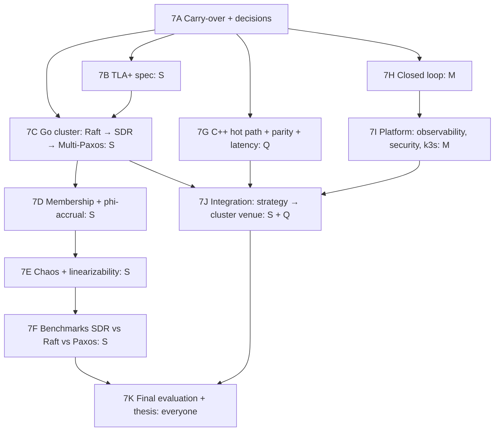

# 7th Semester Plan: Fault Tolerance, Low Latency, Integration and Thesis

| | |
|---|---|
| **Period** | ~16–18 working weeks (7th sem, Jul–Dec 2027). Adjust week numbers to your calendar. |
| **Priority** | Priority 2: fault-tolerant matching-engine cluster (SDR) · Priority 3: measured low-latency C++ hot path · final integration, evaluation and thesis |
| **Data** | Own recorded millisecond data (6A-07) for time-faithful replay · SpoofBench flow · live public WebSocket feeds for PAPER mode |
| **Reference** | [../ARCHITECTURE_AND_TECH_STACK.md](../ARCHITECTURE_AND_TECH_STACK.md) · [../6thSem/6thSem_Plan.md](../6thSem/6thSem_Plan.md) |
| **Owners** | **S** Systems engineer (cluster) · **Q** Quant researcher (C++ hot path + final research) · **M** ML engineer (closed loop + platform) |

## Prerequisites from the 6th semester (must be green before starting)

6L-10 determinism harness · 6L-12 snapshot/restore · 6L-13 C ABI · 6L-15 engine passes conformance suite · 6F-09 conformance suite · 6D-08 incremental Python features (parity target) · 6G strategy + 6H risk/OMS v2 (parity targets) · 6A-07 recorded data · 6J DGT checkpoints · 6K SpoofBench. Unfinished items → `carryover_from_6th.md`, weeks 1–2.

## Goal of this semester

```
C++ engine (6th) → Go replication cluster with Raft / SDR / Multi-Paxos modes
→ TLA+ spec of SDR checked by TLC → chaos testing + linearizability checking
→ honest SDR vs Raft vs Multi-Paxos benchmark
+ C++ hot path (feed → book → features → alpha → quoting → risk → OMS), parity-tested against Python
→ pinning / isolation measured → latency table in 3 configurations
+ closed loop (DGT embeddings as async features) + observability + security + k3s
→ strategy runs in PAPER mode through the SDR cluster venue → final evaluation → thesis
```

## Track flow



---

## 7A Carry-over and decisions (Weeks 1–2)

| ID | Task | Owner | Needs | Done when |
|---|---|---|---|---|
| 7A-01 | Finish `carryover_from_6th.md` | All | — | List empty or re-planned |
| 7A-02 | **ADR-009** (OPEN-06): which flow drives engine benchmarks. Recommended: replay of recorded Bybit-derived order flow + SpoofBench bursts + strategy flow, each reported separately | S | — | ADR merged |
| 7A-03 | **ADR-010** (OPEN-07): DGT placement. Recommended: async embedding refresh off the hot path, staleness bound | M | — | ADR merged |
| 7A-04 | **ADR-011** (OPEN-09): kernel-bypass experiment yes/no (recommended: no, state as future work) | S | — | ADR merged |
| 7A-05 | Cloud setup with student credits: 5 small Linux VMs (dedicated vCPU) in one region / zone; record instance types, kernel, NIC in `docs/env/` | S | — | VMs reachable via SSH; environment file committed |
| 7A-06 | Redpanda single node in docker-compose; topics from architecture doc §6.3 | S | — | Produce/consume test works |

---

## 7B TLA+ specification of SDR (Weeks 1–5, S)

| ID | Task | Owner | Needs | Done when |
|---|---|---|---|---|
| 7B-01 | Install TLA+ tools (VS Code extension + TLC); run the public Raft spec as a warm-up | S | — | TLC runs a known spec |
| 7B-02 | Model state: nodes, terms, logs, commitIndex, messages (as a bag), leader election | S | 7B-01 | Spec parses; small TLC run |
| 7B-03 | Add **speculative apply** at the leader + set `ExternalEvents` (what clients may see) | S | 7B-02 | Spec parses |
| 7B-04 | Add rollback to committed state + deterministic replay + re-propose | S | 7B-03 | Spec parses |
| 7B-05 | Faults in the model: message loss, duplication, reordering, crash/restart | S | 7B-04 | Spec parses |
| 7B-06 | Invariants FV-P1 log matching · P2 leader append-only · P3 state-machine safety · P4 election safety · **P5 speculation containment `∀e ∈ ExternalEvents: e.sourceIndex ≤ commitIndex`** · P6 rollback correctness · P7 commit monotonic | S | 7B-05 | Invariants defined |
| 7B-07 | TLC config A: N=3, ≤4 commands, ≤2 terms; config B: N=5 reduced; store state counts + duration | S | 7B-06 | All invariants hold; artefacts saved |
| 7B-08 | **Broken variant** (commit on non-majority / emit before commit) → TLC **must find a violation** (FV-008) | S | 7B-07 | Counterexample saved |
| 7B-09 | CI job: TLC on changes to `spec/tla/` or `cluster/sdr/`; violation blocks merge; counterexample kept as artefact | S | 7B-08 | Required check |
| 7B-10 | One-page "what is and is not verified" note (model only, bounded, safety only) | S | 7B-07 | `spec/tla/SCOPE.md` |

---

## 7C Go replication cluster (Weeks 2–10, S)

| ID | Task | Owner | Needs | Done when |
|---|---|---|---|---|
| 7C-01 | `cluster/` Go module; gRPC services from `proto/` (client commands, replication RPC) | S | 6A-08 | `go build ./...` and `go test ./...` in CI |
| 7C-02 | cgo wrapper over `helios_me.h` (apply, snapshot, restore); microbenchmark of cgo call overhead | S | 6L-13 | Go test applies commands to the C++ engine |
| 7C-03 | Durable per-shard log: append-only file, `(term, index, checksum)`, fsync before ack, recovery on restart | S | 7C-01 | Crash-restart test keeps entries |
| 7C-04 | Leader election with terms and randomised election timeouts (Raft-style) | S | 7C-03 | Test: one leader per term under restarts |
| 7C-05 | Replication RPC with log-matching check; follower repair by backtracking | S | 7C-04 | Divergent follower test repaired |
| 7C-06 | Commit on quorum ⌊N/2⌋+1 (leader included); commitIndex piggy-backed | S | 7C-05 | Test with N=3 and N=5 |
| 7C-07 | **Raft mode:** apply to engine only after commit → emit events (baseline built in the same framework) | S | 7C-06, 7C-02 | Engine state identical on all nodes after a run |
| 7C-08 | Leader-assigned timestamps and ids carried inside commands (engine never reads clock) | S | 7C-07 | Replay on another node gives identical events |
| 7C-09 | **SDR mode:** speculative apply before commit; results held in a buffer; **emit only after commit** | S | 7C-08 | Test: no client sees an uncommitted trade |
| 7C-10 | SDR rollback: on higher term / conflict → restore snapshot → replay committed log → re-propose or forward | S | 7C-09, 6L-12 | Fault test: state equals committed prefix |
| 7C-11 | Speculative depth bound: leader stops accepting when buffer is full | S | 7C-09 | Test |
| 7C-12 | Client idempotency by `client_order_id` across leader change (no duplicate orders) | S | 7C-07 | Failover retry test: duplicates = 0 |
| 7C-13 | Snapshots + log compaction; snapshot + suffix recovery = full-log recovery | S | 7C-10 | Byte-identical state test |
| 7C-14 | Sharding by symbol; gateway routes by instrument; shard leaders spread across nodes | S | 7C-07 | 2 shards on 3 nodes working |
| 7C-15 | **Multi-Paxos mode** in the same framework (for fair comparison) | S | 7C-06 | Correct on basic tests |
| 7C-16 | Metrics: rollback count/cost, commit latency, replication lag, term, leader per shard (Prometheus) | S | 7C-10 | Metrics visible |
| 7C-17 | Cluster `ExecutionVenue` adapter (Python/C++ client → gRPC) | S | 7C-14 | **6F-09 conformance suite passes against the cluster** |

---

## 7D Membership and failure detection (Weeks 7–10, S)

| ID | Task | Owner | Needs | Done when |
|---|---|---|---|---|
| 7D-01 | Gossip membership with hashicorp/memberlist | S | 7C-01 | Nodes discover each other; join/leave events |
| 7D-02 | phi-accrual detector: sliding window of heartbeat gaps, `φ = −log10(1 − CDF)`, threshold config, φ per node as metric | S | 7D-01 | Unit tests with synthetic heartbeats |
| 7D-03 | Fixed-timeout detector as baseline | S | 7D-02 | Switchable by config |
| 7D-04 | Detector triggers elections only (liveness); a false suspicion never breaks safety | S | 7D-02, 7C-04 | Test: forced false positive → only an extra election |
| 7D-05 | Measure detection latency + false-positive rate under injected delay/loss: phi vs fixed timeout | S | 7D-03, 7E-02 | Comparison table (measured) |

---

## 7E Chaos testing and linearizability (Weeks 9–13, S)

| ID | Task | Owner | Needs | Done when |
|---|---|---|---|---|
| 7E-01 | Cluster in docker-compose (3 and 5 nodes) + same on cloud VMs | S | 7C-14 | Both environments start with one command |
| 7E-02 | Chaos harness (Go): kill, pause/resume (`docker pause`), `tc netem` loss / delay / duplicate / reorder, `iptables` partition, clock skew (libfaketime), disk-full; every fault recorded as `FaultEvent` with seed | S | 7E-01 | Each fault injectable by CLI |
| 7E-03 | Experiment format: hypothesis + expected behaviour written **before** the run | S | 7E-02 | Template in `cluster/chaos/experiments/` |
| 7E-04 | Client history recorder (invoke / response with timestamps) | S | 7C-17 | History files written |
| 7E-05 | **Porcupine** linearizability model for the order book; check recorded histories | S | 7E-04 | Checker passes on a no-fault run; fails on a deliberately broken build |
| 7E-06 | Invariant monitor during faults: no duplicate trade, no lost committed entry, no divergence (state hash per index) | S | 7E-02 | Monitor alerts on violations |
| 7E-07 | Run the full fault catalogue (follower crash, leader crash, stall, loss, delay, duplication, reorder, minority partition, 2+2 split, disk full, clock skew, slow follower, SpoofBench burst) in **SDR mode** | S | 7E-05, 7E-06 | Evidence per row; recovery times measured |
| 7E-08 | Repeat catalogue in Raft mode (for comparison) | S | 7E-07 | Evidence per row |
| 7E-09 | Nightly chaos job (scheduled on a cloud VM); failures keep logs + seed | S | 7E-07 | Job runs nightly |

---

## 7F Benchmark: SDR vs Raft vs Multi-Paxos (Weeks 12–14, S)

| ID | Task | Owner | Needs | Done when |
|---|---|---|---|---|
| 7F-01 | Workload generator following ADR-009 (replayed flow, SpoofBench bursts, strategy flow), fixed seeds | S | 7A-02, 6K-05 | Generator produces reproducible load |
| 7F-02 | Benchmark harness: identical cluster size, VMs, workload and fault schedule for all 3 modes; warm-up; ≥5 repetitions | S | 7F-01, 7C-15 | Harness runs all modes |
| 7F-03 | Metrics: commit latency p50/p95/p99 + jitter, throughput, **rollback rate + rollback cost**, recovery time after leader failure | S | 7F-02 | Raw data stored |
| 7F-04 | SDR with vs without speculation, and at several fault/conflict rates | S | 7F-03 | Plot: when speculation helps and when it hurts |
| 7F-05 | Benchmark report with environment metadata; **report SDR losses honestly** | S | 7F-04 | `docs/reports/sdr_benchmark.md` |

---

## 7G C++ hot path and latency measurement (Weeks 1–14, Q, reviewed by S)

| ID | Task | Owner | Needs | Done when |
|---|---|---|---|---|
| 7G-01 | Latency instrumentation library: TSC-based clock calibrated once, per-stage timestamps, HdrHistogram; measure instrumentation overhead | Q | 6L-01 | Overhead number recorded |
| 7G-02 | C++ feed decoder for Bybit/Binance WebSocket JSON (simdjson) → internal binary `MarketEvent` | Q | 6A-08 | Decodes a recorded day; matches Python events |
| 7G-03 | C++ L2 book built on the 6L book structures | Q | 6L-04, 7G-02 | Snapshot hashes match Python book (6C-07) |
| 7G-04 | C++ incremental features (mid, spread, microprice, OBI-k, OFI, EWMA vol) | Q | 7G-03 | Compiles; unit tests |
| 7G-05 | **Feature parity test** (IFC-29): same fixture event stream through Python 6D-08 and C++; tolerance 1e-9 (arithmetic) / 1e-6 (rolling); **merge-blocking** | Q | 7G-04 | CI required check |
| 7G-06 | C++ formula alpha evaluator for promoted alphas; parity vs Python alpha values | Q | 7G-05 | Parity test green |
| 7G-07 | C++ quoting strategy (port of 6G) + parity on decisions over a recorded day | Q | 7G-06 | Same actions as Python within tolerance |
| 7G-08 | C++ risk check chain + OMS submit (port of 6H); parity on accept/reject decisions | Q | 7G-07 | Same decisions + reason codes |
| 7G-09 | Hot-path rules: pre-allocated pools, no allocation in steady state (verified with allocation counter), no exceptions, lock-free SPSC ring buffers, off-path logging | Q | 7G-08 | Allocation counter = 0 after warm-up |
| 7G-10 | Time-faithful **REPLAY mode** from recorded data (preserves inter-event gaps; timing fidelity reported) | Q | 7G-02, 6A-07 | Replay runs a recorded day |
| 7G-11 | Baseline latency run (no tuning) on a dedicated-vCPU VM: p50/p95/p99 + jitter per stage | Q | 7G-09, 7G-10, 7A-05 | Numbers stored with environment file |
| 7G-12 | Tuning, each **measured before/after**: thread pinning, `isolcpus`/`nohz_full` (if VM allows), IRQ affinity, `mlockall` + huge pages, NUMA locality | Q | 7G-11 | Before/after table (some may show no gain; report that) |
| 7G-13 | Latency table in **3 configurations** (LAT-012): (a) paper venue, (b) single-node C++ engine, (c) SDR cluster; with jitter and noisy-neighbour disclosure | Q+S | 7G-12, 7C-17 | Latency budget table filled with measured values only |
| 7G-14 | Microbenchmarks in nightly CI with regression alert | Q | 7G-11 | Nightly job |

---

## 7H Closed loop (Weeks 4–11, M)

| ID | Task | Owner | Needs | Done when |
|---|---|---|---|---|
| 7H-01 | Embedding service: loads a pinned DGT version, refreshes embeddings every N ms on its own thread/process, publishes with timestamp | M | 7A-03, 6J-08 | Service runs on replayed data |
| 7H-02 | Strategy/risk consume embedding-derived features with a **staleness bound**; stale → UNAVAILABLE, strategy keeps working without it | M | 7H-01 | Test: kill service → strategy continues |
| 7H-03 | Advisory engine-admission hint from embeddings; engine may ignore it; correctness unaffected | M+S | 7H-01, 7C-14 | Test: hint on/off → identical committed state |
| 7H-04 | Add chaos fault-injection event logs to DGT training data; retrain on train split only | M | 7E-07, 6J-08 | New model version registered |
| 7H-05 | Closed-loop alpha/features re-evaluated through the **same gates** before use | M | 7H-02 | Registry rows |
| 7H-06 | Drift monitoring (PSI / KS vs training distribution), exported as metrics | M | 7H-01 | Metric visible |

---

## 7I Platform: observability, security, deployment (Weeks 8–15, M, with S)

| ID | Task | Owner | Needs | Done when |
|---|---|---|---|---|
| 7I-01 | Prometheus metrics in Python, C++ and Go services (latency histograms, trading, risk limit utilisation, distributed, data quality) | M | 7C-16 | All targets scraped |
| 7I-02 | OpenTelemetry traces order → risk → OMS → venue → fill (sampled on hot path, overhead measured) | M | 7I-01 | Trace visible end-to-end |
| 7I-03 | Grafana dashboards: system, latency, trading, risk, ML, distributed; mode + `is_simulated` banner | M | 7I-01 | Dashboards committed as JSON |
| 7I-04 | Alerts: breaker trip, kill switch, reconciliation break, book invariant, quorum loss, replication lag, feed gap, ledger break | M | 7I-03 | Alert test fires |
| 7I-05 | Admin API: JWT auth + RBAC roles (viewer, researcher, ml-engineer, systems-engineer, risk-admin, operator, ci) for risk limits and kill switch | M | 6H-06 | 401/403 tests |
| 7I-06 | mTLS between services; **measure its latency cost** (NET-006) | M+S | 7C-01 | Cost reported |
| 7I-07 | Hash-chained, append-only audit log; verification script | M | 5J-06 | Tamper test detected |
| 7I-08 | Secrets via k3s secrets / `.env` outside git; dependency scanning (Trivy/Dependabot) in CI | M | 5A-07 | CI job |
| 7I-09 | k3s manifests: hot node (static CPU manager, Guaranteed QoS, integer CPUs), cluster nodes (≥3, pod disruption budget), research/platform nodes; no autoscaling of hot/cluster pods | M+S | 7C-14 | Whole system deploys with one command |

---

## 7J Integration: strategy trading through the fault-tolerant venue (Weeks 13–15, S + Q)

| ID | Task | Owner | Needs | Done when |
|---|---|---|---|---|
| 7J-01 | Shadow run: same order flow to paper venue and SDR cluster; compare execution reports | S+Q | 7C-17, 7G-08 | Divergences explained |
| 7J-02 | Switch `ExecutionVenue` binding to the cluster **by config only** (no code change) | S | 7J-01 | PAPER mode runs on cluster venue |
| 7J-03 | End-to-end PAPER run on live public data: C++ hot path → risk → OMS → SDR cluster, ≥3 days | Q+S | 7J-02, 7I-09 | Records + dashboards |
| 7J-04 | Chaos during PAPER trading: kill leader while quoting → zero duplicate orders, zero lost fills, P&L ledger reconciles | S | 7J-03, 7E-07 | Evidence report |
| 7J-05 | SpoofBench burst during PAPER trading → breaker trips, zero leaks, recovery measured | M+S | 7J-03, 6K-07 | Evidence report |

---

## 7K Final evaluation, reproducibility and thesis (Weeks 14–18, everyone)

| ID | Task | Owner | Needs | Done when |
|---|---|---|---|---|
| 7K-01 | Fill the evaluation table (spec §55) with **measured values only**; anything not run stays `TBD-MEASURE` / "not run" with reason | All | 7F-05, 7G-13, 6J-13, 6I-06 | Table complete |
| 7K-02 | Acceptance checklist per subsystem (spec §54.1): tick each or document the gap | All | 7K-01 | Checklist committed |
| 7K-03 | `scripts/reproduce.sh <result_id>`: one command reproduces any reported number from pinned commit, data and seed | S | all | Two random results reproduced by a teammate |
| 7K-04 | Limitations section: simulated execution only, fill-model dependence, L2 queue estimation, cloud jitter, no colocation/FPGA/kernel bypass, TLA+ = bounded model safety only, crash-fault not Byzantine, synthetic SpoofBench | All | 7K-01 | Section written |
| 7K-05 | Prohibited-claims check across every document (no colocation, FPGA, live trading, invented results) | All | 7K-04 | Checklist signed by all three |
| 7K-06 | Final thesis / project report + paper draft (negative results with equal prominence) | All | 7K-05 | Submitted |
| 7K-07 | Final demo + defence slides: alpha pipeline → quoting → risk under SpoofBench → leader kill during trading → latency table | All | 7K-06 | Demo rehearsed |
| 7K-08 | Optional public release: code, SpoofBench benchmark, reproducibility package | All | 7K-06 | Repo tagged `v1.0` |

---

## Exit criteria for the 7th semester (project completion)

- [ ] TLA+ SDR spec: FV-P1..P7 hold on bounded configs; broken variant fails; TLC gate in CI
- [ ] Go cluster with Raft / SDR / Multi-Paxos modes on the C++ engine; passes the venue conformance suite
- [ ] Full chaos catalogue executed with evidence; Porcupine linearizability checks green
- [ ] SDR vs Raft vs Multi-Paxos benchmark with rollback rate/cost, reported honestly
- [ ] C++ hot path parity-tested against Python; latency table in 3 configurations with measured p50/p95/p99 + jitter
- [ ] Closed loop with staleness bounds; observability, security, k3s deployment working
- [ ] Strategy trades in PAPER mode through the SDR cluster; leader kill and SpoofBench burst handled with zero duplicates / leaks
- [ ] Every reported number reproducible by one command; limitations and prohibited-claims checks done
- [ ] Thesis, demo and defence completed
