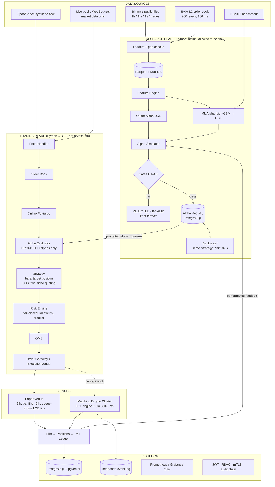
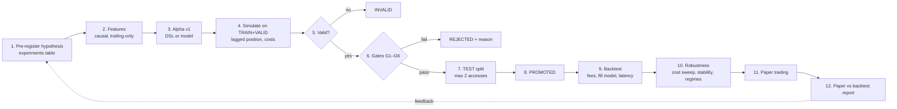
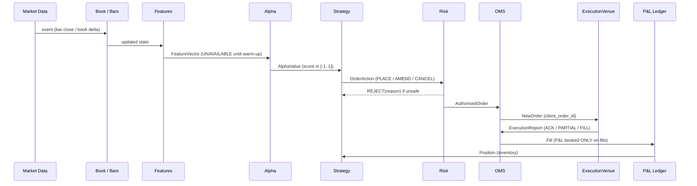
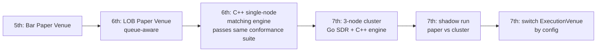
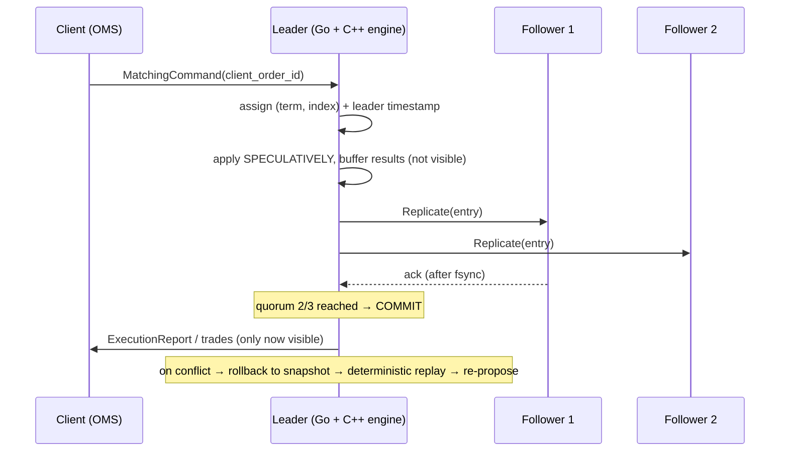
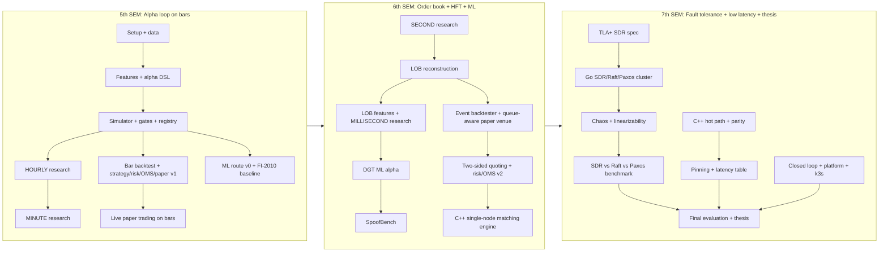

# HELIOS: Tech Stack, Architecture and Flow (reference for all semesters)

| | |
|---|---|
| **Version** | 1.0 · 2026-09-12 |
| **Status** | Fixed reference for 5th, 6th and 7th semester. Change only by writing an ADR (Architecture Decision Record) in `docs/decisions/`. |
| **Decisions fixed here** | OPEN-01 languages → Python + C++ + Go + TLA+ · OPEN-02 data → free crypto data first (Binance, Bybit), FI-2010 for ML benchmark · OPEN-03 horizon → **hourly → minute → second → millisecond** · OPEN-08 event log → Redpanda |
| **Still open (have a task in a semester plan)** | OPEN-04 Fitness formula (5A-12) · OPEN-05 fill model (6A-04) · OPEN-06 engine benchmark flow (7A-02) · OPEN-07 DGT online/offline (7A-03) · OPEN-09 kernel bypass (7A-04) |

---

## 1. Rules that never change

1. **Alpha first.** Priority 1 = alpha/quant, Priority 2 = fault tolerance, Priority 3 = low latency. Systems work does not start before the alpha loop works (scope guard).
2. **Horizon progression.** Every capability is built first at **hourly**, then reused at **minute → second → millisecond**. A stage is "done" only when its alphas have gone through the gates and a backtest.
3. **Python is the reference implementation.** Anything ported to C++ must pass a parity test against the Python version before it is trusted.
4. **One venue interface.** Strategy → Risk → OMS always talks to `ExecutionVenue`. Paper venue now, matching-engine cluster later. Swapping is a config change, not a rewrite.
5. **Risk is independent and fails closed.** No order reaches a venue without passing the risk engine. If risk errors, everything is rejected.
6. **Measure, never claim.** No invented numbers. No colocation, FPGA, or live-trading claims. All execution is simulated (`is_simulated = true`).
7. **Every result is reproducible** from `(git commit, data snapshot id, config hash, seed)`.
8. **Only four languages:** Python, C++, Go, TLA+. No new runtime without an ADR.

---

## 2. Tech stack

| Layer | Choice | Why this | Used from |
|---|---|---|---|
| Dev OS | Windows 11 + **WSL2 Ubuntu 24.04 LTS** | CPU pinning, `tc netem`, sanitizers and most tooling need Linux | 5th |
| Cloud | Linux VMs with **dedicated vCPU** (student credits: GitHub Student Developer Pack / Azure for Students) | Honest latency numbers need non-burstable CPUs | 7th |
| GPU | Institute GPU if available, otherwise Kaggle / Colab free GPU | DGT training | 6th |
| Version control | Git + GitHub (private repo) | — | 5th |
| CI | GitHub Actions + pre-commit | Merge-blocking gates | 5th |
| Research language | **Python 3.12** (3.13 fine if all wheels exist), env via **uv** | Fast iteration, ML ecosystem | 5th |
| Data wrangling | numpy, pandas, **pyarrow**, **DuckDB** | Parquet + SQL over files without a server | 5th |
| Stats / classic ML | scipy, statsmodels, scikit-learn, LightGBM | Baselines, calibration | 5th |
| Validation / config | pydantic, YAML configs | Typed schemas, config hashing | 5th |
| Testing (Py) | pytest, **hypothesis** (property tests), ruff, mypy | Leakage suite, OMS/ledger invariants | 5th |
| Research DB | **PostgreSQL 16** (Docker) + SQLAlchemy + Alembic + psycopg | Alpha registry, orders/fills, audit | 5th |
| Vector store | **pgvector** extension inside the same Postgres | No extra service | 6th |
| Research dashboard | **Streamlit** | Registry browser, reports, paper P&L | 5th |
| Live market data | Public WebSocket feeds (Binance, Bybit), market data only, no API keys, no orders | Paper trading on real-time data | 5th |
| Deep learning | **PyTorch**, **PyTorch Geometric** | DGT (GNN + causal Transformer) | 6th |
| Hot-path & engine language | **C++20**, CMake ≥3.25, GCC 13 / Clang 17 | No GC, full memory control | 6th |
| C++ libraries | GoogleTest, Google Benchmark, RapidCheck, **pybind11**, simdjson, HdrHistogram | Tests, benchmarks, property tests, Python parity, fast JSON feed parsing | 6th–7th |
| C++ safety | ASan, UBSan, TSan in CI | UB in a matching engine is unacceptable | 6th |
| Cluster language | **Go ≥1.22** | Easy, correct concurrency and RPC for replication | 7th |
| Go libraries | gRPC + protobuf, hashicorp/memberlist (gossip), **Porcupine** (linearizability checker) | — | 7th |
| Go ↔ C++ | **cgo** over a small C ABI (`helios_me.h`) | Engine core stays in C++ | 7th |
| Schemas | **Protocol Buffers** in `proto/` | One schema for Python, C++ and Go | 6th |
| Formal methods | **TLA+ with TLC** (VS Code TLA+ extension) | SDR safety properties | 7th |
| Event log | **Redpanda** (Kafka API, single binary) | Durable ordered replay, simpler than Kafka | 7th |
| Live book cache | Redis (optional) | Dashboard view of live book only | 7th |
| Observability | **Prometheus + Grafana + OpenTelemetry** | Metrics, dashboards, traces | 7th (Grafana may start 6th) |
| Containers | Docker + **Docker Compose** | Local stack | 5th |
| Orchestration | **k3s** (lightweight Kubernetes) | Final deployment | 7th |
| Chaos tools | `tc netem`, `iptables`, `docker kill/pause`, libfaketime | Fault injection | 7th |
| Security | JWT + RBAC, mTLS, gitleaks, Trivy / Dependabot | Access control, secret and dependency scanning | 5th (gitleaks) / 7th (rest) |

---

## 3. Which language owns what

| Component | Language | Semester |
|---|---|---|
| Data loaders, gap checks, Parquet writers | Python | 5th |
| Feature engine (research / reference) | Python | 5th (bars), 6th (LOB) |
| Alpha DSL, simulator, gates, registry | Python | 5th |
| Backtester (bar, then event-driven LOB) | Python | 5th, 6th |
| Strategy, Risk, OMS, Paper venue (reference) | Python | 5th (bars), 6th (LOB) |
| ML: baselines, DGT, SpoofBench | Python (PyTorch) | 5th, 6th |
| Order book + matching engine core | **C++** | 6th |
| Hot path: feed decode → LOB → features → alpha → strategy → risk → OMS | **C++** (ported from Python, parity-tested) | 7th |
| Replication (SDR, Raft, Multi-Paxos), gossip, phi-accrual, chaos harness | **Go** | 7th |
| SDR specification | **TLA+** | 7th |
| Dashboards | Streamlit (research), Grafana (ops) | 5th, 7th |

---

## 4. System architecture



**The three planes:**
- **Research plane.** Batch, Python, GPU, slow is fine. Decides *which* alphas are allowed to trade.
- **Trading plane.** Event-driven and single-process. It runs in Python in the 5th and 6th semesters. In the 7th, the latency-sensitive part is ported to C++ on pinned cores.
- **Venues.** Paper venue now. The fault-tolerant matching-engine cluster later, behind the same interface.

---

## 5. Flows

### 5.1 Research flow: from idea to a promoted alpha (every stage, every semester)



**Gates (config file `configs/gates_v1.yaml`, versioned and hashed):**

| Gate | Rule | Status |
|---|---|---|
| G1 | Sharpe > 1 (net of costs) | Confirmed |
| G2 | Fitness > 1 (formula fixed in 5A-12) | Confirmed |
| G3 | 1% < Turnover < 70% per decision period of the horizon family | Confirmed |
| G4 | Metrics computed on out-of-sample data | Adopted |
| G5 | >50% of sub-periods have Sharpe > 0 | Adopted |
| G6 | Sharpe > 0 at 2× assumed cost | Adopted |

Gates are **selection criteria, not promised results.**

### 5.2 Trading flow: one decision



### 5.3 Horizon progression (the order in which data and components are built)

| Stage | Horizon family | Data | Decision interval | periods_per_year (24/7) | Strategy type | Fill model | Semester |
|---|---|---|---|---|---|---|---|
| 1 | **H-HOURLY** | Binance spot 1h, 5 coins (BTC, ETH, SOL, BNB, XRP), 2017→ | 1 hour | 8,760 | Target position | Next-bar open + slippage | 5th |
| 2 | **H-MINUTE** | Binance spot 1m, same 5 coins | 1 minute | 525,600 | Target position | Next-bar open + slippage | 5th |
| 3 | **H-SECOND** | Binance 1s klines + aggTrades | 1 second | 31,536,000 | Target position, limit orders | Trade-through | 6th |
| 4 | **H-MICRO** | Bybit L2 200-level book (100 ms) + own recorded WebSocket data | 100 ms | 315,360,000 | **Two-sided quoting** | **Queue-aware** (+ optimistic / pessimistic range) | 6th → 7th |
| ML benchmark | — | FI-2010 (+ Bybit L2) | — | — | — | — | 6th |

**Convention (fixed in 5A-12):** Every result reports its per-period Sharpe *and* a **daily-aggregated Sharpe** (P&L summed per UTC day, ×√365). Only the daily one is compared across families. This avoids the "√315 million" annualisation trap (audit A-01).

**Honest data caveat:** Bybit L2 data has price levels but **no individual order IDs**, so queue position is *estimated*, not observed. True L3 queue data (LOBSTER / Nasdaq ITCH / Databento MBO) is an optional upgrade in the 7th semester.

### 5.4 Venue upgrade path (Priority 2)



### 5.5 SDR in one picture (7th semester)



### 5.6 Latency path (Priority 3, 7th semester, measured not claimed)

```
Public WS feed → [NIC + kernel] → C++ decode (simdjson) → C++ book → C++ features
→ C++ alpha formula → C++ quoting → C++ risk chain → C++ OMS → venue
   timestamps at every arrow (TSC clock) → HdrHistogram → p50 / p95 / p99 / jitter
   reported in 3 configs: paper venue | single-node engine | SDR cluster
```

This is a cloud approximation, **not** exchange colocation. No FPGA, no kernel bypass.

---

## 6. Data architecture

### 6.1 Folder layout for data (never committed to git)

```
data/
├── README.md                       ← columns and caveats of raw files
├── binance/spot/{klines_1h,klines_1m,klines_1s,aggTrades,trades}/   raw zips (downloaded)
├── bybit/{orderbook_spot,trades}/                                   raw zips (downloaded)
├── fi2010/                                                          raw zip (downloaded)
├── recorded/{bybit,binance}/YYYY-MM-DD/*.jsonl.zst                  own WebSocket captures (6th)
└── processed/                                                       canonical Parquet (built by code)
    ├── bars/source=binance/interval=1h/symbol=BTCUSDT/year=2026/part-*.parquet
    ├── trades/source=binance/symbol=BTCUSDT/date=2026-09-01/*.parquet
    ├── book_snapshots/source=bybit/symbol=BTCUSDT/date=2026-09-01/*.parquet
    └── features/feature_set=v1/interval=1h/symbol=BTCUSDT/*.parquet
```

Rules:
- Raw files are immutable.
- Processed files are always rebuildable by a script.
- Timestamps are UTC, stored as integer microseconds. Binance switched ms → µs on 2025-01-01, so normalise on load.
- Prices and sizes are **integers (ticks / lots)** in the C++ engine. Python may use floats for research, but LOB code uses ticks from the 6th semester.

### 6.2 PostgreSQL tables (grow per semester)

| Semester | Tables |
|---|---|
| 5th | `instruments`, `data_snapshots`, `experiments`, `alpha_definitions` (immutable), `alpha_results` (insert-only), `alpha_gate_config`, `test_set_access`, `strategies`, `risk_limits`, `orders`, `fills`, `positions_snapshot`, `pnl_snapshots`, `risk_events`, `backtest_runs`, `audit_events` |
| 6th | `models`, `model_versions`, `embeddings` (pgvector), `spoof_episodes`, `manipulation_labels` |
| 7th | `fault_experiments`, `benchmark_runs`, `latency_runs`; `audit_events` becomes hash-chained |

### 6.3 Redpanda topics (7th)
`md.<venue>.<symbol>` (market events) · `engine.<shard>.commands` · `engine.<shard>.events` · `risk.events` · `audit`

---

## 7. Repository layout (monorepo, created in task 5A-04)

```
helios/
├── ARCHITECTURE_AND_TECH_STACK.md   ← this file
├── 5thSem/  6thSem/  7thSem/        ← semester plans
├── docs/
│   ├── decisions/                   ← ADR-001 ... (every decision with date + reason)
│   ├── spec/                        ← HELIOS_SRS_and_System_Design_v1.md, knowledge base
│   └── reports/                     ← SRS/SDS reports, semester reports
├── configs/                         ← gates_v1.yaml, universe.yaml, fees.yaml, risk_limits/*.yaml
├── research/helios/                 ← Python package
│   ├── data/  features/  alpha/  sim/  registry/  backtest/
│   ├── strategy/  risk/  oms/  venue/  pnl/  live/
│   ├── ml/  spoofbench/  common/ (lineage, config, types)
│   └── tests/  (unit, property, leakage, parity)
├── dashboards/streamlit/
├── core/                            ← C++20 (6th →): book/, engine/, features/, hotpath/, bindings/ (pybind11), capi/ (helios_me.h)
├── cluster/                         ← Go (7th): sdr/, raft/, paxos/, membership/, fd/, chaos/, bench/, lincheck/
├── spec/tla/                        ← TLA+ specs + TLC configs (7th)
├── proto/                           ← protobuf schemas (6th →)
├── infra/                           ← docker-compose.yml, k3s/, prometheus/, grafana/
├── scripts/                         ← download_*.py, build_*.py, reproduce.sh
├── data/                            ← gitignored
└── .github/workflows/               ← ci.yml, nightly.yml
```

---

## 8. Core interfaces (fixed in 5H-01, same shape in Python, C++, Go)

```python
class MarketDataSource(Protocol):      # file replay | live WebSocket | SpoofBench
    def events(self) -> Iterator[MarketEvent]: ...

class AlphaModel(Protocol):            # quant DSL or ML model
    definition: AlphaDefinition
    def value(self, fv: FeatureVector) -> AlphaValue: ...   # status OK | UNAVAILABLE | STALE

class Strategy(Protocol):
    def on_update(self, alpha: AlphaValue, book: BookView, pos: Position,
                  open_orders: OpenOrders, risk: RiskState) -> list[OrderAction]: ...

class RiskEngine(Protocol):            # synchronous, in-line, fail-closed
    def check(self, action: OrderAction) -> RiskDecision: ...   # ACCEPT → AuthorisedOrder | REJECT(reason_code)

class ExecutionVenue(Protocol):        # paper venue (5th/6th) and cluster (7th)
    def submit(self, o: NewOrder) -> Ack | Reject: ...
    def cancel(self, c: CancelOrder) -> Ack | Reject: ...
    def amend(self, a: AmendOrder) -> Ack | Reject: ...
    def subscribe_reports(self, cb: Callable[[ExecutionReport], None]) -> None: ...
    def snapshot_open_orders(self) -> list[VenueOrderView]: ...
    def venue_info(self) -> VenueInfo: ...    # includes is_simulated
```

The six data types crossing module boundaries: **Feature → Prediction → Alpha → Signal → Strategy action → Order**. Every interface names the type it carries.

---

## 9. Environments

| Env | What runs | Semester |
|---|---|---|
| Laptop (WSL2) | Python package, Postgres + Streamlit via Docker Compose, unit/property tests, small backtests | 5th → |
| GitHub Actions | Lint, tests, leakage suite, (6th) C++ build + sanitizers, (7th) TLC, parity | 5th → |
| Always-on small VM | 24/7 WebSocket recorder + live paper trading | late 5th → |
| GPU (institute / Kaggle / Colab) | DGT pretraining, ablations | 6th |
| Cloud cluster (3–5 VMs, dedicated vCPU) | SDR cluster, chaos, benchmarks, latency measurements, k3s | 7th |

**Disk warning:** `C:` has only ~10 GB free (2026-09-12). Free ≥40 GB before installing WSL2 and Docker (task 5A-01), or put WSL2 and data on another drive.

---

## 10. Engineering conventions

| Topic | Rule |
|---|---|
| Task IDs | `5A-03` = 5th sem, module A, task 3. Put the ID in branch names and commit messages: `5B-02: normalise µs timestamps` |
| Branches | `main` protected; feature branches; 1 reviewer per PR |
| Owners | **Q** = Quant researcher · **S** = Systems engineer · **M** = ML engineer. Assign names in 5A-11. |
| Config | Every run is driven by YAML → pydantic → `config_hash = sha256(canonical json)` |
| Lineage | Every stored result has `code_commit, config_hash, data_snapshot_id, seed` |
| Modes | Every log line, report and dashboard shows `BACKTEST` / `REPLAY` / `PAPER`. `LIVE` does not exist. |
| Splits | Chronological TRAIN · embargo ≥ horizon · VALID · embargo · TEST (TEST touched ≤ 2 times) |
| Results placeholders | Unmeasured values are written `TBD-MEASURE`. Never estimate. |
| Merge-blocking CI | lint · unit · property · **leakage suite** · (6th) **feature parity**, C++ sanitizers, **engine determinism** · (7th) **TLC** |
| Decisions | Any change to this file = new ADR in `docs/decisions/` |

---

## 11. Semester map



Detailed task lists: [5thSem/5thSem_Plan.md](5thSem/5thSem_Plan.md) · [6thSem/6thSem_Plan.md](6thSem/6thSem_Plan.md) · [7thSem/7thSem_Plan.md](7thSem/7thSem_Plan.md)
