# HELIOS — System Design & Software Requirements Specification

**Document ID:** HELIOS-SRS-001
**Version:** 1.0
**Status:** Draft for team review
**Date:** 2026-09-09
**Institution:** Birla Institute of Technology, Mesra, Ranchi — Department of Computer Science & Engineering
**Faculty Mentor:** Dr. Shripal Vijayvargiya
**Team:** Abhishek Kumar (BTECH/25002/24), Anuj Sharma (BTECH/25011/24), Indra Shikari (BTECH/25028/24)

**Primary source of truth:** *HELIOS — Updated Project Knowledge Base* (alpha-first revision).
**Secondary sources (superseded where they conflict):** HELIOS Quantitative Synopsis (Revised); HELIOS journal paper draft; original project proposal.

---

## 0. Document Control

### 0.1 Labelling convention

Every non-trivial statement in this document carries one of four tags. Nothing is presented as decided unless it actually is.

| Tag | Meaning |
|---|---|
| **[CONFIRMED]** | Explicitly stated in the Updated Project Knowledge Base or an earlier project document that the update did not override. |
| **[PROPOSED]** | A design decision made by the architect (me) to fill a gap. Rationale given. **The team must confirm it.** |
| **[ASSUMPTION]** | Something taken as true to make the design coherent, but not verified. If it turns out false, the dependent design changes. |
| **[OPEN]** | A decision that genuinely cannot be made yet without information the team does not have. Explicitly deferred, with the decision owner and deadline. |

### 0.2 Integrity rules binding this document

1. **No invented results.** No latency number, Sharpe, AUC, or throughput figure in this document is an observed measurement. Every number is either a target, a threshold, or a budget, and is labelled as such.
2. **No colocation claim.** HELIOS is not colocated with any exchange. Physical exchange colocation is unavailable to this project. §35–§39 describe an architectural approximation only.
3. **No FPGA claim.** No FPGA or Smart-NIC offload hardware is part of the implementation. It is named only as a future extension.
4. **No live-trading claim.** All execution is paper/simulated. No real capital, no real venue connectivity.
5. **Verification claims are scoped.** TLA+/TLC verifies *the specified properties of the specified model*, not the implementation. This distinction is enforced throughout §31.
6. **Selection criteria ≠ outcomes.** Sharpe > 1, Fitness > 1, 1% < Turnover < 70% are **gates a candidate alpha must pass to be promoted**. They are not predictions, promises, or results.

### 0.3 Requirement ID namespaces

| Prefix | Domain | Section |
|---|---|---|
| `FR` | Functional requirement (system-wide) | §10 |
| `NFR` | Non-functional requirement | §11 |
| `DAT` | Data / database | §14–§15 |
| `IFC` | Interface / API | §16 |
| `QNT` | Quantitative trading (general) | §17 |
| `ALG` | Alpha generation | §18 |
| `SIM` | Alpha simulation & evaluation | §19 |
| `BT` | Backtesting | §20 |
| `STR` | Trading strategy | §21 |
| `RSK` | Risk engine | §22 |
| `OMS` | Order management | §23 |
| `PPR` | Paper trading / simulated execution | §24 |
| `ME` | Matching engine | §25 |
| `DS` | Distributed system | §26 |
| `SDR` | Speculative execution w/ deterministic rollback | §27 |
| `REP` | Replication | §28 |
| `FD` | Failure detection | §29 |
| `RB` | Rollback / deterministic replay | §30 |
| `FV` | Formal verification | §31 |
| `CHA` | Chaos testing | §32 |
| `ML` | DGT / representation learning | §33 |
| `SPB` | SpoofBench | §34 |
| `CL` | Closed loop | §34A |
| `LAT` | Low latency | §35 |
| `NET` | Networking | §36 |
| `NIC` | NIC responsibilities | §37 |
| `CPU` | CPU pinning / isolation | §38 |
| `CPP` | C++ responsibilities | §39 |
| `DEP` | Cloud / deployment | §40–§41 |
| `CICD` | CI/CD | §42 |
| `SEC` | Security | §43–§44 |
| `OBS` | Observability | §45–§46 |
| `PERF` | Performance benchmarking | §47 |
| `TST` | Testing | §48 |

### 0.4 Priority scale

| Priority | Meaning | Consequence if unmet |
|---|---|---|
| **P0** | MVP-blocking. The project has no defensible deliverable without it. | Project fails its primary claim. |
| **P1** | Required for the full project as scoped. | Major scope reduction must be declared. |
| **P2** | Recommended. Strengthens the result. | Degrades quality, not validity. |
| **P3** | Advanced / stretch. | Drop silently if time-constrained. |
| **P4** | Future work. Explicitly out of scope for this project. | N/A — documented, not built. |

### 0.5 Verification method codes

| Code | Method |
|---|---|
| `T` | Automated test (unit / integration / property / e2e) |
| `M` | Measurement / benchmark with recorded artefact |
| `I` | Inspection / code review / design review |
| `A` | Analysis (proof, model check, statistical argument) |
| `D` | Demonstration (live or recorded walkthrough) |

---

# PART I — INTRODUCTION AND CONTEXT

## 1. Introduction

HELIOS is an **alpha-driven quantitative trading system** built on **fault-tolerant** and **low-latency** trading infrastructure. **[CONFIRMED]**

The project deliberately inverts the framing used in earlier HELIOS documents. Earlier versions treated a replicated, formally-verified matching engine as the centrepiece and treated trading logic as the workload that exercised it. The current direction is the opposite: **the quantitative research pipeline — generate an alpha, simulate it, evaluate it against explicit criteria, backtest it, measure P&L and risk — is the primary contribution**, and the distributed and low-latency infrastructure are the second and third priorities respectively, in that order. **[CONFIRMED]**

The working one-sentence definition is:

> **HELIOS is an alpha-driven quantitative trading system that generates and validates statistical/ML alphas, simulates and backtests them to measure risk-adjusted P&L, and ultimately executes those strategies through fault-tolerant and low-latency trading infrastructure.** **[CONFIRMED]**

This document is the engineering blueprint for that system. It is written so that a development team of three, working over roughly eighteen months, can implement HELIOS from it without needing to re-derive architecture decisions from the synopsis.

### 1.1 What changed from the previous HELIOS definition

| Dimension | Previous (systems-first) | Current (alpha-first) **[CONFIRMED]** |
|---|---|---|
| Centre of gravity | Distributed matching engine + SDR | Alpha research → simulation → backtest → P&L |
| ML role | DGT as a standalone representation-learning contribution benchmarked against LiT | ML as **one of two routes to producing a tradeable alpha**; representation quality is a means, not the end |
| Strategy role | Order-flow generator to stress systems/risk components | The consumer of validated alpha; the thing that actually earns P&L |
| Fault tolerance | Priority 1 | **Priority 2** |
| Low latency | Discussed as an infrastructure property | **Priority 3**, with an explicit measurement obligation |
| Execution | Against the replicated matching engine cluster | **Paper / simulated execution now**; matching-engine cluster is a later execution venue |
| Success test | Linearizability verified, latency beaten vs Raft | **An alpha that passes Sharpe/Fitness/Turnover gates and produces credible backtested P&L** |

### 1.2 Conflicts between the updated direction and prior documents

These are **not silently resolved**. They are listed here, referenced in the relevant sections, and resolved (or escalated) in the Self-Audit (§62).

| # | Conflict | Prior document says | Update implies | Status |
|---|---|---|---|---|
| C-1 | Implementation language for the hot path | Go/Rust for matching engine, strategy, risk, OMS | C++ for the latency-sensitive market-data → LOB → alpha → strategy path | **[OPEN]** — see §39.4, Audit A-07 |
| C-2 | Semester sequencing | Sem V = systems core; Sem VI = strategy & ML; Sem VII = integration | Alpha/Quant must come first | **Resolved in favour of the update** — see §57 |
| C-3 | DGT's success metric | Cross-symbol linear-probe transfer vs LiT | ML output must become a *useful trading alpha* | **Both retained, re-ordered** — see §33.9, Audit A-11 |
| C-4 | Alpha selection thresholds vs strategy horizon | (not previously present) | Sharpe/Fitness/Turnover gates alongside HFT-style continuous quoting | **[OPEN] — material issue**, see §19.6 and Audit A-01 |
| C-5 | Matching engine's role | Primary system under test | Later execution venue behind paper trading | **Resolved in favour of the update** — see §25.1 |
| C-6 | SpoofBench's purpose | Benchmark/dataset contribution + kill-switch stressor | Primarily a risk-control stressor; benchmark value retained | **Both retained** — see §34 |

---

## 2. Purpose

### 2.1 Purpose of the system

HELIOS exists to answer one primary research question and two supporting engineering questions.

**Primary (Quant):**
> Can a systematically generated alpha — designed by hand from market-microstructure reasoning, or discovered by a machine-learning model — survive a disciplined quantitative evaluation pipeline (simulation → threshold gates → backtest → robustness checks) and produce credible risk-adjusted P&L under realistic execution assumptions?

**Supporting (Systems):**
> Can the execution path behind such a strategy be made fault-tolerant using a workload-specific replication protocol (SDR) whose safety properties are formally specified and model-checked, and does it hold up under injected faults?

**Supporting (Latency):**
> What is the actual, measured latency of the market-data → signal → order path in a practical cloud environment, and how far can it be reduced with C++ hot-path implementation, CPU pinning, and low-overhead networking?

Note the asymmetry deliberately: the primary question is about **whether an alpha works**; the supporting questions are about **whether the infrastructure around it is sound and fast**.

### 2.2 Purpose of this document

1. Serve as the master technical blueprint for implementation.
2. Fix vocabulary so the team stops conflating *feature / prediction / alpha / signal / strategy / order* (§5.2).
3. Enumerate every requirement with an ID, rationale, priority, and verification method so progress is measurable rather than narrated.
4. Record every open decision explicitly, so the team cannot accidentally "decide by drift".
5. Define acceptance criteria that make it unambiguous when a subsystem is done.
6. Protect the project's integrity: no invented results, no over-claimed infrastructure, no unverifiable citations.

---

## 3. Scope

### 3.1 In scope

| # | Item | Priority |
|---|---|---|
| S-01 | Historical LOB/market data ingestion, normalisation, and storage | P0 |
| S-02 | Limit order book reconstruction (continuous, multi-level, price-time priority) | P0 |
| S-03 | Quantitative feature engine (microstructure features) | P0 |
| S-04 | Quant-designed alpha construction framework | P0 |
| S-05 | ML-generated alpha (DGT: GNN + causal Transformer, self-supervised) | P1 |
| S-06 | Alpha simulator and quantitative evaluation harness | P0 |
| S-07 | Alpha registry with versioned metrics and pass/fail status | P0 |
| S-08 | Event-driven backtesting engine with transaction costs and slippage | P0 |
| S-09 | Trading strategy layer — HFT-style continuous two-sided quoting | P0 |
| S-10 | Pre-trade risk engine (limits, bands, kill switch, circuit breaker) | P0 |
| S-11 | Order Management System + Order Gateway | P0 |
| S-12 | Paper-trading / simulated execution venue | P0 |
| S-13 | Portfolio, position, and P&L accounting | P0 |
| S-14 | Distributed matching engine (sharded, continuous, multi-level) | P1 |
| S-15 | SDR replication protocol implementation | P1 |
| S-16 | Gossip membership + phi-accrual failure detection | P1 |
| S-17 | Deterministic replay + rollback | P1 |
| S-18 | TLA+ specification + TLC model checking of safety properties | P1 |
| S-19 | Chaos-testing harness (crash, loss, delay, partition, leader failure) | P1 |
| S-20 | SpoofBench Hawkes simulator with labelled manipulation injection | P2 |
| S-21 | Low-latency cloud deployment + latency instrumentation | P2 |
| S-22 | C++ hot path for parsing, LOB, and feature computation | P2 |
| S-23 | Observability stack (metrics, traces, dashboards) | P1 |
| S-24 | Security controls (JWT/RBAC, mTLS, secrets, audit log) | P1 |
| S-25 | CI/CD with deterministic-replay, chaos, and TLC gates | P1 |
| S-26 | Closed-loop embedding feedback into strategy/risk features and engine admission | P2 |
| S-27 | Reproducibility package + public benchmark release | P2 |

### 3.2 Explicitly out of scope

| # | Item | Why | Where discussed |
|---|---|---|---|
| X-01 | **Real-money live trading** | No broker relationship, no capital, no regulatory standing | §24.6 |
| X-02 | **Physical exchange colocation** | Not available to an academic project | §36.3, §40.6 |
| X-03 | **FPGA / Smart-NIC offload hardware** | Not procurable; not implemented | §37.4 |
| X-04 | **Kernel-bypass networking (DPDK/Solarflare/ef_vi) on real exchange feeds** | Requires hardware and venue access we do not have | §36.4 — a *loopback/simulated-feed* variant is [OPEN] |
| X-05 | **Geo-replication / multi-region consensus** | Adds no research value at this scale | §26.9 |
| X-06 | **Byzantine fault tolerance** | SDR is crash-fault-tolerant only | §26.2, §27.8 |
| X-07 | **Full liveness proof of SDR** | Safety is the committed scope; liveness is a stretch goal | §31.6 |
| X-08 | **Multi-agent market simulation** (multiple learned policies interacting through the engine) | Deferred | §61 |
| X-09 | **Cross-asset / cross-venue portfolio construction** | Single-venue, single-asset-class scope | §17.6 |
| X-10 | **Regulatory / compliance reporting (MiFID II, SEBI, etc.)** | Not a real trading firm | §43.8 |

### 3.3 Scope guard

**[PROPOSED]** Any proposal to add scope must be tested against: *does it advance Priority 1 (alpha), or is it Priority 2/3 work being pulled forward?* If the latter, it is rejected until the MVP alpha loop (§64.1) is green. This rule exists because the single largest historical risk to this project is systems work crowding out quant work.

---

## 4. Project Objectives

| ID | Objective | Priority | Measured by |
|---|---|---|---|
| OBJ-01 | Build an end-to-end alpha research pipeline from raw LOB data to evaluated, versioned alphas | P0 | ≥1 alpha in registry with complete metric set (§19.7) |
| OBJ-02 | Produce at least one alpha that passes all selection gates (Sharpe > 1, Fitness > 1, 1% < Turnover < 70%) on out-of-sample data | P0 | Registry status = `PROMOTED` with OOS evidence |
| OBJ-03 | Demonstrate both alpha-generation routes: quant-designed **and** ML-generated | P1 | ≥1 alpha of each provenance evaluated end-to-end |
| OBJ-04 | Produce a leakage-free, cost-aware backtest with reported P&L, drawdown, and risk metrics | P0 | Backtest report + leakage test suite passing (§20.6) |
| OBJ-05 | Implement a strategy layer that converts alpha to continuous two-sided quotes, with inventory awareness | P0 | Fill rate, realized spread, inventory profile reported |
| OBJ-06 | Implement a risk engine that provably blocks unsafe orders and halts on abnormal flow | P0 | 100% of injected unsafe orders rejected; kill-switch latency measured |
| OBJ-07 | Implement a continuous, multi-level, price-time-priority matching engine with partial fills | P1 | Property tests pass (§25.7) |
| OBJ-08 | Implement SDR replication and demonstrate correct rollback + deterministic replay under injected faults | P1 | Chaos matrix (§32.4) all-green; replay determinism test passes |
| OBJ-09 | Specify SDR safety properties in TLA+ and check them with TLC as a CI gate | P1 | TLC run artefact in CI; gate blocks on violation |
| OBJ-10 | Benchmark SDR against Raft and Multi-Paxos on commit latency (p50/p95/p99) and throughput | P1 | Benchmark report with methodology + raw data |
| OBJ-11 | Train a graph-structured self-supervised LOB encoder and evaluate transfer, label efficiency, and ablations | P1 | Transfer curves + ablation table (§33.10) |
| OBJ-12 | Build SpoofBench and use it to stress the risk controls | P2 | ROC-AUC + latency-to-detect reported; kill-switch triggered under injected flow |
| OBJ-13 | Measure — not claim — end-to-end latency at p50/p95/p99 with jitter, per stage | P2 | Latency budget table populated with measured values |
| OBJ-14 | Deploy the system reproducibly with monitoring, security, and CI/CD gates | P1 | One-command reproduction; dashboards live |
| OBJ-15 | Publish a reproducibility package and honest report, including null results | P2 | Repo + report released |

**Explicit non-objective:** proving that HELIOS is profitable in live markets. The objective is a **defensible research result**, and a well-evidenced negative result (no alpha passes the gates; DGT does not beat LiT; SDR does not beat Raft) is a valid and reportable outcome. **[CONFIRMED — carried from prior project integrity note]**

---

## 5. Definitions and Terminology

### 5.1 General glossary

| Term | Definition |
|---|---|
| **LOB** | Limit Order Book — the set of resting buy and sell limit orders for an instrument, organised by price level and, within a level, by time priority. |
| **Level** | A single price point on one side of the book, holding a FIFO queue of orders. |
| **Top of book / BBO** | Best bid and best offer — the highest bid price and lowest ask price. |
| **Mid-price** | `(best_bid + best_ask) / 2`. |
| **Microprice** | Size-weighted mid: `(best_bid × ask_size + best_ask × bid_size) / (bid_size + ask_size)`. Leans toward the side with less size, i.e. the side likely to be consumed. |
| **Spread** | `best_ask − best_bid`. |
| **Order-book imbalance (OBI)** | `(bid_size − ask_size) / (bid_size + ask_size)` over the top *k* levels. |
| **Order-flow imbalance (OFI)** | A flow (not stock) measure: net signed change in bid/ask depth caused by arrivals, cancels, and trades between two snapshots. |
| **Queue position** | An order's rank within its price level's FIFO queue; determines fill probability. |
| **Partial fill** | An execution where only part of an order's quantity trades; the remainder stays resting (or is cancelled, per TIF). |
| **Price-time priority** | Matching rule: better price first; within a price, earlier arrival first. |
| **Continuous matching** | Every incoming order is matched immediately against the resting book (as opposed to batch auctions). |
| **Many-to-many matching** | One aggressive order may fill against many resting orders, across multiple price levels, producing multiple trades with multiple counterparties. |
| **TIF** | Time-in-force (GTC, IOC, FOK, DAY). |
| **Slippage** | The difference between the decision price and the realised execution price. |
| **Realized spread** | Post-trade profitability of a passive fill, measured as the signed difference between the fill price and the mid-price some horizon later. |
| **Inventory risk** | Risk from holding a non-flat position; the core hazard of two-sided quoting. |
| **Adverse selection** | Being filled precisely because the market is about to move against you. |
| **SDR** | Speculative execution with Deterministic Rollback — HELIOS's workload-specific replication protocol. |
| **Quorum** | ⌊N/2⌋ + 1 nodes; a majority. |
| **Linearizability** | Every operation appears to take effect atomically at a single instant between its invocation and response, consistent with real-time ordering. |
| **Deterministic replay** | Re-executing a recorded command sequence from a known state and obtaining bit-identical results. |
| **phi-accrual failure detector** | A failure detector outputting a continuous suspicion level φ from the distribution of inter-arrival heartbeat times, rather than a boolean from a fixed timeout. |
| **DGT** | Depth-Graph Transformer — HELIOS's GNN + causal-Transformer LOB encoder. |
| **SpoofBench** | HELIOS's Hawkes-process LOB simulator with labelled injected manipulation. |
| **Hawkes process** | A self-exciting point process where the arrival intensity rises after each event, reproducing order-flow clustering. |
| **Look-ahead bias** | Using information at decision time *t* that was not actually available until after *t*. |
| **Data leakage** | Any path by which test-set information influences model fitting or selection. |
| **IC (Information Coefficient)** | Correlation between a predictive score and realised forward return. |

### 5.2 The six terms the team must stop conflating

This is the most important subsection in Part I. **[CONFIRMED — the source explicitly requires this distinction]**

```
    FEATURE  →  PREDICTION  →  ALPHA  →  SIGNAL  →  STRATEGY  →  ORDER
   (measure)   (estimate)   (scored    (decision  (policy)    (instruction)
                             belief)    input)
```

| Term | Precise definition | Type | Example | Owner component |
|---|---|---|---|---|
| **Feature** | A deterministic function of market state computed **only from information available at or before time *t***. It carries no view of the future. | `f: State_{≤t} → ℝ` | `OBI_5(t) = 0.34` | Feature Engine |
| **Prediction** | A model's estimate of a future quantity, produced from features. It has an explicit **horizon** and **target**. | `p: Features_t → ℝ or [0,1]` | `P(mid_{t+500ms} > mid_t) = 0.61` | Alpha model (quant formula or ML model) |
| **Alpha** | A **versioned, registered, evaluated** time series of desired exposure or expected-return score, standardised so it can be simulated and compared against other alphas independently of execution mechanics. An alpha is *not* the model; it is the model's output-as-a-tradeable-object, plus its identity and evaluation record. | `α: t → ℝ` (typically z-scored or in [−1, 1]) | `alpha_id=A-014, α(t) = +0.7` | Alpha Simulator / Alpha Registry |
| **Trading signal** | The alpha **combined with current portfolio and market state** to produce a concrete trading intent at a decision instant: target inventory, quote skew, aggression level, desired participation. | `σ: (α_t, inventory_t, risk_t, book_t) → Intent` | `target_inv = +200; skew = −1 tick; widen = 0` | Strategy Engine (signal stage) |
| **Trading strategy** | The **policy** that turns intents into a complete set of order actions over time — placement, amendment, cancellation, timing, inventory management, quote laddering. It owns *how* to trade, not *what to believe*. | `π: Intent × BookState × OpenOrders → {OrderAction}` | "cancel bid@100.02, place bid@100.01×200, keep ask@100.05×200" | Strategy Engine (execution-policy stage) |
| **Order** | A single, concrete, timestamped instruction with an ID, side, price, quantity, and TIF, submitted to a venue and subject to a lifecycle. | Record | `{id: O-9931, side: BUY, px: 100.01, qty: 200, tif: GTC}` | OMS → Order Gateway |

**Failure modes this distinction prevents:**

| Confusion | What goes wrong |
|---|---|
| Feature ≡ Alpha | Raw imbalance gets "traded" without normalisation, horizon, or cost awareness; Sharpe is meaningless. |
| Prediction ≡ Alpha | Model accuracy is reported instead of tradeability; a 62%-accurate classifier that only fires when the spread is 3 ticks wide looks great and earns nothing. |
| Alpha ≡ Strategy | The system tries to trade the belief directly, producing one buy and one sell instead of managed continuous quoting; inventory risk is never modelled. |
| Signal ≡ Order | Every signal update becomes a new order, causing quote thrash, exploding message rates, and a self-inflicted circuit-breaker trip. |
| Strategy ≡ Matching engine | The strategy is written as if it decides fills. It does not. It submits orders; the venue decides fills. |
| Order ≡ Fill | P&L is booked on submission rather than execution — a catastrophic accounting error. |

**FR-000 [P0]** — Every module boundary in HELIOS shall carry exactly one of these six types across it, and the type name shall appear in the interface definition (§16). *Verification: I (design review).*

### 5.3 Execution-mode vocabulary (frequently confused)

| Mode | Data | Clock | Order book | Fills decided by | Purpose |
|---|---|---|---|---|---|
| **Backtest** | Historical, batched | Simulated, event-driven, can run faster than real-time | Reconstructed from historical messages | Fill model (assumption-driven) | Evaluate a strategy over long history cheaply |
| **Market replay** | Historical, streamed in original relative order and timing | Simulated but **time-faithful** (respects inter-event gaps) | Reconstructed | Fill model, *or* a real matching engine fed the replayed flow | Test the *system* (latency, ordering, plumbing) as well as the strategy |
| **Paper trading** | Live or replayed feed | Real-time wall clock | Live/reconstructed | Simulated execution venue | Test the full production path with no capital at risk |
| **Live trading** | Live feed | Real-time | Venue's real book | The real exchange | **Out of scope (X-01)** |

**The distinction that matters most:** a backtest may compress time; a replay must not. A backtest can ignore the strategy's own compute latency; a replay and paper-trading run must not — the strategy's decision time consumes simulated or real time and can cause it to miss the market. **[PROPOSED]** HELIOS shall implement all three of backtest, replay, and paper trading, and shall report results for each separately, never merging them into one "performance" number.

---

## 6. System Overview

### 6.1 The primary loop (Priority 1)

```
                        MARKET / HISTORICAL DATABASE
                                    |
                            MARKET DATA FEED
                                    |
                          LOW-LATENCY NETWORK  (P3)
                                    |
                                   NIC          (P3)
                                    |
                         C++ DECODING / PARSING (P3 impl, P0 function)
                                    |
                                   LOB
                                    |
                         QUANT FEATURE ENGINE
                                    |
                           ALPHA GENERATION
                            /              \
                  QUANT-DESIGNED         ML-GENERATED
                      ALPHA                 ALPHA
                            \              /
                            ALPHA SIMULATION
                                    |
                         QUANTITATIVE EVALUATION
                        (Sharpe / Fitness / Turnover /
                         drawdown / IC / cost sensitivity)
                                    |
                            ALPHA SELECTION
                              /          \
                          REJECT        PROMOTE
                                           |
                                       BACKTEST
                                           |
                                  TRADING STRATEGY
                                (continuous 2-sided quoting)
                                           |
                                     RISK ENGINE
                                           |
                                          OMS
                                           |
                              PAPER / SIMULATED EXECUTION
                                           |
                                  POSITIONS / FILLS
                                           |
                                   P&L / PERFORMANCE
                                           |
                                           ↺  (feeds evaluation & alpha research)
```
**[CONFIRMED]**

### 6.2 The infrastructure upgrade path (Priority 2)

Paper execution is the *current* execution venue. The fault-tolerant matching-engine cluster is a **later, swappable execution venue behind the same Order Gateway interface.**

```
              PAPER EXECUTION  (current, P0)
                      |
                      |  same OrderGateway interface (IFC-09)
                      v
        FAULT-TOLERANT MATCHING ENGINE  (P1)
                      |
                     SDR
                      |
                 REPLICATION
                      |
              FAILURE DETECTION
                      |
        ROLLBACK / DETERMINISTIC REPLAY
```
**[CONFIRMED]**

**Critical architectural consequence [PROPOSED]:** because paper execution and the matching-engine cluster must be interchangeable, the Order Gateway interface (§16, IFC-09) must be defined **first**, before either venue is built. Both venues implement the same `ExecutionVenue` contract. This is what makes Priority-1-first sequencing possible without throwing work away.

### 6.3 The latency wrapper (Priority 3)

```
        COLOCATION CONCEPT (architectural reference only — NOT implemented)
                      |
        LOW-LATENCY CLOUD ALTERNATIVE  (what we actually build)
                      |
              LOW-LATENCY NIC path
                      |
                  CPU PINNING
                      |
                      C++
                      |
     FAST MARKET-DATA → SIGNAL → ORDER PATH (measured, not claimed)
```
**[CONFIRMED]**

### 6.4 The research side-loop (Priority 1-supporting / Priority 2-supporting)

```
   Historical LOB (LOBSTER)  ─┐
                              ├──→  DGT  ──→ embeddings ──┬──→ Alpha (ML route)
   Replay/paper event stream ─┘   (GNN +                  ├──→ Strategy/Risk features
   (incl. fault-injection events) causal Tx)              └──→ Engine admission/scheduling (P2)

   SpoofBench (Hawkes sim + injected spoofing/layering/quote-stuffing)
        ├──→ labelled training/eval data for detection
        └──→ adversarial order flow to stress Risk Engine → Kill Switch → Circuit Breaker
```
**[CONFIRMED]**

### 6.5 Layered view

| Layer | Components | Priority | Language **[OPEN — see C-1]** |
|---|---|---|---|
| L0 — Data | Historical store, feed handler, normaliser | P0 | C++ / Python |
| L1 — Book | LOB reconstruction, book state | P0 | C++ |
| L2 — Quant | Feature engine, alpha models, simulator, registry, backtester | P0 | Python (research) + C++ (online features) |
| L3 — Trading | Strategy, risk, OMS, gateway | P0 | C++ or Rust/Go |
| L4 — Venue | Paper execution venue; later, matching-engine cluster | P0 / P1 | Rust/Go/C++ |
| L5 — Consensus | SDR, replication, membership, failure detection, replay | P1 | Rust or Go |
| L6 — Verification | TLA+ specs, TLC harness, chaos harness, property tests | P1 | TLA+, Python, Go |
| L7 — Research ML | DGT, SpoofBench, transfer eval | P1 / P2 | Python / PyTorch / PyG |
| L8 — Platform | K8s, CI/CD, observability, security, dashboard | P1 | YAML / TS / Go |

---

## 7. Stakeholders and Users

| Stakeholder | Interest | What they interact with | Access level |
|---|---|---|---|
| **Faculty mentor / evaluator** | Correctness, novelty, honesty of claims, academic rigour | Reports, dashboards, demo, thesis | Read-only observer |
| **Quant researcher** (team role) | Alpha ideas, feature design, evaluation results | Research notebooks, feature engine, alpha registry, simulator, backtester | Full research access; **no production risk-config write** |
| **Systems engineer** (team role) | Matching engine, SDR, replication, chaos harness | Engine cluster, chaos harness, TLA+ specs, CI | Full systems access |
| **ML engineer** (team role) | DGT, SpoofBench, embeddings | Training cluster, vector store, model registry | GPU + model registry access |
| **Platform/on-call operator** (rotating team role) | System health, incident response | Dashboards, kill switch, node admin | **Only role permitted to arm/disarm the kill switch** |
| **Risk administrator** (rotating, must differ from strategy author for a given run) | Limit configuration, halt authority | Risk config service, audit log | Risk-config write; **cannot edit strategy code** |
| **External reader / reproducer** | Reproducibility of published results | Public repo, benchmark package, SpoofBench leaderboard | Public read |
| **CI system** (non-human) | Gate enforcement | Build, test, TLC, chaos, benchmark stages | Service identity |

**[PROPOSED] SEC-000 — Separation of duty.** For any evaluation run whose results will be reported, the risk-limit configuration in force shall not be authored by the same person who authored the strategy being evaluated, and the configuration shall be recorded (hash + author + timestamp) alongside the results. *Rationale: prevents the "just loosen the limits until it passes" failure mode, which is the single most common way academic trading projects fool themselves.* *Verification: I + audit-log inspection.*

---

## 8. Assumptions

| ID | Assumption | Why it matters | If false |
|---|---|---|---|
| ASM-01 | Message-level historical LOB data (LOBSTER or equivalent) is obtainable for at least 2 instruments over ≥ 20 trading days, with enough instrument diversity for cross-symbol transfer tests | Everything in Priority 1 depends on it | Fall back to SpoofBench-generated synthetic data for pipeline development; transfer claims must then be restricted or dropped. **This is the single highest-impact assumption in the project.** |
| ASM-02 | The team can run GPU training for DGT (institution cluster, Colab Pro, or cloud credits) | ML alpha route | ML route degrades to CPU-trainable smaller models; scope note required |
| ASM-03 | A cloud environment with dedicated/isolated vCPU is available (not only shared burstable instances) | Latency measurement credibility | Latency numbers must be reported with an explicit noisy-neighbour caveat; jitter will dominate |
| ASM-04 | Three developers, ~18 months, part-time alongside coursework | Roadmap feasibility | MVP scope (§64.1) becomes the deliverable; P2/P3 dropped |
| ASM-05 | Simulated execution with a documented fill model is an acceptable substitute for venue execution in an academic evaluation | Entire Priority-1 result rests on it | Results must be framed strictly as "under fill model X"; sensitivity analysis (§20.5) becomes mandatory rather than recommended |
| ASM-06 | Single instrument class, single venue, no cross-listing or fragmentation effects | Simplifies book reconstruction and P&L | Book reconstruction complexity rises materially |
| ASM-07 | Wall-clock timestamps in the historical data are reliable to at least microsecond granularity and monotonic per instrument | Event ordering, replay fidelity | Replay determinism weakens; need a tie-break rule (§20.2) |
| ASM-08 | Crash-fault model is sufficient; no Byzantine/adversarial node behaviour | SDR design | SDR is invalid as specified; would need BFT (out of scope, X-06) |
| ASM-09 | Clocks across cluster nodes are loosely synchronised (NTP-grade), and correctness never depends on clock agreement | SDR safety must not rely on synchronised clocks | If any safety property is found to depend on clock sync, it is a design bug — see FV-007 |
| ASM-10 | "Fitness" will be given a single project-wide formal definition before any alpha is promoted | Otherwise the gate is not a gate | See §19.4 / OPEN-04 |

---

## 9. Constraints

### 9.1 Hard constraints

| ID | Constraint | Source |
|---|---|---|
| CON-01 | No real capital, no live venue connectivity — execution is paper/simulated | **[CONFIRMED]** |
| CON-02 | No physical exchange colocation | **[CONFIRMED]** |
| CON-03 | No FPGA or Smart-NIC offload hardware | **[CONFIRMED]** |
| CON-04 | Crash-fault tolerance only; not Byzantine | Design scope (X-06) |
| CON-05 | Formal verification covers **specified safety properties of a model**, not the implementation | **[CONFIRMED]** + §31 |
| CON-06 | No result may be reported that was not produced by an executed experiment | **[CONFIRMED — project integrity rule]** |
| CON-07 | Alpha promotion requires out-of-sample evidence; in-sample-only promotion is prohibited | §19.5 |
| CON-08 | Three-person team; 18-month calendar | ASM-04 |

### 9.2 Soft constraints / design pressures

| ID | Pressure | Consequence for design |
|---|---|---|
| CON-09 | Cloud jitter is not controllable | Latency reporting must include jitter and a distribution, never a single mean **[CONFIRMED — "measure rather than claim"]** |
| CON-10 | Limited historical data volume | Favour label-efficient / self-supervised methods; strengthens the DGT rationale |
| CON-11 | Part-time developer bandwidth | Prefer boring, well-supported technology; every extra runtime is a tax |
| CON-12 | Systems work is more *visible* than quant work and tends to expand | The scope guard (§3.3) exists to counter this |

### 9.3 Open decisions register

| ID | Decision | Blocking | Owner | Needed by |
|---|---|---|---|---|
| OPEN-01 | Hot-path language: C++ vs Rust vs Go per service (conflict C-1) | §39, §25 | Systems eng. | Before L3/L4 implementation |
| OPEN-02 | Data source: LOBSTER paid tier vs sample vs alternative vs synthetic-only | §14, ASM-01 | Quant researcher | **Immediately — highest urgency** |
| OPEN-03 | Alpha horizon regime(s): sub-second HFT, seconds-to-minutes, or daily (conflict C-4) | §19.6, §21 | Whole team | Before first alpha is registered |
| OPEN-04 | Formal definition of "Fitness" | §19.4 | Quant researcher | Before first alpha promotion |
| OPEN-05 | Fill model: queue-position-aware vs optimistic vs pessimistic (or all three) | §20.5 | Quant researcher | Before first backtest is reported |
| OPEN-06 | Whether the matching-engine cluster is fed by strategy flow, SpoofBench flow, replayed flow, or all three during evaluation | §25.1, §32 | Systems eng. | Before Priority-2 benchmarking |
| OPEN-07 | Whether DGT embeddings feed the *online* strategy path (adds inference latency) or only the *research/offline* path | §33.9, §35.5 | ML eng. | Before closed-loop integration |
| OPEN-08 | Event-log technology: Kafka vs Redpanda vs an embedded append-only log | §14.4, §40 | Systems eng. | Before L5 |
| OPEN-09 | Whether a kernel-bypass path is attempted on a synthetic loopback feed | §36.4 | Systems eng. | Priority-3 phase |
| OPEN-10 | Citation for the cascaded/contrastive spoofing-detection comparison work; author list for "Aspen" (arXiv:2601.03390) | Related work | All | Before any paper submission |
---

# PART II — REQUIREMENTS

## 10. Functional Requirements

These are system-wide functional requirements. Domain-specific requirements live in the domain sections (§17–§47) and are not repeated here.

### 10.1 Data and market state

| ID | Requirement | Rationale | Pri | Verify |
|---|---|---|---|---|
| FR-001 | The system shall ingest message-level historical market data and normalise it into a canonical `MarketEvent` schema (§14.2). | All downstream components must see one event shape regardless of source. | P0 | T |
| FR-002 | The system shall reconstruct a full-depth limit order book from the normalised event stream, maintaining price-time priority. | Every feature and every fill decision depends on correct book state. | P0 | T (replay a known day, compare against vendor-provided book snapshots) |
| FR-003 | The system shall support at least three data provenances — historical file replay, SpoofBench synthetic generation, and live paper-trading feed — behind one `MarketDataSource` interface. | Prevents three parallel code paths and three sets of bugs. | P0 | T, I |
| FR-004 | Every event entering the system shall carry: exchange timestamp, ingestion timestamp, sequence number, source ID, and instrument ID. | Required for ordering, replay, gap detection, and latency attribution. | P0 | T |
| FR-005 | The system shall detect and report sequence gaps, out-of-order events, and duplicate events, and shall not silently reorder them. | Silent repair hides data corruption and creates fake alpha. | P0 | T (fault-injected feed) |
| FR-006 | The system shall support deterministic re-derivation of book state at any historical time *t* from the event log. | Debugging, replay tests, and leakage audits all require it. | P0 | T |

### 10.2 Quant / alpha (Priority 1)

| ID | Requirement | Rationale | Pri | Verify |
|---|---|---|---|---|
| FR-010 | The system shall compute a defined set of microstructure features from book state using only information available at or before the feature's timestamp. | Look-ahead prevention at the source. | P0 | T (causality test, §20.6) |
| FR-011 | The system shall support alpha construction by explicit mathematical/statistical expression over features (quant-designed route). | Confirmed route A. | P0 | T, D |
| FR-012 | The system shall support alpha construction from a trained ML model's output (ML-generated route). | Confirmed route B. | P1 | T, D |
| FR-013 | The system shall simulate every candidate alpha and compute the full metric set (§19.7) before that alpha may be used by any strategy. | "Simulate before select" is a core project rule. | P0 | T (registry state machine forbids it) |
| FR-014 | The system shall apply configured selection gates (Sharpe > 1, Fitness > 1, 1% < Turnover < 70%) and record an explicit PASS/FAIL per gate. | Confirmed selection criteria. | P0 | T |
| FR-015 | The system shall persist every candidate alpha — passing or failing — in a versioned registry with full metrics and provenance. | Rejected alphas are evidence; deleting them is p-hacking by omission. | P0 | I, T |
| FR-016 | The system shall backtest promoted alphas on held-out historical data with transaction costs and a documented fill model. | Confirmed pipeline stage. | P0 | T, M |
| FR-017 | The system shall report P&L, drawdown, volatility, and risk-adjusted return for every backtest. | Confirmed. | P0 | M |
| FR-018 | The system shall refuse to promote an alpha whose evaluation used any data from its designated test period. | Leakage prevention. | P0 | T (leakage suite) |
| FR-019 | The system shall record, for each alpha, its training / validation / test period boundaries and the number of times the test set has been touched. | Multiple-testing discipline. | P0 | I, T |

### 10.3 Strategy, risk, OMS, execution

| ID | Requirement | Rationale | Pri | Verify |
|---|---|---|---|---|
| FR-020 | The strategy engine shall convert alpha plus current state into continuous two-sided quotes (place / amend / cancel), not a single matched buy-sell pair. | Confirmed and explicitly corrected in the source. | P0 | T, D |
| FR-021 | The strategy engine shall be inventory-aware: quote skew and size shall be a function of current position. | Without it, two-sided quoting accumulates unbounded inventory. | P0 | T |
| FR-022 | Every order generated by any strategy shall pass through the risk engine before reaching the OMS. | Confirmed separation of concerns; no bypass path may exist. | P0 | T (bypass test must fail to compile/route), I |
| FR-023 | The risk engine shall be able to reject an order without the strategy's consent and without the strategy being able to override the rejection. | "Risk decides whether we are allowed to trade." | P0 | T |
| FR-024 | The risk engine shall implement a kill switch that halts all new order submission and (configurably) cancels resting orders. | Confirmed. | P0 | T, M (latency) |
| FR-025 | The risk engine shall implement a circuit breaker that trips on abnormal order rate or abnormal market conditions. | Confirmed. | P0 | T |
| FR-026 | The OMS shall track every order through its full lifecycle and maintain remaining quantity, fills, and terminal status. | Confirmed. | P0 | T (state-machine property tests) |
| FR-027 | The OMS shall attribute every order to a `strategy_id` and, where applicable, an `alpha_id`. | Required for P&L attribution and post-hoc analysis. | P0 | T |
| FR-028 | The Order Gateway shall present one `ExecutionVenue` interface implemented by both the paper venue and (later) the matching-engine cluster. | Makes Priority-2 a drop-in upgrade rather than a rewrite. | P0 | I, T (both venues pass the same conformance suite) |
| FR-029 | The paper execution venue shall produce fills according to an explicit, documented, configurable fill model, and shall never fill an order at a price better than was available in the book. | Prevents fantasy fills. | P0 | T |
| FR-030 | The system shall maintain position and P&L accounting that books P&L on **fill events only**, never on order submission. | Elementary but commonly botched. | P0 | T |
| FR-031 | The system shall separately report realised P&L, unrealised P&L, fees/costs, and total P&L. | Cost-blind P&L is misleading. | P0 | T |

### 10.4 Matching engine and distributed layer (Priority 2)

| ID | Requirement | Rationale | Pri | Verify |
|---|---|---|---|---|
| FR-040 | The matching engine shall perform continuous matching: each incoming aggressive order is matched immediately against the resting book. | Confirmed. | P1 | T |
| FR-041 | The matching engine shall support multi-level matching — one order may sweep multiple price levels — producing multiple trades against multiple counterparties. | Confirmed; explicitly corrected from earlier one-to-one framing. | P1 | T (worked examples §25.6) |
| FR-042 | The matching engine shall enforce strict price-time priority within and across levels. | Confirmed. | P1 | T (property test) |
| FR-043 | The matching engine shall support partial fills, leaving residual quantity resting per TIF. | Confirmed. | P1 | T |
| FR-044 | The matching engine shall support cancel and (as scoped) modify, with correct queue-priority semantics. | Modify-with-price-or-size-increase must lose priority. | P1 | T |
| FR-045 | The system shall shard the matching engine by symbol, with each shard replicated independently. | Matches single-writer-per-symbol structure. | P1 | I, T |
| FR-046 | Each shard shall replicate commands using SDR: speculative local execution, quorum replication, commit on quorum, deterministic rollback-and-replay on conflict. | Confirmed protocol. | P1 | T, A |
| FR-047 | The cluster shall use ⌊N/2⌋+1 quorum for commit. | Confirmed. | P1 | A, T |
| FR-048 | The cluster shall use gossip membership and a phi-accrual failure detector. | Confirmed; adapts to delay variance. | P1 | T, M |
| FR-049 | The system shall maintain an append-only event log as the source of truth, from which state can be deterministically replayed. | Confirmed. | P1 | T |
| FR-050 | Replay of a given committed command prefix from a given snapshot shall produce byte-identical state. | Determinism is what makes rollback safe. | P1 | T (determinism harness) |
| FR-051 | SDR safety properties shall be specified in TLA+ and checked by TLC in CI, with a violation blocking merge. | Confirmed verification gate. | P1 | A, I |
| FR-052 | A chaos harness shall inject crash, message loss, message delay, network partition, leader failure, and duplicate/reordered messages. | Confirmed. | P1 | T |

### 10.5 ML and benchmark (Priority 1-supporting)

| ID | Requirement | Rationale | Pri | Verify |
|---|---|---|---|---|
| FR-060 | The system shall construct, for each LOB snapshot, a graph whose nodes are price levels and whose edges connect adjacent levels. | Confirmed DGT design. | P1 | T |
| FR-061 | DGT shall combine a GNN over the level graph with a causal Transformer over time, with causal masking enforced. | Confirmed. | P1 | T (causality unit test on attention mask) |
| FR-062 | DGT shall be pretrained with masked-event prediction and a contrastive queue-position objective, without labels. | Confirmed. | P1 | T, D |
| FR-063 | DGT shall be evaluated for cross-symbol and cross-regime transfer against DeepLOB, HLOB, TLOB, and LiT, with LiT as the primary benchmark. | Confirmed. | P1 | M |
| FR-064 | DGT evaluation shall include graph ablation, pretext-task ablation, and an MLP baseline. | Confirmed; isolates contribution. | P1 | M |
| FR-065 | DGT evaluation shall include label-efficiency curves (1/5/10/25/100%) and few-shot probes (k = 10/50/200). | Confirmed. | P1 | M |
| FR-066 | DGT output shall be evaluable **as an alpha** through the same simulator and gates as any quant-designed alpha. | The updated direction requires ML output to be judged on tradeability, not only on probe accuracy. | P1 | T |
| FR-067 | SpoofBench shall generate synthetic LOB flow from a Hawkes process and inject labelled spoofing, layering, and quote-stuffing at configurable difficulty. | Confirmed. | P2 | T, D |
| FR-068 | SpoofBench flow shall be injectable into the live paper/replay path to stress the risk engine, kill switch, and circuit breaker. | Confirmed dual use. | P2 | T, M |
| FR-069 | SpoofBench shall report ROC-AUC and latency-to-detect per difficulty level. | Confirmed. | P2 | M |

### 10.6 Latency, platform, operations (Priority 3 + supporting)

| ID | Requirement | Rationale | Pri | Verify |
|---|---|---|---|---|
| FR-080 | The system shall instrument every hot-path stage with timestamps sufficient to attribute latency per stage. | "Measure rather than claim." | P2 | M |
| FR-081 | The system shall report p50/p95/p99 latency and jitter per stage, never a bare mean. | Confirmed measurement requirement. | P2 | M |
| FR-082 | The latency-sensitive path (parse → LOB → feature → signal → order) shall be implementable in C++ with no allocation in the steady-state loop. | Confirmed C++ role. | P2 | I, M |
| FR-083 | Latency-sensitive threads shall be pinnable to isolated cores. | Confirmed. | P2 | I, M |
| FR-084 | The system shall expose Prometheus metrics, OpenTelemetry traces, and a dashboard covering system, trading, risk, ML, and distributed-system health. | Confirmed stack. | P1 | D |
| FR-085 | All service-to-service traffic shall be mTLS; all human/API access shall be JWT-authenticated and RBAC-authorised. | Confirmed. | P1 | T, I |
| FR-086 | All risk-relevant actions (limit change, kill-switch arm/disarm, strategy deploy, alpha promotion) shall be written to an append-only audit log. | Non-repudiation; also the anti-self-deception control. | P1 | T, I |
| FR-087 | CI shall run unit, integration, property, deterministic-replay, and (nightly) chaos tests, plus TLC, and shall block merge on defined gates. | Confirmed. | P1 | I |
| FR-088 | The system shall be deployable via Docker/Kubernetes with separated CPU and GPU workloads. | Confirmed. | P1 | D |
| FR-089 | A single documented command shall reproduce any reported experimental result from a pinned commit + pinned data + pinned seed. | Reproducibility package is a stated deliverable. | P2 | D |

---

## 11. Non-Functional Requirements

### 11.1 Performance

All targets below are **[PROPOSED] budgets to be validated by measurement**, not observed results. They exist so the team has something to measure against and so regressions are detectable. If measurement shows a budget is unattainable, the budget is revised **and the revision is recorded** — the measurement is never revised.

| ID | Requirement | Rationale | Pri | Verify |
|---|---|---|---|---|
| NFR-001 | Book update (apply one normalised event to the LOB) shall be measured; **[PROPOSED]** target p99 < 5 µs on the C++ path. | Book update is the innermost loop. | P2 | M |
| NFR-002 | Feature computation for the configured feature set shall be measured; **[PROPOSED]** target p99 < 20 µs incremental. | Features are recomputed per event. | P2 | M |
| NFR-003 | Quant-formula alpha evaluation shall be measured; **[PROPOSED]** target p99 < 10 µs. | Formula alpha must not dominate the path. | P2 | M |
| NFR-004 | ML inference, **if placed online**, shall be measured separately and shall not block the quoting loop (see OPEN-07). | Neural inference is orders of magnitude slower than a formula; if it is in the loop, that must be visible. | P2 | M |
| NFR-005 | Strategy decision (signal → order actions) shall be measured; **[PROPOSED]** target p99 < 30 µs. | — | P2 | M |
| NFR-006 | Pre-trade risk check shall be measured; **[PROPOSED]** target p99 < 5 µs and shall be O(1) in the number of open orders. | A risk check that scans all open orders becomes the bottleneck. | P1 | M, I |
| NFR-007 | OMS submit path shall be measured; **[PROPOSED]** target p99 < 15 µs to gateway handoff. | — | P2 | M |
| NFR-008 | Kill-switch activation latency (trigger → no new orders admitted) shall be measured; **[PROPOSED]** target p99 < 1 ms. | This is a safety metric, not a performance metric. | P0 | M |
| NFR-009 | SDR commit latency (client command → committed) shall be measured at p50/p95/p99 and compared against Raft and Multi-Paxos under identical workload and fault conditions. | Confirmed benchmark obligation. | P1 | M |
| NFR-010 | End-to-end tick-to-order latency shall be reported as a distribution with jitter, decomposed by stage. | Confirmed. | P2 | M |
| NFR-011 | Backtest throughput shall be sufficient to process one instrument-day of message data in **[PROPOSED]** < 5 minutes single-threaded. | Research iteration speed is a first-order productivity constraint. | P1 | M |
| NFR-012 | The matching engine shall sustain a measured throughput under the chaos harness; **[PROPOSED]** no target asserted until baseline measurement exists. | Refusing to invent a number. | P1 | M |

### 11.2 Reliability and correctness

| ID | Requirement | Rationale | Pri | Verify |
|---|---|---|---|---|
| NFR-020 | No committed trade shall ever be lost, duplicated, or reordered relative to the committed log, under any single-node crash or any minority-node failure. | Core safety claim. | P1 | A (TLC), T (chaos) |
| NFR-021 | The system shall tolerate the failure of up to ⌊(N−1)/2⌋ nodes per shard without loss of committed state. | Majority quorum consequence. | P1 | T |
| NFR-022 | Deterministic replay shall reproduce state byte-identically from any snapshot + log suffix. | Rollback correctness depends on it. | P1 | T |
| NFR-023 | Speculative (uncommitted) results shall never be externally visible as fills, trades, or market data. | The central safety hazard of speculative execution. | P1 | A, T |
| NFR-024 | The P&L ledger shall balance: Σ(realised + unrealised + costs) shall reconcile to position × mark plus cash, to within a defined tolerance, at every checkpoint. | Accounting invariant. | P0 | T |
| NFR-025 | The order state machine shall admit no transition outside the defined set (§54.1), enforced structurally rather than by convention. | Illegal transitions are the classic source of phantom orders. | P0 | T (property test) |

### 11.3 Scalability

| ID | Requirement | Rationale | Pri | Verify |
|---|---|---|---|---|
| NFR-030 | Adding an instrument shall not require code change — only configuration. | Cross-symbol transfer study requires many instruments. | P1 | T |
| NFR-031 | Matching-engine shards shall scale horizontally by symbol with no cross-shard coordination on the order path. | Single-writer-per-symbol structure. | P1 | I |
| NFR-032 | Alpha evaluation shall be parallelisable across candidate alphas. | Alpha search is embarrassingly parallel. | P1 | T |
| NFR-033 | **[PROPOSED]** The system shall support at least 8 concurrent instruments and 100 registered alphas without architectural change. | Sets a concrete, modest, achievable bar. | P2 | M |

### 11.4 Maintainability, portability, usability

| ID | Requirement | Rationale | Pri | Verify |
|---|---|---|---|---|
| NFR-040 | Every module shall have exactly one owner role (§13.9 responsibility table). | Ambiguous ownership is how components rot. | P1 | I |
| NFR-041 | Every cross-module interface shall be defined in a schema (protobuf/JSON-Schema) checked into version control and versioned. | Prevents drift between Python research and C++/Rust production code. | P1 | I, T |
| NFR-042 | The research (Python) and production (C++/Rust) implementations of any shared feature shall be cross-validated to a defined numerical tolerance. | **This is the single most dangerous duplication in the system** — see Audit A-05. | P0 | T (parity test) |
| NFR-043 | The system shall run on a developer laptop in a reduced single-node configuration. | Team of three, part-time; cloud-only development kills iteration speed. | P1 | D |
| NFR-044 | All experiments shall be reproducible from (commit hash, data snapshot ID, config hash, RNG seed). | Reproducibility deliverable. | P2 | D |
| NFR-045 | Dashboards shall present strategy health, risk state, and system health without requiring a terminal. | Operator usability during a demo/defence. | P2 | D |

### 11.5 Security and compliance

| ID | Requirement | Rationale | Pri | Verify |
|---|---|---|---|---|
| NFR-050 | No secret shall be committed to version control; all secrets shall come from a secret manager or K8s secret. | Baseline hygiene. | P1 | T (secret scanner in CI) |
| NFR-051 | Kill-switch and risk-limit modification shall require an authenticated principal with the `risk-admin` role and shall be audit-logged. | Emergency controls need access control. | P1 | T |
| NFR-052 | Audit log shall be append-only and tamper-evident (hash chain). | Non-repudiation. | P2 | T |
| NFR-053 | All API endpoints shall enforce rate limits. | Denial-of-service and runaway-client protection. | P2 | T |

### 11.6 Observability

| ID | Requirement | Rationale | Pri | Verify |
|---|---|---|---|---|
| NFR-060 | Every rejected order shall be logged with a machine-readable reason code. | "Rejections went up" is useless without reasons. | P0 | T |
| NFR-061 | Every fill shall be traceable to order → signal → alpha → feature snapshot → source events. | End-to-end attribution; also the leakage-audit path. | P1 | T |
| NFR-062 | Latency histograms shall be exported per stage, not aggregated into one end-to-end number only. | Attribution requires decomposition. | P2 | M |
| NFR-063 | Every model inference shall record model ID, version, and input feature hash. | Model drift and reproducibility. | P1 | T |

### 11.7 Research integrity (project-specific NFRs)

These are unusual for an SRS and are included deliberately, because the dominant failure mode of a project like HELIOS is not a crash — it is a believable but wrong result.

| ID | Requirement | Rationale | Pri | Verify |
|---|---|---|---|---|
| NFR-070 | The test period for any alpha shall be usable at most **[PROPOSED] twice**, and every access shall be counted and logged in the registry. | Repeated test-set evaluation converts a test set into a training set. | P0 | T, I |
| NFR-071 | Any reported metric shall be accompanied by the config hash, data snapshot ID, and code commit that produced it. | Reproducibility and anti-cherry-picking. | P0 | I |
| NFR-072 | Negative results shall be reported with the same prominence as positive ones. | Confirmed project integrity stance. | P1 | I |
| NFR-073 | No metric shall be reported for a component that has not been executed; placeholders shall be visually distinct in all documents (e.g. `TBD-MEASURE`). | Confirmed: no invented results. | P0 | I |
| NFR-074 | Every claim about infrastructure capability (colocation, FPGA, kernel bypass, live trading) shall be checked against the prohibited-claims list (§0.2) before publication. | Prevents accidental over-claiming. | P1 | I |
---

# PART III — ARCHITECTURE

## 12. System Architecture

### 12.1 Architectural style

**[PROPOSED]** HELIOS is a **hybrid event-driven pipeline with a research plane and a trading plane**, connected by two artefacts: the **Alpha Registry** (research → trading) and the **Event Log** (trading → research).

Three properties drive the style:

1. **The hot path is a single-threaded, allocation-free pipeline**, not a microservice mesh. Every network hop and every queue costs microseconds and adds jitter. Market data → LOB → features → alpha → signal → strategy → risk → OMS should live in one process, on pinned cores, communicating through lock-free ring buffers. **[PROPOSED]** *Rationale: a microservice-per-stage design would make the latency objective (Priority 3) unachievable and would add operational complexity a three-person team cannot afford.*
2. **The research plane is batch and offline**, and is allowed to be slow, Python-based, and GPU-heavy.
3. **The venue is pluggable**, so that paper execution (now) and the SDR cluster (later) are interchangeable behind one interface.

### 12.2 Plane view

```
╔══════════════════════════════════════════════════════════════════════════════╗
║  RESEARCH PLANE (offline, Python/PyTorch, GPU, allowed to be slow)           ║
║                                                                              ║
║  Historical Store ──► Feature Lab ──► Alpha Lab ──► Alpha Simulator          ║
║        │                                │  (quant + ML)      │               ║
║        │                                │                    ▼               ║
║        │                          DGT Training      Quantitative Evaluation  ║
║        │                          SpoofBench Gen            │                ║
║        │                                                    ▼                ║
║        └──────────────────────────────────────────►  ALPHA REGISTRY ◄────────╫──┐
║                                                             │                ║  │
║                                                             ▼                ║  │
║                                                     Backtest Engine          ║  │
╚═════════════════════════════════════════════════════════════│════════════════╝  │
                                                              │ promoted alpha    │
╔═════════════════════════════════════════════════════════════▼════════════════╗  │
║  TRADING PLANE (online, hot path, C++/Rust, pinned cores)                    ║  │
║                                                                              ║  │
║  Feed Handler ─► Parser ─► LOB ─► Feature Engine ─► Alpha Eval ─► Strategy   ║  │
║                                                                       │      ║  │
║                                                                       ▼      ║  │
║                                                                  RISK ENGINE ║  │
║                                                                       │      ║  │
║                                                                       ▼      ║  │
║                                                                      OMS     ║  │
║                                                                       │      ║  │
║                                                              ORDER GATEWAY   ║  │
║                                                              (ExecutionVenue)║  │
╚═════════════════════════════════════════════════════════════│════════════════╝  │
                             ┌────────────────────────────────┴──────────┐        │
                             ▼                                           ▼        │
              ┌──────────────────────────┐              ┌────────────────────────┐│
              │ PAPER VENUE (P0, now)    │              │ MATCHING ENGINE        ││
              │  fill model + sim book   │              │ CLUSTER (P1, later)    ││
              └────────────┬─────────────┘              │  shard ── SDR ── quorum││
                           │                            └──────────┬─────────────┘│
                           └────────────────┬──────────────────────┘              │
                                            ▼                                     │
                              FILLS ─► POSITIONS ─► P&L LEDGER ────────────────────┘
                                            │                    (performance feedback)
                                            ▼
╔══════════════════════════════════════════════════════════════════════════════╗
║  PLATFORM PLANE:  Event Log (Kafka/Redpanda) │ Metrics │ Traces │ Audit      ║
║                   K8s │ CI/CD │ Secrets │ mTLS │ RBAC │ Dashboard           ║
╚══════════════════════════════════════════════════════════════════════════════╝
```

### 12.3 Component diagram (Mermaid)

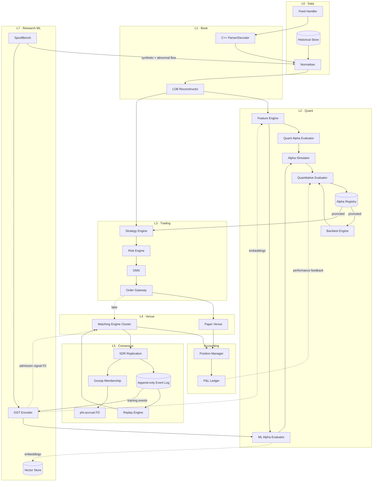
```mermaid
graph TB
    subgraph DATA["L0 · Data"]
        HS[(Historical Store)]
        FH[Feed Handler]
        NRM[Normaliser]
    end
    subgraph BOOK["L1 · Book"]
        PAR[C++ Parser/Decoder]
        LOB[LOB Reconstructor]
    end
    subgraph QUANT["L2 · Quant"]
        FE[Feature Engine]
        AQ[Quant Alpha Evaluator]
        AM[ML Alpha Evaluator]
        SIM[Alpha Simulator]
        EVAL[Quantitative Evaluator]
        REG[(Alpha Registry)]
        BT[Backtest Engine]
    end
    subgraph TRADE["L3 · Trading"]
        STR[Strategy Engine]
        RSK[Risk Engine]
        OMS[OMS]
        GW[Order Gateway]
    end
    subgraph VENUE["L4 · Venue"]
        PV[Paper Venue]
        ME[Matching Engine Cluster]
    end
    subgraph SYS["L5 · Consensus"]
        SDR[SDR Replication]
        MEM[Gossip Membership]
        FD[phi-accrual FD]
        LOG[(Append-only Event Log)]
        RPL[Replay Engine]
    end
    subgraph ML["L7 · Research ML"]
        DGT[DGT Encoder]
        SPB[SpoofBench]
        VS[(Vector Store)]
    end
    subgraph PORT["Accounting"]
        POS[Position Manager]
        PNL[P&L Ledger]
    end

    HS --> NRM
    FH --> PAR --> NRM --> LOB
    LOB --> FE
    FE --> AQ
    FE --> AM
    AM -.embeddings.-> VS
    DGT --> AM
    AQ --> SIM
    AM --> SIM
    SIM --> EVAL --> REG
    REG -->|promoted| BT
    REG -->|promoted| STR
    BT --> EVAL
    LOB --> STR
    STR --> RSK --> OMS --> GW
    GW --> PV
    GW -.later.-> ME
    PV --> POS
    ME --> POS
    POS --> PNL
    PNL -.performance feedback.-> EVAL
    ME --> SDR
    SDR --> LOG
    SDR --> MEM
    MEM --> FD
    LOG --> RPL
    RPL --> ME
    SPB -->|synthetic + abnormal flow| NRM
    SPB --> DGT
    LOG -->|training events| DGT
    DGT -.embeddings.-> FE
    DGT -.admission signal P2.-> ME
```

### 12.4 Deployment topology overview

Detailed in §40. Summary: three logical node groups — **hot-path node(s)** (isolated cores, C++ trading process), **cluster nodes** (matching engine shards + SDR, ≥3 for quorum), and **research nodes** (GPU training, backtesting, dashboards).

### 12.5 Priority-driven build order embedded in the architecture

The architecture is deliberately drawn so that **Priority-1 delivery requires only the shaded path**: `Historical Store → Normaliser → LOB → Feature Engine → Alpha → Simulator → Evaluator → Registry → Backtest → Strategy → Risk → OMS → Gateway → Paper Venue → Positions → P&L`. Nothing in L4-cluster, L5, or L7 is on the critical path for the MVP (§64.1).

---

## 13. Detailed Component Architecture

For every component: purpose, inputs, outputs, internal structure, state, failure modes, and owner.

### 13.1 Feed Handler & Normaliser

| Aspect | Detail |
|---|---|
| **Purpose** | Turn any source (file, synthetic, live paper feed) into a canonical `MarketEvent` stream. |
| **Inputs** | Raw vendor messages (LOBSTER CSV rows, SpoofBench events, live feed frames). |
| **Outputs** | `MarketEvent` (§14.2) on a ring buffer; gap/duplicate/out-of-order diagnostics. |
| **Internal structure** | Source adapter → decoder → validator → sequencer → publisher. |
| **State** | Last sequence number per instrument; gap tracker; instrument reference data. |
| **Failure modes** | Gap in sequence; malformed message; timestamp regression; source disconnect. |
| **Behaviour on failure** | Emit `DATA_GAP` diagnostic event; **do not** interpolate; mark the affected interval as unusable for evaluation; if in paper mode, raise a risk-relevant `FEED_DEGRADED` condition (§22.5). |
| **Owner** | Systems engineer |
| **Language** | **[OPEN-01]** C++ for live path; Python acceptable for offline file ingestion |

**[PROPOSED] Design decision:** the normaliser must never repair data. A gap is a fact about the data and must propagate to evaluation, because a strategy that "trades through" a gap in a backtest is trading on information that did not exist.

### 13.2 LOB Reconstructor

| Aspect | Detail |
|---|---|
| **Purpose** | Maintain exact, full-depth book state per instrument. |
| **Inputs** | `MarketEvent` (add / cancel / modify / execute / trade). |
| **Outputs** | `BookState` view; `BookDelta` events; top-of-book updates. |
| **Data structures** | See §25.4 — the same structures serve reconstruction and matching. |
| **State** | Per instrument: bid ladder, ask ladder, order index, sequence watermark. |
| **Invariants** | (I1) best_bid < best_ask when both sides non-empty; (I2) every level's total size equals the sum of its queue; (I3) every order in the index is present in exactly one level queue; (I4) queue order is arrival order. |
| **Failure modes** | Crossed book from a missed message; negative size; unknown order ID on cancel. |
| **Behaviour on failure** | Raise `BOOK_INCONSISTENT`, snapshot the offending state, and halt processing for that instrument rather than continue on a corrupt book. **[PROPOSED]** *Rationale: a silently corrupt book produces plausible features and fictitious alpha — the worst possible failure for this project.* |
| **Owner** | Systems engineer |

### 13.3 Feature Engine

| Aspect | Detail |
|---|---|
| **Purpose** | Compute microstructure features incrementally and causally. |
| **Inputs** | `BookState` / `BookDelta`, trade prints, optional DGT embeddings (**[OPEN-07]**). |
| **Outputs** | `FeatureVector` with timestamp, instrument, feature values, and a feature-set version. |
| **Internal structure** | Registry of feature definitions → incremental evaluators → rolling-window buffers → vector assembler. |
| **State** | Rolling windows (EWMA, variance, counts), last-value caches. |
| **Causality guard** | Every feature declares its lookback; the engine asserts that no feature reads any buffer entry with `ts > current_event.ts`. |
| **Failure modes** | Window warm-up not complete; divide-by-zero (empty side of book); NaN propagation. |
| **Behaviour on failure** | Emit the feature as `UNAVAILABLE` rather than 0 or NaN; downstream alpha must handle unavailability explicitly, and a strategy shall not quote on an incomplete feature vector. **[PROPOSED]** |
| **Owner** | Quant researcher (definitions) + Systems engineer (online implementation) |

**NFR-042 applies here with full force**: features exist twice — once in Python (research) and once in C++ (online). §16.3 defines the parity contract.

### 13.4 Alpha Evaluators (quant and ML)

| Aspect | Quant route | ML route |
|---|---|---|
| **Purpose** | Turn features into a scored belief | Same, via a learned model |
| **Input** | `FeatureVector` | `FeatureVector` and/or raw graph/event window |
| **Output** | `AlphaValue {alpha_id, version, ts, score, horizon, confidence?}` | Same shape |
| **Structure** | Expression evaluator over a declared formula DAG | Model runtime (TorchScript / ONNX / native) |
| **Latency class** | µs | ms — see NFR-004, OPEN-07 |
| **Determinism** | Fully deterministic | Deterministic given fixed weights, seed, and no non-deterministic kernels |
| **Failure modes** | Missing feature; numerical overflow | Model load failure; input shape mismatch; inference timeout |
| **On failure** | Emit `AlphaValue.status = UNAVAILABLE`; strategy must flatten toward neutral quoting, not guess | Same, plus fall back to the last valid value only within a configured staleness bound |
| **Owner** | Quant researcher | ML engineer |

### 13.5 Alpha Simulator + Quantitative Evaluator

| Aspect | Detail |
|---|---|
| **Purpose** | Convert an alpha time series into metrics, independent of full strategy mechanics. |
| **Inputs** | Alpha time series, forward returns, cost model, universe/period definition. |
| **Outputs** | `AlphaResult` (§14.2) with the full metric set. |
| **Structure** | Alignment → position mapping → PnL series → metric battery → gate evaluation → registry write. |
| **Key design point** | The simulator uses a **simplified, standardised position mapping** (§19.2) so that alphas are comparable to each other. It is *not* the backtester and does not model quoting. |
| **Failure modes** | Misaligned timestamps; insufficient sample; degenerate turnover (constant alpha). |
| **On failure** | Mark `AlphaResult.status = INVALID` with a reason; never emit metrics from a degenerate simulation. |
| **Owner** | Quant researcher |

### 13.6 Strategy Engine

| Aspect | Detail |
|---|---|
| **Purpose** | Convert alpha + state into continuous two-sided quote management. |
| **Inputs** | `AlphaValue`, `BookState`, `Position`, `RiskState`, open-order table. |
| **Outputs** | `OrderAction` stream: `PLACE`, `AMEND`, `CANCEL`. |
| **Internal stages** | (1) fair-value estimation, (2) inventory skew, (3) spread/size sizing, (4) quote-ladder construction, (5) diff against open orders, (6) action emission with hysteresis. |
| **State** | Desired quote ladder; open-order mirror; last action timestamps; quote-update budget. |
| **Failure modes** | Quote thrash (excessive amend/cancel); one-sided quoting due to inventory limits; stale alpha. |
| **On failure** | Widen and reduce size; if alpha is stale beyond bound, cancel and stand down. |
| **Owner** | Quant researcher (policy) + Systems engineer (implementation) |

### 13.7 Risk Engine

| Aspect | Detail |
|---|---|
| **Purpose** | Independently authorise or reject every order action; halt trading when required. |
| **Inputs** | `OrderAction`, `Position`, `RiskLimits` config, market state, order-rate counters. |
| **Outputs** | `RiskDecision {ACCEPT | REJECT(reason_code)}`, `RiskEvent`, halt commands. |
| **Structure** | Ordered check chain (§22.3) → decision → counter update → event emission. |
| **State** | Position/exposure aggregates, rolling order-rate windows, kill-switch state, circuit-breaker state. |
| **Independence rule** | The risk engine shall not import strategy code, shall not read alpha values as authorisation input, and shall not be configurable by the strategy at runtime. **[PROPOSED, enforced structurally]** |
| **Failure modes** | Config unavailable; position feed stale; counter overflow. |
| **On failure** | **Fail closed** — reject all new orders. **[PROPOSED]** *Rationale: an unavailable risk engine must never mean unrestricted trading.* |
| **Owner** | Risk administrator (config) + Systems engineer (implementation) |

### 13.8 OMS + Order Gateway

| Aspect | Detail |
|---|---|
| **Purpose** | Own order identity and lifecycle; translate to venue protocol; reconcile. |
| **Inputs** | Authorised `OrderAction`; venue `ExecutionReport`. |
| **Outputs** | `Order` records, `Fill` records, lifecycle events; venue-bound messages. |
| **Structure** | ID allocator → order table → state machine → venue adapter → reconciliation loop. |
| **State** | Order table (open + terminal, with retention), sequence counters, venue session state. |
| **Failure modes** | Duplicate submission on retry; orphan order (venue has it, OMS lost it); lost fill; sequence desync. |
| **On failure** | Idempotent submission via `client_order_id`; periodic reconciliation against venue open-order snapshot; unmatched orphan triggers `RECONCILIATION_BREAK` and (configurably) kill switch. |
| **Owner** | Systems engineer |

### 13.9 Component responsibility matrix

| Component | Owner role | Owns (single responsibility) | Must NOT do |
|---|---|---|---|
| Feed Handler | Systems | Source abstraction, sequencing | Repair or interpolate data |
| LOB Reconstructor | Systems | Exact book state | Compute features |
| Feature Engine | Quant + Systems | Causal features | Make predictions |
| Alpha Evaluator | Quant / ML | Produce scored belief | Decide orders |
| Alpha Simulator | Quant | Standardised metrics | Model quoting mechanics |
| Alpha Registry | Quant | Identity, versioning, gate status | Execute anything |
| Backtest Engine | Quant | Full strategy simulation over history | Be used for latency claims |
| Strategy Engine | Quant + Systems | Quote policy | Authorise its own orders |
| Risk Engine | Risk admin + Systems | Authorisation & halt | Have an opinion on alpha |
| OMS | Systems | Order identity & lifecycle | Decide fills |
| Order Gateway | Systems | Venue abstraction | Contain trading logic |
| Paper Venue | Systems | Fill simulation | Be confused with live trading |
| Matching Engine | Systems | Continuous multi-level matching | Contain strategy logic |
| SDR / Replication | Systems | Agreement & durability | Reorder committed events |
| Failure Detector | Systems | Suspicion level φ | Trigger trading halts directly |
| Replay Engine | Systems | Deterministic reconstruction | Alter events |
| DGT | ML | Representations | Be evaluated only on probe accuracy (see §33.9) |
| SpoofBench | ML | Labelled synthetic flow | Be treated as real market data |
| Observability | Platform | Measurement | Be optional |

---

## 14. Data Architecture

### 14.1 Data flow (DFD level 0 and 1)

**Level 0 — context**

```
 [Historical Data Vendor]──┐
 [SpoofBench Generator]────┼──► ((HELIOS)) ──► [Reports / Dashboards / Registry / Repo]
 [Paper Feed]──────────────┘        │
                                    └──► [Audit & Event Log]
```

**Level 1 — main data flow**

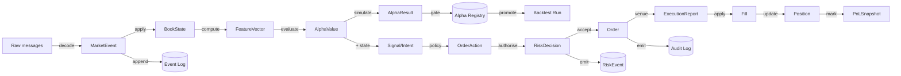
```mermaid
graph LR
    A[Raw messages] -->|decode| B[MarketEvent]
    B -->|apply| C[BookState]
    C -->|compute| D[FeatureVector]
    D -->|evaluate| E[AlphaValue]
    E -->|simulate| F[AlphaResult]
    F -->|gate| G[(Alpha Registry)]
    G -->|promote| H[Backtest Run]
    E -->|+ state| I[Signal/Intent]
    I -->|policy| J[OrderAction]
    J -->|authorise| K[RiskDecision]
    K -->|accept| L[Order]
    L -->|venue| M[ExecutionReport]
    M -->|apply| N[Fill]
    N -->|update| O[Position]
    O -->|mark| P[PnLSnapshot]
    B -->|append| Q[(Event Log)]
    K -->|emit| R[(RiskEvent)]
    L -->|emit| S[(Audit Log)]
```

### 14.2 Core data entities

For each: purpose, key fields, relationships, lifecycle, source, consumer.

---

#### E-01 `MarketEvent`
- **Purpose:** canonical unit of market information.
- **Fields:** `event_id`, `instrument_id`, `seq_no`, `ts_exchange`, `ts_ingest`, `type` ∈ {ADD, CANCEL, MODIFY, EXECUTE, TRADE, STATUS}, `side`, `price`, `size`, `order_ref`, `source_id`, `flags`.
- **Relationships:** many→1 instrument; ordered by (`instrument_id`, `seq_no`).
- **Lifecycle:** created at ingest → appended to event log → consumed by LOB → retained immutably.
- **Source:** Feed Handler. **Consumer:** LOB, Event Log, DGT training, replay.

#### E-02 `BookState` / `BookDelta`
- **Purpose:** current or incremental book.
- **Fields (state):** `instrument_id`, `ts`, `seq_no`, `bids[{price, total_size, order_count, queue[]}]`, `asks[...]`, `best_bid`, `best_ask`.
- **Lifecycle:** mutated in place; snapshotted periodically for replay and for graph construction.
- **Source:** LOB Reconstructor. **Consumer:** Feature Engine, Strategy, DGT graph builder, Paper Venue fill model.

#### E-03 `FeatureVector`
- **Fields:** `instrument_id`, `ts`, `feature_set_version`, `values[name → float]`, `availability_mask`, `source_seq_no`.
- **Lifecycle:** produced per event or per sampling tick; retained for training and for leakage audit.
- **Source:** Feature Engine. **Consumer:** Alpha evaluators, ML training, Risk (selected features).

#### E-04 `AlphaDefinition`
- **Fields:** `alpha_id`, `version`, `provenance` ∈ {QUANT, ML}, `formula_or_model_ref`, `feature_set_version`, `horizon`, `params`, `author`, `created_ts`, `code_commit`.
- **Lifecycle:** DRAFT → SIMULATED → EVALUATED → PROMOTED | REJECTED | RETIRED (§54.3).
- **Source:** Alpha Lab. **Consumer:** Simulator, Backtester, Strategy.

#### E-05 `AlphaValue`
- **Fields:** `alpha_id`, `version`, `instrument_id`, `ts`, `score`, `horizon`, `status` ∈ {OK, UNAVAILABLE, STALE}, `feature_vector_hash`.
- **Source:** Alpha Evaluator. **Consumer:** Simulator, Strategy.

#### E-06 `AlphaResult` (the registry record — §19.7)
- **Fields:** `alpha_id`, `version`, `run_id`, period boundaries (`train`, `valid`, `test`), `sharpe`, `fitness`, `turnover`, `pnl`, `max_drawdown`, `volatility`, `ic_mean`, `ic_ir`, `hit_rate`, `cost_bps_assumed`, `pnl_net`, `cost_sensitivity_curve`, `regime_breakdown`, `stability_score`, `gate_results{}`, `status`, `data_snapshot_id`, `config_hash`, `code_commit`, `seed`, `test_set_access_count`, `timestamp`.

#### E-07 `Order`
- **Fields:** `order_id`, `client_order_id`, `parent_id?`, `strategy_id`, `alpha_id?`, `instrument_id`, `side`, `order_type`, `price`, `qty`, `remaining_qty`, `filled_qty`, `avg_fill_px`, `tif`, `status`, `reject_reason?`, `ts_created`, `ts_submitted`, `ts_ack`, `ts_terminal`, `venue_order_id?`.
- **Lifecycle:** §54.1.
- **Source:** OMS. **Consumer:** Gateway, Venue, P&L, audit, analytics.

#### E-08 `Fill`
- **Fields:** `fill_id`, `order_id`, `instrument_id`, `side`, `price`, `qty`, `liquidity_flag` ∈ {MAKER, TAKER}, `fee`, `ts_venue`, `ts_received`, `counterparty_ref?`, `venue_id`.
- **Source:** Venue. **Consumer:** OMS, Position Manager, P&L, realized-spread analytics.

#### E-09 `Position`
- **Fields:** `instrument_id`, `strategy_id`, `net_qty`, `avg_cost`, `realised_pnl`, `unrealised_pnl`, `mark_px`, `ts`.
- **Lifecycle:** §54.2.

#### E-10 `PnLSnapshot`
- **Fields:** `ts`, `scope` (strategy/instrument/portfolio), `realised`, `unrealised`, `fees`, `total`, `gross_exposure`, `net_exposure`, `cash`.
- **Invariant:** NFR-024 reconciliation.

#### E-11 `RiskEvent`
- **Fields:** `event_id`, `ts`, `type` ∈ {LIMIT_BREACH, ORDER_REJECTED, RATE_ABNORMAL, KILL_SWITCH_ARMED, KILL_SWITCH_TRIPPED, BREAKER_TRIPPED, BREAKER_RESET, FEED_DEGRADED, RECONCILIATION_BREAK}, `severity`, `reason_code`, `subject_ref`, `limits_snapshot_hash`, `actor?`.

#### E-12 `MatchingCommand` / `MatchingEvent`
- **Command fields:** `cmd_id`, `shard_id`, `instrument_id`, `type` ∈ {NEW, CANCEL, MODIFY}, `payload`, `client_ts`, `arrival_seq`.
- **Event fields:** `event_id`, `cmd_id`, `type` ∈ {ACCEPTED, TRADE, RESTED, CANCELLED, REJECTED}, `trades[]`, `book_delta`, `commit_index`.

#### E-13 `LogEntry` (SDR log)
- **Fields:** `shard_id`, `term`, `index`, `cmd_id`, `command`, `checksum`, `speculative_flag`, `commit_ts`.
- **Invariant:** an entry, once committed at index *i* in term *t*, is never overwritten by a different command at index *i*.

#### E-14 `NodeState`
- **Fields:** `node_id`, `role` ∈ {LEADER, FOLLOWER, CANDIDATE, RECOVERING, DEAD}, `term`, `last_log_index`, `commit_index`, `phi`, `last_heartbeat_ts`.

#### E-15 `FaultEvent` (chaos)
- **Fields:** `fault_id`, `ts_start`, `ts_end`, `type`, `target`, `params`, `experiment_id`, `expected_behaviour_ref`.

#### E-16 `ModelArtifact` / `ModelVersion`
- **Fields:** `model_id`, `version`, `architecture`, `pretext_tasks[]`, `train_data_snapshot`, `hyperparams_hash`, `weights_uri`, `metrics{}`, `code_commit`, `seed`, `created_ts`.

#### E-17 `Embedding`
- **Fields:** `model_id`, `model_version`, `instrument_id`, `ts`, `vector[]`, `source_snapshot_hash`.
- **Store:** vector store, versioned by `model_version` (never overwritten in place).

#### E-18 `AuditEvent`
- **Fields:** `audit_id`, `ts`, `actor`, `action`, `subject`, `before_hash`, `after_hash`, `chain_hash`, `justification?`.

#### E-19 `SystemEvent`
- **Fields:** `ts`, `component`, `severity`, `code`, `message`, `trace_id`.

#### E-20 `ManipulationLabel` (SpoofBench)
- **Fields:** `label_id`, `episode_id`, `type` ∈ {SPOOF, LAYER, QUOTE_STUFF}, `ts_start`, `ts_end`, `instrument_id`, `difficulty`, `involved_order_ids[]`, `ground_truth = true`.

### 14.3 Entity relationships

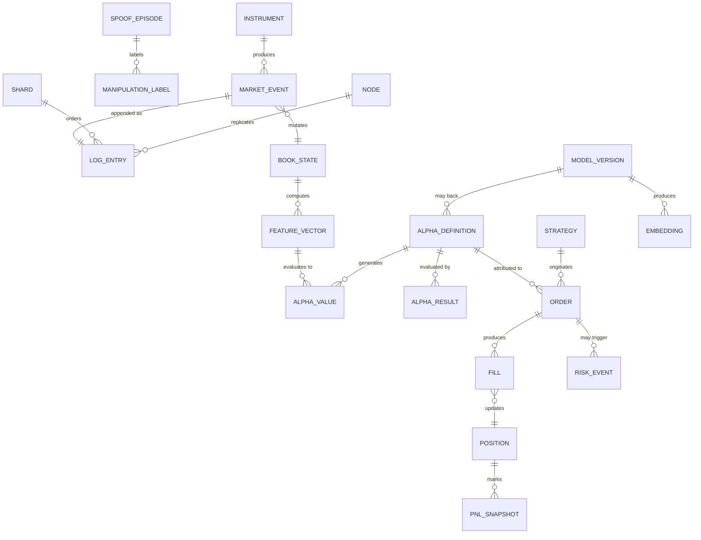
```mermaid
erDiagram
    INSTRUMENT ||--o{ MARKET_EVENT : produces
    MARKET_EVENT ||--|| LOG_ENTRY : "appended as"
    MARKET_EVENT }o--|| BOOK_STATE : "mutates"
    BOOK_STATE ||--o{ FEATURE_VECTOR : "computes"
    FEATURE_VECTOR ||--o{ ALPHA_VALUE : "evaluates to"
    ALPHA_DEFINITION ||--o{ ALPHA_VALUE : "generates"
    ALPHA_DEFINITION ||--o{ ALPHA_RESULT : "evaluated by"
    ALPHA_DEFINITION ||--o{ ORDER : "attributed to"
    STRATEGY ||--o{ ORDER : "originates"
    ORDER ||--o{ FILL : "produces"
    ORDER ||--o{ RISK_EVENT : "may trigger"
    FILL }o--|| POSITION : "updates"
    POSITION ||--o{ PNL_SNAPSHOT : "marks"
    MODEL_VERSION ||--o{ EMBEDDING : "produces"
    MODEL_VERSION ||--o{ ALPHA_DEFINITION : "may back"
    SPOOF_EPISODE ||--o{ MANIPULATION_LABEL : "labels"
    SHARD ||--o{ LOG_ENTRY : "orders"
    NODE ||--o{ LOG_ENTRY : "replicates"
```

### 14.4 Storage strategy

| Data class | Store | Rationale | Retention |
|---|---|---|---|
| Raw + normalised market events | Columnar files (Parquet) partitioned by instrument/date, plus append-only log for live | Cheap, fast scans for research; log for replay | Full project duration |
| Live book state | In-memory; **[CONFIRMED]** Redis-class store for cross-process/live view | Hot path must not touch disk | Ephemeral + snapshots |
| Event log (matching engine) | **[CONFIRMED]** Kafka/Redpanda — **[OPEN-08]** | Durable, replayable, ordered per partition | Full duration (it is the source of truth) |
| Alpha registry, model registry, order/fill/position history, RBAC, audit | **[CONFIRMED]** PostgreSQL | Relational integrity, transactions, easy querying | Full duration |
| Embeddings | **[CONFIRMED]** Vector store, versioned | Similarity search + versioned reproducibility | Per model version |
| Metrics / traces | Prometheus / OTel backend | Time-series | 30–90 days |
| Artefacts (models, reports, plots) | Object storage / repo LFS | Reproducibility package | Full duration |

**[PROPOSED] DAT-001** — Partition the event log by `(shard_id)` and preserve per-partition ordering; never rely on cross-partition ordering for correctness. *Rationale: cross-partition ordering is not guaranteed by Kafka/Redpanda and assuming it is a classic correctness bug.* *Pri: P1. Verify: I, T.*

### 14.5 Data lineage requirement

**DAT-002 [P0]** — Every `AlphaResult` and every backtest report shall be reconstructible from `(data_snapshot_id, config_hash, code_commit, seed)`. *Verification: D — pick a random historical result and reproduce it.*

**DAT-003 [P0]** — Every `Fill` shall be traceable backwards to the `MarketEvent` sequence range that produced the `FeatureVector` that produced the `AlphaValue` that produced the `Order`. *Rationale: this is both the attribution path and the leakage-audit path (NFR-061).* *Verification: T.*

---

## 15. Database Requirements

### 15.1 Relational schema (PostgreSQL) — core tables

| Table | Key columns | Notes |
|---|---|---|
| `instruments` | `instrument_id` PK, `symbol`, `tick_size`, `lot_size`, `venue_id`, `active` | Reference data; tick size matters for the graph and for price bands |
| `data_snapshots` | `snapshot_id` PK, `source`, `date_range`, `instrument_set`, `checksum`, `created_ts` | Immutable; referenced by every result |
| `alpha_definitions` | `alpha_id, version` PK, `provenance`, `spec_json`, `feature_set_version`, `horizon`, `author`, `code_commit` | Immutable per version |
| `alpha_results` | `run_id` PK, FK `(alpha_id, version)`, metric columns, `gate_results jsonb`, `status`, lineage columns | One row per evaluation run |
| `alpha_gate_config` | `config_id` PK, `sharpe_min`, `fitness_min`, `turnover_min`, `turnover_max`, `extra jsonb`, `effective_from` | Gates are versioned; changing a gate is an audited event |
| `test_set_access` | `access_id` PK, FK alpha, `snapshot_id`, `ts`, `actor`, `purpose` | Enforces NFR-070 |
| `models` / `model_versions` | `model_id`, `version` PK | DGT and any ML alpha backbone |
| `strategies` | `strategy_id` PK, `alpha_id`, `params_json`, `code_commit`, `status` | |
| `risk_limits` | `limit_set_id` PK, `scope`, `limits jsonb`, `author`, `effective_from`, `hash` | Versioned, audited; SEC-000 |
| `orders` | `order_id` PK, all E-07 fields, FKs to strategy/alpha | Partitioned by date |
| `fills` | `fill_id` PK, FK `order_id` | |
| `positions_eod` / `positions_snapshot` | `(scope, instrument_id, ts)` | |
| `pnl_snapshots` | `(scope, ts)` | |
| `risk_events` | `event_id` PK | |
| `audit_events` | `audit_id` PK, `chain_hash` | Append-only, hash-chained |
| `backtest_runs` | `bt_run_id` PK, lineage, fill-model ref, cost model ref, results ref | |
| `experiments` | `experiment_id` PK, `type`, `hypothesis`, `pre_registered_ts` | **[PROPOSED]** see below |
| `fault_experiments` | `fault_id` PK, chaos metadata | |

### 15.2 Database requirements

| ID | Requirement | Rationale | Pri | Verify |
|---|---|---|---|---|
| DAT-010 | `alpha_definitions` rows shall be immutable; changes create a new `version`. | Reproducibility; prevents retro-fitting a definition to a result. | P0 | T |
| DAT-011 | `alpha_results` shall be insert-only. | Results are evidence. | P0 | T |
| DAT-012 | `audit_events` shall be append-only with a hash chain linking each row to its predecessor. | Tamper evidence. | P2 | T |
| DAT-013 | `risk_limits` shall be versioned and referenced by hash from every order-authorisation decision. | Reconstruct *which* limits were in force. | P1 | T |
| DAT-014 | Order and fill tables shall be time-partitioned. | Volume management. | P2 | I |
| DAT-015 | **[PROPOSED]** An `experiments` table shall record a hypothesis and its parameters **before** the experiment runs (lightweight pre-registration). | Directly counters HARKing and multiple-testing bias, which is the biggest threat to the credibility of an alpha result. | P1 | I |
| DAT-016 | All timestamps shall be stored in UTC with at least microsecond precision, and exchange vs ingest timestamps shall be distinct columns. | Latency attribution and correct ordering. | P0 | T |
| DAT-017 | Referential integrity shall be enforced by FK constraints between order → fill → position → P&L. | Prevents orphan P&L. | P0 | T |
| DAT-018 | Backups/snapshots of the registry and audit tables shall be taken before every reported experiment batch. | Cheap insurance. | P2 | I |

---

## 16. API / Interface Requirements

### 16.1 Interface catalogue

Every interface has: input, output, style, error cases, latency class, and ordering requirement. **Latency class**: `HOT` (µs, in the quoting loop), `WARM` (ms, near-line), `COLD` (offline/batch).

| ID | Interface | Input | Output | Style **[PROPOSED]** | Errors | Latency | Ordering |
|---|---|---|---|---|---|---|---|
| IFC-01 | Feed → Parser | Raw frames/rows | Decoded messages | In-process, zero-copy buffer | Malformed frame, truncation | HOT | Strict per source |
| IFC-02 | Parser → Normaliser/LOB | Decoded message | `MarketEvent` | In-process struct on ring buffer | Unknown type, bad instrument | HOT | Strict per instrument by `seq_no` |
| IFC-03 | LOB → Feature Engine | `BookDelta` / `BookState` ref | — (callback) | In-process callback, no allocation | Book inconsistent | HOT | Strict |
| IFC-04 | Feature Engine → Alpha | `FeatureVector` (+ availability mask) | `AlphaValue` | In-process call | Feature unavailable, warm-up | HOT | Strict |
| IFC-05 | ML Inference | `FeatureVector` / graph window | `AlphaValue` or `Embedding` | **[OPEN-07]** in-process (TorchScript/ONNX) if online; gRPC if sidecar | Model missing, timeout, shape error | WARM | Per instrument |
| IFC-06 | Alpha → Strategy | `AlphaValue` + `Position` + `RiskState` | `Intent` | In-process | Stale alpha, unavailable | HOT | Strict |
| IFC-07 | Strategy → Risk | `OrderAction` | `RiskDecision` | **Synchronous in-process call — mandatory, no async bypass** | Reject with reason code; fail-closed on internal error | HOT | Strict; **must be in-line, not fire-and-forget** |
| IFC-08 | Risk → OMS | Authorised `OrderAction` | `Order` | In-process | Duplicate client id, unknown order | HOT | Strict |
| IFC-09 | OMS → **ExecutionVenue** (Order Gateway) | `NewOrder` / `CancelOrder` / `AmendOrder` | `ExecutionReport` (ACK/REJECT/FILL/PARTIAL/CANCELLED) | **The pivotal interface.** In-process for paper venue; binary RPC/TCP for cluster | Venue down, reject, timeout, duplicate | HOT | Strict per instrument; idempotent by `client_order_id` |
| IFC-10 | Venue → OMS | `ExecutionReport` | — | Callback / socket | Out-of-order report, unknown order | HOT | Strict per order |
| IFC-11 | OMS → Position/P&L | `Fill` | Updated `Position`, `PnLSnapshot` | In-process | Duplicate fill, unknown order | WARM | Strict per instrument |
| IFC-12 | Any → Event Log | Events | Ack + offset | Kafka/Redpanda producer | Broker unavailable, backpressure | WARM | Per-partition |
| IFC-13 | Event Log → Replay Engine | Log range | Reconstructed state | Consumer + snapshot loader | Gap, checksum mismatch | COLD | Strict per partition |
| IFC-14 | Alpha Lab → Alpha Registry | `AlphaDefinition`, `AlphaResult` | `alpha_id/version`, status | REST/JSON over HTTPS + SQL | Validation failure, duplicate version | COLD | N/A |
| IFC-15 | Registry → Backtester | Promoted `AlphaDefinition` | `BacktestRun` | Library call | Alpha not promoted, missing data | COLD | N/A |
| IFC-16 | Registry → Strategy deploy | `AlphaDefinition` + params | Loaded strategy config | Config file / RPC | Alpha not promoted → **hard reject** | COLD | N/A |
| IFC-17 | SpoofBench → Feed | Synthetic events + labels | `MarketEvent` + `ManipulationLabel` | Same `MarketDataSource` interface | Config invalid | WARM | Strict |
| IFC-18 | Chaos Harness → Cluster | `FaultEvent` | Applied fault, ack | Admin RPC / eBPF / tc / kill | Target unreachable | COLD | N/A |
| IFC-19 | Client → Matching Engine | `MatchingCommand` | `MatchingEvent` | Binary RPC over mTLS | Reject, shard unavailable, not-leader redirect | HOT | Strict per shard |
| IFC-20 | Leader ↔ Followers (SDR) | `AppendEntries`-style replication RPC | Ack/nack with match index | Binary RPC | Timeout, stale term, log mismatch | HOT | Per shard, monotonic index |
| IFC-21 | Membership/gossip | Heartbeat, membership delta | Suspicion updates | UDP gossip | Loss (tolerated by design) | WARM | Eventually consistent |
| IFC-22 | Any → Metrics | Counters/histograms | — | Prometheus scrape | Scrape failure | COLD | N/A |
| IFC-23 | Any → Tracing | Spans | — | OTel exporter | Exporter down (must not block) | COLD | N/A |
| IFC-24 | Admin → Risk Config | Limit set | Versioned config + audit event | REST, JWT + RBAC `risk-admin` | AuthZ failure, validation failure | COLD | N/A |
| IFC-25 | Admin → Kill Switch | Arm/disarm/trip | Confirmation + audit event | REST, JWT + RBAC `operator` | AuthZ failure | WARM (must be < NFR-008) | N/A |
| IFC-26 | Dashboard → Read APIs | Query | JSON | REST/GraphQL, JWT | AuthZ, rate limit | COLD | N/A |
| IFC-27 | DGT → Vector Store | `Embedding` batch | Ack | Client SDK | Dimension mismatch, version conflict | COLD | N/A |
| IFC-28 | DGT → Engine admission (P2) | Embedding-derived score | Admission hint | In-process / RPC | Unavailable → **engine ignores hint** (must degrade to normal operation) | WARM | Best-effort |

### 16.2 The `ExecutionVenue` contract (IFC-09) — the pivot of the architecture

**[PROPOSED]** Both the paper venue and the matching-engine cluster implement:

```
interface ExecutionVenue:
    submit(NewOrder{client_order_id, instrument, side, type, price, qty, tif}) -> Ack | Reject
    cancel(CancelOrder{client_order_id, target_client_order_id})               -> Ack | Reject
    amend (AmendOrder {client_order_id, target_client_order_id, new_px, new_qty}) -> Ack | Reject
    subscribe_reports(callback: ExecutionReport -> void)
    snapshot_open_orders() -> [VenueOrderView]        # for reconciliation
    venue_info() -> {venue_id, supports_amend, tick_size, latency_class, is_simulated}
```

| Rule | Statement |
|---|---|
| **VEN-01** | `is_simulated` shall be `true` for the paper venue and shall be surfaced in every report, dashboard, and log line derived from it. *No result derived from a simulated venue may be presented without that flag.* **[P0]** |
| **VEN-02** | Both venues shall pass an identical conformance test suite covering ordering, partial fills, cancel-after-fill races, duplicate submission, and unknown-order handling. **[P0]** |
| **VEN-03** | Neither venue shall ever produce a fill at a price better than the best contra price available at the time of the matching decision. **[P0]** |
| **VEN-04** | `client_order_id` shall be the idempotency key; a duplicate submit shall return the original ack, not create a second order. **[P0]** |

### 16.3 Feature parity contract (NFR-042)

**IFC-29 [P0]** — For every feature implemented in both Python (research) and C++ (online), a parity test shall replay a fixed event sequence through both implementations and assert agreement within tolerance.

| Aspect | Requirement |
|---|---|
| Tolerance | **[PROPOSED]** relative error ≤ 1e-9 for deterministic arithmetic features; ≤ 1e-6 for EWMA/rolling features where accumulation order differs |
| Fixture | A checked-in, versioned event sequence covering: empty book, one-sided book, crossed-book rejection, warm-up boundary, wide spread, zero-size level |
| Failure | Parity failure is a **merge-blocking CI error**, not a warning |
| Rationale | If research features and online features diverge, backtest results do not describe the deployed system — every downstream claim becomes void |

### 16.4 Error-handling policy across interfaces

| Class | Policy |
|---|---|
| Data-quality error (gap, malformed) | Propagate as a typed diagnostic; never silently repair |
| Feature unavailable | Explicit `UNAVAILABLE`; downstream must handle, never impute silently |
| Alpha stale | Strategy stands down to neutral/cancel; never trades on stale belief |
| Risk internal error | **Fail closed** (reject all) |
| Venue timeout | Retry with same `client_order_id`; escalate to reconciliation after N attempts |
| Reconciliation break | `RiskEvent` + configurable kill switch |
| Metrics/tracing failure | Non-blocking; degrade silently but count the degradation |
| Model unavailable | Alpha `UNAVAILABLE`; **never** substitute a default score |
---

# PART IV — QUANTITATIVE TRADING SYSTEM (PRIORITY 1)

## 17. Quantitative Trading Requirements

### 17.1 The alpha lifecycle — the spine of the project

```
DATA → FEATURE ENGINEERING → ALPHA GENERATION → SIMULATION → EVALUATION
     → FILTERING (gates) → BACKTEST → VALIDATION → STRATEGY → RISK
     → PAPER EXECUTION → FILLS → POSITIONS → P&L → (feedback into research)
```
**[CONFIRMED]**

Each arrow is a hard boundary with an owner, a data contract, and a gate. An alpha cannot skip a stage. The registry state machine (§54.3) enforces this structurally rather than by discipline.

| Stage | Input | Output | Gate to advance | Owner |
|---|---|---|---|---|
| Data | Vendor/synthetic messages | `MarketEvent` stream | Data-quality checks pass; snapshot registered | Systems |
| Feature engineering | Book state | `FeatureVector` | Causality test passes; parity test passes | Quant + Systems |
| Alpha generation | Features (+ model) | `AlphaValue` series | Definition registered with version + horizon | Quant / ML |
| Simulation | Alpha series + forward returns + costs | `AlphaResult` metrics | Simulation valid (non-degenerate, sufficient sample) | Quant |
| Evaluation | Metrics | Gate results | — | Quant |
| Filtering | Gate results | PROMOTED / REJECTED | Sharpe > 1 **and** Fitness > 1 **and** 1% < Turnover < 70% **and** OOS evidence | Quant |
| Backtest | Promoted alpha + strategy params | P&L, risk, execution stats | No leakage; costs applied; fill model declared | Quant |
| Validation | Backtest results | Robustness verdict | Regime + stability + cost-sensitivity checks | Quant |
| Strategy | Validated alpha | Quote policy config | Inventory limits configured; dry-run passes | Quant + Systems |
| Risk | Order actions | Authorised orders | Limits configured by a different author (SEC-000) | Risk admin |
| Paper execution | Authorised orders | Fills | Venue conformance suite green | Systems |
| P&L | Fills | Ledger | Reconciliation invariant holds (NFR-024) | Systems |

### 17.2 Requirements

| ID | Requirement | Rationale | Pri | Verify |
|---|---|---|---|---|
| QNT-001 | The quant pipeline shall be executable end-to-end from a single command against a registered data snapshot. | Reproducibility and iteration speed. | P0 | D |
| QNT-002 | Every stage of the lifecycle shall emit a machine-readable artefact persisted with lineage. | Audit and reproducibility. | P0 | T |
| QNT-003 | No component downstream of "Filtering" shall accept an alpha whose registry status is not `PROMOTED`. | Prevents un-evaluated alphas reaching a strategy. | P0 | T |
| QNT-004 | The pipeline shall support at least two alpha provenances (QUANT, ML) through one common interface. | Confirmed dual route; also forces fair comparison. | P0 | T |
| QNT-005 | The pipeline shall support multiple concurrent candidate alphas with independent versioning. | Alpha research is a search, not a single attempt. | P0 | T |
| QNT-006 | All monetary results shall be reported both gross and net of modelled transaction costs. | Gross-only P&L is the classic self-deception. | P0 | I, T |
| QNT-007 | The universe (instruments) and period for every evaluation shall be declared up front and stored. | Prevents post-hoc universe selection. | P0 | T |
| QNT-008 | The system shall support single-instrument evaluation; cross-sectional metrics shall be computed only when the universe has ≥ **[PROPOSED]** 5 instruments, and shall be marked `N/A` otherwise. | IC and rank-based metrics are meaningless on one name — see Audit A-02. | P0 | T |

### 17.3 Feature taxonomy

All features are computed causally from book state and trade prints. Each feature declares: name, formula, inputs, lookback, units, warm-up period, and update trigger.

| # | Feature | Formula (indicative) | Type | Lookback | Notes |
|---|---|---|---|---|---|
| F-01 | Best bid / best ask | top of ladder | State | 0 | Foundation |
| F-02 | Mid-price | `(bb + ba)/2` | State | 0 | Reference price; naive |
| F-03 | Spread | `ba − bb` | State | 0 | In ticks and in bps |
| F-04 | Microprice | `(bb·A + ba·B)/(A+B)` where B, A are top sizes | State | 0 | Better short-horizon fair-value proxy than mid |
| F-05 | Order-book imbalance (OBI-k) | `(Σ₁..ₖ B − Σ₁..ₖ A)/(Σ₁..ₖ B + Σ₁..ₖ A)` | State | 0 | k ∈ {1,3,5,10}; the canonical microstructure feature |
| F-06 | Weighted depth imbalance | distance-decayed OBI: weight level *i* by `exp(−λ·i)` | State | 0 | Reduces sensitivity to deep, stale levels |
| F-07 | Order-flow imbalance (OFI) | signed depth change at BBO from adds/cancels/trades between events | **Flow** | 1 event or Δt | Distinct from OBI: stock vs flow. Do not conflate. |
| F-08 | Trade-flow imbalance (TFI) | `(buy_vol − sell_vol)/(buy_vol + sell_vol)` over window | Flow | Δt | Uses trade prints and aggressor side |
| F-09 | Order-flow intensity | event arrival rate (adds, cancels, trades) per unit time | Flow | Δt | Directly connects to the Hawkes framing in SpoofBench |
| F-10 | Cancel ratio | cancels / (adds + cancels) over window | Flow | Δt | Elevated cancel ratio is a spoofing indicator |
| F-11 | Realised volatility | `sqrt(Σ r²)` over window on mid or micro returns | Derived | Δt | Multiple horizons |
| F-12 | Momentum / short-horizon return | `mid_t − mid_{t−Δ}` (ticks or bps) | Derived | Δ | Multiple Δ |
| F-13 | Queue position estimate | cumulative size ahead of our order at its level | State | 0 | Drives fill probability; central for maker strategies |
| F-14 | Queue depletion rate | d(size ahead)/dt | Flow | Δt | Predicts imminent fill |
| F-15 | Book slope / shape | regression of cumulative size on price distance | State | 0 | Liquidity resilience proxy |
| F-16 | Rolling statistics | EWMA/EWVar of any of the above | Derived | half-life | Standardisation inputs |
| F-17 | Time-of-day / session phase | clock features | Exogenous | 0 | Intraday seasonality is real; ignoring it inflates apparent alpha |
| F-18 | Spread volatility | stdev of spread over window | Derived | Δt | Regime indicator |
| F-19 | Trade size distribution stats | mean/quantiles of recent trade sizes | Flow | Δt | Institutional-flow proxy |
| F-20 | DGT embedding components | learned vector | Learned | model window | **[OPEN-07]** online vs offline |

**ALG-010 [P0]** — Each feature shall be registered with an explicit `warmup_events`/`warmup_time`, and shall report `UNAVAILABLE` until warm-up completes. *Rationale: an EWMA evaluated on 3 samples is noise that looks like signal, and it disproportionately appears at the start of every test window.* *Verify: T.*

**ALG-011 [P0]** — Features shall be standardised (z-score or rank) using **only trailing data**, never full-sample statistics. *Rationale: full-sample normalisation is the most common and most invisible form of look-ahead bias.* *Verify: T (leakage suite, §20.6).*

### 17.4 Worked feature examples

**Order-book imbalance (k = 1):**
```
bids: 100.02 × 800      asks: 100.03 × 200
OBI_1 = (800 − 200) / (800 + 200) = +0.60      → pressure to the upside
Microprice = (100.02·200 + 100.03·800)/(1000) = 100.028   (vs mid 100.025)
```
The microprice sits above the mid precisely because the ask is thin — the side more likely to be consumed. **[Example only, not a confirmed alpha.]**

**Order-flow imbalance across two events:**
```
t0: bid 100.02 × 800, ask 100.03 × 200
t1: bid 100.02 × 950, ask 100.03 × 150   (150 added to bid, 50 pulled/traded from ask)
OFI = ΔB − ΔA = (+150) − (−50) = +200      → net buying pressure in flow terms
```
Note OBI moved from +0.60 to +0.727, but OFI is a different quantity with different dynamics and different decay. **They must be separate features.**

### 17.5 From features to a quant-designed alpha — worked examples

> **All formulations below are EXAMPLES to illustrate construction. None is a confirmed HELIOS alpha. Every one must pass §19 before it means anything.**

**Example A — Imbalance-reversion/continuation blend**
```
z_obi   = zscore_trailing(OBI_5, halflife = 30s)
z_ofi   = zscore_trailing(OFI,   halflife = 10s)
alpha_A = w1 · z_obi + w2 · z_ofi − w3 · z_spread
```
Rationale: depth imbalance and flow imbalance are complementary (stock vs flow); wide spreads are penalised because they raise crossing cost and reduce realisable edge.

**Example B — Microprice deviation**
```
alpha_B = (microprice − mid) / tick_size       [normalised]
```
Rationale: the classic size-weighted-fair-value tilt. Extremely well known — its value here is as a **baseline** against which any fancier alpha must justify itself.

**Example C — Queue-aware maker edge**
```
p_fill  = g(queue_ahead, depletion_rate, arrival_intensity)
alpha_C = p_fill · expected_edge_if_filled − adverse_selection_penalty(z_ofi)
```
Rationale: for a maker strategy the relevant belief is not "price goes up" but "I get filled *and* the fill is not adverse".

**Example D — Cancel-burst / manipulation-aware defensive alpha**
```
alpha_D = −w · zscore(cancel_ratio) · 1[order_flow_intensity > threshold]
```
Rationale: connects directly to SpoofBench; also doubles as a risk feature.

**ALG-012 [P1]** — At least one **trivial baseline alpha** (e.g. Example B, or pure OBI sign) shall be evaluated through the identical pipeline, and every non-trivial alpha shall be reported against it. *Rationale: without a baseline, "Sharpe 1.3" is uninterpretable — the baseline may be 1.4.* *Verify: I, M.*

### 17.6 Universe and horizon policy

**[OPEN-03]** is resolved here structurally rather than by decree: the system shall support **alpha families keyed by horizon**, and every alpha declares its horizon at registration.

| Family | Horizon | Position mapping | Turnover meaning | Realistic for HELIOS? |
|---|---|---|---|---|
| H-MICRO | 100 ms – 5 s | Quote skew / target inventory | Quote replacement rate | Yes; matches the HFT-style quoting strategy |
| H-SHORT | 5 s – 5 min | Target position in units | Position change per interval | Yes; easiest to evaluate credibly |
| H-DAILY | 1 day | Target weight per instrument | Fraction of book turned per day | Only if a multi-instrument daily dataset is obtained |

**This matters because the Sharpe/Fitness/Turnover thresholds carry different meanings per family** — see §19.6 and Audit A-01.

---

## 18. Alpha Generation Requirements

### 18.1 Route A — Quant-designed alpha

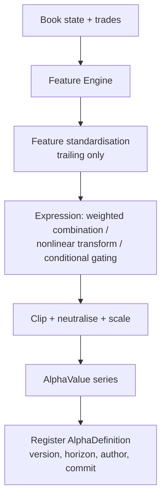
```mermaid
flowchart TD
    A[Book state + trades] --> B[Feature Engine]
    B --> C[Feature standardisation<br/>trailing only]
    C --> D[Expression: weighted combination /<br/>nonlinear transform / conditional gating]
    D --> E[Clip + neutralise + scale]
    E --> F[AlphaValue series]
    F --> G[Register AlphaDefinition<br/>version, horizon, author, commit]
```

| ID | Requirement | Rationale | Pri | Verify |
|---|---|---|---|---|
| ALG-001 | Quant alphas shall be declared as versioned expressions over registered features, not as free-form code in a notebook. | Reproducibility and comparability; prevents "the alpha changed while we were testing it". | P0 | I, T |
| ALG-002 | The alpha DSL/expression evaluator shall support arithmetic, rolling ops, standardisation, clipping, conditional gating, and lags — with every op declaring its lookback. | Enough expressiveness without enabling accidental look-ahead. | P0 | T |
| ALG-003 | Any operation that would read future data shall be structurally impossible in the evaluator (no negative lags, no full-sample statistics). | Look-ahead prevention by construction, not by review. | P0 | T |
| ALG-004 | Alpha output shall be clipped/bounded and shall declare its scale convention. | Unbounded alphas produce unbounded positions and meaningless Sharpe. | P0 | T |
| ALG-005 | Alpha parameters explored during search shall be logged, including rejected settings. | Multiple-testing accounting (NFR-070). | P1 | T |
| ALG-006 | The number of free parameters per alpha shall be recorded and reported alongside its metrics. | Overfitting capacity must be visible. | P1 | I |

### 18.2 Route B — ML-generated alpha

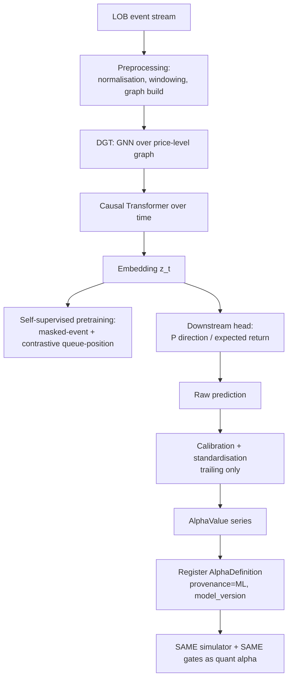
```mermaid
flowchart TD
    A[LOB event stream] --> B[Preprocessing:<br/>normalisation, windowing, graph build]
    B --> C[DGT: GNN over price-level graph]
    C --> D[Causal Transformer over time]
    D --> E[Embedding z_t]
    E --> F1[Self-supervised pretraining:<br/>masked-event + contrastive queue-position]
    E --> F2[Downstream head:<br/>P direction / expected return]
    F2 --> G[Raw prediction]
    G --> H[Calibration + standardisation<br/>trailing only]
    H --> I[AlphaValue series]
    I --> J[Register AlphaDefinition<br/>provenance=ML, model_version]
    J --> K[SAME simulator + SAME gates as quant alpha]
```

| ID | Requirement | Rationale | Pri | Verify |
|---|---|---|---|---|
| ALG-020 | ML alpha inputs shall be constructed from the same causal feature/book pipeline as quant alphas. | Prevents an ML model accidentally seeing data the quant path cannot. | P0 | T |
| ALG-021 | Model training, validation, and test splits shall be **time-ordered and non-overlapping**, with a purge/embargo gap between splits at least as long as the label horizon. | Overlapping windows leak labels across the boundary. This is the single most common leak in LOB ML. | P0 | T |
| ALG-022 | Model predictions shall be calibrated (e.g. isotonic/Platt on the validation split only) before becoming alpha. | An uncalibrated probability makes position sizing arbitrary. | P1 | T |
| ALG-023 | ML alpha shall be registered with `model_id` + `model_version`, and inference shall be reproducible from pinned weights and seed. | Reproducibility. | P0 | T |
| ALG-024 | ML alphas shall be evaluated by the **same simulator and same gates** as quant alphas. | **Confirmed direction: ML output is judged on tradeability, not probe accuracy.** | P0 | T |
| ALG-025 | Probe/classification accuracy shall be reported as a diagnostic, never as the success criterion for the alpha route. | Accuracy ≠ P&L. | P0 | I |
| ALG-026 | Any ML alpha that is promoted shall be reported against the trivial baseline (ALG-012) and against the best quant-designed alpha. | Otherwise "ML works" is unfalsifiable. | P1 | M |
| ALG-027 | Feature/embedding drift shall be monitored; predictions on inputs outside the training distribution shall be flagged. | Regime shift is the main practical failure mode of LOB ML. | P2 | M |

### 18.3 The prediction → alpha conversion (frequently skipped, always needed)

A raw model output is not an alpha. The conversion pipeline is:

```
raw prediction  p_t  (e.g. P(up) = 0.61, or Ê[r] = +0.8 bps)
        │
        ├─ 1. Calibrate            (validation split only)
        ├─ 2. Convert to expected edge in ticks/bps
        ├─ 3. Subtract expected cost (spread crossing + fees + expected adverse selection)
        ├─ 4. Standardise on trailing window
        ├─ 5. Clip to bounds
        └─► alpha_t
```

**ALG-028 [P0]** — Step 3 (cost subtraction) shall be explicit and configurable, and an alpha's metrics shall be reported both with and without it. *Rationale: many LOB "alphas" have positive raw prediction skill entirely inside the bid-ask spread — they are unprofitable by construction, and step 3 is what reveals it.* *Verify: T, M.*

### 18.4 Alpha-generation flowchart (combined)

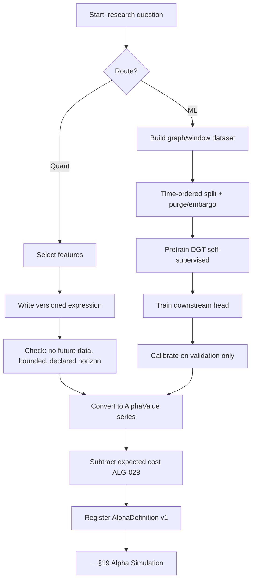
```mermaid
flowchart TD
    S[Start: research question] --> D{Route?}
    D -->|Quant| Q1[Select features]
    Q1 --> Q2[Write versioned expression]
    Q2 --> Q3[Check: no future data, bounded, declared horizon]
    D -->|ML| M1[Build graph/window dataset]
    M1 --> M2[Time-ordered split + purge/embargo]
    M2 --> M3[Pretrain DGT self-supervised]
    M3 --> M4[Train downstream head]
    M4 --> M5[Calibrate on validation only]
    Q3 --> C[Convert to AlphaValue series]
    M5 --> C
    C --> C2[Subtract expected cost ALG-028]
    C2 --> R[Register AlphaDefinition v1]
    R --> SIM[→ §19 Alpha Simulation]
```

---

## 19. Alpha Simulation and Evaluation Requirements

### 19.1 Purpose and boundary

The **Alpha Simulator** answers: *does this belief have exploitable, cost-aware, stable predictive value?*
The **Backtester** (§20) answers: *does a strategy built on this belief make money under realistic execution?*

They are different tools and must not be merged.

| | Alpha Simulator | Backtester |
|---|---|---|
| Models quoting/queue/fills | No — standardised position mapping | Yes — full order lifecycle, fill model |
| Speed | Fast, vectorised, many alphas | Slow, event-driven, few alphas |
| Purpose | Compare and filter candidates | Validate the promoted candidate |
| Output | `AlphaResult` metrics | P&L, execution stats, risk report |
| Costs | Simple cost model (bps per unit turnover) | Explicit fees + spread + slippage + queue |
| Comparability | High (identical mapping for all alphas) | Lower (strategy-specific) |

### 19.2 Standardised position mapping (simulator)

**[PROPOSED]** The simulator converts `alpha_t` to a normalised position:

```
pos_t = clip( alpha_t / scale , −1 , +1 )          # normalised exposure in [−1, +1]
ret_t = pos_{t−1} · fwd_return_t                    # NOTE: position from the PREVIOUS step
turnover_t = |pos_t − pos_{t−1}|
cost_t = turnover_t · cost_bps / 1e4
pnl_t  = ret_t − cost_t
```

**SIM-001 [P0]** — The simulator shall apply position at *t−1* against the return realised over (*t−1*, *t*], with an explicit, configurable execution lag of at least one decision interval. *Rationale: using `pos_t · ret_t` is instantaneous execution — the most common look-ahead error in alpha research, and it can manufacture a Sharpe of 3 from pure noise.* *Verify: T (a pure-noise alpha must produce Sharpe ≈ 0; a "cheating" configuration must be detectable and blocked).*

### 19.3 Metric definitions (fixed project-wide)

| Metric | Definition used by HELIOS | Notes |
|---|---|---|
| **Return** | Σ pnl_t over the period, annualised by `periods_per_year` for the alpha's horizon family | Horizon family must be declared |
| **Volatility** | stdev(pnl_t) annualised identically | |
| **Sharpe** | `mean(pnl_t) / stdev(pnl_t) × sqrt(periods_per_year)`, **net of costs** | **[PROPOSED]** risk-free rate = 0; stated explicitly |
| **Turnover** | `mean(|pos_t − pos_{t−1}|)` per period, expressed as a fraction | Meaning depends on horizon family — §19.6 |
| **Fitness** | **[OPEN-04]** — see §19.4 | Must be pinned before promotion |
| **Max drawdown** | max peak-to-trough of cumulative pnl | Report both magnitude and duration |
| **IC** | Spearman/Pearson corr(alpha_t, fwd_return_{t+h}) | Time-series IC for single instrument; cross-sectional only if ≥5 instruments (QNT-008) |
| **IC IR** | `mean(IC) / stdev(IC)` across sub-periods | Stability of predictive power |
| **Hit rate** | fraction of periods where sign(pos) = sign(fwd_return) | Diagnostic only; a high hit rate with negative P&L is common and must not be celebrated |
| **Cost sensitivity** | Sharpe as a function of assumed cost_bps, swept over a range | The single most informative robustness plot |
| **Stability** | Sharpe computed per sub-period (e.g. per week/month); report mean, min, and fraction of sub-periods > 0 | An alpha that earns everything in three days is not an alpha |
| **Regime breakdown** | Metrics conditioned on volatility regime, spread regime, and session phase | Confirmed robustness requirement |
| **Fill rate** *(strategy-level, §20)* | filled orders / submitted orders | Not an alpha-simulator metric |
| **Realized spread** *(strategy-level)* | signed (fill px − mid_{t+h}) for maker fills | Measures adverse selection |
| **Inventory risk** *(strategy-level)* | distribution of |position| and time-weighted exposure | |

### 19.4 The "Fitness" definition problem — **[OPEN-04]**

The knowledge base specifies `Fitness > 1` as a gate but does not define Fitness. This must be fixed before any alpha is promoted, because an undefined gate is not a gate.

| Option | Definition | Pros | Cons |
|---|---|---|---|
| **Opt-1** (industry-style, as used in alpha-research platforms) | `Fitness = Sharpe × sqrt( |annual_return| / max(turnover, floor) )` | Penalises high-turnover alphas that need heavy trading to earn their Sharpe; standard and defensible | The `floor` constant and turnover convention must be documented; the formula is convention, not law |
| **Opt-2** | `Fitness = Sharpe × sqrt(|return| / turnover)` with no floor | Simpler | Explodes as turnover → 0; degenerate for near-constant alphas |
| **Opt-3** | Define Fitness = net-of-cost Sharpe after a stress cost multiplier (e.g. 3× base cost) | Directly measures cost robustness; easy to explain | Non-standard; harder to compare to external work |

**[PROPOSED] Recommendation: adopt Opt-1 with a documented floor, and additionally always report Opt-3 as `cost_stress_sharpe`.** Rationale: Opt-1 keeps HELIOS comparable to how the criterion is conventionally used, while Opt-3 gives the honest robustness answer. **The team must ratify this and record it in `alpha_gate_config` before the first promotion.**

**SIM-002 [P0]** — The Fitness formula, including all constants, shall be stored in `alpha_gate_config` and referenced by hash from every `AlphaResult`. *Verify: T.*

### 19.5 The gate

```
Candidate Alpha
      │
      ▼
 ┌─────────────┐
 │  SIMULATOR  │  standardised mapping, execution lag, cost model
 └──────┬──────┘
        ▼
 ┌─────────────────────────────────────────────┐
 │ METRICS: Sharpe, Fitness, Turnover, PnL,    │
 │ drawdown, vol, IC, IC-IR, hit rate,         │
 │ cost sensitivity, stability, regimes        │
 └──────┬──────────────────────────────────────┘
        ▼
 ┌─────────────────────────────────────────────┐
 │ VALIDITY CHECKS (before gates are even read)│
 │  • sample size sufficient?                  │
 │  • non-degenerate (turnover > 0, variance>0)│
 │  • no NaN / no warm-up contamination        │
 │  • split integrity verified                 │
 └──────┬──────────────────────────────────────┘
        │ invalid → status = INVALID (not "FAIL")
        ▼ valid
 ┌─────────────────────────────────────────────┐
 │ GATES (all must pass)                       │
 │   G1: Sharpe   > 1                          │
 │   G2: Fitness  > 1                          │
 │   G3: 1% < Turnover < 70%                   │
 │   G4: metrics computed on OOS/validation    │
 │       data, not in-sample only              │
 │   G5: stability — >50% of sub-periods       │
 │       Sharpe > 0            [PROPOSED]      │
 │   G6: cost sensitivity — Sharpe > 0 at 2×   │
 │       assumed cost         [PROPOSED]       │
 └──────┬──────────────────────────────────────┘
        │
   ┌────┴────┐
  FAIL      PASS
   │          │
   ▼          ▼
REJECTED   PROMOTED ──► §20 BACKTEST ──► final validation ──► §21 STRATEGY
(kept in registry with full metrics)
```

**G1–G3 are [CONFIRMED] project criteria. G4–G6 are [PROPOSED] additions**, justified as follows: G4 prevents in-sample-only promotion (an alpha with Sharpe 4 in-sample and −0.2 OOS would otherwise pass); G5 prevents a single lucky window carrying the result; G6 prevents promoting an alpha whose entire edge is smaller than realistic costs. Each can be disabled by config, but disabling is an audited action.

**SIM-003 [P0]** — Gate evaluation shall be automatic and recorded per-gate, never a human judgement call. *Verify: T.*
**SIM-004 [P0]** — `INVALID` shall be a distinct status from `REJECTED`; an invalid simulation shall not count as evidence of anything. *Verify: T.*

### 19.6 Threshold semantics across horizon families — **material issue, [OPEN-03]**

`1% < Turnover < 70%` is unambiguous for a **daily-horizon** alpha (turn 1%–70% of the book per day). It is **not** directly meaningful for a sub-second quoting strategy, where "turnover" in the same sense would be enormous.

**[PROPOSED] Resolution:** define turnover **per decision period of the alpha's declared horizon family**, and record the family with every result:

| Family | Decision period | Turnover measured as | Gate interpretation |
|---|---|---|---|
| H-DAILY | 1 day | `mean(|Δpos|)` per day | Literal: 1%–70% per day |
| H-SHORT | 1 min (configurable) | `mean(|Δpos|)` per decision period | 1%–70% per period |
| H-MICRO | quote-update interval | `mean(|Δ target inventory|)` per interval, **plus** a separate `quote_replacement_rate` reported alongside | Gate applies to inventory turnover; quote churn is reported but gated separately by risk (§22.4 order-rate limits) |

**SIM-005 [P0]** — Every `AlphaResult` shall record `horizon_family` and `periods_per_year`, and the gate comparison shall be made only against alphas of the same family. *Rationale: comparing a Sharpe computed with 252 periods/year to one computed with 6.5 million periods/year is meaningless.* *Verify: T.*

**This is flagged as the highest-priority open decision in the quant track (Audit A-01).**

### 19.7 The Alpha Registry

**Purpose:** the single source of truth for what has been tried, what passed, and on what evidence.

| Field | Type | Notes |
|---|---|---|
| `alpha_id` | string | Stable across versions |
| `version` | int | Immutable once results exist |
| `provenance` | enum | QUANT / ML |
| `formula_or_model_ref` | text / FK | Expression source or `model_id@version` |
| `feature_set_version` | string | Ties to the exact feature definitions |
| `horizon` / `horizon_family` | enum + duration | SIM-005 |
| `params` | jsonb | Including count of free parameters (ALG-006) |
| `train_period`, `valid_period`, `test_period` | date ranges | Non-overlapping, with embargo |
| `data_snapshot_id` | FK | Immutable data reference |
| `sharpe`, `fitness`, `turnover` | float | Gate metrics |
| `pnl_gross`, `pnl_net`, `cost_bps_assumed` | float | QNT-006 |
| `max_drawdown`, `dd_duration`, `volatility` | float | |
| `ic_mean`, `ic_ir`, `hit_rate` | float | `NULL` where N/A (QNT-008) |
| `cost_sensitivity_curve` | jsonb | Sharpe vs cost multiplier |
| `stability_by_subperiod` | jsonb | G5 evidence |
| `regime_breakdown` | jsonb | vol / spread / session |
| `gate_results` | jsonb | Per-gate PASS/FAIL + threshold values used |
| `gate_config_hash` | string | Which gates were in force |
| `status` | enum | DRAFT / SIMULATED / EVALUATED / PROMOTED / REJECTED / INVALID / RETIRED |
| `test_set_access_count` | int | NFR-070 |
| `code_commit`, `config_hash`, `seed` | string | Reproducibility |
| `author`, `created_ts`, `evaluated_ts` | | |
| `baseline_comparison` | jsonb | vs trivial baseline (ALG-012) |
| `notes` | text | Including why it was tried |

**SIM-006 [P0]** — Rejected and invalid alphas shall be retained permanently. *Rationale: the count of attempts is required to interpret the significance of the one that passed. Deleting failures is how a project accidentally reports a 1-in-40 fluke as a discovery.* *Verify: I.*

**SIM-007 [P1]** — The registry shall expose a "search effort" summary: total candidates evaluated, per provenance, and the multiple-testing-adjusted view of the best result. **[PROPOSED]** *Verify: D.*

### 19.8 Alpha evaluation requirements table

| ID | Requirement | Rationale | Pri | Verify |
|---|---|---|---|---|
| SIM-010 | The simulator shall compute the complete metric set (§19.3) for every candidate. | Partial metrics invite cherry-picking. | P0 | T |
| SIM-011 | The simulator shall apply an explicit transaction-cost model and report gross and net. | QNT-006. | P0 | T |
| SIM-012 | The simulator shall produce a cost-sensitivity curve over at least 5 cost multipliers. | Robustness. | P1 | M |
| SIM-013 | The simulator shall compute metrics separately for train / validation / test periods. | Distinguishes fit from generalisation. | P0 | T |
| SIM-014 | A pure-noise control alpha shall be run through the simulator regularly; its Sharpe shall not be significantly different from 0. | **Self-test of the simulator itself.** If random alphas score well, the simulator is broken. | P0 | T |
| SIM-015 | A "future-peeking" control alpha (deliberately using `fwd_return_t`) shall score implausibly high; if it does not, the simulator's return alignment is wrong. | Second self-test, in the opposite direction. | P0 | T |
| SIM-016 | Simulation runs shall be deterministic given a seed. | Reproducibility. | P0 | T |
| SIM-017 | Evaluation shall be parallelisable across alphas without shared mutable state. | NFR-032. | P1 | T |

SIM-014 and SIM-015 together are the simulator's **calibration pair** — they are the cheapest, highest-value tests in the entire quant track.

---

## 20. Backtesting Requirements

### 20.1 Backtest engine architecture

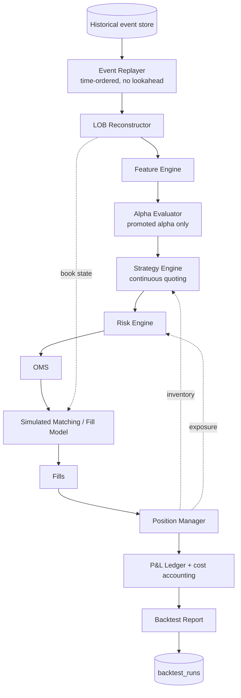
```mermaid
flowchart TD
    A[(Historical event store)] --> B[Event Replayer<br/>time-ordered, no lookahead]
    B --> C[LOB Reconstructor]
    C --> D[Feature Engine]
    D --> E[Alpha Evaluator<br/>promoted alpha only]
    E --> F[Strategy Engine<br/>continuous quoting]
    F --> G[Risk Engine]
    G --> H[OMS]
    H --> I[Simulated Matching / Fill Model]
    I --> J[Fills]
    J --> K[Position Manager]
    K --> L[P&L Ledger + cost accounting]
    L --> M[Backtest Report]
    C -.book state.-> I
    K -.inventory.-> F
    K -.exposure.-> G
    M --> N[(backtest_runs)]
```

**Key property:** the backtest reuses the **same** Strategy, Risk, and OMS components as paper trading. Only the venue differs. **[PROPOSED]** *Rationale: a backtest that uses a different strategy implementation than production is testing a program that will never run.*

### 20.2 Event ordering and clock

| ID | Requirement | Rationale | Pri | Verify |
|---|---|---|---|---|
| BT-001 | The backtest clock shall be event-driven and monotonic; the strategy shall observe events strictly in exchange-timestamp order. | Ordering is correctness. | P0 | T |
| BT-002 | Ties in exchange timestamp shall be broken by sequence number, deterministically. | ASM-07; ensures reproducibility. | P0 | T |
| BT-003 | The strategy's own actions shall be inserted into the event timeline with a configurable **decision latency** (default **[PROPOSED]** ≥ 1 event or ≥ 100 µs, whichever is later). | Zero-latency strategies are fictional and systematically over-earn. | P0 | T |
| BT-004 | Orders submitted at time *t* shall not be eligible to interact with the book until *t + latency*. | Same reason. | P0 | T |
| BT-005 | The backtest shall support running at full speed (compressed time) while preserving relative event order and modelled latencies. | Iteration speed without fidelity loss. | P1 | T |

### 20.3 Fill model — **[OPEN-05]**

The fill model is the single largest source of backtest optimism. HELIOS shall implement three and report against all three.

| Model | Rule | Bias | Use |
|---|---|---|---|
| **Optimistic** | Passive order fills as soon as a trade occurs at its price | Over-optimistic (ignores queue) | Upper bound only |
| **Queue-aware [PROPOSED default]** | Track cumulative size ahead; a passive order fills only after the queue ahead is consumed by trades/cancels; assume conservative cancel-behind | Realistic-ish | Primary reported result |
| **Pessimistic** | Passive order fills only if traded volume at that price exceeds queue-ahead **plus** a penalty margin; aggressive orders pay full spread + slippage | Conservative | Lower bound |

| ID | Requirement | Rationale | Pri | Verify |
|---|---|---|---|---|
| BT-010 | Every backtest report shall state which fill model produced it. | Non-negotiable transparency. | P0 | I, T |
| BT-011 | Headline results shall be reported under the queue-aware model, with optimistic and pessimistic shown as a range. | A single number hides model risk. | P0 | M |
| BT-012 | No fill shall occur at a price better than the contra best at the decision time. | VEN-03. | P0 | T |
| BT-013 | An aggressive order shall walk the book, consuming levels in price-time order and producing multiple partial fills at multiple prices. | Confirmed matching semantics; also the correct slippage source. | P0 | T |
| BT-014 | Market impact shall be either (a) modelled explicitly, or (b) declared un-modelled with the order-size regime in which that is defensible. | Ignoring impact silently is a false claim. | P1 | I, M |
| BT-015 | Fees/rebates shall be configurable per venue and applied per fill with maker/taker distinction. | Maker/taker economics dominate HFT-style P&L. | P0 | T |

### 20.4 Transaction costs and slippage

```
total_cost = explicit_fees + spread_cost + slippage + (optional) impact
```
| Component | Modelled as |
|---|---|
| Explicit fees | per-share/per-trade, maker vs taker, from config |
| Spread cost | for aggressive fills: (fill px − mid at decision) × qty |
| Slippage | difference between the price at decision and the volume-weighted fill price after walking levels |
| Adverse selection | measured *post hoc* via realized spread rather than assumed |
| Impact | **[OPEN]** — declare un-modelled at small size, or add a simple square-root/linear model with a stated coefficient |

**BT-016 [P0]** — Cost parameters shall be stored per backtest run, and a cost-sensitivity sweep shall be produced. *Verify: M.*

### 20.5 Bias-avoidance requirements

| ID | Bias | Requirement | Verify |
|---|---|---|---|
| BT-020 | **Look-ahead** | No component may read any datum with timestamp > current event timestamp; enforced by a causality assertion in the event bus in debug builds. | T |
| BT-021 | **Look-ahead (statistics)** | No full-sample normalisation, scaling, PCA, or clipping bound. All standardisation trailing-only. | T |
| BT-022 | **Data leakage (splits)** | Time-ordered splits with a purge/embargo ≥ label horizon between them. | T |
| BT-023 | **Data leakage (selection)** | Hyperparameters and alpha selection shall use validation data only; test data touched at most twice (NFR-070). | T, I |
| BT-024 | **Survivorship** | The instrument universe shall be defined as of the start of the period, including instruments that later become inactive; if unavailable, the limitation shall be stated. | I |
| BT-025 | **Unrealistic fills** | Queue-aware fill model default; no fills better than contra best; no fills at prices never traded. | T |
| BT-026 | **Zero-latency** | Mandatory decision latency (BT-003). | T |
| BT-027 | **Overfitting** | Free-parameter count reported; number of configurations tried logged; out-of-sample confirmation required; pre-registration (DAT-015). | I |
| BT-028 | **Regime cherry-picking** | Results reported per sub-period and per regime, not only in aggregate. | M |
| BT-029 | **Cost omission** | Net-of-cost reporting mandatory. | T |
| BT-030 | **Restart/warm-up contamination** | Metrics computed only after all feature warm-ups complete. | T |

**BT-031 [P0] — The leakage test suite.** A dedicated suite shall contain:
1. A **noise alpha** → expected Sharpe ≈ 0 (fails the build if it passes gates).
2. A **future-peeking alpha** → expected Sharpe implausibly high (fails the build if it does *not*).
3. A **constant alpha** → expected turnover 0 and INVALID status.
4. A **shuffled-label** control for ML alphas → expected performance ≈ chance.
5. A **shifted-feature** test: shifting all features one step later must degrade performance; if it improves, alignment is inverted.
*Verify: T. This suite runs in CI and blocks merge.*

### 20.6 Train / validation / test protocol

```
|<------ TRAIN ------>|<-E->|<-- VALIDATION -->|<-E->|<---- TEST ---->|
                       ^                        ^
                       └── embargo ≥ label horizon ┘

TRAIN      : model fitting, expression weight fitting
VALIDATION : hyperparameter choice, alpha selection, calibration, gate tuning
TEST       : final confirmation only — touched ≤ 2 times, every access logged
```

| ID | Requirement | Pri | Verify |
|---|---|---|---|
| BT-040 | Splits shall be chronological, never random. | P0 | T |
| BT-041 | An embargo gap ≥ the label horizon shall separate splits. | P0 | T |
| BT-042 | **[PROPOSED]** Walk-forward evaluation (rolling train/valid/test windows) shall be supported and used for the stability metric. | P1 | T, M |
| BT-043 | Test-set access shall be recorded in `test_set_access` with actor and purpose. | P0 | T |
| BT-044 | Any change to an alpha after touching the test set shall create a new `alpha_id`, not a new version of the same one. | P0 | I, T |

### 20.7 Backtest report contents

| Section | Contents |
|---|---|
| Header | alpha_id@version, strategy config, fill model, cost model, data snapshot, commit, seed |
| P&L | Cumulative gross/net, per-period, per-instrument, per-regime |
| Risk | Volatility, max drawdown + duration, VaR-style tail summary **[PROPOSED]**, inventory distribution |
| Execution | Order count, fill rate, maker/taker split, realized spread, average queue wait, cancel rate |
| Sensitivity | Cost sweep, latency sweep, fill-model comparison |
| Integrity | Leakage-suite results, warm-up handling, test-access count |
| Caveats | Un-modelled effects (impact, partial-day gaps, venue fragmentation), explicitly enumerated |
---

## 21. Trading-Strategy Requirements

### 21.1 Alpha ≠ Strategy

| | Alpha | Strategy |
|---|---|---|
| Question answered | *"What do we believe will happen?"* | *"Given that belief, what should we actually do?"* |
| Output | A score | A set of order actions |
| Aware of inventory? | No | **Yes** |
| Aware of open orders? | No | **Yes** |
| Aware of queue position? | Only as a feature | **Yes, operationally** |
| Aware of costs? | As a subtraction | As a decision variable (post vs cross) |
| Evaluated by | Sharpe/Fitness/Turnover/IC | Fill rate, realized spread, inventory profile, net P&L |
| Can it be wrong and still profitable? | No | Yes — good execution can salvage a weak alpha, and bad execution can destroy a strong one |

**[CONFIRMED]** The strategy is **HFT-style continuous two-sided quoting**: it posts, updates, and cancels both a bid and an ask around an estimated fair value as conditions change. It does **not** place one matched buy and one matched sell.

### 21.2 Strategy pipeline

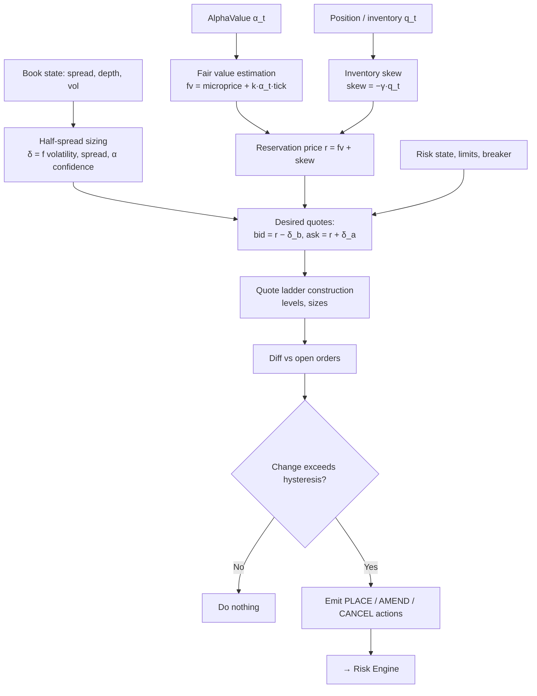
```mermaid
flowchart TD
    A[AlphaValue α_t] --> B[Fair value estimation<br/>fv = microprice + k·α_t·tick]
    C[Position / inventory q_t] --> D[Inventory skew<br/>skew = −γ·q_t]
    E[Book state: spread, depth, vol] --> F[Half-spread sizing<br/>δ = f volatility, spread, α confidence]
    B --> G[Reservation price r = fv + skew]
    D --> G
    F --> H[Desired quotes:<br/>bid = r − δ_b, ask = r + δ_a]
    G --> H
    I[Risk state, limits, breaker] --> H
    H --> J[Quote ladder construction<br/>levels, sizes]
    J --> K[Diff vs open orders]
    K --> L{Change exceeds hysteresis?}
    L -->|No| M[Do nothing]
    L -->|Yes| N[Emit PLACE / AMEND / CANCEL actions]
    N --> O[→ Risk Engine]
```

### 21.3 Requirements

| ID | Requirement | Rationale | Pri | Verify |
|---|---|---|---|---|
| STR-001 | The strategy shall maintain quotes on both sides simultaneously under normal conditions. | Confirmed two-sided quoting. | P0 | T, D |
| STR-002 | The strategy shall estimate a fair value from book state and alpha, not from the last trade price alone. | Last-trade is stale and noisy; microprice + alpha tilt is the standard construction. | P0 | T |
| STR-003 | The strategy shall skew quotes as a function of current inventory, biasing toward flattening. | Without inventory skew, two-sided quoting accumulates one-sided risk until a limit trips. | P0 | T (inventory mean-reversion test) |
| STR-004 | The strategy shall widen quotes and/or reduce size as volatility, spread, or alpha uncertainty rises. | Adverse selection protection. | P0 | T |
| STR-005 | The strategy shall stop quoting on a side when inventory reaches a configured soft limit, and shall quote only the flattening side. | Graceful degradation before risk rejection. | P0 | T |
| STR-006 | The strategy shall implement hysteresis / minimum-change thresholds so that small fair-value changes do not cause quote churn. | Quote thrash burns message budget and trips the circuit breaker. | P0 | T, M |
| STR-007 | The strategy shall track its own open orders and reconcile against the OMS view. | Divergence causes duplicate or orphan quotes. | P0 | T |
| STR-008 | The strategy shall support amend-in-place where the venue allows it, and cancel-replace otherwise, with correct priority expectations. | Amending price or increasing size loses queue priority; the strategy must know this. | P1 | T |
| STR-009 | The strategy shall stand down (cancel all, quote nothing) when: alpha is stale beyond a bound, book state is inconsistent, feed is degraded, or risk state is halted. | Fail-safe behaviour. | P0 | T |
| STR-010 | The strategy shall never assume a fill; position updates come only from `Fill` events. | Assumed fills corrupt inventory and cascade into wrong skew. | P0 | T |
| STR-011 | The strategy shall support a configurable maximum order-action rate below the risk engine's abnormal-rate threshold. | The strategy should self-limit before risk has to intervene. | P1 | T, M |
| STR-012 | The strategy shall be able to cross the spread (take liquidity) only when configured to do so, with an explicit edge threshold exceeding taker cost. | Uncontrolled aggression destroys maker economics. | P1 | T |
| STR-013 | Strategy parameters shall be versioned and stored; a backtest and a paper run shall reference the same parameter hash. | Comparability. | P0 | T |
| STR-014 | The strategy shall expose per-decision diagnostics (fair value, skew, chosen quotes, reason for no-action) for post-hoc analysis. | Otherwise strategy debugging is guesswork. | P1 | T |

### 21.4 Quoting policy — worked example **[example only]**

```
Book:   bid 100.02 × 500  |  ask 100.04 × 500       (spread = 2 ticks, tick = 0.01)
microprice = 100.030 ; α_t = +0.6 (bullish) ; inventory q = +300 (long) ; γ = 0.00002
k = 0.5 tick per unit alpha

fv        = 100.030 + 0.5 · 0.6 · 0.01 = 100.033
skew      = −γ · q = −0.00002 · 300 = −0.006
r         = fv + skew = 100.027            ← reservation price pulled DOWN because we are long
δ         = 1 tick base, widened to 1.5 ticks by current volatility

desired bid = 100.027 − 0.015 = 100.012 → round to 100.01
desired ask = 100.027 + 0.015 = 100.042 → round to 100.04

Result: we are long, so despite a bullish alpha we quote a passive bid one tick lower
and keep the ask at the touch — biasing toward selling down our inventory.
```
This example demonstrates the essential point: **alpha is bullish, but the strategy leans to sell.** Alpha and strategy are not the same thing.

### 21.5 Strategy state machine

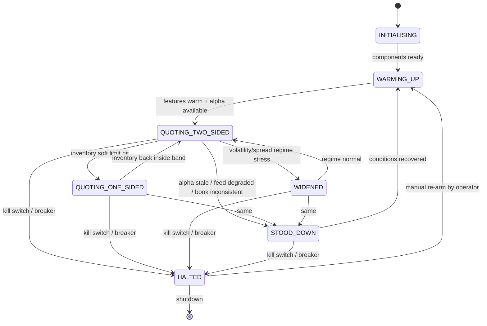
```mermaid
stateDiagram-v2
    [*] --> INITIALISING
    INITIALISING --> WARMING_UP: components ready
    WARMING_UP --> QUOTING_TWO_SIDED: features warm + alpha available
    QUOTING_TWO_SIDED --> QUOTING_ONE_SIDED: inventory soft limit hit
    QUOTING_ONE_SIDED --> QUOTING_TWO_SIDED: inventory back inside band
    QUOTING_TWO_SIDED --> WIDENED: volatility/spread regime stress
    WIDENED --> QUOTING_TWO_SIDED: regime normal
    QUOTING_TWO_SIDED --> STOOD_DOWN: alpha stale / feed degraded / book inconsistent
    QUOTING_ONE_SIDED --> STOOD_DOWN: same
    WIDENED --> STOOD_DOWN: same
    STOOD_DOWN --> WARMING_UP: conditions recovered
    QUOTING_TWO_SIDED --> HALTED: kill switch / breaker
    QUOTING_ONE_SIDED --> HALTED: kill switch / breaker
    WIDENED --> HALTED: kill switch / breaker
    STOOD_DOWN --> HALTED: kill switch / breaker
    HALTED --> WARMING_UP: manual re-arm by operator
    HALTED --> [*]: shutdown
```

| Transition | Trigger | Actions |
|---|---|---|
| INITIALISING → WARMING_UP | All components report ready | Subscribe to feeds |
| WARMING_UP → QUOTING_TWO_SIDED | Feature warm-up done, alpha status OK | Place initial ladder |
| QUOTING_TWO_SIDED → QUOTING_ONE_SIDED | \|q\| ≥ soft inventory limit | Cancel the accumulating side |
| → WIDENED | vol or spread above threshold | Increase δ, reduce size |
| → STOOD_DOWN | alpha stale / feed gap / book invariant violated | **Cancel all**, quote nothing |
| → HALTED | Kill switch tripped or breaker open | Cancel all (if configured), refuse all new actions |
| HALTED → WARMING_UP | Operator re-arm (RBAC-gated, audited) | Re-warm before quoting |

---

## 22. Risk-Engine Requirements

### 22.1 The separation principle

> **Strategy decides WHAT we want to trade. Risk decides WHETHER we are allowed to trade it.** **[CONFIRMED]**

| Property | Enforcement |
|---|---|
| Risk cannot be bypassed | The OMS accepts orders only from the risk engine's authorised output type; there is no constructor for an `AuthorisedOrder` outside the risk engine. **[PROPOSED — enforce with the type system]** |
| Risk cannot be overridden by strategy | No API on the risk engine accepts a "force" or "override" flag from strategy code. |
| Risk is not alpha-aware | Alpha values are not inputs to authorisation decisions. Risk may *log* the alpha_id for attribution but shall not use it to decide. |
| Risk config is separately owned | `risk-admin` RBAC role; SEC-000 separation of duty. |
| Risk fails closed | On internal error, missing config, or stale position data → reject everything. |

### 22.2 Requirements

| ID | Requirement | Rationale | Pri | Verify |
|---|---|---|---|---|
| RSK-001 | Every order action shall be evaluated by the pre-trade check chain before submission. | Confirmed. | P0 | T |
| RSK-002 | The risk engine shall enforce per-instrument and aggregate **position limits**. | Bounded exposure. | P0 | T |
| RSK-003 | The risk engine shall enforce **gross and net exposure limits** in notional terms. | Position count alone is insufficient across price levels. | P0 | T |
| RSK-004 | The risk engine shall enforce **maximum order size** (fat-finger check). | Confirmed. | P0 | T |
| RSK-005 | The risk engine shall enforce **price bands** — reject orders priced beyond a configured distance from a reference price. | Confirmed; prevents erroneous far-off orders. | P0 | T |
| RSK-006 | The risk engine shall enforce **order-rate limits** over rolling windows (per second/minute, per instrument and aggregate). | Confirmed abnormal-rate control. | P0 | T, M |
| RSK-007 | The risk engine shall implement a **kill switch**: halt all new order submission, and optionally cancel all resting orders. | Confirmed. | P0 | T, M |
| RSK-008 | The risk engine shall implement a **circuit breaker**: automatic trip on abnormal order rate, abnormal rejection rate, abnormal P&L excursion, or abnormal market conditions, with a defined reset procedure. | Confirmed. | P0 | T |
| RSK-009 | The risk engine shall enforce a **maximum loss / drawdown limit** per session, tripping the breaker on breach. | **[PROPOSED]** — a strategy that is losing steadily is a risk event even if every individual order is legal. | P0 | T |
| RSK-010 | Every rejection shall carry a machine-readable reason code and shall be logged and counted. | NFR-060. | P0 | T |
| RSK-011 | The check chain shall be O(1) per order in the number of open orders. | NFR-006. | P1 | M, I |
| RSK-012 | Risk limits shall be versioned; the limit-set hash in force shall be recorded with every decision. | DAT-013; reconstructability. | P1 | T |
| RSK-013 | The kill switch shall be operable manually (RBAC `operator`) and automatically (breaker), and both paths shall be audited. | Confirmed emergency control + accountability. | P0 | T |
| RSK-014 | Kill-switch activation latency shall be measured. | NFR-008; a kill switch of unknown speed is not a control. | P0 | M |
| RSK-015 | The risk engine shall treat **feed degradation** and **reconciliation break** as risk conditions, not merely as system errors. | Trading on a broken book is the highest-severity failure. | P0 | T |
| RSK-016 | Risk state shall be recoverable after a restart from persisted position and counter state. | Otherwise a restart resets all limits to zero usage — an exploitable hole. | P1 | T |

### 22.3 Pre-trade check chain (ordered, fail-fast)

| # | Check | Reject reason code | Notes |
|---|---|---|---|
| 1 | System state — kill switch / breaker open? | `HALTED_KILL_SWITCH`, `HALTED_BREAKER` | Cheapest check first |
| 2 | Instrument tradable / session open? | `INSTRUMENT_NOT_TRADABLE` | |
| 3 | Feed health / book validity | `FEED_DEGRADED`, `BOOK_INVALID` | RSK-015 |
| 4 | Message well-formed: valid side, price on tick, size on lot | `MALFORMED_ORDER`, `TICK_VIOLATION`, `LOT_VIOLATION` | |
| 5 | Max order size (fat finger) | `MAX_ORDER_SIZE` | |
| 6 | Price band vs reference price | `PRICE_BAND` | Reference = mid or last valid mid **[PROPOSED]** |
| 7 | Position limit (projected post-fill) | `POSITION_LIMIT` | Must use **projected** position including open orders, not just current |
| 8 | Gross/net exposure limit (projected) | `EXPOSURE_LIMIT` | |
| 9 | Order-rate limit (rolling window) | `RATE_LIMIT` | |
| 10 | Open-order count / notional cap | `TOO_MANY_OPEN_ORDERS` | |
| 11 | Session loss limit | `LOSS_LIMIT` | Triggers breaker as a side effect |
| 12 | Self-trade prevention **[PROPOSED]** | `SELF_TRADE_PREVENTION` | Relevant once our own orders are on both sides of a simulated book |

**RSK-017 [P0]** — Position and exposure checks shall use the **projected** position: `current_position + signed_open_order_qty + this_order_qty`. *Rationale: checking only the current position allows a strategy to submit many orders that are individually legal but collectively breach the limit if all fill — the classic limit-evasion bug.* *Verify: T.*

### 22.4 Normal vs abnormal examples

**Normal — accepted:**
```
State: position +300 (limit ±2000), open orders +200, order rate 40/s (limit 200/s),
       kill switch disarmed, breaker closed, feed healthy, spread 2 ticks
Action: PLACE BUY 200 @ 100.01
Checks: projected position = 300+200+200 = 700 < 2000  ✓
        notional exposure within limit ✓ ; size 200 < max 1000 ✓
        price 100.01 within ±1% band of mid 100.03 ✓ ; rate 41/s ✓
Decision: ACCEPT → OMS
```

**Abnormal 1 — fat finger:**
```
Action: PLACE BUY 2,000,000 @ 100.01     (max order size = 1000)
Decision: REJECT(MAX_ORDER_SIZE) → RiskEvent(LIMIT_BREACH, severity=HIGH)
Note: order never reaches OMS or venue. Counter increments; repeated occurrences
      contribute to the abnormal-rejection-rate breaker input.
```

**Abnormal 2 — limit evasion by accumulation:**
```
Position +1800 (limit 2000), open buy orders +150
Action: PLACE BUY 200
Naive check (current position only): 1800 + 200 = 2000 → would ACCEPT (at the edge)
Projected check (RSK-017): 1800 + 150 + 200 = 2150 > 2000 → REJECT(POSITION_LIMIT)  ✓
```

**Abnormal 3 — quote-stuffing / runaway loop (SpoofBench-driven or self-inflicted):**
```
Order-rate window shows 4,800 actions/s vs limit 200/s
→ circuit breaker TRIPS
→ new order submission blocked (BREAKER_OPEN)
→ resting orders cancelled per config
→ RiskEvent(BREAKER_TRIPPED) + alert + audit entry
→ strategy transitions to HALTED
→ reset requires operator action after cool-down (RBAC + audit)
```

**Abnormal 4 — price band under a spoofed book:**
```
SpoofBench injects a layered bid wall; microprice jumps; strategy computes fv far from
the last valid mid and tries to quote 3% away.
→ REJECT(PRICE_BAND) using the *last valid* reference price, not the manipulated one.
Design note [PROPOSED]: the reference price for price bands shall be a slow, robust
estimate (e.g. median mid over a trailing window), NOT the instantaneous mid — otherwise
a manipulated book widens its own band and defeats the control.
```

### 22.5 Kill switch and circuit breaker state machines

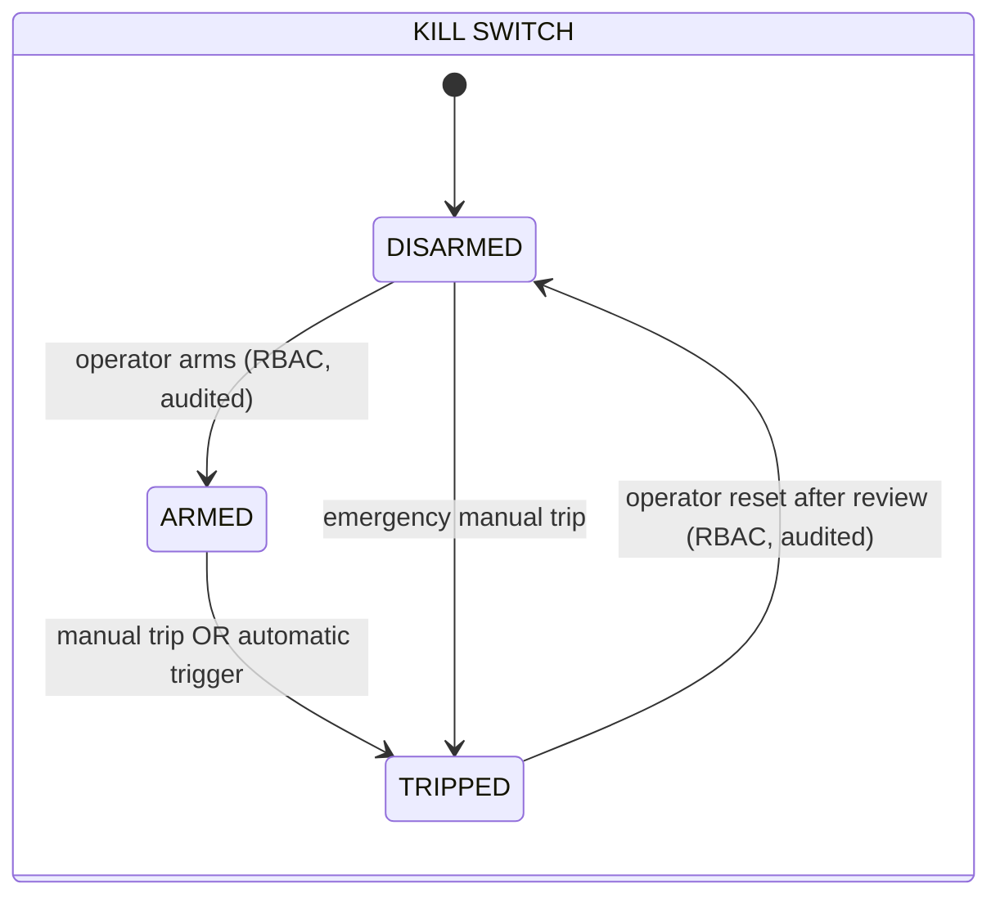
```mermaid
stateDiagram-v2
    state "KILL SWITCH" as KS {
        [*] --> DISARMED
        DISARMED --> ARMED: operator arms (RBAC, audited)
        ARMED --> TRIPPED: manual trip OR automatic trigger
        DISARMED --> TRIPPED: emergency manual trip
        TRIPPED --> DISARMED: operator reset after review (RBAC, audited)
    }
```

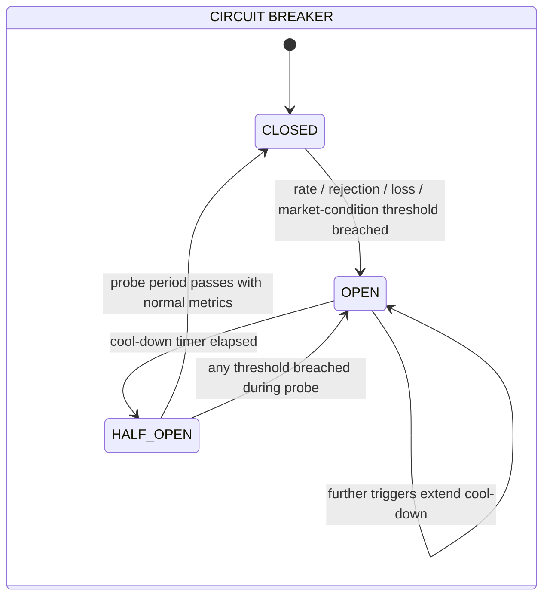
```mermaid
stateDiagram-v2
    state "CIRCUIT BREAKER" as CB {
        [*] --> CLOSED
        CLOSED --> OPEN: rate / rejection / loss / market-condition threshold breached
        OPEN --> HALF_OPEN: cool-down timer elapsed
        HALF_OPEN --> CLOSED: probe period passes with normal metrics
        HALF_OPEN --> OPEN: any threshold breached during probe
        OPEN --> OPEN: further triggers extend cool-down
    }
```

| State | New orders | Resting orders | Exit condition |
|---|---|---|---|
| KS DISARMED | Allowed | Untouched | — |
| KS ARMED | Allowed | Untouched | Arming only makes trip instantaneous |
| KS TRIPPED | **Blocked** | Cancelled (configurable) | Operator reset, audited |
| CB CLOSED | Allowed | Untouched | — |
| CB OPEN | **Blocked** | Cancelled (configurable) | Cool-down elapsed |
| CB HALF_OPEN | Allowed at reduced rate/size **[PROPOSED]** | Normal | Probe passes → CLOSED |

**RSK-018 [P0]** — Trip actions shall be idempotent and shall complete even if the strategy process is unresponsive; the risk engine shall be able to cancel orders and block submission independently of strategy liveness. *Rationale: the most likely reason you need a kill switch is that the strategy is misbehaving.* *Verify: T (chaos test: hang the strategy thread, then trip).*

---

## 23. OMS Requirements

### 23.1 Order lifecycle

```
                      ┌───────────────► REJECTED (terminal)
                      │
CREATED ──► PENDING_NEW ──► ACCEPTED ──┬──► PARTIALLY_FILLED ──┬──► FILLED (terminal)
                      │                │            ▲          │
                      │                │            └──────────┘ (more partials)
                      │                │
                      │                ├──► PENDING_CANCEL ──► CANCELLED (terminal)
                      │                │
                      │                └──► PENDING_AMEND ──► ACCEPTED (new px/qty)
                      │                                   └─► AMEND_REJECTED → ACCEPTED (old terms)
                      └──► EXPIRED (terminal, TIF)
```

Detailed state machine in §54.1.

### 23.2 Requirements

| ID | Requirement | Rationale | Pri | Verify |
|---|---|---|---|---|
| OMS-001 | Every order shall have a globally unique `order_id` and a `client_order_id` used as the venue idempotency key. | Duplicate-submission safety. | P0 | T |
| OMS-002 | The OMS shall maintain `qty`, `filled_qty`, `remaining_qty`, and `avg_fill_px`, with the invariant `filled + remaining = qty` at all times for live orders. | Core accounting invariant. | P0 | T (property test) |
| OMS-003 | The OMS shall accept only legal state transitions (§54.1); illegal transitions shall raise an error and not mutate state. | NFR-025. | P0 | T |
| OMS-004 | The OMS shall record timestamps for creation, submission, acknowledgement, each fill, and terminal state. | Latency attribution and forensics. | P0 | T |
| OMS-005 | The OMS shall attribute every order to `strategy_id` and, where applicable, `alpha_id`. | FR-027; P&L attribution. | P0 | T |
| OMS-006 | The OMS shall handle out-of-order execution reports (e.g. fill arriving before ack) without corrupting state. | Real venues do this; simulated ones must be tested for it too. | P0 | T |
| OMS-007 | The OMS shall handle the cancel-after-fill race: a cancel for an already-filled order shall be resolved to `CANCEL_REJECTED_TOO_LATE`, not to a phantom cancellation. | Classic source of position drift. | P0 | T |
| OMS-008 | The OMS shall perform periodic reconciliation against `snapshot_open_orders()` from the venue, and raise `RECONCILIATION_BREAK` on divergence. | Orphan detection. | P1 | T |
| OMS-009 | The OMS shall persist order and fill records durably before acknowledging them internally. | Restart recovery. | P1 | T |
| OMS-010 | On restart, the OMS shall rebuild state from persistence + venue snapshot before permitting any new order. | Prevents duplicate quoting after a crash. | P1 | T |
| OMS-011 | The OMS shall expose an open-order view to the strategy and risk engine that is consistent (single source of truth). | Prevents three divergent views of "what is live". | P0 | T |
| OMS-012 | Amendments shall be modelled explicitly, including the priority consequence (price change or size increase loses queue position). | Correctness of queue-aware modelling. | P1 | T |

### 23.3 Order Gateway

| Responsibility | Detail |
|---|---|
| Venue abstraction | Implements `ExecutionVenue` selection (paper vs cluster) by configuration |
| Serialisation | Converts internal order structs to venue wire format |
| Session management | Connect, heartbeat, resequence, reconnect with state recovery |
| Idempotency | Retries reuse `client_order_id` |
| Backpressure | If the venue is slow, the gateway applies backpressure upstream rather than queueing unboundedly |
| Latency instrumentation | Timestamps at submit and at report receipt, feeding the latency budget (§47) |

**OMS-013 [P0]** — The gateway shall never silently drop an order action. Every action results in exactly one of: venue ack, venue reject, or a local error event that is surfaced to risk and observability. *Verify: T.*

---

## 24. Paper-Trading / Simulated-Execution Requirements

### 24.1 Architecture

```
Strategy → Risk → OMS → Order Gateway → PAPER VENUE
                                            │
                                            ├─ maintains a simulated book:
                                            │    • external orders from the market feed
                                            │    • our own orders inserted at correct queue position
                                            │
                                            ├─ fill model (queue-aware by default)
                                            │
                                            └─ ExecutionReport → OMS → Fill → Position → P&L
```

### 24.2 How simulated execution works

1. The paper venue consumes the same normalised `MarketEvent` stream as the LOB reconstructor, maintaining an **independent** book copy that also contains **our** orders.
2. When our order is placed at price *p*, it is inserted at the **back** of the queue at that level, and the venue records `queue_ahead = current_total_size_at_p`.
3. As trades and cancels consume size at *p*, `queue_ahead` decreases according to the configured model:
   - Trades at *p* always reduce `queue_ahead`.
   - Cancels reduce `queue_ahead` only by the configured `cancel_ahead_fraction` **[PROPOSED default: 0.5]** — because we cannot know whether a cancel came from ahead of or behind us. This parameter is a declared assumption and appears in the sensitivity sweep.
4. Our order fills when consumption exceeds `queue_ahead`, for the excess quantity — producing **partial fills**.
5. Aggressive orders walk the contra side, consuming levels in price-time order and producing multiple fills at multiple prices.
6. Each fill generates an `ExecutionReport` with a modelled venue latency **[PROPOSED default: configurable, ≥ the measured paper-path latency]**.

### 24.3 Requirements

| ID | Requirement | Rationale | Pri | Verify |
|---|---|---|---|---|
| PPR-001 | The paper venue shall implement the full `ExecutionVenue` contract and pass the shared conformance suite (VEN-02). | Interchangeability with the real matching engine. | P0 | T |
| PPR-002 | The paper venue shall model queue position for passive orders. | Optimistic fills are the primary source of fake P&L. | P0 | T |
| PPR-003 | The paper venue shall produce partial fills, multiple fills per order, and fills at multiple prices for sweeping orders. | Realistic execution semantics. | P0 | T |
| PPR-004 | The paper venue shall apply configurable venue latency to acks and fills. | Zero-latency venues are unrealistic. | P1 | T |
| PPR-005 | The paper venue shall never fill at a price better than the contra best at decision time. | VEN-03. | P0 | T |
| PPR-006 | The paper venue shall model market impact as **[OPEN]** either absent-and-declared or explicit. | Honesty about un-modelled effects. | P1 | I |
| PPR-007 | All output derived from the paper venue shall carry `is_simulated = true`. | VEN-01; prevents accidental presentation as live results. | P0 | T, I |
| PPR-008 | The paper venue shall support deterministic replay: same input stream + same seed → identical fills. | Reproducibility and debugging. | P0 | T |
| PPR-009 | Our own orders shall not be echoed back into the market-data stream in a way that lets our features see them as external liquidity. | **Self-feedback contamination**: a strategy that reacts to its own quotes generates fictitious signal. | P0 | T |
| PPR-010 | The paper venue shall record, per fill, the queue state at fill time (queue_ahead consumed, time in queue) for realized-spread and fill-rate analytics. | Execution-quality analysis. | P1 | T |

**PPR-009 deserves emphasis.** In a paper-trading setup where our orders are inserted into a simulated book, there is a real risk that the feature engine sees our own posted size as market depth and computes imbalance from it. That closes a fake feedback loop and can manufacture apparent alpha. The book used for **feature computation** and the book used for **fill simulation** must therefore be distinguishable: features read the *external* book; the venue reads the *external + own* book. **[PROPOSED]**

### 24.4 Distinguishing the four modes (restated as requirements)

| ID | Requirement | Pri |
|---|---|---|
| PPR-020 | Every report, dashboard, and log line shall declare its mode: `BACKTEST`, `REPLAY`, `PAPER`, or `LIVE`. | P0 |
| PPR-021 | `LIVE` shall be structurally unreachable in this project: no live venue adapter shall be implemented. | P0 |
| PPR-022 | Backtest and paper results shall never be merged into a single performance figure. | P0 |
| PPR-023 | Replay mode shall preserve original inter-event timing within a configured tolerance and report timing fidelity. | P1 |

### 24.5 P&L accounting

```
On each Fill:
    signed_qty   = +qty if BUY else −qty
    new_position = position + signed_qty

    if sign(position) == sign(signed_qty) or position == 0:      # increasing
        avg_cost = (avg_cost·|position| + price·qty) / |new_position|
    else:                                                        # reducing/flipping
        closed_qty     = min(|position|, qty)
        realised_pnl  += closed_qty · (price − avg_cost) · direction
        if flipping: avg_cost = price

    fees          += fee(price, qty, liquidity_flag)
    unrealised_pnl = |new_position| · (mark − avg_cost) · direction
    total_pnl      = realised_pnl + unrealised_pnl − fees
```

| ID | Requirement | Pri | Verify |
|---|---|---|---|
| PPR-030 | P&L shall be booked on `Fill` events only. | P0 | T |
| PPR-031 | Realised, unrealised, and fees shall be tracked separately and reported separately. | P0 | T |
| PPR-032 | The mark price for unrealised P&L shall be an explicitly declared reference (mid or micro), consistently applied. | P0 | I, T |
| PPR-033 | The ledger reconciliation invariant (NFR-024) shall be asserted at every snapshot; a break shall raise a critical alert and halt reporting. | P0 | T |
| PPR-034 | P&L shall be attributable by strategy, alpha, instrument, and time bucket. | P1 | T |

### 24.6 Explicit non-capability

**[CONFIRMED]** HELIOS does not connect to any real trading venue, does not transmit real orders, and does not manage real capital. Any statement in any project artefact implying otherwise is a defect (NFR-074).
---

# PART V — FAULT-TOLERANT INFRASTRUCTURE (PRIORITY 2)

## 25. Matching-Engine Requirements

### 25.1 Role in the alpha-first architecture

**[CONFIRMED]** The matching engine is **Priority 2**. It is not the system under study; it is the execution venue that eventually replaces or augments the paper venue, behind the same `ExecutionVenue` interface (IFC-09).

Its research value is that it is **workload-specific**: single writer per symbol, strict price-time priority, deterministic command application. Those properties are what make SDR plausible as a specialised alternative to general-purpose consensus.

**[OPEN-06]** Which order flow drives the engine during evaluation — strategy flow, replayed historical flow, SpoofBench flow, or a synthetic load generator — must be decided before benchmarking, because it determines what the latency and throughput numbers actually mean.

### 25.2 Functional model

| Property | Requirement |
|---|---|
| Matching mode | **Continuous** — every incoming order is matched immediately against the resting book |
| Depth | **Multi-level** — an aggressive order sweeps levels until filled or its limit price is exhausted |
| Priority | **Price-time** — better price first; within a price, earlier arrival first |
| Fills | **Partial fills** supported; residual rests per TIF |
| Counterparties | **Many-to-many** — one incoming order may generate many trades against many resting orders |
| Order types | LIMIT, MARKET **[PROPOSED minimum]**; IOC, FOK, GTC, DAY as TIF |
| Actions | NEW, CANCEL, MODIFY |

### 25.3 Requirements

| ID | Requirement | Rationale | Pri | Verify |
|---|---|---|---|---|
| ME-001 | Matching shall be continuous, not batched/auction-based. | Confirmed. | P1 | T |
| ME-002 | An aggressive order shall consume resting orders across multiple price levels in price-time order until filled, cancelled, or its limit is reached. | Confirmed multi-level, many-to-many. | P1 | T (worked examples §25.6) |
| ME-003 | Within a price level, orders shall fill strictly in arrival order (FIFO). | Confirmed price-time priority. | P1 | T (property test) |
| ME-004 | Partial fills shall leave the residual resting with **unchanged** queue priority. | A partial fill must not push you to the back of the queue. | P1 | T |
| ME-005 | Cancel shall remove exactly the identified order and shall be rejected if the order is already terminal. | Correct cancel semantics; supports the cancel-after-fill race test. | P1 | T |
| ME-006 | Modify shall be supported with correct priority semantics: size **decrease** retains priority; price change or size **increase** loses priority (implemented as cancel + new). | The standard exchange rule; getting it wrong invalidates queue-position modelling. | P1 | T |
| ME-007 | The engine shall reject orders violating tick size, lot size, or price bands. | Input validation at the venue. | P1 | T |
| ME-008 | Every command shall produce a deterministic event sequence given the same starting state. | Prerequisite for SDR replay (FR-050). | P1 | T |
| ME-009 | The engine shall emit `TRADE` events with both counterparty order references, price, size, aggressor side, and timestamp. | Required for market data, P&L, and audit. | P1 | T |
| ME-010 | The engine shall be sharded by symbol; a shard shall be the unit of replication and of single-writer serialisation. | Confirmed. | P1 | I, T |
| ME-011 | No cross-shard transaction shall exist on the order path. | Preserves the single-writer property SDR depends on. | P1 | I |
| ME-012 | The engine shall maintain a monotonically increasing per-shard sequence for all emitted events. | Ordering and replay. | P1 | T |
| ME-013 | The engine shall expose `snapshot_open_orders()` for OMS reconciliation. | OMS-008. | P1 | T |
| ME-014 | Self-trade prevention **[PROPOSED]** shall be configurable. | Once our own strategy is on both sides, self-trades distort P&L. | P2 | T |

### 25.4 Order-book data structures **[PROPOSED]**

```
Book (per instrument)
├── bids : ordered map  price(desc) → PriceLevel
├── asks : ordered map  price(asc)  → PriceLevel
└── index: hash map     order_id    → (side, price, node_ptr)

PriceLevel
├── price
├── total_size          (maintained incrementally)
├── order_count
└── queue : intrusive doubly-linked list of OrderNode  (FIFO)

OrderNode
├── order_id, participant_id, side, price
├── original_qty, remaining_qty
├── ts_arrival, seq_arrival
└── prev/next pointers
```

| Choice | Rationale | Complexity |
|---|---|---|
| Ordered map (or a **price-indexed array** for dense tick grids) for levels | O(1) best-price access; O(log n) or O(1) level lookup | best: O(1); insert level: O(log n) or O(1) |
| Intrusive linked list per level | O(1) append (new order) and O(1) removal given a node pointer | cancel: O(1) |
| Hash index order_id → node | Makes cancel/modify O(1) instead of scanning | O(1) |
| Incrementally maintained `total_size` | Feature computation reads depth constantly; recomputing is wasteful | O(1) per update |

**[PROPOSED]** For a dense tick grid within a bounded price band, replace the ordered map with a **fixed-size array indexed by tick offset** plus a bitmap of occupied levels. Rationale: removes tree traversal and pointer chasing from the hottest path, which matters for the Priority-3 latency objective. Trade-off: requires a bounded price range and rebasing logic when the price moves outside it. **Team must confirm (OPEN-01 adjacent).**

### 25.5 Matching algorithm

```
match(incoming_order O):
    trades = []
    contra = (O.side == BUY) ? asks : bids

    while O.remaining > 0 and contra is not empty:
        best = contra.best_level()
        if not price_crosses(O.limit_price, best.price, O.side):
            break                                    # no more marketable levels

        node = best.queue.front()                     # strict time priority
        while node != null and O.remaining > 0:
            fill_qty = min(O.remaining, node.remaining_qty)
            trades.append(Trade{px: best.price, qty: fill_qty,
                                aggressor: O.id, passive: node.id,
                                aggressor_side: O.side})
            O.remaining        -= fill_qty
            node.remaining_qty -= fill_qty
            best.total_size    -= fill_qty
            if node.remaining_qty == 0:
                next = node.next
                best.queue.remove(node); index.erase(node.id)
                node = next
            # else: node keeps its position at the queue front (ME-004)
        if best.queue.empty(): contra.remove_level(best.price)

    if O.remaining > 0:
        if O.tif == IOC:  emit CANCELLED(remaining)
        elif O.tif == FOK and trades not empty_of_full_fill: rollback all; emit REJECTED
        else:             rest(O)                     # add to own side, back of queue

    emit ACCEPTED, trades..., RESTED/CANCELLED
```

### 25.6 Worked examples

**Example 1 — multi-level sweep with partial fill and multiple counterparties**

```
Resting asks:
  100.03 → [A1: 100, A2: 150]        (A1 arrived first)
  100.04 → [A3: 300]
  100.05 → [A4: 500]

Incoming: BUY 600 @ limit 100.04 (GTC)

Step 1: level 100.03 (crosses)
        fill A1 100  → Trade(100.03, 100, A1)   remaining 500
        fill A2 150  → Trade(100.03, 150, A2)   remaining 350   level empty → removed
Step 2: level 100.04 (crosses)
        fill A3 300  → Trade(100.04, 300, A3)   remaining  50   level empty → removed
Step 3: level 100.05 → 100.05 > limit 100.04 → stop

Residual 50 rests as a BID @ 100.04, at the back of that level's queue.

Result: ONE incoming order → THREE trades → THREE counterparties → TWO price levels
        → ONE partial residual that becomes resting liquidity.
```
This is the behaviour the earlier one-buy-one-sell framing got wrong, and it is why **FR-041 exists**.

**Example 2 — price-time priority within a level**

```
Resting bids @ 100.02: [B1: 200 (t=1), B2: 200 (t=2), B3: 200 (t=3)]
Incoming: SELL 300 @ 100.02
→ B1 fills 200 (fully), B2 fills 100 (partially, remaining 100, KEEPS front position)
→ B3 untouched.
Queue after: [B2: 100, B3: 200]
```

**Example 3 — modify semantics**

```
B2 has remaining 100 at the front of its level.
  modify(B2, new_qty = 50)   → size decrease  → keeps position. Queue: [B2:50, B3:200]
  modify(B2, new_qty = 300)  → size increase  → loses priority → cancel+new
                              Queue: [B3:200, B2':300]
  modify(B2, new_px = 100.03)→ price change   → loses priority, moves level
```

**Example 4 — cancel/fill race**

```
t=10: incoming SELL 200 begins matching against B1 (200 @ 100.02)
t=10: CANCEL(B1) arrives
Because the shard is a single writer, commands are strictly serialised.
If CANCEL is sequenced first  → B1 removed → SELL matches B2 instead.
If SELL is sequenced first    → B1 fully filled → CANCEL → REJECT(ORDER_ALREADY_TERMINAL)
There is no third outcome. The single-writer property is what makes this unambiguous —
and it is exactly the structural property SDR exploits.
```

### 25.7 Matching-engine property tests

| ID | Property | Test |
|---|---|---|
| ME-P1 | No crossed book after any command | assert best_bid < best_ask whenever both sides non-empty |
| ME-P2 | Conservation of quantity | Σ(filled) + Σ(resting remaining) + Σ(cancelled) = Σ(submitted), per instrument |
| ME-P3 | Price-time priority | For any two resting orders at the same price, the earlier-arriving one fills first |
| ME-P4 | Price priority | No trade occurs at a worse price while a better contra price is available |
| ME-P5 | No fill better than limit | Buy never fills above its limit; sell never below |
| ME-P6 | Determinism | Same command sequence from same state → identical event sequence (byte-compare) |
| ME-P7 | Index consistency | Every `order_id` in the index resolves to a node present in exactly one level queue |
| ME-P8 | Level integrity | `level.total_size` equals the sum of `remaining_qty` over its queue |
| ME-P9 | Terminal orders are immutable | No event may modify an order in a terminal state |

**[PROPOSED]** These shall be implemented as randomised property-based tests (thousands of generated command sequences), not example tests. *Rationale: matching bugs live in rare interleavings that hand-written examples do not reach.*

---

## 26. Distributed-System Requirements

### 26.1 Model

| Aspect | Choice |
|---|---|
| Fault model | **Crash-stop / crash-recovery** (ASM-08). Not Byzantine (X-06). |
| Network model | **Asynchronous with message loss, delay, duplication, reordering, and partition.** No timing assumption is used for safety. |
| Clocks | Loosely synchronised; **safety never depends on clock agreement** (ASM-09). Clocks may be used for timeouts/leases affecting *liveness* only. |
| Unit of replication | One **shard** = one instrument (or a set of instruments), single writer |
| Quorum | ⌊N/2⌋ + 1 **[CONFIRMED]** |
| Consistency target | **Linearizable** committed order/trade history per shard |

### 26.2 Requirements

| ID | Requirement | Rationale | Pri | Verify |
|---|---|---|---|---|
| DS-001 | Each shard shall have exactly one leader at a time per term, and only the leader shall apply commands to the authoritative state. | Single-writer serialisation. | P1 | A, T |
| DS-002 | Committed state shall be linearizable: the committed sequence of commands is a total order consistent with real-time precedence. | Core correctness claim. | P1 | A (TLC), T (linearizability checker) |
| DS-003 | Safety shall not depend on synchronised clocks or on any bound on message delay. | Standard asynchronous-model discipline; violating it produces protocols that fail in exactly the situations they exist for. | P1 | A, I |
| DS-004 | The system shall tolerate the failure of any minority of nodes per shard without losing committed state. | Majority-quorum consequence. | P1 | T |
| DS-005 | The system shall handle duplicated and reordered messages idempotently. | Asynchronous network model. | P1 | T |
| DS-006 | A node that rejoins after failure shall recover state from the log/snapshot before serving reads or accepting leadership. | Stale replicas must not serve stale state. | P1 | T |
| DS-007 | The event log shall be append-only and the single source of truth for state reconstruction. | Confirmed. | P1 | T |
| DS-008 | No two nodes shall ever report conflicting committed values for the same log index. | Log-matching safety property. | P1 | A, T |
| DS-009 | Cross-shard operations shall not exist on the order path (NFR-031, ME-011). | Avoids distributed transactions entirely. | P1 | I |
| DS-010 | Client requests shall be idempotent via `client_order_id`, so that retries after leader change do not duplicate orders. | Duplicate orders after failover are a real trading hazard. | P1 | T |

### 26.3 Cluster topology

```
                       ┌──────────── Order Gateway ────────────┐
                       │        (routes by instrument)         │
                       └───┬───────────────┬───────────────┬───┘
                           │               │               │
                  ┌────────▼──────┐ ┌──────▼────────┐ ┌────▼──────────┐
                  │  SHARD S1     │ │  SHARD S2     │ │  SHARD S3     │
                  │  (AAPL)       │ │  (MSFT)       │ │  (…)          │
                  ├───────────────┤ ├───────────────┤ ├───────────────┤
                  │ N1 LEADER     │ │ N2 LEADER     │ │ N3 LEADER     │
                  │ N2 follower   │ │ N3 follower   │ │ N1 follower   │
                  │ N3 follower   │ │ N1 follower   │ │ N2 follower   │
                  └───────────────┘ └───────────────┘ └───────────────┘
                           │               │               │
                  ┌────────▼───────────────▼───────────────▼────────┐
                  │  Gossip membership + phi-accrual failure detector│
                  └─────────────────────┬───────────────────────────┘
                                        │
                  ┌─────────────────────▼───────────────────────────┐
                  │  Append-only event log (Kafka/Redpanda)  [OPEN-08]│
                  └─────────────────────────────────────────────────┘
```

Leadership is distributed across nodes per shard so that no single node is the bottleneck for all instruments. **[PROPOSED]**

---

## 27. SDR Requirements (Speculative Execution with Deterministic Rollback)

### 27.1 Definition

**[CONFIRMED]** SDR = **Speculative execution with Deterministic Rollback**. The leader applies a command speculatively to local state, replicates it, and commits once a quorum acknowledges. On conflict or failure before quorum, the leader rolls back to the last committed state and deterministically replays the committed log before re-proposing.

### 27.2 Normal-path sequence

```
1. Client → Leader:      MatchingCommand(cmd_id, instrument, NEW/CANCEL/MODIFY)
2. Leader:               assign (term, index); append to local log as SPECULATIVE
3. Leader:               APPLY SPECULATIVELY to in-memory state
                         → compute trades/book delta
                         → hold results in a speculative buffer (NOT externally visible)
4. Leader → Followers:   Replicate(term, index, prev_index, prev_term, command)
5. Followers:            log-consistency check → append → ack(match_index)
6. Leader:               on quorum (⌊N/2⌋+1 including self) → advance commit_index
7. Leader:               PROMOTE speculative results to committed
                         → emit MatchingEvents (ACCEPTED / TRADE / RESTED)
                         → append to durable event log
8. Leader → Client:      ExecutionReport
9. Leader → Followers:   commit_index piggybacked on next replication; followers apply
```

**The critical invariant is step 3 vs step 7:** speculative results exist only inside the leader. Nothing leaves the process until quorum is reached.

### 27.3 Failure/conflict path

```
   speculative apply at index i
             │
             ▼
   replication fails / conflict detected / leader learns of a higher term
             │
             ▼
   ┌─────────────────────────────────────────────┐
   │ ROLLBACK                                    │
   │   • discard speculative buffer (indices     │
   │     > commit_index)                         │
   │   • restore state = last committed snapshot │
   └─────────────────┬───────────────────────────┘
                     ▼
   ┌─────────────────────────────────────────────┐
   │ DETERMINISTIC REPLAY                        │
   │   • replay committed log entries from the   │
   │     snapshot up to commit_index             │
   │   • byte-identical resulting state          │
   └─────────────────┬───────────────────────────┘
                     ▼
   ┌─────────────────────────────────────────────┐
   │ RE-PROPOSE (if still leader)                │
   │   • re-assign index, re-apply speculatively │
   │   • or forward to the new leader            │
   └─────────────────┬───────────────────────────┘
                     ▼
                  COMMIT
```

### 27.4 Requirements

| ID | Requirement | Rationale | Pri | Verify |
|---|---|---|---|---|
| SDR-001 | Speculative results shall never be externally visible — no execution report, no market-data event, no log record consumed by another component — before quorum commit. | **The single most important safety property of SDR.** If a speculative trade escapes and is then rolled back, the system has reported a trade that never happened. | P1 | A (TLC invariant), T |
| SDR-002 | Rollback shall restore state to exactly the last committed state. | Correctness of the recovery path. | P1 | T (byte-compare) |
| SDR-003 | Replay shall be deterministic: same snapshot + same committed prefix → byte-identical state. | Without this, rollback is not safe. | P1 | T |
| SDR-004 | Command application shall have no non-deterministic inputs — no wall-clock reads, no RNG, no map iteration-order dependence, no uninitialised memory. | Determinism is a property you must design for, not one you get. | P1 | I, T |
| SDR-005 | Any timestamp needed inside command application shall be **assigned by the leader before replication and carried in the command**, never read at apply time. | Otherwise replay produces different timestamps and therefore different state. | P1 | I, T |
| SDR-006 | Speculative depth shall be bounded (max uncommitted entries); on breach, the leader shall stop accepting new commands rather than grow the buffer unboundedly. | Memory safety + bounded rollback cost. | P1 | T |
| SDR-007 | Commit shall require ⌊N/2⌋+1 acknowledgements including the leader. | Confirmed quorum. | P1 | A, T |
| SDR-008 | A leader that discovers a higher term shall step down, roll back speculative state, and become a follower. | Prevents split-brain divergence. | P1 | A, T |
| SDR-009 | Log entries shall carry `(term, index, checksum)`; a follower shall reject entries whose `(prev_index, prev_term)` do not match its log. | Log-matching property. | P1 | A, T |
| SDR-010 | Once committed at index *i*, an entry shall never be replaced by a different entry at index *i*. | Fundamental safety property. | P1 | A (TLC), T |
| SDR-011 | The protocol shall handle duplicate replication messages idempotently. | DS-005. | P1 | T |
| SDR-012 | The benefit of speculation (latency saved) shall be **measured**, and the cost (rollback frequency and cost) shall be measured alongside it. | Otherwise the protocol's premise is unevaluated. **A speculative protocol whose rollback rate is high is worse than not speculating.** | P1 | M |

**SDR-012 deserves emphasis:** the entire justification for SDR is that speculation reduces perceived latency. The benchmark must therefore report **rollback rate**, **rollback cost**, and **latency with and without speculation**, not just the headline commit latency. Reporting only the favourable number would be a research-integrity failure.

### 27.5 What SDR shares with, and does not share from, Raft

| Aspect | Raft | SDR **[PROPOSED positioning]** |
|---|---|---|
| Leader election, terms, log matching | Yes | Yes — SDR reuses these; there is no value in reinventing them |
| Apply timing | Apply **after** commit | Apply **speculatively before** commit, hold results |
| External visibility | After commit | After commit (unchanged — SDR-001) |
| Rollback | Not needed (never applied early) | Required; enabled by determinism + single writer |
| Workload assumption | General state machine | **Single writer per symbol, deterministic matching, price-time priority** |
| Where the gain comes from | — | Overlapping local execution with the replication round-trip |

**[PROPOSED]** SDR shall be positioned honestly as *Raft's replication core plus workload-specific speculative execution*, not as a novel consensus algorithm. Rationale: the honest framing is defensible and the over-claim is not. This matches the project's existing positioning discipline.

### 27.6 SDR command state machine

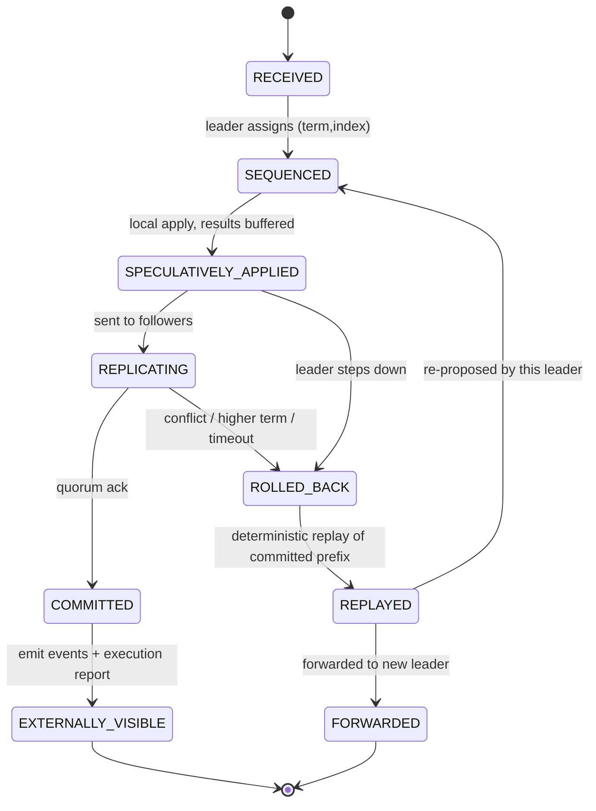
```mermaid
stateDiagram-v2
    [*] --> RECEIVED
    RECEIVED --> SEQUENCED: leader assigns (term,index)
    SEQUENCED --> SPECULATIVELY_APPLIED: local apply, results buffered
    SPECULATIVELY_APPLIED --> REPLICATING: sent to followers
    REPLICATING --> COMMITTED: quorum ack
    REPLICATING --> ROLLED_BACK: conflict / higher term / timeout
    SPECULATIVELY_APPLIED --> ROLLED_BACK: leader steps down
    ROLLED_BACK --> REPLAYED: deterministic replay of committed prefix
    REPLAYED --> SEQUENCED: re-proposed by this leader
    REPLAYED --> FORWARDED: forwarded to new leader
    COMMITTED --> EXTERNALLY_VISIBLE: emit events + execution report
    EXTERNALLY_VISIBLE --> [*]
    FORWARDED --> [*]
```

**Invariant across this machine (SDR-001):** the `EXTERNALLY_VISIBLE` state is reachable **only** from `COMMITTED`. This is exactly the invariant expressed in TLA+ (§31.3).

### 27.7 Benchmarking against Raft and Multi-Paxos

| ID | Requirement | Pri | Verify |
|---|---|---|---|
| SDR-020 | SDR, Raft, and Multi-Paxos shall be benchmarked under **identical** workload, cluster size, hardware, and fault schedule. | P1 | M |
| SDR-021 | Reported metrics: commit latency p50/p95/p99, throughput, rollback rate, recovery time after leader failure. | P1 | M |
| SDR-022 | The comparison shall state which Raft/Multi-Paxos implementations were used and whether they are production-grade or reference implementations. | P1 | I |
| SDR-023 | If SDR does not outperform the baselines, that result shall be reported as-is. | P1 | I |

**SDR-022 matters:** benchmarking a hand-written SDR against a mature, heavily optimised Raft library measures implementation effort, not protocol design. **[PROPOSED]** the fairest comparison is SDR versus a *Raft implemented on the same internal framework by the same team*, with any library comparison reported separately and caveated.

### 27.8 Explicit non-claims

- SDR is **not** Byzantine-fault-tolerant.
- SDR does **not** improve liveness guarantees over Raft.
- SDR's safety claim is **per shard**, not across shards.
- Formal verification covers the **model**, not the implementation (§31.5).

---

## 28. Replication Requirements

| ID | Requirement | Rationale | Pri | Verify |
|---|---|---|---|---|
| REP-001 | Replication shall be leader-based, log-structured, and per shard. | Matches single-writer structure. | P1 | I |
| REP-002 | Quorum = ⌊N/2⌋+1. For N=3, quorum=2 (tolerates 1 failure); N=5, quorum=3 (tolerates 2). | Confirmed. | P1 | A |
| REP-003 | Followers shall persist entries durably before acknowledging. | Otherwise a quorum ack can be lost in a correlated crash. | P1 | T |
| REP-004 | Replication shall support batching and pipelining. | Throughput; also the main lever for beating baselines. | P2 | M |
| REP-005 | Replication lag per follower shall be exported as a metric. | Observability of degradation before failure. | P1 | M |
| REP-006 | A follower whose log diverges shall be repaired by backtracking to the last matching `(index, term)` and re-replicating forward. | Log repair. | P1 | T |
| REP-007 | Snapshots shall be taken periodically, and log entries before a snapshot shall be compactable. | Bounded log growth and fast recovery. | P2 | T |
| REP-008 | Snapshot + log-suffix recovery shall be equivalent to full-log recovery (byte-identical state). | Correctness of compaction. | P2 | T |

**Quorum arithmetic table:**

| N | Quorum ⌊N/2⌋+1 | Failures tolerated | Notes |
|---|---|---|---|
| 1 | 1 | 0 | Degenerate; development only |
| 2 | 2 | 0 | **Worse than N=1 for availability** — never deploy |
| 3 | 2 | 1 | **[PROPOSED] default for this project** |
| 4 | 3 | 1 | No benefit over 3; more cost |
| 5 | 3 | 2 | Use for the failure-tolerance demonstration |

---

## 29. Failure-Detection Requirements

| ID | Requirement | Rationale | Pri | Verify |
|---|---|---|---|---|
| FD-001 | Membership shall be maintained by gossip. | Confirmed; scalable and partition-aware. | P1 | T |
| FD-002 | Failure detection shall use a **phi-accrual** detector producing a continuous suspicion level, not a boolean timeout. | Confirmed; adapts to delay variance instead of assuming a fixed bound. | P1 | T, M |
| FD-003 | The φ threshold shall be configurable, and the detector shall expose φ per node as a metric. | Tuning requires visibility. | P1 | M |
| FD-004 | Failure detection shall affect **liveness only** — never safety. A false positive shall cause at most an unnecessary leader election, never data loss or divergence. | ASM-09/DS-003. **This is the property that makes an adaptive detector safe to use.** | P1 | A, T |
| FD-005 | The detector shall maintain a sliding window of heartbeat inter-arrival times per node. | φ is computed from this distribution. | P1 | T |
| FD-006 | Suspicion shall decay when heartbeats resume; a recovered node shall rejoin without manual intervention. | Self-healing. | P1 | T |
| FD-007 | The detector's false-positive rate and detection latency shall be **measured** under injected delay and loss, and compared against a fixed-timeout baseline. | The entire justification for choosing phi-accrual over a timeout. Unmeasured, it is a design assertion. | P1 | M |

**φ computation (standard formulation):**
```
Given inter-arrival samples with mean μ and stdev σ (sliding window),
and time since last heartbeat t_since:
    P_later(t_since) = 1 − CDF_normal(t_since ; μ, σ)
    φ = −log10( P_later(t_since) )
Node is suspected when φ > φ_threshold (e.g. 8).
```
φ = 8 corresponds to roughly a 10⁻⁸ chance that the node is alive given the observed distribution. As network delay variance rises, σ rises, and the same absolute delay yields a lower φ — the detector automatically becomes more patient. That adaptivity is the point.

---

## 30. Rollback and Deterministic-Replay Requirements

### 30.1 Why determinism is non-negotiable

Rollback restores a previous state and then re-derives the current committed state by replaying the log. If replay is not deterministic, the re-derived state differs from what other nodes have, and **the cluster silently diverges** — the exact failure the whole protocol exists to prevent. Determinism is therefore not an optimisation; it is the precondition for rollback being safe at all.

### 30.2 Requirements

| ID | Requirement | Rationale | Pri | Verify |
|---|---|---|---|---|
| RB-001 | Command application shall be a pure function of `(state, command)`. | Determinism. | P1 | I, T |
| RB-002 | No wall-clock read, RNG call, environment read, or thread-scheduling dependence shall occur inside command application. | RB-001 in practice. | P1 | I (lint/static check), T |
| RB-003 | Any required non-determinism (timestamps, IDs) shall be resolved by the leader **before** replication and carried inside the command. | SDR-005. | P1 | T |
| RB-004 | Iteration over hash-based containers shall not affect output; ordered containers or explicit sorting shall be used where iteration order matters. | Classic source of non-determinism across runs and platforms. | P1 | I, T |
| RB-005 | Floating-point arithmetic shall be avoided in matching; prices and sizes shall be integers (ticks and lots). | Floating point is a determinism and correctness hazard in matching. **[PROPOSED — strongly recommended]** | P1 | I, T |
| RB-006 | Rollback shall be bounded in cost by the speculative-depth bound (SDR-006). | Predictable worst case. | P1 | M |
| RB-007 | A replay-determinism harness shall replay recorded command sequences on a fresh process and assert byte-identical final state and event streams. | The direct test of the property. | P1 | T |
| RB-008 | The determinism harness shall run in CI on every commit touching the engine or protocol. | Determinism regressions are silent otherwise. | P1 | I |
| RB-009 | Replay shall be possible from any snapshot plus the subsequent log suffix. | Fast recovery. | P2 | T |
| RB-010 | Rollback and replay durations shall be measured and reported. | Feeds SDR-012's honest cost accounting. | P1 | M |

**RB-005 is worth expanding.** Using `double` for prices invites (a) representation error (100.03 is not exactly representable), (b) platform/compiler-dependent rounding, and (c) comparison bugs at level boundaries. Representing price as an integer number of ticks and size as an integer number of lots eliminates the entire class. This also simplifies the price-level array structure proposed in §25.4.

---

## 31. TLA+ / TLC Formal-Verification Requirements

### 31.1 What is being verified

**[CONFIRMED]** The **safety properties of the SDR protocol model**, checked with the **TLC** model checker on **bounded configurations**.

### 31.2 What is NOT being verified — stated plainly

| Not verified | Why it matters |
|---|---|
| The implementation | TLA+ checks a model written in TLA+, not the C++/Rust/Go code. A verified model with a buggy implementation is still a buggy system. |
| Unbounded configurations | TLC explores a finite state space (e.g. 3 nodes, ≤4 commands, ≤2 terms). Properties are checked *for those bounds*, not proven for all N. |
| Liveness | Committed scope is safety. Liveness (every submitted command eventually commits under eventual synchrony) is a stretch goal (X-07). |
| Performance | Nothing about latency or throughput follows from a model check. |
| Real network behaviour | The model abstracts the network; the chaos harness (§32) tests the real one. |

**FV-001 [P0]** — Every artefact describing HELIOS shall state the above scope limits wherever verification is claimed. *Verification: I. Rationale: over-claiming formal verification is one of the fastest ways to lose credibility with a reviewer who knows the field.*

### 31.3 Properties to specify

| ID | Property | Type | Statement (informal) |
|---|---|---|---|
| FV-P1 | **Log matching** | Safety invariant | If two logs contain an entry with the same index and term, the logs are identical in all preceding entries. |
| FV-P2 | **Leader append-only** | Safety invariant | A leader never overwrites or deletes entries in its own log. |
| FV-P3 | **State-machine safety** | Safety invariant | If a node has applied an entry at index *i*, no other node ever applies a different entry at index *i*. |
| FV-P4 | **Election safety** | Safety invariant | At most one leader per term. |
| FV-P5 | **Speculation containment** | **SDR-specific safety invariant** | No externally-visible event is ever derived from a speculative (uncommitted) application. Formally: `∀ e ∈ ExternalEvents : e.sourceIndex ≤ commitIndex`. |
| FV-P6 | **Rollback correctness** | Safety invariant | After rollback+replay, the node's state equals the state obtained by applying the committed prefix from the initial state. |
| FV-P7 | **Commit monotonicity** | Safety invariant | `commitIndex` never decreases. |
| FV-P8 | **Linearizability** | Refinement | The externally visible history refines a sequential specification of the matching engine. |
| FV-P9 | **Eventual commit** (stretch) | Liveness / temporal | Under eventual synchrony and a stable leader, every proposed command eventually commits. **[P3, X-07]** |

FV-P5 is the property that distinguishes SDR from Raft and is therefore the single most important thing to verify.

### 31.4 Requirements

| ID | Requirement | Rationale | Pri | Verify |
|---|---|---|---|---|
| FV-002 | The SDR protocol shall be specified in TLA+ including speculative apply, rollback, replay, and leader change. | Confirmed. | P1 | I |
| FV-003 | TLC shall check FV-P1..P7 on at least the configurations (N=3, ≤4 commands, ≤2 terms) and (N=5, reduced command bound). | Bounded but non-trivial. | P1 | A |
| FV-004 | The model shall include message loss, duplication, reordering, and node crash/restart. | A model without faults verifies nothing interesting. | P1 | I, A |
| FV-005 | Every TLC run shall produce a stored artefact (config, state count, result, duration) referenced from CI. | Evidence, not assertion. | P1 | I |
| FV-006 | A property violation shall block merge, and the counterexample trace shall be preserved. | Confirmed verification gate. | P1 | I |
| FV-007 | The specification shall not assume synchronised clocks for any safety property. | ASM-09/DS-003; if a property needs clocks, the design is wrong. | P1 | I, A |
| FV-008 | A **deliberately broken variant** of the spec (e.g. commit on a non-majority) shall be checked periodically and must FAIL. | Confirms the checker and properties actually have teeth. Without this, a spec that passes may simply be vacuous. | P1 | A |
| FV-009 | State-space size and coverage statistics shall be recorded per run. | Distinguishes "checked thoroughly" from "checked a tiny corner". | P2 | M |
| FV-010 | Where feasible, the implementation shall be cross-checked against the model via trace validation: record real execution traces and check them against the spec. **[PROPOSED, P3]** | Narrows the model-implementation gap. | P3 | A |

**FV-008 is the formal-methods analogue of SIM-014/SIM-015** — a test that the verification itself is not vacuous. Cheap, and it catches the embarrassing case where the invariant is trivially true because a predicate is misspelled.

### 31.5 Three distinct assurance activities — do not conflate

| Activity | What it checks | Strength | Weakness |
|---|---|---|---|
| **Formal model verification (TLA+/TLC)** | Protocol logic, all interleavings within bounds | Exhaustive within bounds; finds subtle race conditions no test would | Says nothing about the code |
| **Implementation testing (unit/property/replay)** | The actual code's behaviour on generated inputs | Tests the real artefact | Samples the input space; misses rare interleavings |
| **Chaos testing** | The deployed system under real faults | Tests the whole stack including OS, network, timing | Non-exhaustive, non-deterministic, hard to reproduce |

All three are required. None substitutes for another. **[CONFIRMED distinction, expanded.]**

---

## 32. Chaos-Testing Requirements

### 32.1 Framework

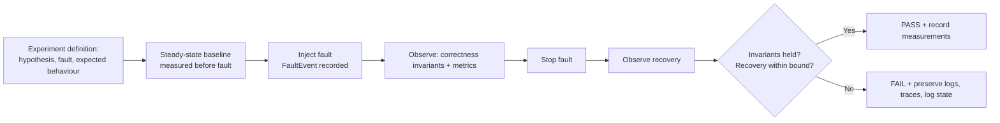
```mermaid
flowchart LR
    A[Experiment definition:<br/>hypothesis, fault, expected behaviour] --> B[Steady-state baseline<br/>measured before fault]
    B --> C[Inject fault<br/>FaultEvent recorded]
    C --> D[Observe: correctness invariants + metrics]
    D --> E[Stop fault]
    E --> F[Observe recovery]
    F --> G{Invariants held?<br/>Recovery within bound?}
    G -->|Yes| H[PASS + record measurements]
    G -->|No| I[FAIL + preserve logs, traces, log state]
```

### 32.2 Requirements

| ID | Requirement | Rationale | Pri | Verify |
|---|---|---|---|---|
| CHA-001 | The harness shall inject: process crash, process pause/stall, message loss, message delay, message duplication, message reordering, network partition, and leader kill. | Confirmed fault set + duplication/reordering. | P1 | T |
| CHA-002 | Every experiment shall declare a hypothesis and expected behaviour **before** running. | Prevents post-hoc rationalisation of failures. | P1 | I |
| CHA-003 | Correctness invariants shall be checked continuously during faults, not only afterwards. | Transient violations are the interesting ones. | P1 | T |
| CHA-004 | Every run shall record a `FaultEvent` with parameters and a deterministic seed. | Reproducibility of a chaos failure. | P1 | T |
| CHA-005 | Chaos runs shall be reproducible given the same seed and fault schedule. | Otherwise debugging is hopeless. | P1 | T |
| CHA-006 | Recovery time (fault clear → normal service) shall be measured per fault type. | Feeds the failure matrix (§49). | P1 | M |
| CHA-007 | Chaos tests shall run nightly in CI and on demand; a defined subset shall block release (not every merge). | Balance between rigour and iteration speed. | P1 | I |
| CHA-008 | A linearizability checker shall validate recorded client histories from chaos runs. | Directly tests DS-002 on the real implementation, complementing TLC on the model. | P1 | T |

### 32.3 Fault catalogue

| Fault | Trigger mechanism **[PROPOSED]** | Expected behaviour | Recovery behaviour | Correctness condition | Measurement |
|---|---|---|---|---|---|
| **Follower crash** | SIGKILL container | Leader continues; quorum still met (3-node → 1 loss OK) | Node restarts, catches up from log/snapshot | No committed entry lost; no divergence | Commit latency delta; catch-up time |
| **Leader crash** | SIGKILL leader | Election; new leader; in-flight speculative work rolled back at the old leader | Old leader rejoins as follower | No committed entry lost; no duplicate trade; client retry idempotent | Time to new leader; unavailability window; duplicate rate = 0 |
| **Process stall** | SIGSTOP / cgroup freeze | φ rises; node suspected; election if leader | SIGCONT → node discovers higher term, steps down, rolls back | **Stalled old leader must not commit anything after stepping down** | Detection latency; false-suspicion rate |
| **Message loss** | `tc netem loss 10%/30%` | Retries; commit latency rises | Loss stops → latency normalises | No loss of committed state; no duplicate application | p99 latency vs loss rate |
| **Message delay** | `tc netem delay 50ms ±20ms` | φ adapts (σ grows); ideally **no spurious election** | Delay removed → φ falls | Safety unaffected | φ trace; spurious-election count vs fixed-timeout baseline (FD-007) |
| **Message duplication** | Harness duplicates RPCs | Idempotent handling | N/A | No double-apply; no duplicate fill | Duplicate-apply count = 0 |
| **Message reordering** | Harness shuffles within a window | Log-matching check rejects out-of-order appends | Repaired by backtracking | Log consistency maintained | Repair count and duration |
| **Network partition (minority)** | `iptables` drop between groups | Minority cannot commit; majority continues | Heal → minority truncates conflicting entries, catches up | **Minority must not serve stale reads or accept orders as leader** | Stale-response count = 0 |
| **Network partition (symmetric, even split)** | Partition N=4 into 2+2 | **Neither side commits** | Heal → normal | No split-brain; no divergence | Unavailability duration |
| **Disk full / fsync failure** | Fault-injecting filesystem | Node fails cleanly rather than acking unpersisted entries | Restart after clearing | No ack without durability (REP-003) | Detected-vs-silent failure |
| **Clock skew** | Adjust node clock ±minutes | **No safety impact** (DS-003) | N/A | Safety invariants hold | Explicit assertion that safety is clock-independent |
| **Slow follower** | cgroup CPU throttle | Leader continues with the other quorum member; lag metric rises | Throttle removed → catch-up | No commit stall while quorum available | Replication lag |
| **Abnormal order flow** (SpoofBench) | Inject high-rate manipulative flow | Risk breaker trips; engine remains correct | Cool-down, reset | Book invariants hold; kill switch fires | Kill-switch latency; rejection rate |

### 32.4 Chaos acceptance matrix

A Priority-2 subsystem is accepted only when **every row above** has been executed at least once with recorded evidence, and every "correctness condition" held. Rows may be marked `NOT-RUN` with justification, but never silently omitted.
---

# PART VI — MACHINE LEARNING AND BENCHMARK RESEARCH

## 33. ML / DGT Requirements

### 33.1 Pipeline

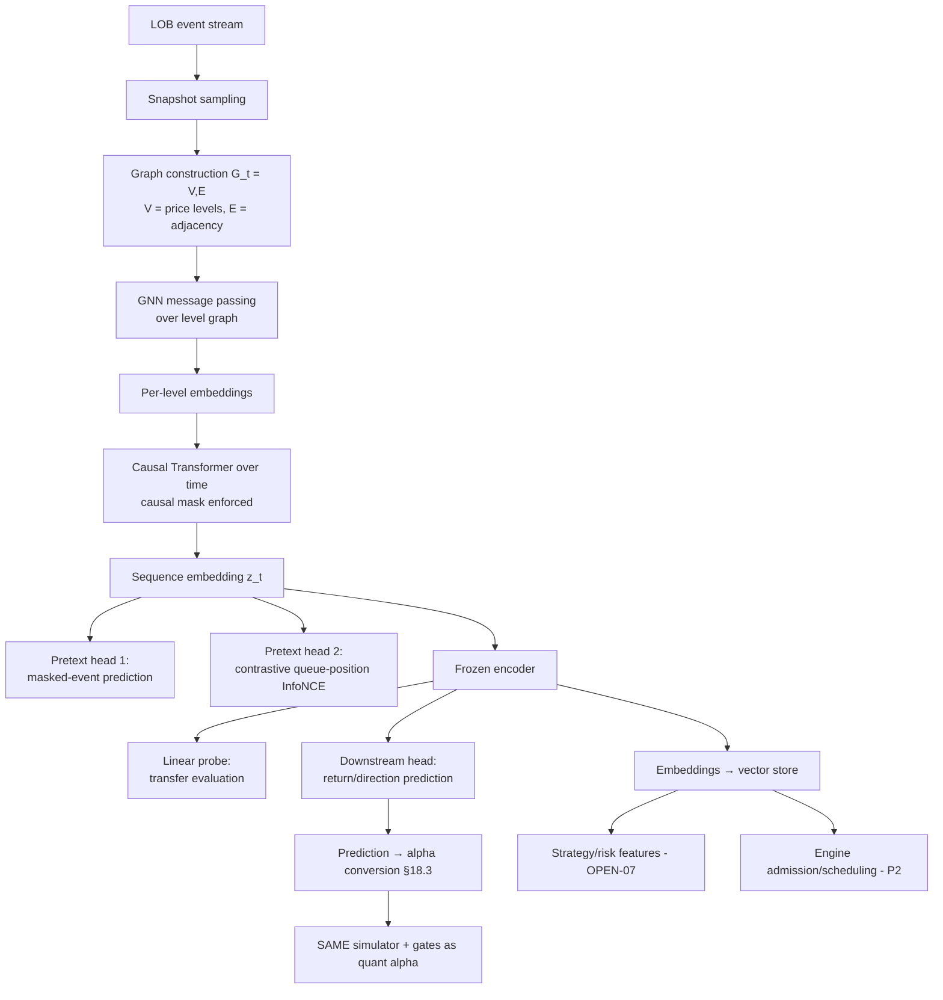
```mermaid
flowchart TD
    A[LOB event stream] --> B[Snapshot sampling]
    B --> C[Graph construction G_t = V,E<br/>V = price levels, E = adjacency]
    C --> D[GNN message passing<br/>over level graph]
    D --> E[Per-level embeddings]
    E --> F[Causal Transformer over time<br/>causal mask enforced]
    F --> G[Sequence embedding z_t]
    G --> H1[Pretext head 1:<br/>masked-event prediction]
    G --> H2[Pretext head 2:<br/>contrastive queue-position InfoNCE]
    G --> I[Frozen encoder]
    I --> J1[Linear probe:<br/>transfer evaluation]
    I --> J2[Downstream head:<br/>return/direction prediction]
    J2 --> K[Prediction → alpha conversion §18.3]
    K --> L[SAME simulator + gates as quant alpha]
    I --> M[Embeddings → vector store]
    M --> N1[Strategy/risk features - OPEN-07]
    M --> N2[Engine admission/scheduling - P2]
```

### 33.2 Graph construction

| Element | Definition |
|---|---|
| **Nodes** *V* | Price levels within a configured depth *L* on each side (2L nodes), each carrying: relative price offset in ticks from mid, total size, order count, side indicator, level index, and (optionally) recent flow at that level |
| **Edges** *E* | Adjacency between price-neighbouring levels; **[PROPOSED]** additionally a cross-side edge between best bid and best ask, since the spread is where the interaction actually happens |
| **Features** | Sizes normalised by a trailing depth statistic; prices expressed as **tick offsets from mid**, never absolute |
| **Rationale** | Relative, adjacency-based representation may reduce dependence on absolute tick size and price range, which **may** help cross-instrument transfer. **This is a testable hypothesis, not a guarantee** — [CONFIRMED framing, deliberately modest] |

| ID | Requirement | Rationale | Pri | Verify |
|---|---|---|---|---|
| ML-001 | Graphs shall use relative (tick-offset) price encoding, never absolute price. | The transfer hypothesis depends on it. | P1 | I, T |
| ML-002 | Node features shall be normalised using trailing statistics only. | ALG-011; leakage. | P0 | T |
| ML-003 | Graph construction shall be deterministic given a snapshot. | Reproducibility. | P1 | T |
| ML-004 | Depth *L* shall be configurable and its effect studied as an ablation. | Depth choice is a hidden hyperparameter that can dominate results. | P2 | M |

### 33.3 Encoder

| ID | Requirement | Rationale | Pri | Verify |
|---|---|---|---|---|
| ML-010 | The GNN shall perform message passing over the level graph, producing per-level embeddings. | Confirmed. | P1 | T |
| ML-011 | The temporal model shall be a Transformer with **causal masking**, verified by a unit test that shows position *t* cannot attend to *t+1*. | Confirmed; and causal masking bugs are common and silent. | P0 | T |
| ML-012 | The encoder shall accept variable-length histories up to a configured window. | Practical flexibility. | P2 | T |
| ML-013 | Inference shall be deterministic given fixed weights and seed (deterministic kernels enabled). | Reproducibility; also required if used online. | P1 | T |

### 33.4 Self-supervised objectives

| Objective | Construction | Purpose |
|---|---|---|
| **Masked-event prediction** | Mask a contiguous span of the event stream (or node features at masked levels); reconstruct the masked content from context | Forces the encoder to model book dynamics rather than memorise a label |
| **Contrastive queue-position (InfoNCE)** | Positive pairs = augmented views of the same book state / temporally adjacent states with similar queue configuration; negatives = states with dissimilar queue configuration | Shapes the embedding so that states with similar fill-probability structure are close — directly relevant to maker strategies |

| ID | Requirement | Rationale | Pri | Verify |
|---|---|---|---|---|
| ML-020 | Both pretext tasks shall be implemented and independently ablatable. | Confirmed ablation requirement. | P1 | T, M |
| ML-021 | Masking shall never allow reconstruction from a trivially leaked source (e.g. an unmasked duplicate of the masked field elsewhere in the input). | A leaked pretext task learns nothing. | P0 | T |
| ML-022 | Contrastive negatives shall not be sampled from temporally adjacent windows unless explicitly studied. | Adjacent windows are near-duplicates; using them as negatives teaches the model to distinguish noise. | P1 | I, T |
| ML-023 | Pretraining shall use only the training split; validation and test splits shall be untouched by pretraining. | Self-supervision on test data is still leakage — a widely-made mistake because "there are no labels". | P0 | T |

**ML-023 is important and easy to get wrong.** Self-supervised pretraining on the full dataset "because it uses no labels" leaks the *distribution* of the test period into the encoder, and inflates downstream transfer results.

### 33.5 Evaluation protocol

| ID | Requirement | Pri | Verify |
|---|---|---|---|
| ML-030 | Transfer shall be evaluated cross-symbol (train on symbols A..C, evaluate on unseen D..E) and cross-regime (train calm, evaluate volatile). | P1 | M |
| ML-031 | Comparison targets: DeepLOB, HLOB, TLOB, and **LiT as the primary benchmark**. | P1 | M |
| ML-032 | Baselines shall be run by the team under identical splits and preprocessing wherever code is available; where a published number is quoted instead, that shall be stated explicitly and not presented as a like-for-like comparison. | P1 | I, M |
| ML-033 | Ablations: (a) graph-ablated (sequence-only), (b) each pretext task removed, (c) both removed (supervised-only), (d) **MLP-on-graph-features baseline**. | P1 | M |
| ML-034 | Label-efficiency curves at 1%, 5%, 10%, 25%, 100% of labels; report labels needed to reach 90% of the supervised ceiling. | P1 | M |
| ML-035 | Few-shot linear probes at k = 10, 50, 200. | P1 | M |
| ML-036 | Every result shall report mean ± stdev over ≥ **[PROPOSED] 3** seeds. | P1 | M |
| ML-037 | A null result (DGT does not beat LiT) shall be reported as-is. | P1 | I |

**ML-036 matters more than it looks.** Single-seed comparisons between deep models are close to meaningless; seed variance in LOB models frequently exceeds the differences being claimed. **The MLP baseline in TLOB's own ablation is the cautionary precedent the team already knows about.**

### 33.6 The MLP-baseline discipline

**[CONFIRMED context]** TLOB's own ablation showed a simpler MLP variant matching its FI-2010 performance. HELIOS must therefore treat "our architecture is complex and scores well" as insufficient.

**ML-038 [P0]** — For every claimed benefit of DGT (graph structure, pretraining, temporal attention), the ablation that removes it must show a **statistically distinguishable** degradation across seeds. If it does not, the component shall be reported as not-demonstrated. *Verify: M, A.*

### 33.7 ML as an alpha route (the updated direction)

| ID | Requirement | Pri | Verify |
|---|---|---|---|
| ML-040 | DGT's downstream prediction shall be converted to an alpha via §18.3 and evaluated by the **same simulator and same gates** as quant alphas. | P0 | T |
| ML-041 | Probe accuracy and transfer scores shall be reported as **representation-quality diagnostics**, and shall not be used to claim trading value. | P0 | I |
| ML-042 | The ML alpha shall be compared against the best quant-designed alpha and against the trivial baseline. | P1 | M |
| ML-043 | If DGT's transfer improves but its alpha fails the gates, both facts shall be reported, and the project shall state plainly that better representations did not translate into tradeable edge in this setting. | P1 | I |

**ML-043 encodes the honest resolution of conflict C-3.** Transfer quality and tradeability are different claims; HELIOS reports both and does not let one stand in for the other.

### 33.8 Model management

| ID | Requirement | Pri |
|---|---|---|
| ML-050 | Every trained model shall be registered with architecture, hyperparameters hash, data snapshot, seed, code commit, and metrics. | P1 |
| ML-051 | Embeddings shall be stored versioned by `model_version`; a new version never overwrites old vectors. | P1 |
| ML-052 | Model artefacts shall be immutable once registered. | P1 |
| ML-053 | Inference shall record `model_id`, `model_version`, and input feature hash (NFR-063). | P1 |

### 33.9 Online vs offline placement — **[OPEN-07]**

| Option | Latency impact | Complexity | Research value |
|---|---|---|---|
| **Offline only** (embeddings precomputed, used in research and as batch features) | None on the hot path | Low | Sufficient to answer the transfer question and to produce an ML alpha evaluated in backtest |
| **Online inference in the quoting loop** | Adds ms-scale latency to a µs-scale path — **directly contradicts Priority 3** | High | Demonstrates a real closed loop |
| **Online, but off the critical path** (asynchronous embedding updated at a slower cadence, consumed as a slowly-varying feature) **[PROPOSED recommendation]** | Small and bounded | Medium | Preserves the closed-loop claim without wrecking the latency story |

**[PROPOSED] Recommendation: option 3.** The embedding is refreshed at a configurable cadence (e.g. every N ms) on a separate thread; the quoting loop reads the most recent value with a staleness bound and treats a stale embedding as `UNAVAILABLE`. This keeps the hot path free of neural inference while still closing the loop. **Team must ratify.**

### 33.10 ML deliverables table

| Deliverable | Contents | Status field |
|---|---|---|
| Transfer table | DGT vs DeepLOB/HLOB/TLOB/LiT, cross-symbol and cross-regime, mean ± std over seeds | `TBD-MEASURE` until run |
| Ablation table | Graph-ablated, pretext-ablated (each and both), MLP baseline | `TBD-MEASURE` |
| Label-efficiency curves | Accuracy vs {1,5,10,25,100}% labels | `TBD-MEASURE` |
| Few-shot table | k ∈ {10, 50, 200} | `TBD-MEASURE` |
| Regime-shift result | Calm-trained → volatile-tested | `TBD-MEASURE` |
| **ML alpha result** | `AlphaResult` row with gates evaluated | `TBD-MEASURE` |

**No cell in these tables may be populated with anything other than a measured value.** (NFR-073)

---

## 34. SpoofBench Requirements

### 34.1 Purpose (dual)

1. **Benchmark contribution:** a synthetic LOB environment with *ground-truth* manipulation labels — obtainable by construction in a simulator, and essentially unobtainable in real data. **[CONFIRMED positioning: a dataset/benchmark contribution, not a detection-method contribution.]**
2. **Risk stressor:** a generator of adversarial order flow to exercise the risk engine, kill switch, and circuit breaker under conditions that ordinary replayed data never produces. **[CONFIRMED dual use.]**

### 34.2 Simulator design

| Component | Design |
|---|---|
| **Base flow** | Multivariate Hawkes process: arrival intensity of each event type (limit add, cancel, market order) per side is self- and cross-exciting, reproducing clustering and burstiness |
| **Intensity** | `λ_i(t) = μ_i + Σ_j Σ_{t_k < t} α_ij · exp(−β_ij (t − t_k))` |
| **Placement** | Level selection from a fitted depth distribution; size from a fitted size distribution |
| **Cancellation** | Hazard-rate model conditioned on queue position and depth |
| **Validation** | Against stylised facts (Cont & de Larrard, 2013 and related): order-size distribution, inter-arrival clustering, depth profile shape, spread distribution, volatility signature |
| **Precedent** | CoinTossX (Jericevich et al., 2021) established that Hawkes-driven flow against a real matching engine is feasible; SpoofBench builds on that precedent rather than claiming to invent it **[CONFIRMED positioning discipline]** |

### 34.3 Manipulation injection

| Pattern | Construction | Ground-truth label |
|---|---|---|
| **Spoofing** | Place large orders away from touch on one side to create false pressure, with high probability of cancellation before execution; simultaneously trade on the opposite side | Episode window + involved order IDs |
| **Layering** | Multiple orders across several levels on one side, built and torn down together | Episode window + order set |
| **Quote stuffing** | Very high-rate place/cancel bursts with no intent to trade | Episode window + rate profile |

| ID | Requirement | Rationale | Pri | Verify |
|---|---|---|---|---|
| SPB-001 | The simulator shall generate base flow from a Hawkes process with configurable parameters. | Confirmed. | P2 | T |
| SPB-002 | The simulator shall validate generated flow against declared stylised facts and report the comparison. | A simulator that does not reproduce known market statistics teaches a detector the wrong thing. | P2 | M |
| SPB-003 | Manipulation episodes shall be injected with configurable **difficulty levels** (e.g. size relative to book, distance from touch, cancellation latency, camouflage by concurrent genuine flow). | Confirmed; a single difficulty makes AUC uninterpretable. | P2 | T |
| SPB-004 | Every injected episode shall produce a `ManipulationLabel` with exact time bounds and involved order IDs. | Ground truth is the contribution. | P2 | T |
| SPB-005 | Generation shall be deterministic given a seed. | Reproducibility of the benchmark. | P2 | T |
| SPB-006 | The benchmark shall define standard splits, metrics (ROC-AUC, precision-recall, **latency-to-detect**), and an evaluation script. | Otherwise it is data, not a benchmark. | P2 | I, T |
| SPB-007 | SpoofBench flow shall be injectable into the live paper/replay path through the standard `MarketDataSource` interface. | Confirmed dual use; also avoids a second ingestion path. | P2 | T |
| SPB-008 | SpoofBench data shall be clearly marked synthetic everywhere it is used. | Prevents synthetic results being read as market results. | P0 | I, T |
| SPB-009 | Base-rate (prevalence of manipulation) shall be configurable and reported with every AUC. | AUC is base-rate-independent but precision is not; reporting AUC alone on a 0.1%-prevalence problem is misleading. | P2 | M |
| SPB-010 | The benchmark shall include at least one trivial baseline detector (e.g. cancel-ratio threshold) so reported AUCs are interpretable. | Same logic as ALG-012. | P2 | M |

### 34.4 Risk-stress workflow

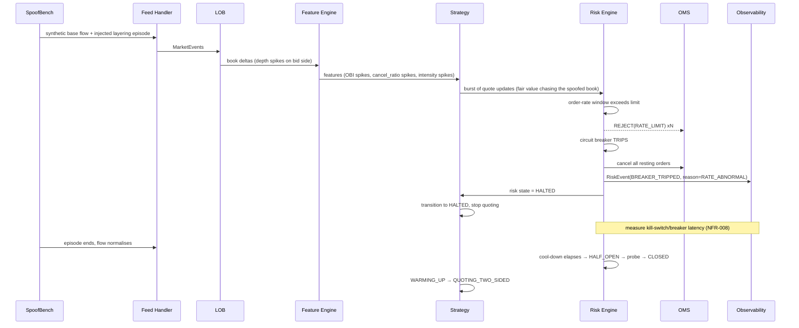
```mermaid
sequenceDiagram
    participant SB as SpoofBench
    participant FH as Feed Handler
    participant LOB as LOB
    participant FE as Feature Engine
    participant ST as Strategy
    participant RK as Risk Engine
    participant OMS as OMS
    participant OBS as Observability

    SB->>FH: synthetic base flow + injected layering episode
    FH->>LOB: MarketEvents
    LOB->>FE: book deltas (depth spikes on bid side)
    FE->>ST: features (OBI spikes, cancel_ratio spikes, intensity spikes)
    ST->>RK: burst of quote updates (fair value chasing the spoofed book)
    RK->>RK: order-rate window exceeds limit
    RK-->>OMS: REJECT(RATE_LIMIT) xN
    RK->>RK: circuit breaker TRIPS
    RK->>OMS: cancel all resting orders
    RK->>OBS: RiskEvent(BREAKER_TRIPPED, reason=RATE_ABNORMAL)
    RK->>ST: risk state = HALTED
    ST->>ST: transition to HALTED, stop quoting
    Note over RK,OBS: measure kill-switch/breaker latency (NFR-008)
    SB->>FH: episode ends, flow normalises
    RK->>RK: cool-down elapses → HALF_OPEN → probe → CLOSED
    ST->>ST: WARMING_UP → QUOTING_TWO_SIDED
```

| ID | Requirement | Pri | Verify |
|---|---|---|---|
| SPB-020 | The stress workflow shall measure: time-to-trip, orders rejected, orders that leaked through, resting orders cancelled, time-to-recover. | P2 | M |
| SPB-021 | A **leak count of zero** (no order submitted after the trip) shall be an acceptance criterion. | P0 | T |
| SPB-022 | The price-band reference price shall be verified to resist manipulation (§22.4, Abnormal 4). | P1 | T |

---

## 34A. Closed-Loop Requirements

### 34A.1 The two loops

**Loop 1 — the trading loop (immediate, always on):**
```
Market/LOB → Features → Alpha → Strategy → Risk → Orders → Execution
     ▲                                                         │
     └───────────── new market state (our orders are now part of it) ─┘
```
Note the subtlety: in paper trading, our orders enter the *simulated* book but must not contaminate the *feature* book (PPR-009).

**Loop 2 — the learning loop (slow, offline or slow-cadence):**
```
LOB events (incl. fault-injection and SpoofBench events)
        │
        ▼
      DGT ──► embeddings ──┬──► strategy/risk features   [OPEN-07: cadence]
                           └──► engine admission/scheduling hint   [P2]
```

### 34A.2 Requirements

| ID | Requirement | Rationale | Pri | Verify |
|---|---|---|---|---|
| CL-001 | Embeddings shall be consumable as strategy/risk features with an explicit staleness bound. | Confirmed feedback path; bounded staleness keeps it honest. | P2 | T |
| CL-002 | Embedding unavailability shall degrade gracefully: the strategy operates without the embedding feature rather than halting. | An optional research feature must not become a single point of failure. | P2 | T |
| CL-003 | The engine admission/scheduling hint shall be **advisory only**; the engine's correctness shall not depend on it, and ignoring it shall be a valid behaviour. | Confirmed scoping: evaluated as a scheduling/feature signal only. Also prevents an ML component becoming safety-critical. | P2 | I, T |
| CL-004 | Fault-injection events from chaos runs shall be included in DGT training data. | **[CONFIRMED]** — the source explicitly notes training on live events including controlled fault-injection experiments, not only static history. | P2 | T |
| CL-005 | Any alpha or feature derived from the closed loop shall be re-evaluated through the standard gates before use. | No back door into production. | P0 | T |
| CL-006 | A full multi-agent market simulation (multiple learned policies interacting through the engine) is **out of scope** and shall be described only as future work. | **[CONFIRMED]** explicit scoping. | P4 | I |

### 34A.3 Planned vs future

| Element | Status |
|---|---|
| Trading loop (market → alpha → order → fill → new state) | **Planned, P0** |
| Embeddings → strategy/risk features | **Planned, P2** |
| Embeddings → engine admission/scheduling (advisory) | **Planned, P2** |
| Training on fault-injection events | **Planned, P2** |
| Multi-agent simulation | **Future work, not built** |
| Online retraining / continual learning | **Future work, not built** |

---

# PART VII — LOW-LATENCY AND PLATFORM (PRIORITY 3)

## 35. Low-Latency Requirements

### 35.1 The stated architecture and the honest version

```
   REFERENCE (production HFT)          WHAT HELIOS ACTUALLY BUILDS
   ──────────────────────────          ───────────────────────────
   Exchange                            Simulated/replayed feed source
        │                                        │
   Physical colocation  ←── NOT US    Low-latency cloud environment
        │                                        │
   Kernel-bypass NIC    ←── NOT US    Standard NIC, tuned socket path
        │                                        │
   CPU-pinned thread                   CPU-pinned thread            ✓ same
        │                                        │
   C++ decode/parse                    C++ decode/parse             ✓ same
        │                                        │
   LOB                                 LOB                          ✓ same
        │                                        │
   Quant / Alpha                       Quant / Alpha                ✓ same
        │                                        │
   Strategy → order out                Strategy → order out         ✓ same
```

**[CONFIRMED]** HELIOS builds the architectural pattern and **measures** it; it does not claim the physical infrastructure.

### 35.2 Requirements

| ID | Requirement | Rationale | Pri | Verify |
|---|---|---|---|---|
| LAT-001 | Latency shall be **measured**, not asserted, at every stage. | Confirmed core requirement. | P2 | M |
| LAT-002 | Reported latency shall include p50, p95, p99, and jitter (e.g. p99−p50, or stdev), never a bare mean. | Confirmed; means hide the tail that actually matters. | P2 | M |
| LAT-003 | The hot path shall perform no heap allocation in steady state. | Allocation is the dominant source of jitter. | P2 | I, M |
| LAT-004 | The hot path shall avoid locks; inter-thread handoff shall use lock-free SPSC ring buffers. | Lock contention creates unbounded tail latency. | P2 | I, M |
| LAT-005 | The hot path shall avoid logging to disk synchronously; diagnostics shall be written to a lock-free buffer and drained off-path. | A `printf` in the hot loop can cost more than the entire rest of the path. | P2 | I, M |
| LAT-006 | Timestamping shall use a monotonic, low-overhead clock source (e.g. TSC-based), calibrated once. | `clock_gettime` overhead is itself measurable at this scale. | P2 | I, M |
| LAT-007 | Measurement overhead shall itself be measured and reported, so the instrument's effect on the measurement is known. | Otherwise reported latency includes an unknown observer cost. | P2 | M |
| LAT-008 | A latency budget table (§47.2) shall be maintained with measured values per stage; unmeasured stages shall read `TBD-MEASURE`. | NFR-073. | P2 | M |
| LAT-009 | Any latency claim shall state the environment (instance type, isolation, kernel, NIC, load) in which it was measured. | A latency number without an environment is not a result. | P2 | I |
| LAT-010 | Latency regressions beyond a configured threshold shall fail the benchmark CI stage. | Prevents silent drift. | P2 | I |

### 35.3 Sources of latency and jitter, and the mitigation for each

| Source | Effect | Mitigation in HELIOS | Feasible here? |
|---|---|---|---|
| Network propagation | Fixed floor | Colocation (not available) → same-AZ/placement-group cloud | Partial |
| Kernel network stack | µs + jitter | Busy-poll, socket tuning, `SO_BUSY_POLL`; kernel bypass out of scope (X-04) | Partial |
| Interrupt handling | Jitter | IRQ affinity away from pinned cores | Yes |
| Context switching | Jitter | CPU pinning + core isolation | Yes |
| Scheduler preemption | Jitter | `isolcpus`, `nohz_full`, real-time priority | Yes (bare VM), limited on shared cloud |
| Memory allocation | Spikes | Pre-allocated pools, arena allocation, no steady-state `new`/`malloc` | Yes |
| Cache misses | µs | Contiguous, cache-line-aligned structures; avoid pointer chasing | Yes |
| Page faults / swap | Large spikes | `mlockall`, huge pages, disable swap | Yes |
| GC pauses | Large spikes | **No garbage-collected language on the hot path** | Yes — see C-1/OPEN-01 |
| Lock contention | Unbounded tail | Lock-free SPSC queues, single-threaded stages | Yes |
| Logging / serialisation | µs–ms | Binary, off-path, pre-sized buffers | Yes |
| Neural inference | ms | Keep off the hot path (OPEN-07 option 3) | Yes |
| **Cloud noisy neighbours** | **Unbounded jitter** | Dedicated/isolated instances; report jitter honestly; run repeated trials | **Only partially — must be disclosed** |

**LAT-011 [P2]** — Every latency report shall include an explicit statement that the environment is a shared/virtualised cloud environment and that observed jitter includes environmental variance outside the system's control. *Rationale: this is the honest framing that makes the measurements credible rather than embarrassing.* *Verify: I.*

### 35.4 The GC question (C-1 consequence)

A garbage-collected runtime on the hot path introduces pauses that dominate every other optimisation. Go's GC is low-pause but not pause-free, and its scheduling is not preemption-free at the granularity that matters here.

**[PROPOSED] Resolution of C-1:**

| Layer | Language | Justification |
|---|---|---|
| Hot path (parse → LOB → features → alpha-formula → strategy → risk → OMS submit) | **C++** | No GC, full control over allocation and layout, matches the confirmed C++ role |
| Matching engine core | **C++ or Rust** | Same reasoning; Rust adds memory safety without GC |
| Cluster control plane (SDR replication, membership, failure detection, admin RPC) | **Go or Rust** | Not on the µs path; developer productivity matters more; Go's concurrency model suits gossip/RPC |
| Research, ML, backtest orchestration | **Python** | Confirmed |
| Formal spec | **TLA+** | Confirmed |

This preserves the earlier Go/Rust choice for the services where it is appropriate and reserves C++ for the path where the latency objective actually lives. **Team must ratify (OPEN-01).**

### 35.5 Latency vs fault tolerance — the honest tension

These two priorities pull in opposite directions and the document must say so.

| | Effect on latency |
|---|---|
| Replication to a quorum | **Adds** a network round-trip to every commit |
| Durable persistence before ack | **Adds** an fsync |
| Speculative execution (SDR) | **Hides** part of that cost by overlapping local execution with replication — this is precisely its purpose |
| Rollback | **Adds** cost when it happens (SDR-012 requires measuring how often) |

**LAT-012 [P1]** — The system shall report latency in three configurations: (a) paper venue, no replication; (b) single-node matching engine, no replication; (c) replicated cluster with SDR. *Rationale: this decomposition is what makes the cost of fault tolerance visible and is a genuinely interesting result in its own right.* *Verify: M.*

---

## 36. Networking Requirements

| ID | Requirement | Rationale | Pri | Verify |
|---|---|---|---|---|
| NET-001 | Market-data ingestion and order submission shall use a binary protocol; no JSON on the hot path. | Text parsing costs µs and allocates. | P2 | I, M |
| NET-002 | Socket options shall be tuned: `TCP_NODELAY`, adequate buffer sizes, and (where available) busy polling. | Nagle's algorithm alone can add tens of ms. | P2 | I, M |
| NET-003 | Hot-path components shall be co-located within the same availability zone / placement group. | Cross-AZ adds hundreds of µs to ms. | P2 | I, M |
| NET-004 | IRQ affinity shall be configured so that NIC interrupts do not land on isolated application cores. | Interrupt-induced jitter. | P2 | I, M |
| NET-005 | Network latency between components shall be measured independently of application latency. | Attribution: distinguish "the network is slow" from "our code is slow". | P2 | M |
| NET-006 | mTLS shall be used for service-to-service traffic; its latency cost shall be measured and reported. | Security is required (FR-085), and its cost must be honest, not hidden. | P1 | M |
| NET-007 | Kernel-bypass networking is **out of scope**; if a loopback/synthetic experiment is attempted, it shall be clearly labelled as a synthetic-feed experiment, not exchange connectivity. | X-04, OPEN-09. | P3 | I |

**NET-006 is worth stating explicitly:** teams routinely benchmark a plaintext path and deploy a TLS one. HELIOS measures what it deploys.

---

## 37. NIC Requirements

### 37.1 NIC ≠ C++ — division of responsibility **[CONFIRMED]**

| Layer | Responsibility | HELIOS status |
|---|---|---|
| **NIC (hardware/driver)** | Fast packet reception and transmission; DMA into host memory; checksum offload; interrupt coalescing or polling; **potentially** low-level packet processing | Standard cloud NIC, tuned |
| **Kernel network stack** | Protocol handling, socket delivery | Present (no bypass — X-04) |
| **C++ application** | Application-level market-message interpretation, decoding/parsing, LOB construction and maintenance, feature computation, alpha evaluation, latency-sensitive trading logic | **This is where HELIOS's engineering lives** |

The distinction: the NIC moves **bytes**; C++ interprets **meaning**. They are sequential stages, not alternatives.

### 37.2 Requirements

| ID | Requirement | Pri | Verify |
|---|---|---|---|
| NIC-001 | NIC configuration (queues, coalescing, offloads, IRQ affinity) shall be recorded as part of the benchmark environment. | P2 | I |
| NIC-002 | Receive-side scaling / queue assignment shall be configured so the hot-path core receives its traffic directly. | P2 | I, M |
| NIC-003 | Time spent in the network stack shall be estimated (e.g. via hardware/software receive timestamps) and separated from application time. | P2 | M |
| NIC-004 | **No claim shall be made of FPGA or Smart-NIC offload.** Such hardware is not part of the implementation and appears only as a named future extension. | P0 | I |

---

## 38. CPU-Pinning and Isolation Requirements

| ID | Requirement | Rationale | Pri | Verify |
|---|---|---|---|---|
| CPU-001 | Latency-sensitive threads shall be pinned to specific cores (`sched_setaffinity` / `taskset`). | Prevents migration-induced cache loss and scheduling jitter. | P2 | I, M |
| CPU-002 | Pinned cores shall be isolated from the general scheduler where the environment permits (`isolcpus`, `nohz_full`, `rcu_nocbs`). | Removes timer ticks and background work from the hot core. | P2 | I, M |
| CPU-003 | Hyper-threading siblings of pinned cores shall be left idle or isolated. | A sibling thread contends for the same physical core's resources. | P2 | I |
| CPU-004 | NUMA locality shall be respected: hot-path memory allocated on the same node as the pinned core. | Cross-NUMA access is a multiple-hundred-ns penalty per miss. | P2 | I, M |
| CPU-005 | Memory shall be locked (`mlockall`) and huge pages used for hot structures where beneficial. | Eliminates page-fault spikes and reduces TLB misses. | P2 | I, M |
| CPU-006 | The effect of each isolation measure shall be **measured** (before/after jitter comparison), not assumed. | Some of these help little in a virtualised environment; claiming benefit without measurement is exactly the kind of over-claim this project forbids. | P2 | M |
| CPU-007 | Kubernetes deployments of hot-path pods shall use the static CPU manager policy with guaranteed QoS and integer CPU requests. | Otherwise K8s will happily reschedule and throttle the pinned process. | P2 | I |

**CPU-006 is the intellectually honest requirement here.** In a shared cloud VM, `isolcpus` may deliver much less than it does on bare metal. Measuring and reporting that is a better result than asserting the technique works.

---

## 39. C++ Responsibilities

### 39.1 Scope of C++ **[CONFIRMED]**

```
Network data (from NIC/kernel)
       │
       ▼
   C++ decoding          ← wire format → typed message
       │
       ▼
   Market-message parsing ← semantic interpretation
       │
       ▼
   LOB processing        ← book construction and maintenance
       │
       ▼
   Feature computation   ← incremental microstructure features
       │
       ▼
   Low-latency strategy / signal path   ← alpha formula eval, quoting decision, risk check
```

### 39.2 Requirements

| ID | Requirement | Rationale | Pri | Verify |
|---|---|---|---|---|
| CPP-001 | The hot path shall be implemented in C++ (**[OPEN-01]**, recommendation in §35.4). | Confirmed C++ role; no GC. | P2 | I |
| CPP-002 | No dynamic allocation in the steady-state loop; pre-allocated pools and arenas only. | LAT-003. | P2 | I, T |
| CPP-003 | No exceptions on the hot path; error signalling via return codes/status types. | Exception unwinding cost is unpredictable. | P2 | I |
| CPP-004 | No virtual dispatch in the innermost loop where it can be avoided (templates/CRTP or tagged dispatch instead). | Indirect calls inhibit inlining and prefetching. | P2 | I |
| CPP-005 | Data structures shall be cache-line aligned; hot fields grouped; false sharing avoided. | Memory layout dominates at this scale. | P2 | I, M |
| CPP-006 | Integer arithmetic for prices (ticks) and sizes (lots); no floating point in matching or book maintenance. | RB-005. | P1 | I, T |
| CPP-007 | The build shall be reproducible with pinned compiler version and flags recorded in benchmark metadata. | Benchmarks are compiler-sensitive. | P2 | I |
| CPP-008 | Undefined-behaviour, address, and thread sanitizers shall run in CI on a debug build. | UB in C++ produces "fast" code that is silently wrong — unacceptable in a matching engine. | P1 | T |
| CPP-009 | Every feature implemented in C++ shall have a Python counterpart validated by the parity test (IFC-29). | NFR-042. | P0 | T |
| CPP-010 | Hot-path code shall be benchmarked with a microbenchmark harness on every change. | Regression detection. | P2 | M |

### 39.3 Why C++ specifically

| Requirement | Why C++ satisfies it |
|---|---|
| No GC pauses | Deterministic destruction, manual lifetime control |
| Control over allocation | Custom allocators, pools, arenas, placement new |
| Control over memory layout | Struct layout, alignment, padding, cache-line control |
| Zero-cost abstraction | Templates compile away; no runtime dispatch cost |
| Deterministic teardown | RAII |
| Mature ecosystem for this domain | Established practice in the field |

Rust would satisfy the same list (and adds memory safety); Go would not, because of GC and goroutine scheduling. This is the substance of OPEN-01.

### 39.4 Conflict C-1 — statement, not silent resolution

> The prior HELIOS synopsis states **Go/Rust** for the matching engine and strategy/risk/OMS services. The updated direction states **C++** for the latency-sensitive path. These overlap on strategy/risk/OMS.
>
> This document does **not** silently pick one. §35.4 proposes a split (C++ hot path, Rust/Go control plane, Python research) with justification, and records it as **OPEN-01** for the team to ratify. Until ratified, both statements stand and the conflict is visible.

---

## 40. Cloud / Deployment Architecture

### 40.1 Honest framing **[CONFIRMED]**

> Physical exchange colocation is not available to this project. HELIOS builds and benchmarks a **low-latency cloud environment that approximates the architectural principles** as far as is practical. It is **not equivalent** to physical exchange colocation, and no artefact shall claim otherwise.

### 40.2 Topology

```
┌─────────────────────────── Kubernetes cluster ───────────────────────────┐
│                                                                          │
│  NODE GROUP A — "hot" (dedicated CPU, isolated cores, same AZ)           │
│  ┌──────────────────────────────────────────────────────────────┐        │
│  │ trading-hot pod  (Guaranteed QoS, static CPU policy)         │        │
│  │   feed handler │ parser │ LOB │ features │ alpha │ strategy  │        │
│  │   risk │ OMS │ gateway            (single process, pinned)   │        │
│  └──────────────────────────────────────────────────────────────┘        │
│  ┌──────────────────────────────────────────────────────────────┐        │
│  │ paper-venue pod  (or matching-engine client)                 │        │
│  └──────────────────────────────────────────────────────────────┘        │
│                                                                          │
│  NODE GROUP B — "cluster" (≥3 nodes for quorum, spread across failure    │
│                            domains but within one AZ for latency)        │
│  ┌───────────┐  ┌───────────┐  ┌───────────┐                             │
│  │ engine-1  │  │ engine-2  │  │ engine-3  │  shards + SDR + gossip      │
│  └───────────┘  └───────────┘  └───────────┘                             │
│                                                                          │
│  NODE GROUP C — "research" (GPU + high memory, no latency requirement)   │
│  ┌───────────────┐ ┌───────────────┐ ┌───────────────┐                   │
│  │ DGT training  │ │ backtest jobs │ │ SpoofBench gen│                   │
│  └───────────────┘ └───────────────┘ └───────────────┘                   │
│                                                                          │
│  NODE GROUP D — "platform"                                               │
│  ┌──────────┐ ┌────────┐ ┌──────────┐ ┌───────┐ ┌───────────┐ ┌────────┐ │
│  │Kafka/RP  │ │Postgres│ │Redis-cls │ │VectorS│ │Prom+Graf  │ │Next.js │ │
│  └──────────┘ └────────┘ └──────────┘ └───────┘ └───────────┘ └────────┘ │
└──────────────────────────────────────────────────────────────────────────┘
```

### 40.3 Requirements

| ID | Requirement | Rationale | Pri | Verify |
|---|---|---|---|---|
| DEP-001 | Hot-path pods shall run on dedicated instances with Guaranteed QoS and integer CPU requests. | CPU-007; shared/burstable instances make latency measurement meaningless. | P2 | I |
| DEP-002 | Cluster nodes shall be ≥3 for quorum and shall be placed to allow genuine partition testing. | Quorum + chaos realism. | P1 | I |
| DEP-003 | GPU workloads shall be isolated to node group C with no co-tenancy on hot-path nodes. | GPU jobs saturate memory bandwidth and destroy latency. | P1 | I |
| DEP-004 | All components shall be containerised with pinned base images and versions. | Reproducibility. | P1 | I |
| DEP-005 | Resource requests and limits shall be set for every workload. | Prevents one runaway job from degrading the cluster. | P1 | I |
| DEP-006 | A single-node local configuration (docker-compose or kind) shall exist for development. | NFR-043. | P1 | D |
| DEP-007 | The benchmark environment (instance type, kernel, NIC, isolation settings, co-tenancy) shall be recorded with every latency result. | LAT-009. | P2 | I |
| DEP-008 | Every artefact describing the deployment shall state that this is a cloud approximation and not exchange colocation. | Confirmed honesty requirement. | P0 | I |
| DEP-009 | Stateful services (Postgres, Kafka/Redpanda, vector store) shall use persistent volumes with defined backup. | Losing the alpha registry would be catastrophic to the project. | P1 | I, T |

### 40.4 Docker / Kubernetes specifics

| ID | Requirement | Pri |
|---|---|---|
| DEP-020 | Multi-stage builds; runtime images contain no compilers or build tooling. | P2 |
| DEP-021 | Images tagged by commit SHA; `latest` shall not be deployed. | P1 |
| DEP-022 | Health/readiness probes for every service; hot-path probes shall not run on the pinned core. | P1 |
| DEP-023 | ConfigMaps for configuration, Secrets for credentials; no secrets in images or env files in git. | P1 |
| DEP-024 | Network policies restricting inter-pod traffic to what is required. | P2 |
| DEP-025 | Horizontal scaling for research/backtest jobs; **no autoscaling of hot-path or cluster pods**. | P1 |
| DEP-026 | Pod disruption budgets for cluster nodes so that maintenance cannot break quorum. | P2 |

---

## 41. CI/CD Requirements

### 41.1 Pipeline


```mermaid
flowchart LR
    A[Developer push] --> B[Lint + static analysis + secret scan]
    B --> C[Build: C++ / Rust / Go / Python]
    C --> D[Unit tests]
    D --> E[Property tests<br/>matching, OMS, features]
    E --> F[Leakage suite BT-031]
    F --> G[Feature parity test IFC-29]
    G --> H[Integration tests]
    H --> I[Deterministic replay test RB-007]
    I --> J[TLC model check FV-003]
    J --> K{All blocking gates pass?}
    K -->|No| L[BLOCK MERGE]
    K -->|Yes| M[Merge]
    M --> N[Nightly: chaos suite]
    M --> O[Nightly: performance benchmark]
    N --> P{Release gates}
    O --> P
    P -->|Pass| Q[Container build + tag by SHA]
    Q --> R[Deploy to staging]
    R --> S[Smoke + conformance suite VEN-02]
    S --> T[Manual approval]
    T --> U[Deploy]
```

### 41.2 Gate policy

| Stage | Blocks merge? | Blocks release? | Rationale |
|---|---|---|---|
| Lint / static analysis / secret scan | **Yes** | Yes | Cheap and catches real problems |
| Build | **Yes** | Yes | — |
| Unit tests | **Yes** | Yes | — |
| Property tests (matching, OMS, book invariants) | **Yes** | Yes | Correctness of the core |
| **Leakage suite (BT-031)** | **Yes** | Yes | **A leaking research pipeline invalidates every result** |
| **Feature parity (IFC-29)** | **Yes** | Yes | Divergence invalidates backtests |
| Integration tests | **Yes** | Yes | — |
| **Deterministic replay (RB-007)** | **Yes** | Yes | Determinism regressions are silent and fatal to SDR |
| **TLC safety check (FV-006)** | **Yes** (on changes to spec or protocol code) | Yes | Confirmed verification gate |
| Sanitizers (ASan/UBSan/TSan) | On a nightly build | Yes | Too slow for every merge |
| Chaos suite | No (nightly) | **Yes** | Too slow and flaky for per-merge |
| Performance benchmark | No (nightly, alerts on regression) | **Yes** | Noise makes per-merge gating unreliable |
| Venue conformance (VEN-02) | No | **Yes** | Run before any venue swap |

| ID | Requirement | Pri | Verify |
|---|---|---|---|
| CICD-001 | The pipeline shall be defined as code in the repository. | P1 | I |
| CICD-002 | A TLC property violation shall block merge and preserve the counterexample trace as a build artefact. | P1 | I |
| CICD-003 | Benchmarks shall record results to a time series so regressions are visible across commits. | P2 | M |
| CICD-004 | Chaos failures shall preserve node logs, event-log state, and the fault schedule seed. | P1 | I |
| CICD-005 | Every deployable artefact shall be traceable to a commit SHA and a build log. | P1 | I |
| CICD-006 | Experiment-producing jobs shall record `(commit, data_snapshot, config_hash, seed)` into the results database automatically. | P1 | T |

---

## 42. Security Requirements

### 42.1 Requirements

| ID | Requirement | Rationale | Pri | Verify |
|---|---|---|---|---|
| SEC-001 | All human and API access shall be authenticated with JWT. | Confirmed. | P1 | T |
| SEC-002 | Authorisation shall be role-based (RBAC) with least privilege. | Confirmed. | P1 | T |
| SEC-003 | Service-to-service communication shall use mTLS with certificate rotation. | Confirmed. | P1 | T |
| SEC-004 | Data shall be encrypted in transit and at rest. | Confirmed. | P1 | I |
| SEC-005 | Secrets shall be managed by a secret store; none in git, images, or logs. | NFR-050. | P1 | T |
| SEC-006 | All APIs shall enforce rate limits. | NFR-053. | P2 | T |
| SEC-007 | Risk-limit modification, kill-switch operation, strategy deployment, and alpha promotion shall require specific roles and shall be audit-logged. | Emergency controls need accountability. | P1 | T |
| SEC-008 | Audit log shall be append-only and hash-chained. | NFR-052. | P2 | T |
| SEC-009 | Dependency vulnerability scanning shall run in CI. | Baseline hygiene. | P2 | I |
| SEC-010 | Input validation shall occur at every trust boundary, including the venue interface. | A malformed execution report must not corrupt OMS state. | P1 | T |

### 42.2 RBAC roles

| Role | Read | Write | Notes |
|---|---|---|---|
| `viewer` | Dashboards, reports | — | Faculty/evaluator/external |
| `researcher` | All research data, registry | Alpha definitions, run experiments | **Cannot** modify risk limits or deploy strategies |
| `ml-engineer` | Research data, model registry | Models, embeddings | Same restriction |
| `systems-engineer` | System state, logs | Engine/cluster config, deploy services | **Cannot** modify risk limits |
| `risk-admin` | Everything trading-related | Risk limits, price bands, breaker thresholds | **Cannot** author strategy code for a run they configure (SEC-000) |
| `operator` | System + trading state | Arm/disarm/trip kill switch, halt/resume | The only role with the halt authority |
| `ci` | Repos, artefacts | Build artefacts, results | Service identity, no trading authority |

### 42.3 Trading-specific security concerns

| Concern | Control |
|---|---|
| Unauthorised strategy deployment | RBAC + audit + config hash recorded with every run |
| Risk-limit tampering to make results look good | Versioned limits, audit log, SEC-000 separation of duty, limit hash in every result |
| Runaway order generation (bug or attack) | Rate limits at strategy, risk, and gateway layers — defence in depth |
| Kill switch unavailable when needed | RSK-018: risk engine can halt independently of strategy liveness; kill-switch path tested in chaos runs |
| Market-data spoofing / poisoned feed | Feed validation, sequence checking, robust reference price for bands (§22.4) |
| Result tampering | Insert-only results tables, hash-chained audit, lineage fields |
| Credential leakage | Secret store, scanning, rotation |

**Note:** these are engineering controls for an academic simulated system. HELIOS is not subject to, and does not claim compliance with, financial regulatory regimes (X-10).

---

## 43. Observability Requirements

### 43.1 Metric catalogue

| Domain | Metrics |
|---|---|
| **System** | CPU per core (incl. isolated cores), memory, page faults, context switches, network throughput/errors, disk I/O, process restarts, GC (non-hot-path services) |
| **Latency** | Per-stage histograms: ingest, parse, book update, feature, alpha, strategy, risk, OMS, gateway, venue round-trip, end-to-end tick-to-order; jitter per stage |
| **Trading** | Orders submitted/accepted/rejected, fills, fill rate, maker/taker split, realized spread, quote uptime (fraction of time two-sided), quote update rate, cancel rate, average queue wait |
| **Position/P&L** | Net position per instrument, gross/net exposure, realised P&L, unrealised P&L, fees, total P&L, drawdown from session peak, inventory time-weighted distribution |
| **Risk** | Rejections by reason code, limit utilisation (% of each limit consumed), order-rate window value, breaker state, kill-switch state, time-to-trip, loss-limit proximity |
| **Alpha/strategy health** | Alpha availability rate, alpha staleness, alpha value distribution vs training distribution, strategy state (from §21.5), stand-down count and reasons |
| **ML** | Inference latency, model id/version in use, feature drift (PSI/KS vs training), embedding staleness, unavailability rate |
| **Distributed** | Leader per shard, term number, election count, commit index, replication lag per follower, quorum health, φ per node, rollback count and cost, replay duration, log size, snapshot age |
| **Data quality** | Sequence gaps, duplicates, out-of-order events, feed staleness, book invariant violations |
| **CI/experiments** | Test pass rates, benchmark trend, TLC state count and duration, chaos pass rate |

### 43.2 Requirements

| ID | Requirement | Pri | Verify |
|---|---|---|---|
| OBS-001 | All metrics shall be exported in Prometheus format and scraped. | P1 | D |
| OBS-002 | Distributed traces (OpenTelemetry) shall span order → risk → OMS → venue → fill. | P1 | D |
| OBS-003 | Tracing on the hot path shall be sampled and shall not allocate; its overhead shall be measured. | P2 | M |
| OBS-004 | Dashboards shall cover: system health, latency, trading, risk, ML, distributed system. | P1 | D |
| OBS-005 | Alerts shall exist for: breaker trip, kill switch, reconciliation break, book invariant violation, quorum loss, replication lag, feed gap, ledger reconciliation failure. | P1 | D |
| OBS-006 | Every rejected order shall be counted by reason code. | P0 | T |
| OBS-007 | Limit **utilisation** shall be exported, not just breaches. | P1 | M |
| OBS-008 | Logs shall be structured (JSON or binary), with a trace id, and centrally aggregated. | P1 | I |
| OBS-009 | The audit log shall be separate from the operational log, with different retention and access control. | P1 | I |
| OBS-010 | Dashboards shall clearly display the execution mode (`BACKTEST`/`REPLAY`/`PAPER`) and `is_simulated`. | P0 | D |

**OBS-007 rationale:** breach counts tell you when you have already hit a wall; utilisation tells you that you are at 92% of the position limit and about to. For a demo/defence, the utilisation view is also far more convincing.

---

## 44. Performance Benchmarking Requirements

### 44.1 What is measured where

| Stage | Measured as | Belongs to | Instrument |
|---|---|---|---|
| Wire → application | NIC/kernel receive timestamp → first application byte | **Network** | SO_TIMESTAMPING / hardware timestamp |
| Parse/decode | first byte → typed message | **Parsing** | TSC delta |
| Book update | typed message → book updated | **LOB** | TSC delta |
| Feature computation | book updated → feature vector ready | **Alpha pipeline** | TSC delta |
| Alpha evaluation | features → alpha value | **Alpha** | TSC delta |
| Strategy decision | alpha → order actions | **Strategy** | TSC delta |
| Risk check | action → decision | **Risk** | TSC delta |
| OMS + gateway | decision → bytes on the wire | **OMS/Execution** | TSC delta |
| Venue round trip | order out → execution report in | **Execution/venue** | Wall + TSC |
| Replication commit | command received at leader → committed | **Distributed** | Cluster instrumentation |
| Kill switch | trigger → first order blocked | **Risk (safety)** | Event timestamps |
| Recovery | fault cleared → normal service | **Distributed** | Chaos harness |

### 44.2 Latency budget table (to be populated by measurement)

| Stage | p50 | p95 | p99 | Jitter | Proposed budget | Status |
|---|---|---|---|---|---|---|
| Network receive | — | — | — | — | environment-dependent | `TBD-MEASURE` |
| Parse/decode | — | — | — | — | < 2 µs p99 | `TBD-MEASURE` |
| Book update | — | — | — | — | < 5 µs p99 | `TBD-MEASURE` |
| Feature computation | — | — | — | — | < 20 µs p99 | `TBD-MEASURE` |
| Alpha (formula) | — | — | — | — | < 10 µs p99 | `TBD-MEASURE` |
| Alpha (ML, if online) | — | — | — | — | reported separately | `TBD-MEASURE` |
| Strategy decision | — | — | — | — | < 30 µs p99 | `TBD-MEASURE` |
| Risk check | — | — | — | — | < 5 µs p99 | `TBD-MEASURE` |
| OMS + gateway | — | — | — | — | < 15 µs p99 | `TBD-MEASURE` |
| **Tick-to-order total** | — | — | — | — | < 100 µs p99 | `TBD-MEASURE` |
| SDR commit | — | — | — | — | no target until baseline | `TBD-MEASURE` |
| Raft commit (baseline) | — | — | — | — | — | `TBD-MEASURE` |
| Multi-Paxos commit (baseline) | — | — | — | — | — | `TBD-MEASURE` |
| Kill-switch activation | — | — | — | — | < 1 ms p99 | `TBD-MEASURE` |
| Leader-failure recovery | — | — | — | — | no target until baseline | `TBD-MEASURE` |

**Every "proposed budget" above is a target for measurement, not a claim. Every cell in the p50/p95/p99 columns must be filled by an executed benchmark before it appears in any report.** (NFR-073)

### 44.3 Benchmark methodology requirements

| ID | Requirement | Pri | Verify |
|---|---|---|---|
| PERF-001 | Benchmarks shall report full distributions (histogram or quantile set), not summary means. | P2 | M |
| PERF-002 | Each benchmark shall run for a defined warm-up period before measurement begins. | P2 | I |
| PERF-003 | Each benchmark shall be repeated ≥ **[PROPOSED] 5** times; run-to-run variance shall be reported. | P2 | M |
| PERF-004 | The environment (instance, kernel, NIC, isolation, co-tenancy, compiler, flags) shall be recorded. | P2 | I |
| PERF-005 | Measurement overhead shall be characterised and reported (LAT-007). | P2 | M |
| PERF-006 | Load level and its generator shall be specified; latency at saturation shall be distinguished from latency at low load. | P2 | M |
| PERF-007 | Comparative benchmarks (SDR vs Raft vs Multi-Paxos) shall use identical harness, workload, cluster size, and fault schedule (SDR-020). | P1 | M |
| PERF-008 | Throughput and latency shall be reported jointly (a latency number without a load level is meaningless). | P2 | M |
---

# PART VIII — MODELS, DIAGRAMS AND WORKFLOWS

## 45. State Machines

### 45.1 Order lifecycle

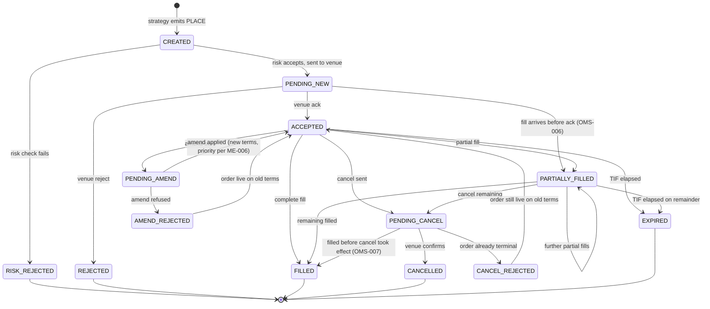
```mermaid
stateDiagram-v2
    [*] --> CREATED: strategy emits PLACE
    CREATED --> RISK_REJECTED: risk check fails
    CREATED --> PENDING_NEW: risk accepts, sent to venue
    PENDING_NEW --> ACCEPTED: venue ack
    PENDING_NEW --> REJECTED: venue reject
    PENDING_NEW --> PARTIALLY_FILLED: fill arrives before ack (OMS-006)
    ACCEPTED --> PARTIALLY_FILLED: partial fill
    ACCEPTED --> FILLED: complete fill
    ACCEPTED --> PENDING_CANCEL: cancel sent
    ACCEPTED --> PENDING_AMEND: amend sent
    ACCEPTED --> EXPIRED: TIF elapsed
    PARTIALLY_FILLED --> PARTIALLY_FILLED: further partial fills
    PARTIALLY_FILLED --> FILLED: remaining filled
    PARTIALLY_FILLED --> PENDING_CANCEL: cancel remaining
    PARTIALLY_FILLED --> EXPIRED: TIF elapsed on remainder
    PENDING_CANCEL --> CANCELLED: venue confirms
    PENDING_CANCEL --> FILLED: filled before cancel took effect (OMS-007)
    PENDING_CANCEL --> CANCEL_REJECTED: order already terminal
    CANCEL_REJECTED --> ACCEPTED: order still live on old terms
    PENDING_AMEND --> ACCEPTED: amend applied (new terms, priority per ME-006)
    PENDING_AMEND --> AMEND_REJECTED: amend refused
    AMEND_REJECTED --> ACCEPTED: order live on old terms
    RISK_REJECTED --> [*]
    REJECTED --> [*]
    FILLED --> [*]
    CANCELLED --> [*]
    EXPIRED --> [*]
```

| Transition | Trigger | Guard | Side effects |
|---|---|---|---|
| CREATED → RISK_REJECTED | Risk check fails | any check in §22.3 fails | `RiskEvent`; counter by reason; no venue traffic |
| CREATED → PENDING_NEW | Risk accepts | limits ok | reserve projected exposure; assign `client_order_id`; send |
| PENDING_NEW → ACCEPTED | Venue ack | `client_order_id` matches | record `ts_ack`; add to open-order view |
| PENDING_NEW → PARTIALLY_FILLED | Fill before ack | fill references known `client_order_id` | book the fill; synthesise implied ack |
| ACCEPTED → PARTIALLY_FILLED | Fill, `qty_filled < qty` | `filled + remaining = qty` maintained | update position, realised/unrealised P&L, avg px |
| ACCEPTED/PARTIAL → FILLED | Cumulative fills = qty | remaining = 0 | terminal; release exposure reservation |
| ACCEPTED → PENDING_CANCEL | Strategy cancels | order live | do not release exposure until confirmed |
| PENDING_CANCEL → FILLED | Fill wins the race | — | **cancel is not honoured**; position updated (OMS-007) |
| PENDING_CANCEL → CANCEL_REJECTED | Order already terminal | — | log; reconcile; do not create a phantom cancel |
| ACCEPTED → PENDING_AMEND | Strategy amends | venue supports amend | — |
| PENDING_AMEND → ACCEPTED | Amend applied | — | update terms; **queue priority per ME-006** |
| any → EXPIRED | TIF elapsed | — | terminal |

**Illegal transitions** (must raise, not mutate): any terminal → non-terminal; FILLED → CANCELLED; RISK_REJECTED → PENDING_NEW; any state → FILLED where `filled_qty ≠ qty`.

### 45.2 Position lifecycle

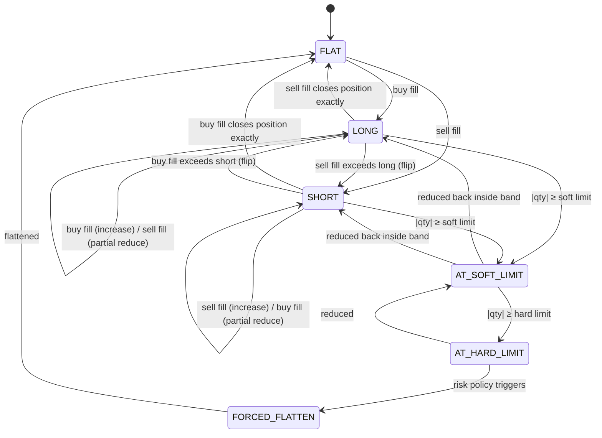
```mermaid
stateDiagram-v2
    [*] --> FLAT
    FLAT --> LONG: buy fill
    FLAT --> SHORT: sell fill
    LONG --> LONG: buy fill (increase) / sell fill (partial reduce)
    LONG --> FLAT: sell fill closes position exactly
    LONG --> SHORT: sell fill exceeds long (flip)
    SHORT --> SHORT: sell fill (increase) / buy fill (partial reduce)
    SHORT --> FLAT: buy fill closes position exactly
    SHORT --> LONG: buy fill exceeds short (flip)
    LONG --> AT_SOFT_LIMIT: |qty| ≥ soft limit
    SHORT --> AT_SOFT_LIMIT: |qty| ≥ soft limit
    AT_SOFT_LIMIT --> LONG: reduced back inside band
    AT_SOFT_LIMIT --> SHORT: reduced back inside band
    AT_SOFT_LIMIT --> AT_HARD_LIMIT: |qty| ≥ hard limit
    AT_HARD_LIMIT --> AT_SOFT_LIMIT: reduced
    AT_HARD_LIMIT --> FORCED_FLATTEN: risk policy triggers
    FORCED_FLATTEN --> FLAT: flattened
```

| State | Strategy behaviour | Risk behaviour |
|---|---|---|
| FLAT | Quote both sides symmetrically | Normal |
| LONG / SHORT | Skew quotes toward flattening (STR-003) | Normal, monitor utilisation |
| AT_SOFT_LIMIT | Quote **only** the flattening side (STR-005) | Warn; utilisation alert |
| AT_HARD_LIMIT | Cannot add to position | **Reject** any order increasing exposure (RSK-002/017) |
| FORCED_FLATTEN | Strategy relinquishes control | Risk-driven flattening **[PROPOSED, P2]** |

### 45.3 Alpha lifecycle

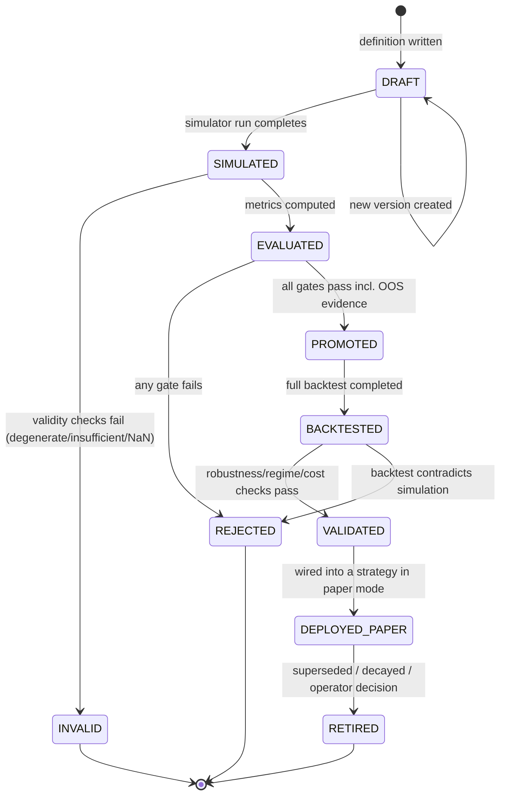
```mermaid
stateDiagram-v2
    [*] --> DRAFT: definition written
    DRAFT --> SIMULATED: simulator run completes
    SIMULATED --> INVALID: validity checks fail (degenerate/insufficient/NaN)
    SIMULATED --> EVALUATED: metrics computed
    EVALUATED --> REJECTED: any gate fails
    EVALUATED --> PROMOTED: all gates pass incl. OOS evidence
    PROMOTED --> BACKTESTED: full backtest completed
    BACKTESTED --> VALIDATED: robustness/regime/cost checks pass
    BACKTESTED --> REJECTED: backtest contradicts simulation
    VALIDATED --> DEPLOYED_PAPER: wired into a strategy in paper mode
    DEPLOYED_PAPER --> RETIRED: superseded / decayed / operator decision
    REJECTED --> [*]
    INVALID --> [*]
    RETIRED --> [*]
    DRAFT --> DRAFT: new version created
```

| Transition | Guard | Recorded |
|---|---|---|
| DRAFT → SIMULATED | Definition registered with horizon, feature set, params | run_id, lineage |
| SIMULATED → INVALID | turnover = 0, variance = 0, sample too small, NaN present | reason |
| SIMULATED → EVALUATED | Simulation valid | full metric set |
| EVALUATED → PROMOTED | G1..G6 all pass **and** metrics computed OOS | gate results + config hash |
| EVALUATED → REJECTED | Any gate fails | which gate, by how much |
| PROMOTED → BACKTESTED | Backtest run completes with leakage suite green | backtest report ref |
| BACKTESTED → REJECTED | Backtest P&L contradicts simulated expectation beyond tolerance | discrepancy analysis |
| BACKTESTED → VALIDATED | Stability, regime, and cost-sensitivity checks pass | evidence refs |
| VALIDATED → DEPLOYED_PAPER | Strategy config + risk limits configured (SEC-000) | deployment audit event |
| any → RETIRED | Operator decision or decay detection | reason |

**Note the branch `BACKTESTED → REJECTED`.** An alpha that looks good in the simplified simulator but fails under realistic execution is a *common and expected outcome*, and the state machine must be able to express it. A pipeline where promotion is irreversible is a pipeline that will eventually deploy something it should not.

### 45.4 Matching-engine command lifecycle

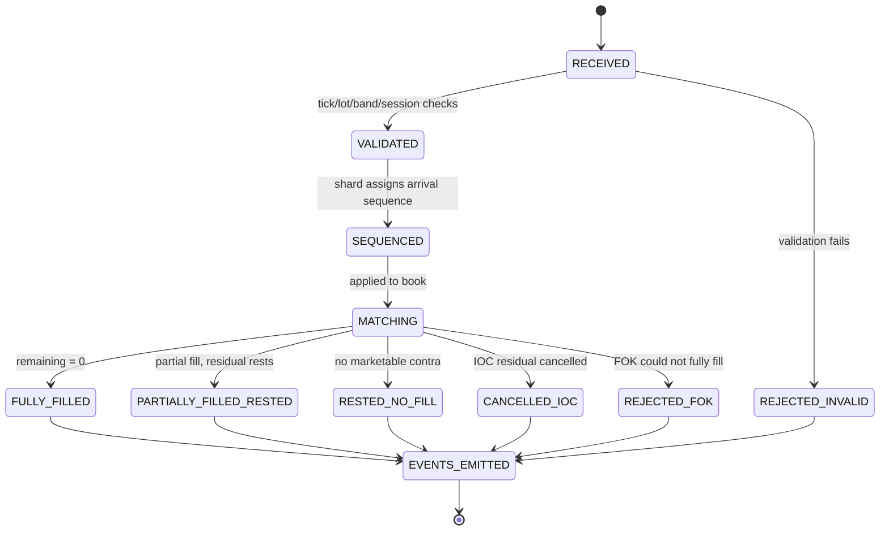
```mermaid
stateDiagram-v2
    [*] --> RECEIVED
    RECEIVED --> VALIDATED: tick/lot/band/session checks
    RECEIVED --> REJECTED_INVALID: validation fails
    VALIDATED --> SEQUENCED: shard assigns arrival sequence
    SEQUENCED --> MATCHING: applied to book
    MATCHING --> FULLY_FILLED: remaining = 0
    MATCHING --> PARTIALLY_FILLED_RESTED: partial fill, residual rests
    MATCHING --> RESTED_NO_FILL: no marketable contra
    MATCHING --> CANCELLED_IOC: IOC residual cancelled
    MATCHING --> REJECTED_FOK: FOK could not fully fill
    FULLY_FILLED --> EVENTS_EMITTED
    PARTIALLY_FILLED_RESTED --> EVENTS_EMITTED
    RESTED_NO_FILL --> EVENTS_EMITTED
    CANCELLED_IOC --> EVENTS_EMITTED
    REJECTED_FOK --> EVENTS_EMITTED
    REJECTED_INVALID --> EVENTS_EMITTED
    EVENTS_EMITTED --> [*]
```

### 45.5 SDR command lifecycle

See §27.6. The critical structural property restated: **`EXTERNALLY_VISIBLE` is reachable only from `COMMITTED`** (invariant FV-P5).

### 45.6 Node lifecycle

```mermaid
stateDiagram-v2
    [*] --> STARTING
    STARTING --> RECOVERING: load snapshot + replay log
    RECOVERING --> FOLLOWER: state caught up to commit index
    FOLLOWER --> CANDIDATE: election timeout / leader suspected (φ > threshold)
    CANDIDATE --> LEADER: majority votes
    CANDIDATE --> FOLLOWER: higher term seen / another leader elected
    LEADER --> FOLLOWER: higher term seen (steps down, rolls back speculative state)
    FOLLOWER --> SUSPECTED: φ above threshold as seen by peers
    SUSPECTED --> FOLLOWER: heartbeats resume, φ decays
    SUSPECTED --> DEAD: no recovery within bound
    LEADER --> DEAD: crash
    FOLLOWER --> DEAD: crash
    DEAD --> STARTING: restart
```

| State | Serves reads? | Accepts commands? | Replicates? |
|---|---|---|---|
| STARTING | No | No | No |
| RECOVERING | **No** (DS-006) | No | Receiving only |
| FOLLOWER | Only via leader | No | Yes |
| CANDIDATE | No | No | No |
| LEADER | Yes | Yes | Yes |
| SUSPECTED | Behaviour unchanged locally — suspicion is a *peer's* view; safety unaffected (FD-004) | | |
| DEAD | No | No | No |

### 45.7 Kill switch and 45.8 circuit breaker

See §22.5.

### 45.9 Backtest lifecycle

```mermaid
stateDiagram-v2
    [*] --> CONFIGURED: alpha, strategy params, period, fill model, costs
    CONFIGURED --> VALIDATING: pre-flight checks
    VALIDATING --> ABORTED: data gaps / alpha not promoted / leakage suite red
    VALIDATING --> RUNNING: checks pass
    RUNNING --> FAILED: runtime error / invariant violation
    RUNNING --> COMPLETED: end of period reached
    COMPLETED --> ANALYSED: metrics + sensitivity computed
    ANALYSED --> REPORTED: report generated with lineage
    REPORTED --> [*]
    ABORTED --> [*]
    FAILED --> [*]
```

---

## 46. Sequence Diagrams

### A. Normal market-data flow

```mermaid
sequenceDiagram
    participant SRC as Data source
    participant FH as Feed Handler
    participant PAR as C++ Parser
    participant LOB as LOB
    participant FE as Feature Engine
    participant AL as Alpha Evaluator
    participant ST as Strategy

    SRC->>FH: raw message
    FH->>FH: validate seq_no, detect gap/dup
    FH->>PAR: raw bytes
    PAR->>PAR: decode → typed MarketEvent
    PAR->>LOB: MarketEvent (ts_exch, seq)
    LOB->>LOB: apply; assert invariants I1..I4
    LOB->>FE: BookDelta
    FE->>FE: incremental update; check warm-up
    FE->>AL: FeatureVector (+availability mask)
    AL->>ST: AlphaValue (or UNAVAILABLE)
    ST->>ST: recompute desired quotes
    Note over FH,ST: every hop timestamped for §44 latency attribution
```

### B. Alpha generation (quant route)

```mermaid
sequenceDiagram
    participant R as Researcher
    participant AL as Alpha Lab
    participant FS as Feature Store
    participant REG as Alpha Registry

    R->>AL: define expression over registered features
    AL->>AL: static check — no negative lag, no full-sample stats (ALG-003)
    AL->>FS: request features for declared period
    FS-->>AL: FeatureVector series (trailing-standardised)
    AL->>AL: evaluate expression → alpha series
    AL->>AL: subtract expected cost (ALG-028)
    AL->>REG: register AlphaDefinition v1 (+ commit, author, horizon)
    REG-->>R: alpha_id@v1, status = DRAFT
```

### C. Alpha evaluation

```mermaid
sequenceDiagram
    participant REG as Alpha Registry
    participant SIM as Alpha Simulator
    participant EV as Quantitative Evaluator
    participant DB as Results DB

    REG->>SIM: alpha_id@v1, period, cost model
    SIM->>SIM: pos_t = clip(α/scale); apply pos_{t-1} to ret_t (SIM-001)
    SIM->>SIM: compute pnl, turnover series
    SIM->>EV: series + metadata
    EV->>EV: validity checks (degenerate? sample size? NaN?)
    alt invalid
        EV->>DB: status = INVALID + reason
    else valid
        EV->>EV: Sharpe, Fitness, Turnover, DD, vol, IC, hit rate
        EV->>EV: cost-sensitivity sweep, stability by sub-period, regime split
        EV->>EV: evaluate gates G1..G6 against gate_config
        EV->>DB: AlphaResult + gate_results + lineage
    end
```

### D. Alpha passing criteria

```mermaid
sequenceDiagram
    participant EV as Evaluator
    participant REG as Registry
    participant BT as Backtester
    participant AU as Audit

    EV->>REG: G1 PASS (Sharpe 1.4) / G2 PASS (Fitness 1.2) / G3 PASS (turnover 22%)
    EV->>REG: G4 PASS (OOS) / G5 PASS (68% subperiods >0) / G6 PASS (Sharpe>0 at 2x cost)
    REG->>REG: status DRAFT → PROMOTED
    REG->>AU: AuditEvent(alpha_promoted, gate_config_hash, actor)
    REG->>BT: schedule full backtest
    Note over REG,BT: values shown are ILLUSTRATIVE placeholders,<br/>not measured results
```

### E. Alpha rejection

```mermaid
sequenceDiagram
    participant EV as Evaluator
    participant REG as Registry
    participant R as Researcher

    EV->>REG: G1 PASS, G2 PASS, G3 FAIL (turnover 84% > 70%)
    REG->>REG: status → REJECTED (retained permanently, SIM-006)
    REG->>R: rejection detail: which gate, margin, full metric set
    R->>R: may create a NEW VERSION (e.g. add hysteresis to reduce turnover)
    Note over R,REG: if the TEST period was already touched,<br/>the revision requires a NEW alpha_id (BT-044)
```

### F. Backtest

```mermaid
sequenceDiagram
    participant BT as Backtest Engine
    participant RP as Event Replayer
    participant LOB as LOB
    participant FE as Features
    participant AL as Alpha
    participant ST as Strategy
    participant RK as Risk
    participant OMS as OMS
    participant FM as Fill Model
    participant PL as P&L

    BT->>RP: start(period, snapshot_id, seed)
    loop each historical event
        RP->>LOB: MarketEvent (in exchange-ts order)
        LOB->>FE: BookDelta
        FE->>AL: FeatureVector
        AL->>ST: AlphaValue
        ST->>ST: compute desired ladder, diff vs open orders
        ST->>RK: OrderAction(s)
        RK-->>ST: ACCEPT / REJECT(reason)
        RK->>OMS: authorised actions
        OMS->>FM: submit with decision latency (BT-003)
        FM->>FM: queue-aware fill evaluation
        FM-->>OMS: ExecutionReport (partial/full/none)
        OMS->>PL: Fill
        PL->>PL: update position, realised/unrealised, fees
    end
    BT->>BT: compute report: P&L, DD, fill rate, realized spread, inventory
    BT->>BT: run under optimistic + pessimistic fill models (BT-011)
```

### G. Paper trade (end-to-end)

```mermaid
sequenceDiagram
    participant FD as Live/replay feed
    participant HOT as Hot path (LOB→FE→Alpha→Strategy)
    participant RK as Risk
    participant OMS as OMS
    participant GW as Gateway
    participant PV as Paper Venue
    participant PL as P&L
    participant OBS as Observability

    FD->>HOT: MarketEvent stream
    HOT->>RK: OrderAction PLACE BID 100.01 x200
    RK->>RK: check chain §22.3
    RK->>OMS: authorised
    OMS->>GW: NewOrder(client_order_id=C-1)
    GW->>PV: submit
    PV->>PV: insert at back of queue; queue_ahead = 500
    PV-->>OMS: ACK (venue latency modelled)
    OMS->>OBS: order accepted; latency recorded
    FD->>PV: trades consume 550 at that level
    PV->>PV: queue_ahead exhausted → fill 50
    PV-->>OMS: PARTIAL FILL 50 @ 100.01 (MAKER)
    OMS->>PL: Fill
    PL->>PL: position +50, avg cost 100.01, fees applied
    PL->>OBS: P&L, inventory, realized spread (measured later at t+h)
```

### H. Order placement / I. Partial fill / J. Full fill

```mermaid
sequenceDiagram
    participant ST as Strategy
    participant RK as Risk
    participant OMS as OMS
    participant V as Venue

    ST->>RK: PLACE BUY 200 @100.01
    RK-->>OMS: ACCEPT
    OMS->>V: NewOrder C-1 (qty 200, remaining 200)
    V-->>OMS: ACK → ACCEPTED
    V-->>OMS: FILL 50  → PARTIALLY_FILLED (filled 50, remaining 150)
    Note over OMS: invariant filled + remaining = qty holds (OMS-002)
    V-->>OMS: FILL 150 → FILLED (filled 200, remaining 0)
    OMS->>OMS: terminal; release exposure reservation
```

### K. Risk rejection

```mermaid
sequenceDiagram
    participant ST as Strategy
    participant RK as Risk
    participant OBS as Observability
    participant OMS as OMS

    ST->>RK: PLACE BUY 2,000,000 @100.01
    RK->>RK: check 5 — max order size (limit 1000)
    RK-->>ST: REJECT(MAX_ORDER_SIZE)
    RK->>OBS: RiskEvent(LIMIT_BREACH, HIGH, reason=MAX_ORDER_SIZE)
    Note over RK,OMS: OMS never sees this order; no venue traffic
    ST->>ST: log, do not retry blindly, count toward self-limit
```

### L. Kill switch

```mermaid
sequenceDiagram
    participant OP as Operator (RBAC operator)
    participant RK as Risk Engine
    participant OMS as OMS
    participant V as Venue
    participant ST as Strategy
    participant AU as Audit

    OP->>RK: TRIP kill switch (JWT + role check)
    RK->>RK: state → TRIPPED   [t0]
    RK->>OMS: block all new submissions   [t1: NFR-008 measures t1 − t0]
    RK->>OMS: cancel all resting orders (if configured)
    OMS->>V: CancelOrder xN
    RK->>ST: risk state = HALTED
    ST->>ST: transition to HALTED, stop quoting
    RK->>AU: AuditEvent(kill_switch_tripped, actor, ts, reason)
    Note over RK,ST: RSK-018 — this path works even if the strategy thread is hung
```

### M. Matching (multi-level sweep)

```mermaid
sequenceDiagram
    participant C as Client/Gateway
    participant ME as Matching Engine (shard leader)
    participant BK as Book
    participant EV as Event stream

    C->>ME: NEW BUY 600 @100.04 GTC
    ME->>ME: validate (tick, lot, band, session)
    ME->>BK: best ask 100.03 [A1:100, A2:150]
    BK-->>ME: crosses
    ME->>EV: TRADE 100.03 x100 (A1)
    ME->>EV: TRADE 100.03 x150 (A2)
    ME->>BK: level 100.03 empty → remove
    ME->>BK: best ask 100.04 [A3:300]
    ME->>EV: TRADE 100.04 x300 (A3)
    ME->>BK: level 100.04 empty → remove
    ME->>BK: next ask 100.05 > limit → stop
    ME->>BK: rest residual 50 as BID @100.04 (back of queue)
    ME->>EV: ACCEPTED + RESTED(50)
    ME-->>C: ExecutionReport: 3 fills, 3 counterparties, 2 levels, 50 resting
```

### N. SDR replication (normal path)

```mermaid
sequenceDiagram
    participant C as Client
    participant L as Leader (N1)
    participant F2 as Follower N2
    participant F3 as Follower N3
    participant LOG as Event Log

    C->>L: MatchingCommand(cmd_id)
    L->>L: assign (term=5, index=42); append SPECULATIVE
    L->>L: apply speculatively → trades held in buffer (NOT visible)
    par replicate
        L->>F2: Replicate(term5, idx42, prev41/term5, cmd)
        L->>F3: Replicate(term5, idx42, prev41/term5, cmd)
    end
    F2->>F2: log-match check ok → persist → ack(42)
    F2-->>L: ack
    Note over F3: slow / lost — not needed for quorum
    L->>L: acks = {self, N2} = 2 ≥ ⌊3/2⌋+1 = 2 → COMMIT idx42
    L->>L: promote speculative → committed
    L->>LOG: append committed events
    L-->>C: ExecutionReport (first external visibility — FV-P5)
    L->>F2: commit_index=42 (piggybacked)
    L->>F3: catch-up replication + commit_index
```

### O. Node failure (follower)

```mermaid
sequenceDiagram
    participant L as Leader
    participant F2 as Follower N2
    participant F3 as Follower N3 (crashes)
    participant FD as phi-accrual detector

    L->>F3: Replicate(idx 43)
    Note over F3: CRASH
    FD->>FD: heartbeat inter-arrival grows → φ rises past threshold
    FD->>L: N3 suspected
    L->>L: continue — quorum {self, N2} = 2 still met
    L->>F2: Replicate(44,45,46...)
    Note over F3: restart
    F3->>F3: STARTING → RECOVERING: load snapshot, replay log
    F3->>L: request entries from last matching index
    L->>F3: backfill 43..46
    F3->>F3: RECOVERING → FOLLOWER (only now may it participate)
    FD->>FD: φ decays → suspicion cleared
```

### P. Rollback

```mermaid
sequenceDiagram
    participant L as Leader (N1, term 5)
    participant F2 as Follower N2
    participant N3 as Node N3 (term 6)

    L->>L: speculative apply idx 47, 48 (uncommitted)
    N3->>L: message with term 6 > 5
    L->>L: step down — must not commit anything further
    L->>L: ROLLBACK: discard speculative buffer for idx > commit_index(46)
    L->>L: restore state = last committed snapshot
    L->>L: DETERMINISTIC REPLAY committed prefix → state at idx 46
    L->>L: assert replayed state == expected checksum (RB-007)
    L->>L: role → FOLLOWER (term 6)
    Note over L: NOTHING from idx 47/48 was ever externally visible (FV-P5)<br/>so no trade needs to be "unwound" downstream
```

### Q. Deterministic replay (recovery)

```mermaid
sequenceDiagram
    participant N as Recovering node
    participant SNAP as Snapshot store
    participant LOG as Event log
    participant CHK as Determinism checker

    N->>SNAP: load latest snapshot (idx 1000, state hash H0)
    N->>LOG: read entries 1001..1500
    loop each entry, in index order
        N->>N: apply(state, command) — pure function (RB-001)
    end
    N->>N: final state hash H1
    N->>CHK: compare H1 against leader's committed state hash
    alt match
        CHK-->>N: OK → become FOLLOWER
    else mismatch
        CHK-->>N: DIVERGENCE — halt node, raise critical alert
        Note over N,CHK: divergence is never "repaired" silently;<br/>it indicates a determinism bug (RB-002..RB-005)
    end
```

### R. Leader failure

```mermaid
sequenceDiagram
    participant C as Client
    participant L1 as Leader N1 (crashes)
    participant N2 as N2
    participant N3 as N3

    C->>L1: command (in flight)
    Note over L1: CRASH before quorum
    N2->>N2: φ(N1) exceeds threshold → election timeout
    N2->>N3: RequestVote(term 6)
    N3-->>N2: vote granted (N2's log is at least as up to date)
    N2->>N2: becomes LEADER term 6
    N2->>N3: heartbeat / replicate
    C->>N2: retry with SAME client_order_id (DS-010)
    N2->>N2: idempotency check — not previously committed → process once
    N2-->>C: ExecutionReport
    Note over C,N2: the client's retry cannot create a duplicate order
```

### S. Network partition

```mermaid
sequenceDiagram
    participant C as Client
    participant N1 as N1 (minority side)
    participant N2 as N2 (majority)
    participant N3 as N3 (majority)

    Note over N1,N3: PARTITION: {N1} | {N2, N3}
    C->>N1: command
    N1->>N1: speculative apply
    N1->>N2: replicate (dropped)
    N1->>N3: replicate (dropped)
    N1->>N1: no quorum → cannot commit → ROLLBACK
    N1-->>C: error / not-leader (must NOT return success)
    N2->>N3: election → N2 leader (term 7)
    C->>N2: retry (same client_order_id)
    N2-->>C: committed
    Note over N1,N3: PARTITION HEALS
    N1->>N2: sees term 7 > 6 → steps down
    N1->>N1: truncate conflicting uncommitted entries; replay from N2's log
    N1->>N1: RECOVERING → FOLLOWER
```

### T. ML inference (recommended off-critical-path design, OPEN-07 option 3)

```mermaid
sequenceDiagram
    participant LOB as LOB
    participant EMB as Embedding worker (separate thread)
    participant MDL as DGT model
    participant CACHE as Shared embedding slot
    participant FE as Feature Engine
    participant ST as Strategy

    LOB->>EMB: book snapshot (at slower cadence, e.g. every N ms)
    EMB->>MDL: graph window
    MDL-->>EMB: embedding z_t (ms-scale latency)
    EMB->>CACHE: atomic store (z_t, ts)
    FE->>CACHE: read latest (lock-free)
    alt fresh within staleness bound
        FE->>ST: FeatureVector including embedding components
    else stale
        FE->>ST: FeatureVector with embedding = UNAVAILABLE (CL-002)
        ST->>ST: proceed without embedding feature — do not halt
    end
    Note over LOB,ST: neural inference never blocks the µs quoting loop
```

### U. SpoofBench abnormal flow

See §34.4.

### V. End-to-end HELIOS loop

```mermaid
sequenceDiagram
    participant DATA as Data / SpoofBench
    participant HOT as Hot path
    participant REG as Alpha Registry
    participant ST as Strategy
    participant RK as Risk
    participant OMS as OMS
    participant VEN as Venue (paper → later cluster)
    participant PL as P&L
    participant RES as Research plane

    REG->>ST: load PROMOTED + VALIDATED alpha
    DATA->>HOT: market events
    HOT->>HOT: parse → LOB → features → alpha
    HOT->>ST: AlphaValue
    ST->>RK: OrderActions (continuous two-sided quotes)
    RK->>OMS: authorised subset
    OMS->>VEN: orders
    VEN-->>OMS: fills (partial, multi-level, multi-counterparty)
    OMS->>PL: position and P&L updates
    PL->>RES: realised performance
    HOT->>RES: event log for DGT training
    RES->>RES: retrain / re-evaluate alphas against gates
    RES->>REG: new AlphaDefinition versions
    Note over VEN: later, the same OMS talks to the SDR cluster<br/>through the identical ExecutionVenue interface
```

---

## 47. Flowcharts (per subsystem)

### 47.1 Complete HELIOS flow

```mermaid
flowchart TD
    A[(Market / Historical DB)] --> B[Market Data Feed]
    B --> C[Low-latency network / NIC]
    C --> D[C++ Parser / Decoder]
    D --> E[LOB]
    E --> F[Quant Feature Engine]
    F --> G{Alpha route}
    G -->|Quant| H1[Quant-designed alpha]
    G -->|ML| H2[DGT → prediction → alpha]
    H1 --> I[Alpha Simulation]
    H2 --> I
    I --> J[Quantitative Evaluation]
    J --> K{Gates: Sharpe>1, Fitness>1,<br/>1%<Turnover<70%, OOS,<br/>stability, cost robustness}
    K -->|Fail| L[(REJECTED — retained)]
    K -->|Pass| M[(PROMOTED)]
    M --> N[Backtest]
    N --> O{Validation: leakage-free,<br/>cost-aware, regime-stable}
    O -->|Fail| L
    O -->|Pass| P[Trading Strategy<br/>continuous two-sided quoting]
    P --> Q[Risk Engine]
    Q -->|Reject| R[(RiskEvent + reason code)]
    Q -->|Accept| S[OMS]
    S --> T[Order Gateway]
    T --> U[Paper / Simulated Execution]
    T -.later.-> V[FT Matching Engine Cluster]
    U --> W[Fills → Positions]
    V --> W
    W --> X[P&L / Performance]
    X --> Y[Feedback into research]
    Y --> G
```

### 47.2 Risk flow

```mermaid
flowchart TD
    A[OrderAction] --> B{Kill switch tripped<br/>or breaker open?}
    B -->|Yes| Z[REJECT HALTED]
    B -->|No| C{Instrument tradable?}
    C -->|No| Z2[REJECT INSTRUMENT_NOT_TRADABLE]
    C -->|Yes| D{Feed healthy, book valid?}
    D -->|No| Z3[REJECT FEED_DEGRADED / BOOK_INVALID]
    D -->|Yes| E{Well-formed: tick, lot, side?}
    E -->|No| Z4[REJECT MALFORMED / TICK / LOT]
    E -->|Yes| F{Size ≤ max order size?}
    F -->|No| Z5[REJECT MAX_ORDER_SIZE]
    F -->|Yes| G{Price within band of<br/>ROBUST reference price?}
    G -->|No| Z6[REJECT PRICE_BAND]
    G -->|Yes| H{Projected position<br/>within limit? RSK-017}
    H -->|No| Z7[REJECT POSITION_LIMIT]
    H -->|Yes| I{Projected exposure ok?}
    I -->|No| Z8[REJECT EXPOSURE_LIMIT]
    I -->|Yes| J{Order rate within window?}
    J -->|No| Z9[REJECT RATE_LIMIT] --> BR[Consider breaker trip]
    J -->|Yes| K{Open-order count ok?}
    K -->|No| Z10[REJECT TOO_MANY_OPEN_ORDERS]
    K -->|Yes| L{Session loss limit ok?}
    L -->|No| Z11[REJECT LOSS_LIMIT] --> BR
    L -->|Yes| M[ACCEPT → OMS]
    Z --> N[(RiskEvent + counter)]
    Z2 --> N
    Z3 --> N
    Z4 --> N
    Z5 --> N
    Z6 --> N
    Z7 --> N
    Z8 --> N
    Z9 --> N
    Z10 --> N
    Z11 --> N
```

### 47.3 SDR flow

```mermaid
flowchart TD
    A[Client command] --> B[Leader assigns term,index]
    B --> C[Append SPECULATIVE to log]
    C --> D[Apply speculatively<br/>results buffered, NOT visible]
    D --> E[Replicate to followers]
    E --> F{Quorum ack<br/>⌊N/2⌋+1?}
    F -->|Yes| G[Advance commit_index]
    G --> H[Promote speculative → committed]
    H --> I[Emit events + execution report<br/>FIRST external visibility]
    F -->|No: timeout / conflict / higher term| J[ROLLBACK<br/>discard idx > commit_index]
    J --> K[Restore last committed state]
    K --> L[Deterministic replay of committed prefix]
    L --> M{Still leader?}
    M -->|Yes| B
    M -->|No| N[Step down → FOLLOWER<br/>forward client to new leader]
```

### 47.4 Failure-recovery flow

```mermaid
flowchart TD
    A[Fault occurs] --> B{Detected by?}
    B -->|phi-accrual| C[Node suspected]
    B -->|Log mismatch| D[Log repair path]
    B -->|Invariant violation| E[Halt component + alert]
    B -->|Reconciliation break| F[RiskEvent + optional kill switch]
    C --> G{Is it the leader?}
    G -->|Yes| H[Election]
    G -->|No| I[Continue if quorum holds]
    H --> J[New leader; old leader rolls back on rejoin]
    D --> K[Backtrack to last matching index → re-replicate]
    I --> L[Failed node restarts → RECOVERING]
    J --> L
    K --> L
    L --> M[Load snapshot + deterministic replay]
    M --> N{State hash matches?}
    N -->|Yes| O[FOLLOWER — normal service]
    N -->|No| P[DIVERGENCE: halt node, critical alert,<br/>never silently repair]
```

### 47.5 CI/CD flow

See §41.1.

### 47.6 Deployment flow

```mermaid
flowchart TD
    A[Merged commit] --> B[Build images tagged by SHA]
    B --> C[Push to registry]
    C --> D[Deploy platform: Postgres, Kafka/RP, Redis, vector store, Prom/Graf]
    D --> E[Deploy cluster node group: engine shards + SDR]
    E --> F[Deploy hot-path pod: Guaranteed QoS, pinned cores]
    F --> G[Deploy research node group: GPU jobs, backtest workers]
    G --> H[Deploy dashboard]
    H --> I[Smoke tests + venue conformance VEN-02]
    I --> J{Green?}
    J -->|No| K[Rollback to previous SHA]
    J -->|Yes| L[Record environment metadata for benchmarks DEP-007]
```

### 47.7 Monitoring flow

```mermaid
flowchart LR
    A[Components] -->|/metrics| B[Prometheus]
    A -->|OTel spans| C[Trace backend]
    A -->|structured logs| D[Log aggregation]
    A -->|audit events| E[(Audit store — separate)]
    B --> F[Grafana dashboards]
    C --> F
    D --> F
    B --> G[Alert rules]
    G --> H{Severity}
    H -->|Critical: breaker, quorum loss,<br/>ledger break, book invariant| I[Page operator + auto-halt where configured]
    H -->|Warning: lag, drift, utilisation| J[Dashboard + notification]
```

### 47.8 Security flow

```mermaid
flowchart TD
    A[Request] --> B{mTLS valid?}
    B -->|No| Z[Reject at transport]
    B -->|Yes| C{JWT valid + not expired?}
    C -->|No| Z2[401]
    C -->|Yes| D{Role permits action? RBAC}
    D -->|No| Z3[403 + audit]
    D -->|Yes| E{Rate limit ok?}
    E -->|No| Z4[429]
    E -->|Yes| F{Input validation passes?}
    F -->|No| Z5[400 + audit]
    F -->|Yes| G[Execute]
    G --> H{Risk-relevant action?}
    H -->|Yes| I[Append to hash-chained audit log]
    H -->|No| J[Operational log only]
```

### 47.9 DGT flow / 47.10 SpoofBench flow

See §33.1 and §34.4.

---

## 48. End-to-End Workflows

### 48.1 Workflow W-1: "From idea to a paper-traded alpha"

| Step | Actor | Action | Artefact | Gate |
|---|---|---|---|---|
| 1 | Researcher | Register hypothesis in `experiments` (DAT-015) | experiment row | — |
| 2 | Researcher | Define features (or reuse) | feature-set version | Causality + parity tests |
| 3 | Researcher | Define alpha expression / train model | `AlphaDefinition` v1 | Static causality check |
| 4 | System | Simulate on TRAIN + VALIDATION | `AlphaResult` | Validity checks |
| 5 | System | Evaluate gates G1–G6 | gate results | All must pass |
| 6 | Researcher | Iterate on validation only (never test) | new versions | Test-access counter unchanged |
| 7 | System | Final confirmation on TEST (≤2 accesses) | `AlphaResult` (OOS) | G4 |
| 8 | Registry | Promote | status = PROMOTED | Audit event |
| 9 | System | Full backtest with queue-aware fill model + costs | backtest report | Leakage suite green |
| 10 | System | Sensitivity: cost sweep, fill-model range, latency sweep | sensitivity report | G6 |
| 11 | Researcher | Validate stability + regimes | validation verdict | G5 |
| 12 | Risk admin (≠ author) | Configure risk limits | versioned limit set | SEC-000 |
| 13 | Systems | Deploy strategy in PAPER mode | deployment audit event | Venue conformance green |
| 14 | Operator | Monitor; kill switch armed | dashboards | — |
| 15 | System | Record live paper P&L vs backtest expectation | comparison report | Divergence triggers review |

### 48.2 Workflow W-2: "Swap the execution venue from paper to the SDR cluster"

| Step | Action | Gate |
|---|---|---|
| 1 | Run the venue conformance suite (VEN-02) against the cluster | Must pass identically to the paper venue |
| 2 | Run deterministic replay + chaos suite against the cluster | All chaos rows green |
| 3 | Confirm TLC gate green for the deployed protocol version | FV-006 |
| 4 | Run in shadow: same order flow to both venues, compare execution reports | Divergences explained |
| 5 | Switch `ExecutionVenue` binding by configuration | No code change (FR-028) |
| 6 | Re-measure latency in configuration (c) (LAT-012) | Report cost of fault tolerance |

### 48.3 Workflow W-3: "Investigate a suspicious result"

| Step | Action |
|---|---|
| 1 | Retrieve lineage: commit, data snapshot, config hash, seed |
| 2 | Re-run; confirm bit-reproducibility (DAT-002) |
| 3 | Run leakage suite against that configuration (BT-031) |
| 4 | Run the noise-alpha and future-peek controls (SIM-014/015) |
| 5 | Check test-set access count for that alpha |
| 6 | Check feature parity test for the feature set used |
| 7 | Inspect fill model and cost assumptions; re-run under pessimistic model |
| 8 | Check for self-feedback contamination (PPR-009) |
| 9 | Record findings in the experiment row regardless of outcome |
---

# PART IX — VERIFICATION, DELIVERY AND RISK

## 49. Testing Strategy

### 49.1 Test catalogue

| # | Test class | Purpose | Input | Expected result | Pass/fail condition |
|---|---|---|---|---|---|
| T-01 | **Unit** | Individual functions correct | Crafted values | Documented output | Assertion holds |
| T-02 | **Property (matching)** | Book invariants under arbitrary command sequences | Randomly generated command streams | ME-P1..P9 hold | Any violation = fail |
| T-03 | **Property (OMS)** | Order state machine legality | Random event sequences incl. races | Only legal transitions; `filled+remaining=qty` | Any illegal transition = fail |
| T-04 | **Property (features)** | Causality and warm-up | Random event streams | No feature reads future data; UNAVAILABLE before warm-up | Any future read = fail |
| T-05 | **Feature parity** | Python vs C++ agreement | Fixed fixture stream | Agreement within tolerance (IFC-29) | Deviation beyond tolerance = fail |
| T-06 | **Leakage suite** | Research pipeline integrity | Noise alpha, future-peek alpha, constant alpha, shuffled labels, shifted features | Noise ≈ 0; future-peek implausibly high; constant INVALID; shuffled ≈ chance; shift degrades | Any inversion = fail |
| T-07 | **Simulator calibration** | Simulator is not fooling itself | SIM-014 / SIM-015 controls | As above | Fail = simulator broken |
| T-08 | **Integration** | Component boundaries | Recorded event stream through the full pipeline | Consistent artefacts at each boundary | Mismatch = fail |
| T-09 | **Venue conformance** | Paper venue ≡ cluster semantics | Shared conformance scenarios (VEN-02) | Identical externally-observable behaviour | Divergence = fail |
| T-10 | **Deterministic replay** | Byte-identical reconstruction | Snapshot + committed log | Identical state hash and event stream | Any difference = fail |
| T-11 | **Chaos** | Fault tolerance in the real deployment | Fault catalogue §32.3 | Invariants hold; recovery within bound | Violation or non-recovery = fail |
| T-12 | **Linearizability check** | DS-002 on the implementation | Recorded client histories from chaos runs | History is linearizable | Non-linearizable = fail |
| T-13 | **TLC model check** | Protocol safety | TLA+ spec + config | FV-P1..P7 hold; broken variant FAILS (FV-008) | Violation = merge blocked |
| T-14 | **Performance / microbenchmark** | Latency per stage | Synthetic and replayed load | Within budget or documented | Regression beyond threshold = fail |
| T-15 | **Load** | Behaviour at saturation | Increasing message rate | Graceful degradation, backpressure, no unbounded queueing | OOM/unbounded growth = fail |
| T-16 | **Security** | AuthN/AuthZ/secret hygiene | Unauthorised requests, secret scan, dependency scan | 401/403; no secrets; no critical CVEs | Any bypass = fail |
| T-17 | **Risk tests** | Every limit blocks what it should | Orders crafted to breach each limit | Correct reason code; nothing reaches OMS | Any leak-through = fail |
| T-18 | **Kill-switch test** | Halt works, including under strategy hang | Trip while strategy thread is stalled (RSK-018) | Zero orders after trip; latency measured | Any post-trip order = fail |
| T-19 | **Strategy tests** | Quoting behaviour | Scripted book scenarios | Two-sided quoting, inventory skew, widening, stand-down | Behavioural assertion fails = fail |
| T-20 | **Backtest validation** | Backtester matches a hand-computed scenario | Small hand-verified scenario | P&L and fills match hand calculation exactly | Mismatch = fail |
| T-21 | **ML tests** | Causal mask, determinism, split integrity | Synthetic sequences | Mask blocks future attention; identical outputs across runs; no split overlap | Any leak = fail |
| T-22 | **Regression** | Previously fixed bugs stay fixed | Bug-specific fixtures | Bug does not recur | Recurrence = fail |
| T-23 | **Reconciliation test** | OMS vs venue divergence detection | Inject an orphan order at the venue | `RECONCILIATION_BREAK` raised | Silent divergence = fail |
| T-24 | **Sanitizers** | Memory/UB/thread safety in C++ | Debug build under ASan/UBSan/TSan | Clean | Any report = fail |

### 49.2 Coverage expectations **[PROPOSED]**

| Component | Expectation |
|---|---|
| Matching engine | Property tests dominant; ≥90% line coverage on the matching core |
| OMS | Full state-machine transition coverage, including illegal transitions |
| Risk engine | 100% of check-chain branches; every reason code exercised |
| Feature engine | Every feature has a causality test and a parity test |
| Alpha pipeline | Leakage suite mandatory; every gate exercised in both directions |
| SDR / replication | TLC for the model + property/replay tests + full chaos matrix |
| Hot path | Microbenchmark per stage; sanitizers nightly |

---

## 50. Failure Matrix

| # | Failure | Detection | Immediate response | Recovery | Data-integrity requirement | Impact | Metric |
|---|---|---|---|---|---|---|---|
| FM-01 | Market-data gap | Sequence check (FR-005) | Mark interval unusable; `FEED_DEGRADED` risk condition | Resume on clean sequence; backfill if source allows | No interpolation; gap recorded | Strategy stands down; evaluation excludes interval | Gap count, gap duration |
| FM-02 | Malformed message | Decoder validation | Drop + count; escalate on rate | Continue | Never partially applied to the book | Minor | Malformed rate |
| FM-03 | Book invariant violation | Invariant assertions (I1–I4) | **Halt processing for that instrument** | Rebuild from snapshot/replay | Corrupt book never feeds features | Instrument offline | Violation count (target 0) |
| FM-04 | Feature warm-up not complete | Warm-up flags | Report `UNAVAILABLE` | Wait for warm-up | No zero/NaN imputation | Delayed quoting | Unavailable rate |
| FM-05 | Alpha model unavailable | Inference error / staleness | `AlphaValue = UNAVAILABLE`; strategy stands down | Reload model; retry | No default score substituted | No quoting | Availability %, staleness |
| FM-06 | Strategy quote thrash | Order-rate metric | Self-limit; then risk rate limit; then breaker | Hysteresis tuning | — | Wasted budget; possible halt | Actions/sec |
| FM-07 | Risk engine internal error | Health check | **Fail closed** — reject all | Restart; reload versioned limits | Never open on error | Trading stops | Error count |
| FM-08 | Risk limit breach | Pre-trade check | Reject with reason code | Strategy adapts | Order never reaches venue | Rejected order | Rejections by code |
| FM-09 | Abnormal order rate | Rolling window | Breaker trips; cancel resting | Cool-down → HALF_OPEN → CLOSED | — | Trading halted | Time-to-trip, leak count |
| FM-10 | Session loss limit breached | P&L monitor | Breaker trips | Manual review before reset | P&L ledger accurate | Trading halted | Drawdown from peak |
| FM-11 | Venue timeout | Gateway timer | Retry with same `client_order_id` | Reconcile after N retries | Idempotency prevents duplicates | Latency spike | Timeout rate |
| FM-12 | Orphan order (venue has it, OMS lost it) | Periodic reconciliation | `RECONCILIATION_BREAK`; optional kill switch | Adopt or cancel the orphan | Position must be correct before resuming | Potential unmanaged exposure | Break count (target 0) |
| FM-13 | Duplicate fill | Fill dedup by `fill_id` | Ignore duplicate | — | Position never double-counted | None if handled | Duplicate count |
| FM-14 | P&L ledger reconciliation break | NFR-024 assertion | **Halt reporting**; critical alert | Investigate before any further reporting | Ledger integrity absolute | Results untrustworthy until resolved | Break count (target 0) |
| FM-15 | Follower crash | phi-accrual | Continue if quorum met | Restart → RECOVERING → catch up | No committed entry lost | Reduced redundancy | Detection latency, catch-up time |
| FM-16 | Leader crash | phi-accrual + election timeout | Election; speculative work rolled back | New leader; old rejoins as follower | No duplicate trade; client retry idempotent | Brief unavailability | Time to new leader |
| FM-17 | Leader stall (SIGSTOP-like) | φ rises | Election proceeds | On resume, old leader sees higher term, steps down, rolls back | **Stalled leader must not commit after step-down** | Brief unavailability | False-suspicion rate |
| FM-18 | Minority partition | Quorum failure | Minority cannot commit; returns not-leader/error | Heal → truncate + catch up | Minority never serves stale state as authoritative | Minority unavailable | Stale-response count (target 0) |
| FM-19 | Symmetric partition (even split) | Quorum failure both sides | Neither commits | Heal → normal | No split-brain | Full unavailability for that shard | Unavailability duration |
| FM-20 | Log divergence | Log-matching check / state-hash mismatch | Repair by backtracking; on hash mismatch **halt the node** | Re-replicate from leader | Never silently repaired | Node offline | Divergence count (target 0) |
| FM-21 | Non-deterministic replay | Determinism harness / hash mismatch | Halt node; fail CI | Fix the non-determinism source (RB-002..005) | Determinism is a hard invariant | Blocks Priority-2 delivery | Harness failures |
| FM-22 | Disk full / fsync failure | I/O error | Node fails cleanly; **no ack without durability** | Clear space; restart; catch up | Never ack unpersisted entries | Node down | Failure type |
| FM-23 | Clock skew | Monitoring | **No safety impact** | NTP correction | Safety independent of clocks | Possible spurious elections | Skew magnitude, election count |
| FM-24 | GPU/training job saturating the cluster | Resource metrics | Resource limits; node-group isolation | Reschedule | — | Latency degradation if isolation fails | Hot-path jitter |
| FM-25 | Cloud noisy neighbour | Jitter metrics | Report honestly; repeat trials | Move instance if possible | — | Latency measurement variance | Jitter distribution |
| FM-26 | Secret leak | Secret scanner | Block merge; rotate | Rotate and audit | — | Security incident | Scanner findings |
| FM-27 | Unauthorised risk-limit change | RBAC + audit | Reject; alert | Review audit chain | Limits versioned and hashed | Integrity of results | Audit anomalies |
| FM-28 | Test-set over-access | Registry counter | Block promotion | New alpha_id required (BT-044) | Multiple-testing discipline | Result credibility | Access count |
| FM-29 | Self-feedback contamination in paper trading | PPR-009 test | Separate feature book from venue book | Fix wiring | Features must see external book only | Fake alpha | Test result |
| FM-30 | Backtest/paper divergence | Comparison report | Investigate before reporting | Reconcile fill model or fix parity | Backtest must describe the deployed system | Result credibility | Divergence magnitude |

---

## 51. Recovery Scenarios

| Scenario | Recovery procedure | Success criterion |
|---|---|---|
| **Node restart** | Load latest snapshot → deterministic replay of log suffix → compare state hash → join as FOLLOWER | Hash matches; no divergence; catch-up within bound |
| **Leader failure** | Election → new leader → clients retry with same `client_order_id` → old leader rejoins, rolls back speculative state | Zero duplicate orders; zero committed-entry loss |
| **Partition heal** | Minority truncates conflicting uncommitted entries → re-replicates from leader → rejoins | No divergence; no stale reads served during partition |
| **Corrupt book** | Halt instrument → rebuild from last valid snapshot + replay → verify invariants → resume | Invariants hold; no trading on corrupt state |
| **Reconciliation break** | Halt new orders → fetch venue open-order snapshot → adopt or cancel orphans → verify position → resume | Position matches venue exactly |
| **Ledger break** | Halt reporting → recompute from fill history → identify discrepancy → fix and re-verify | Reconciliation invariant restored; cause documented |
| **Breaker trip** | Cool-down → HALF_OPEN probe at reduced rate/size → CLOSED if normal | No re-trip during probe |
| **Kill-switch trip** | Operator review → cause documented → limits reviewed → manual re-arm (RBAC + audit) | Documented cause; audit entry |
| **Model failure** | Alpha `UNAVAILABLE` → strategy stands down → reload pinned model version → verify determinism → resume | No trading on stale/absent belief |
| **Data-source outage** | `FEED_DEGRADED` → stand down → mark interval unusable → resume on clean sequence | No evaluation over the degraded interval |

---

## 52. Development Roadmap

### 52.1 Priority-driven sequencing (supersedes the old Sem V→VI→VII systems-first order)

**[CONFIRMED priority: 1. Alpha/Quant → 2. Fault tolerance → 3. Low latency]**

The old plan front-loaded the systems core. That ordering is now **explicitly rejected** where it conflicts (conflict C-2), because it would leave the primary contribution until last — the highest-risk possible sequencing for a project whose main claim is about alpha.

### 52.2 Phases

| Phase | Name | Duration **[PROPOSED]** | Exit criterion |
|---|---|---|---|
| **P-0** | Foundations | ~4 weeks | Data snapshot registered; LOB reconstruction passes property tests; `ExecutionVenue` interface defined |
| **P-1** | Alpha loop MVP | ~10 weeks | End-to-end: data → features → quant alpha → simulator → gates → registry, with leakage suite green |
| **P-2** | Backtest + strategy + risk + OMS + paper venue | ~10 weeks | A promoted alpha runs through continuous two-sided quoting into paper execution with correct P&L |
| **P-3** | ML alpha route (DGT) | ~10 weeks, partly parallel with P-2 | DGT pretrained; transfer + ablations run; DGT alpha evaluated through the same gates |
| **P-4** | Matching engine (single node) | ~6 weeks | Continuous multi-level price-time matching; property tests green; determinism harness green |
| **P-5** | SDR + replication + failure detection | ~10 weeks | 3-node cluster; SDR normal path + rollback/replay; TLA+ spec + TLC gate in CI |
| **P-6** | Chaos + benchmarking | ~6 weeks | Full chaos matrix executed; SDR vs Raft vs Multi-Paxos benchmark reported |
| **P-7** | SpoofBench + risk stress | ~5 weeks | Hawkes simulator validated; manipulation injection; kill-switch stress measured |
| **P-8** | Low-latency work + measurement | ~6 weeks | C++ hot path; pinning/isolation; full latency budget table populated |
| **P-9** | Closed loop + platform hardening | ~5 weeks | Embeddings feeding features (bounded staleness); security, observability, CI gates complete |
| **P-10** | Reproducibility, release, write-up | ~4 weeks | One-command reproduction; benchmark package; thesis + defence |

### 52.3 Dependency graph

```mermaid
flowchart LR
    P0[P-0 Foundations] --> P1[P-1 Alpha loop MVP]
    P0 --> P4[P-4 Matching engine]
    P1 --> P2[P-2 Backtest+Strategy+Risk+OMS+Paper]
    P1 --> P3[P-3 ML alpha / DGT]
    P2 --> P7[P-7 SpoofBench + risk stress]
    P3 --> P7
    P4 --> P5[P-5 SDR + replication]
    P5 --> P6[P-6 Chaos + benchmarks]
    P2 --> P8[P-8 Low latency]
    P4 --> P8
    P3 --> P9[P-9 Closed loop + platform]
    P6 --> P9
    P7 --> P9
    P8 --> P9
    P9 --> P10[P-10 Release]
```

### 52.4 Parallelisation by role

| Role | P-0..P-2 | P-3..P-6 | P-7..P-10 |
|---|---|---|---|
| **Quant researcher** | Features, alpha DSL, simulator, gates, backtester | Strategy policy, validation, DGT-alpha evaluation | Risk-stress analysis, results write-up |
| **Systems engineer** | LOB, `ExecutionVenue`, paper venue, OMS, risk engine | Matching engine, SDR, replication, chaos, TLA+ | Low-latency work, platform, CI |
| **ML engineer** | Data tooling, graph construction | DGT pretraining, transfer, ablations | SpoofBench, closed loop |

**Critical constraint:** the systems engineer's Priority-2 work (P-4/P-5) must not start before P-2 is complete, or the scope guard (§3.3) has failed.

### 52.5 Milestones and acceptance gates

| Milestone | Gate |
|---|---|
| M1 — Book correct | ME property tests + LOB invariants green |
| M2 — Alpha loop live | ≥1 alpha with complete `AlphaResult`; leakage suite green; SIM-014/015 controls pass |
| M3 — First promotion | ≥1 alpha PROMOTED with OOS evidence and full gate record |
| M4 — Paper trading live | Promoted alpha quoting two-sided in paper mode with reconciling P&L |
| M5 — ML alpha evaluated | DGT alpha through the same gates; transfer + ablation tables populated |
| M6 — Engine correct | Continuous multi-level matching + determinism harness green |
| M7 — Cluster correct | SDR 3-node with rollback/replay; TLC gate in CI green |
| M8 — Fault-tolerant | Full chaos matrix executed; linearizability checker green |
| M9 — Benchmarked | SDR vs Raft vs Multi-Paxos reported, incl. rollback rate (SDR-012) |
| M10 — Measured | Latency budget table fully populated with environment metadata |
| M11 — Released | Reproducibility package + honest report incl. negative results |

---

## 53. Minimum Viable System vs Full System

This section exists so the team does not design an impossible project.

| Tier | Contents | If time runs out |
|---|---|---|
| **MVP (must exist or the project has no thesis)** | Data ingest + LOB; feature engine; quant alpha; simulator + gates + registry; leakage suite; backtester with costs and a queue-aware fill model; strategy (two-sided quoting, inventory-aware); risk engine (limits, bands, kill switch, breaker); OMS; paper venue; P&L ledger; basic dashboards; reproducible runs | **Never cut** |
| **Required (the project as scoped)** | ML alpha route (DGT pretraining + downstream alpha through the same gates); DGT transfer + ablations; single-node matching engine; SDR on 3 nodes with rollback/replay; TLA+ spec + TLC gate; core chaos suite; security + CI gates | Cut only with an explicit, documented scope reduction |
| **Recommended (strengthens the result substantially)** | SDR vs Raft vs Multi-Paxos benchmark; full chaos matrix incl. partitions; SpoofBench + risk stress; label-efficiency and few-shot curves; latency instrumentation + budget table | Cut in this order: benchmark comparison last, SpoofBench first |
| **Advanced** | C++ hot path with pinning/isolation and measured jitter; closed-loop embeddings into features; engine admission hints; walk-forward evaluation; linearizability checker | Drop freely |
| **Stretch** | Kernel-bypass experiment on synthetic feed; SDR liveness proof; trace validation of implementation against TLA+ spec; public leaderboard | Drop freely |
| **Future work (documented, not built)** | Live trading; physical colocation; FPGA/Smart-NIC; geo-replication; BFT; multi-agent market simulation; continual learning; cross-asset portfolio construction | Never started |

**Hard rule:** no work in *Advanced* or *Stretch* begins until *MVP* is complete and *Required* is underway. **[PROPOSED, enforced by the scope guard §3.3.]**

---

## 54. Acceptance Criteria

### 54.1 Per subsystem

| Subsystem | Acceptance criteria (all must hold) |
|---|---|
| **Data / LOB** | Book reconstructed from a full instrument-day with zero invariant violations; gaps detected and reported, never interpolated; deterministic re-derivation of state at arbitrary *t* |
| **Feature engine** | Every feature has a causality test and a Python/C++ parity test, both green; warm-up handled as `UNAVAILABLE`; no full-sample statistics anywhere |
| **Alpha (quant)** | ≥1 alpha with a complete `AlphaResult`; simulator calibration pair (SIM-014/015) passes; gates evaluated automatically; rejected alphas retained |
| **Alpha (ML)** | DGT pretrained without touching validation/test; causal mask unit test green; downstream alpha evaluated through the **same** gates; probe accuracy reported as a diagnostic only |
| **Alpha promotion** | ≥1 alpha PROMOTED with OOS evidence, gate config hash recorded, test-access count ≤ 2, baseline comparison present |
| **Backtest** | Leakage suite green; costs applied; queue-aware fill model default with optimistic/pessimistic range reported; hand-verified scenario matches exactly; decision latency enforced |
| **Strategy** | Quotes two-sided under normal conditions; inventory skew demonstrably reduces |position| drift; widens under stress; stands down on stale alpha/degraded feed; fill rate, realized spread, and inventory distribution reported |
| **Risk** | 100% of injected unsafe orders blocked with correct reason codes; zero orders submitted after a kill-switch trip; kill-switch latency measured; breaker trip/cool-down/reset demonstrated; risk works with the strategy thread hung |
| **OMS** | Full state-machine coverage including illegal transitions and races; `filled + remaining = qty` invariant holds under property testing; reconciliation detects an injected orphan |
| **Paper venue** | Passes the same conformance suite as the cluster; models queue position; produces partial and multi-level fills; `is_simulated` flag present in every derived artefact; no self-feedback contamination (PPR-009 test green) |
| **P&L** | Reconciliation invariant holds at every checkpoint; realised/unrealised/fees separated; attribution by strategy/alpha/instrument works |
| **Matching engine** | ME-P1..P9 property tests green over ≥10⁵ generated command sequences; worked examples in §25.6 reproduce exactly; determinism harness green |
| **SDR** | Normal path commits on quorum; speculative results never externally visible (verified in TLC **and** in an implementation test); rollback restores exact committed state; deterministic replay byte-identical; rollback rate and cost measured |
| **Replication** | Tolerates ⌊(N−1)/2⌋ failures; followers persist before ack; log repair works; replication lag exported |
| **Failure detection** | φ exported per node; detection latency and false-positive rate measured under injected delay and compared against a fixed-timeout baseline |
| **Formal verification** | TLC checks FV-P1..P7 with recorded state counts; broken-variant check (FV-008) fails as expected; gate blocks merge; scope limits stated in every artefact |
| **Chaos** | Every row of §32.3 executed with recorded evidence; all correctness conditions held; linearizability checker green on recorded histories |
| **SpoofBench** | Stylised-fact validation reported; difficulty levels implemented; ground-truth labels exact; ROC-AUC + latency-to-detect reported with base rate; trivial baseline detector included; kill-switch stress produces zero post-trip leaks |
| **Low latency** | Latency budget table fully populated with measured p50/p95/p99 and jitter; environment recorded; measurement overhead characterised; latency reported in the three configurations of LAT-012 |
| **Platform** | mTLS + JWT + RBAC enforced; secrets scanned; audit chain verifiable; dashboards cover all six domains; CI gates operative |
| **Reproducibility** | One documented command reproduces any reported result from pinned commit/data/seed |

### 54.2 Project-level acceptance

The project is complete when:
1. Every MVP-tier item is delivered and its acceptance criteria hold.
2. Every reported number in every artefact is traceable to an executed run (NFR-071/073).
3. Every prohibited claim (§0.2) is absent from every artefact (NFR-074).
4. Every open decision in §9.3 is either resolved and recorded, or explicitly documented as unresolved with its consequence.
5. Negative results, if any, are reported with the same prominence as positive ones.

---

## 55. Evaluation Methodology

| Area | Metric | Comparison / split | Output | Status |
|---|---|---|---|---|
| Alpha quality | Sharpe, Fitness, Turnover | Train / validation / test; vs trivial baseline | Gate table per alpha | `TBD-MEASURE` |
| Alpha robustness | Cost-sensitivity curve, sub-period stability, regime breakdown | Cost multipliers; per-week; vol/spread regimes | Robustness report | `TBD-MEASURE` |
| Alpha predictive content | IC, IC-IR, hit rate | Time-series (single instrument); cross-sectional only if ≥5 instruments | Diagnostic table | `TBD-MEASURE` |
| Strategy execution | Fill rate, realized spread, inventory distribution, quote uptime | Rule-based baseline vs alpha-driven quoting | Execution report | `TBD-MEASURE` |
| P&L | Gross, net, drawdown, volatility, risk-adjusted return | Per fill model (optimistic/queue-aware/pessimistic) | Backtest + paper reports, reported separately | `TBD-MEASURE` |
| Risk | Rejection rate by reason; kill-switch latency; leak count | Normal vs SpoofBench-injected abnormal flow | Risk report | `TBD-MEASURE` |
| Matching correctness | Property-test pass rate; invariant violations | Randomised command sequences | Test report | `TBD-MEASURE` |
| Protocol safety | TLC invariant results; state count | Bounded configs (N=3, N=5) | Verification artefact | `TBD-MEASURE` |
| Replication performance | Commit latency p50/p95/p99, throughput, rollback rate, recovery time | **SDR vs Raft vs Multi-Paxos**, identical harness | Benchmark report | `TBD-MEASURE` |
| Fault tolerance | Invariants under each fault; recovery time | Full chaos matrix | Chaos report | `TBD-MEASURE` |
| Failure detection | Detection latency, false-positive rate | phi-accrual vs fixed timeout under injected delay | FD report | `TBD-MEASURE` |
| ML transfer | Linear-probe accuracy / downstream metric | Held-out symbols and regimes; vs DeepLOB/HLOB/TLOB/**LiT** | Transfer table (mean ± std, ≥3 seeds) | `TBD-MEASURE` |
| ML label efficiency | Accuracy vs label fraction | 1/5/10/25/100% | Curve; labels for 90% of ceiling | `TBD-MEASURE` |
| ML few-shot | k-shot probe | k = 10/50/200 | Table | `TBD-MEASURE` |
| ML ablation | Component delta | Graph-ablated / pretext-ablated / MLP baseline | Ablation table with significance | `TBD-MEASURE` |
| **ML as alpha** | Sharpe/Fitness/Turnover of the DGT-derived alpha | Same gates as quant alphas; vs best quant alpha | `AlphaResult` row | `TBD-MEASURE` |
| Manipulation detection | ROC-AUC, precision-recall, latency-to-detect | Per difficulty level, with base rate stated; vs trivial baseline | SpoofBench report | `TBD-MEASURE` |
| Latency | p50/p95/p99 + jitter per stage | Paper / single-node engine / replicated cluster (LAT-012) | Latency budget table | `TBD-MEASURE` |

**Every `TBD-MEASURE` is a placeholder that must be replaced by an executed measurement. No cell in this table may be filled by estimation, extrapolation, or literature values presented as our own.**

---

## 56. Risks and Limitations

### 56.1 Project risks

| ID | Risk | Likelihood | Impact | Mitigation |
|---|---|---|---|---|
| R-01 | **Data unavailable or insufficient** (ASM-01) | Medium | **Critical** — Priority 1 collapses | Resolve OPEN-02 immediately; SpoofBench as fallback with restricted claims |
| R-02 | **No alpha passes the gates** | Medium-High | Medium | This is a *legitimate reportable result* (NFR-072); the pipeline itself is the contribution; report honestly |
| R-03 | **Systems work crowds out quant work** | **High** (historical pattern) | High | Scope guard §3.3; roadmap sequencing §52; explicit constraint that P-4 waits for P-2 |
| R-04 | Backtest optimism (fill model, costs, latency) | High | High | Three fill models; cost sweeps; decision latency; queue-aware default; sensitivity reporting |
| R-05 | Look-ahead / leakage slipping through | Medium | **Critical** — invalidates everything | Leakage suite in CI (BT-031); simulator calibration pair; structural prevention in the alpha DSL |
| R-06 | Multiple-testing / overfitting via repeated alpha search | **High** | High | Registry retains all attempts; test-access counting; pre-registration; baseline comparison |
| R-07 | DGT does not beat LiT | Medium | Low-Medium | Reportable null result; ablations still informative; ML-043 |
| R-08 | SDR does not beat Raft | Medium | Low-Medium | Reportable; SDR-023; the honest positioning (§27.5) makes this survivable |
| R-09 | Cloud jitter makes latency results noisy | **High** | Medium | Report distributions + environment; repeated trials; LAT-011 disclosure |
| R-10 | C++/Rust/Go language sprawl exceeds team capacity | Medium | High | Resolve OPEN-01 early; minimise the number of runtimes; prefer one hot-path language |
| R-11 | Feature parity drift between research and production | Medium | **Critical** — invalidates backtests | IFC-29 parity test as a merge gate |
| R-12 | Non-determinism breaks SDR replay | Medium | High | RB-002..RB-005 discipline; determinism harness in CI |
| R-13 | Formal verification becomes vacuous (spec passes trivially) | Medium | Medium | FV-008 broken-variant check |
| R-14 | Scope inflation from the 60-section requirement list | High | High | MVP/Required/Recommended tiering (§53); explicit cut order |
| R-15 | Unverifiable citations reaching a submission | Low | Medium | OPEN-10 tracked; verified before any submission |
| R-16 | Team bandwidth (part-time, coursework) | **High** | High | MVP tier is deliberately small; parallelisation by role; drop order pre-agreed |

### 56.2 Limitations to state in every write-up

1. Execution is simulated; no live venue, no real capital.
2. Results depend on the fill model and cost assumptions; a range is reported for that reason.
3. Latency is measured in a shared cloud environment, not on colocated bare metal; jitter includes environmental variance.
4. No FPGA, Smart-NIC offload, or kernel-bypass networking is used.
5. Formal verification covers specified safety properties of a bounded model, not the implementation, and not liveness.
6. The fault model is crash-stop/crash-recovery, not Byzantine.
7. Market impact is (per OPEN) either simply modelled or un-modelled and declared; results apply to small order sizes.
8. The instrument universe and period are limited; transfer claims are bounded by that universe.
9. SpoofBench is synthetic; detection results on it do not transfer automatically to real manipulation.
10. Any comparison against published baselines is bounded by whether those baselines were re-run by us under identical conditions (ML-032).

---

## 57. Future Extensions

| Extension | Why deferred | Prerequisite |
|---|---|---|
| Live trading with real capital | Regulatory, financial, and risk exposure far beyond an academic project | Institutional/broker relationship |
| Physical exchange colocation | Not available | Commercial arrangement |
| FPGA / Smart-NIC offload | Hardware unavailable; large engineering cost | Hardware + expertise |
| Kernel-bypass networking on real feeds | Requires venue connectivity and NIC support | Both of the above |
| Geo-replication | No research value at this scale; latency cost is prohibitive for the trading path | — |
| Byzantine fault tolerance | Different threat model; different protocol | New protocol design |
| SDR liveness proof | Safety is the committed scope | TLAPS work; temporal reasoning |
| Trace validation of implementation vs TLA+ spec | Narrows the model-implementation gap, but is substantial extra work | Working spec + instrumented implementation |
| Multi-agent market simulation | Multiple learned policies interacting through the engine | Stable single-agent loop first |
| Continual / online learning | Adds drift, safety, and reproducibility complexity | Offline pipeline proven first |
| Cross-asset / cross-venue portfolio construction | Out of the single-venue scope | Multi-venue data |
| Public SpoofBench leaderboard | Requires stable benchmark + hosting | SpoofBench v1 complete |
| Options / futures microstructure | Different instrument semantics | Equity path complete |
---

# PART X — SELF-AUDIT REPORT

I re-read the document above as a hostile senior architect whose job is to find reasons it would fail in review. Findings are ordered by severity. Each has: **Issue → Why it is a problem → Correction → What it affects**. Where the correction changed the document, the change is already incorporated above and the section is cited; where it could not be resolved without a team decision, it is escalated to the open-decision register (§9.3).

---

### A-01 — The alpha selection thresholds and the strategy horizon are drawn from different worlds ⚠️ **CRITICAL**

**Issue.** `Sharpe > 1`, `Fitness > 1`, `1% < Turnover < 70%` is a coherent, conventional gate set for **daily-horizon, cross-sectional alpha research**. The strategy layer, however, is **HFT-style continuous two-sided quoting**, which operates at sub-second horizons. On a sub-second quoting strategy, "turnover between 1% and 70%" has no natural referent — inventory can turn over many times per minute. "Fitness", as conventionally defined, also embeds a turnover convention. Applying the daily-convention gates unmodified to a microsecond-horizon strategy would produce numbers that look rigorous and mean nothing.

**Why it is a problem.** It is the kind of inconsistency an external examiner finds in five minutes. Worse, it is silently self-fulfilling: whichever convention the implementer happens to pick determines whether the alpha passes, and nobody would notice.

**Correction.** §17.6 introduces **horizon families** (H-MICRO / H-SHORT / H-DAILY); §19.6 defines turnover per decision period of the declared family, requires `horizon_family` and `periods_per_year` on every `AlphaResult` (SIM-005), and forbids comparing alphas across families. §19.4 forces a single formal Fitness definition (SIM-002) before any promotion. The underlying scope question — *which horizon family is HELIOS's primary target?* — is escalated as **OPEN-03** because it is a project decision, not an architecture decision.

**Affects:** scope, architecture, documentation. **Status: mitigated structurally; the scope decision remains open and is the single most urgent quant decision.**

---

### A-02 — IC and cross-sectional metrics assumed without a universe ⚠️ **HIGH**

**Issue.** The source lists "IC/correlation metrics where appropriate" among the evaluation criteria. IC in its usual sense is a *cross-sectional* quantity: the correlation of alpha ranks with forward-return ranks **across instruments** at each time. With one instrument, there is no cross-section, and an "IC" computed anyway is just a time-series correlation wearing a borrowed name.

**Why it is a problem.** Reporting "IC = 0.04" for a single-instrument alpha invites the reviewer to assume a universe that does not exist, and makes the number incomparable to published work.

**Correction.** QNT-008 restricts cross-sectional metrics to universes of ≥5 instruments and requires `N/A` otherwise; §19.3 explicitly distinguishes time-series IC from cross-sectional IC.

**Affects:** documentation, implementation.

---

### A-03 — The feature engine exists twice and nothing forced them to agree ⚠️ **CRITICAL**

**Issue.** Research features are naturally written in Python; the hot path requires C++. Two implementations of the same feature will drift. If they drift, the backtest describes a system that was never deployed, and every P&L claim becomes void — silently, with no error anywhere.

**Why it is a problem.** This is the highest-consequence, lowest-visibility failure in the whole design. It produces results that are internally consistent and externally wrong.

**Correction.** NFR-042 raised to P0; IFC-29 defines a parity contract with tolerances, a versioned fixture set covering edge cases, and **merge-blocking** CI enforcement (§41.2); CPP-009 mirrors it on the C++ side.

**Affects:** architecture, implementation, CI.

---

### A-04 — Speculative execution had no containment invariant ⚠️ **CRITICAL**

**Issue.** The source describes SDR as "apply speculatively, replicate, commit on quorum, roll back on conflict" but does not state what happens to the *results* of a speculative apply in the window before commit. If a speculatively-generated trade escapes — into a market-data event, an execution report, or a downstream consumer — and is then rolled back, the system has reported a trade that never happened. That is worse than any latency problem it solves.

**Why it is a problem.** It is the defining hazard of speculative execution, and it is exactly the property a reviewer familiar with Zyzzyva-style speculative protocols will probe first.

**Correction.** SDR-001 makes containment an explicit P1 requirement; FV-P5 makes it a formal TLA+ invariant (`∀ e ∈ ExternalEvents : e.sourceIndex ≤ commitIndex`); §27.6's state machine makes `EXTERNALLY_VISIBLE` reachable only from `COMMITTED`; §46-P shows the rollback sequence explicitly noting that nothing downstream needs unwinding *because* nothing escaped.

**Affects:** architecture, verification, implementation.

---

### A-05 — Determinism was assumed rather than engineered ⚠️ **HIGH**

**Issue.** Rollback is only safe if replay is deterministic, and the source treats determinism as a property SDR has. In practice it is a property you must actively defend: wall-clock reads inside command application, RNG, hash-map iteration order, uninitialised memory, and floating-point rounding all break it, and all are easy to introduce accidentally.

**Why it is a problem.** A single `now()` call inside the matching path silently makes replay non-deterministic. Nodes then diverge, and the divergence surfaces as a mysterious inconsistency months later.

**Correction.** §30 makes determinism a requirements section: RB-001 (pure function), RB-002 (no clock/RNG/scheduling dependence), RB-003 (leader-assigned timestamps carried in the command, mirrored by SDR-005), RB-004 (no hash-iteration-order dependence), RB-005 (integer prices/sizes, no floating point in matching), RB-007/RB-008 (determinism harness in CI). FM-21 covers the failure. CPP-006 mirrors the integer requirement.

**Affects:** architecture, implementation, CI.

---

### A-06 — Paper trading could contaminate its own signal ⚠️ **HIGH**

**Issue.** In the paper venue, our orders are inserted into a simulated book. If the feature engine reads that same book, it sees our own posted size as market depth. The strategy then computes imbalance partly from its own quotes, reacts to itself, and generates a feedback loop that manufactures apparent alpha out of nothing.

**Why it is a problem.** It produces beautiful, entirely fictitious P&L, and it is very hard to spot from the outside because everything else about the system looks correct.

**Correction.** PPR-009 forbids it; §24.3 requires the *feature book* (external orders only) to be distinguishable from the *venue book* (external + own); FM-29 records the failure mode; W-3 step 8 makes it part of the standard investigation of any suspicious result.

**Affects:** architecture, implementation.

---

### A-07 — Language conflict (C++ vs Go/Rust) was never resolved and cannot be resolved silently ⚠️ **HIGH**

**Issue.** The prior synopsis specifies Go/Rust for the matching engine and the strategy/risk/OMS services. The updated direction specifies C++ for the latency-sensitive path. Those overlap precisely on strategy/risk/OMS. Go in particular introduces GC pauses that would dominate every other latency optimisation, making the Priority-3 objective unattainable on that path.

**Why it is a problem.** Picking silently would misrepresent one of the two source documents; not picking at all leaves the team building the same component twice.

**Correction.** Recorded as conflict C-1 in §1.2, surfaced again in §39.4, and **not silently resolved**. §35.4 proposes a layered split (C++ hot path / Rust or Go control plane / Python research) with explicit justification, and registers it as **OPEN-01** for team ratification. §35.3 documents GC as an unmitigable jitter source, which is the technical substance of the recommendation.

**Affects:** architecture, scope, implementation.

---

### A-08 — The strategy could have been read as one-buy-one-sell ⚠️ **HIGH (already corrected upstream, guarded here)**

**Issue.** Earlier project drafts implied a simplified one-buy-one-sell pairing. The updated source explicitly corrects this, but an SRS that merely repeats "continuous two-sided quoting" without showing the mechanics leaves the door open for an implementer to build the simple thing anyway.

**Correction.** §21.2 gives the full quoting pipeline; §21.4 gives a worked example in which **the alpha is bullish and the strategy leans to sell** because of inventory — a case that is impossible to express in a one-buy-one-sell design and therefore functions as a discriminating test; §21.5 gives the strategy state machine; STR-001/003/005 make two-sided, inventory-aware quoting explicit requirements; §25.6 Example 1 shows one order producing three trades across two levels.

**Affects:** implementation, documentation.

---

### A-09 — Risk engine had no independence enforcement ⚠️ **HIGH**

**Issue.** "Risk is separate from strategy" is easy to state and easy to violate: a shared config object, a `force` flag, an async risk check that returns after the order has already gone out, or simply a code path where the strategy calls the venue directly.

**Correction.** §22.1 enforces independence structurally: `AuthorisedOrder` has no constructor outside the risk engine (so the OMS *cannot* accept an unauthorised order); no override flag exists; risk is not alpha-aware; risk config is separately owned via RBAC and SEC-000 separation of duty. IFC-07 requires the check to be **synchronous and in-line**, explicitly not fire-and-forget. FR-022 requires the bypass test to fail to compile or route. RSK-018 requires the halt path to work even when the strategy is hung, and T-18 tests exactly that.

**Affects:** architecture, implementation, security.

---

### A-10 — Position limits could be evaded by accumulation ⚠️ **HIGH**

**Issue.** A limit check against the *current* position accepts many individually-legal orders that collectively breach the limit if they all fill. This is a standard, widely-repeated bug.

**Correction.** RSK-017 mandates a **projected** position check (`current + open + this`), and §22.4 "Abnormal 2" works through the exact case where the naive check accepts and the projected check correctly rejects.

**Affects:** implementation.

---

### A-11 — "ML works" and "the representation is better" were being allowed to substitute for each other ⚠️ **MEDIUM-HIGH**

**Issue.** The original project judged DGT by cross-symbol linear-probe transfer against LiT. The updated direction says ML output must become a *useful trading alpha*. These are different claims, and a good transfer score does not imply tradeable edge — an encoder can be excellent at reconstructing book states and still yield predictions whose entire edge lies inside the spread.

**Correction.** ML-040 routes the DGT-derived alpha through the **same** simulator and gates as a quant alpha; ML-041 demotes probe accuracy to a diagnostic; ML-043 requires that if transfer improves but the alpha fails the gates, **both** facts are reported. ALG-028 (subtract expected cost before an alpha exists) is what makes the inside-the-spread case visible.

**Affects:** scope, evaluation methodology, documentation.

---

### A-12 — Self-supervised pretraining on the full dataset is still leakage ⚠️ **MEDIUM-HIGH**

**Issue.** It is tempting to pretrain on all available data "because pretraining uses no labels". It leaks the distribution of the evaluation period into the encoder and inflates downstream transfer results.

**Correction.** ML-023 confines pretraining to the training split; BT-022/ALG-021 require time-ordered splits with an embargo ≥ label horizon; T-21 tests split integrity.

**Affects:** implementation, evaluation validity.

---

### A-13 — The gate set had no defence against in-sample promotion or single-window luck ⚠️ **MEDIUM-HIGH**

**Issue.** Sharpe > 1, Fitness > 1, and a turnover band can all be satisfied in-sample by an overfit alpha, or by an alpha that earned everything during one favourable week.

**Correction.** Three **[PROPOSED]** gates added on top of the confirmed three: G4 (metrics must be out-of-sample), G5 (>50% of sub-periods with Sharpe > 0), G6 (Sharpe > 0 at 2× assumed cost). Plus NFR-070 (test-set access counting), SIM-006 (rejected alphas retained), ALG-012 (mandatory trivial baseline), DAT-015 (pre-registration), and BT-044 (touching the test set forces a new `alpha_id`, not a new version). Each added gate is individually disableable — but only as an audited action, so a disabled gate is visible in the record.

**Affects:** scope, evaluation methodology.

---

### A-14 — No test that the simulator itself works ⚠️ **MEDIUM-HIGH**

**Issue.** The whole alpha pipeline rests on the simulator. If its return alignment is off by one step, random alphas will score well and the project will "discover" many alphas that are noise.

**Correction.** SIM-014 (a pure-noise alpha must score ≈ 0) and SIM-015 (a deliberately future-peeking alpha must score implausibly high). Together they bracket the failure: if the first fails, the simulator is leaking; if the second fails, the alignment is inverted. FV-008 is the same idea applied to formal verification, and SPB-010/ALG-012 apply it to benchmarks. These are the cheapest high-value tests in the project.

**Affects:** implementation, evaluation validity.

---

### A-15 — Backtests with zero decision latency ⚠️ **MEDIUM-HIGH**

**Issue.** A backtest in which the strategy observes an event and acts on it at the same timestamp is a strategy with infinite speed. It systematically over-earns, and the effect is largest for exactly the short-horizon microstructure alphas HELIOS is pursuing.

**Correction.** BT-003 mandates a configurable decision latency (default ≥1 event or ≥100 µs); BT-004 prevents orders from interacting with the book before `t + latency`; the sensitivity sweep includes a latency sweep (§20.7).

**Affects:** implementation, result validity.

---

### A-16 — Price bands could be defeated by the manipulation they exist to resist ⚠️ **MEDIUM**

**Issue.** If the price-band reference is the instantaneous mid, a spoofed or layered book moves the mid, which moves the band, which then permits the very orders the band was supposed to block.

**Correction.** §22.4 "Abnormal 4" requires a **robust, slow** reference (e.g. trailing median mid) rather than instantaneous mid; SPB-022 makes verifying this an explicit SpoofBench test.

**Affects:** implementation, risk design.

---

### A-17 — Missing: what happens when the risk engine itself fails ⚠️ **MEDIUM**

**Issue.** The source describes risk checks but not the behaviour when the risk engine is unavailable, its config is missing, or its position feed is stale. A naive implementation would pass orders through.

**Correction.** §13.7 and FM-07 require **fail-closed**: on internal error, missing config, or stale position data, reject everything. §16.4 sets this as the standard error policy for the risk boundary.

**Affects:** architecture, implementation.

---

### A-18 — Missing: OMS restart and orphan handling ⚠️ **MEDIUM**

**Issue.** No coverage of what happens if the OMS restarts while orders are live at the venue, or if the venue holds an order the OMS has no record of.

**Correction.** OMS-009 (durable persistence before internal ack), OMS-010 (rebuild from persistence + venue snapshot before permitting new orders), OMS-008 (periodic reconciliation), FM-12 and T-23 (injected-orphan test), plus the recovery procedure in §51.

**Affects:** architecture, implementation.

---

### A-19 — Missing: risk-state restart hole ⚠️ **MEDIUM**

**Issue.** If risk counters (order-rate windows, session loss, exposure) reset on restart, then restarting the risk engine resets all limit usage to zero — an exploitable hole and, more likely, an accidental one during a demo.

**Correction.** RSK-016 requires risk state to be recoverable from persisted position and counter state.

**Affects:** implementation.

---

### A-20 — Formal verification was at risk of being over-claimed ⚠️ **MEDIUM**

**Issue.** "Verified with TLA+/TLC" invites the reading that the *system* is proven correct. TLC checks a *model*, on *bounded configurations*, for *specified* properties, and says nothing about the implementation, unbounded N, liveness, or performance.

**Correction.** §31.2 states the non-claims in a table; FV-001 requires the scope limits to appear wherever verification is claimed; §31.5 separates model verification, implementation testing, and chaos testing into three non-substitutable activities; NFR-074 puts over-claiming on the prohibited-claims checklist.

**Affects:** documentation, research integrity.

---

### A-21 — Verification could be vacuously true ⚠️ **MEDIUM**

**Issue.** A TLA+ invariant that is misspelled, or whose antecedent is never satisfied in the explored state space, passes trivially. The run looks green and verifies nothing.

**Correction.** FV-008 requires periodically model-checking a **deliberately broken** variant (e.g. commit on a non-majority), which must FAIL. FV-009 requires recording state-space size and coverage so "checked thoroughly" is distinguishable from "checked a tiny corner".

**Affects:** verification methodology.

---

### A-22 — SDR's premise was never scheduled for measurement ⚠️ **MEDIUM**

**Issue.** SDR's justification is that speculation hides replication latency. If rollbacks are frequent, speculation is a net loss. Reporting only commit latency would hide that entirely.

**Correction.** SDR-012 requires measuring rollback rate, rollback cost, and latency with and without speculation. SDR-023 requires reporting the result even if SDR loses. SDR-022 requires stating which Raft/Multi-Paxos implementations were used, and §27.7 notes that benchmarking a hand-written SDR against a mature Raft library measures engineering effort rather than protocol design.

**Affects:** evaluation methodology, research integrity.

---

### A-23 — Quorum arithmetic invited an N=2 deployment ⚠️ **LOW-MEDIUM**

**Issue.** ⌊N/2⌋+1 is stated, but N=2 gives quorum=2 and tolerates **zero** failures — strictly worse availability than a single node, while costing twice as much.

**Correction.** §28 includes an explicit quorum table marking N=2 as never-deploy, and sets N=3 as the proposed default with N=5 for the failure-tolerance demonstration.

**Affects:** deployment, documentation.

---

### A-24 — Failure detection could have been allowed to affect safety ⚠️ **MEDIUM**

**Issue.** An adaptive failure detector produces false positives by design. If any safety property depended on the detector being right, adaptivity would be dangerous rather than helpful.

**Correction.** FD-004 states that failure detection affects **liveness only** — a false positive costs at most an unnecessary election. DS-003 and ASM-09 forbid safety from depending on clocks or delay bounds. FV-007 requires the spec to be checked for this. The clock-skew chaos row (§32.3) asserts it empirically.

**Affects:** architecture, verification.

---

### A-25 — Latency and fault tolerance pull in opposite directions and the document was not saying so ⚠️ **MEDIUM**

**Issue.** Priority 2 (replication, durability) *adds* latency; Priority 3 (low latency) tries to remove it. A document that presents both as achievable without acknowledging the tension is not credible.

**Correction.** §35.5 states the tension explicitly and LAT-012 requires latency to be reported in three configurations (paper venue / single-node engine / replicated cluster), which turns the tension into a measured, publishable result rather than an unexamined contradiction.

**Affects:** documentation, evaluation methodology.

---

### A-26 — Neural inference in a microsecond loop ⚠️ **MEDIUM**

**Issue.** DGT inference is a millisecond-scale operation. Placing it in the quoting loop would make the Priority-3 latency objective unreachable, and the document originally left the placement unspecified.

**Correction.** OPEN-07 registered; §33.9 evaluates three placements and **recommends** the off-critical-path design (asynchronous embedding refresh at a slower cadence, consumed with a staleness bound); §46-T shows the sequence; NFR-004 requires ML latency to be measured separately; CL-002 requires graceful degradation when the embedding is stale.

**Affects:** architecture, scope.

---

### A-27 — Cloud jitter was at risk of being presented as system latency ⚠️ **MEDIUM**

**Issue.** In a shared cloud environment, a meaningful share of observed tail latency is noisy-neighbour variance the system does not control. Presenting p99 without that context implies a control we do not have.

**Correction.** LAT-011 requires explicit disclosure of the shared/virtualised environment in every latency report; LAT-009/DEP-007 require full environment metadata; PERF-003 requires repeated trials with run-to-run variance; CPU-006 requires measuring the effect of each isolation measure rather than assuming it helps. §35.1 draws the reference-vs-actual comparison explicitly.

**Affects:** documentation, research integrity.

---

### A-28 — Accidental colocation / FPGA claims ⚠️ **HIGH (integrity)**

**Issue.** The architecture diagrams begin with "Colocation → NIC → CPU pinning", and a reader skimming them could reasonably conclude that HELIOS is colocated and uses specialised hardware. Both would be false.

**Correction.** §0.2 rules 2 and 3; §35.1's side-by-side reference-vs-actual table; NIC-004; DEP-008; X-02/X-03/X-04; NFR-074's prohibited-claims check before publication; and §56.2's standing limitations list.

**Affects:** documentation, research integrity.

---

### A-29 — Backtest and paper results could be merged into one number ⚠️ **MEDIUM**

**Issue.** They are different experiments with different clocks, different fill semantics, and different latency treatment. Merging them produces a figure that describes nothing.

**Correction.** §5.3 defines all four modes precisely; PPR-020 requires every artefact to declare its mode; PPR-022 forbids merging; W-1 step 15 requires an explicit backtest-versus-paper comparison report, and FM-30 treats divergence as an investigation trigger rather than something to average away.

**Affects:** documentation, evaluation methodology.

---

### A-30 — Transaction costs could be omitted from headline numbers ⚠️ **MEDIUM**

**Issue.** Gross P&L for a high-turnover quoting strategy is close to meaningless; maker/taker economics frequently determine the sign of the result.

**Correction.** QNT-006 (report gross and net), ALG-028 (subtract expected cost before an alpha exists at all), BT-015 (maker/taker fees per fill), BT-016 + SIM-012 (cost-sensitivity sweeps), G6 (must survive 2× cost), and §19.4 Opt-3 (`cost_stress_sharpe` always reported).

**Affects:** evaluation methodology.

---

### A-31 — Missing: what "Fitness" actually means ⚠️ **MEDIUM**

**Issue.** A gate with an undefined metric is not a gate. Two team members would implement it differently and both would believe they were following the spec.

**Correction.** §19.4 lays out three candidate definitions with trade-offs, **recommends** one plus a mandatory companion metric, and registers **OPEN-04**; SIM-002 requires the formula and its constants to live in `alpha_gate_config` and be referenced by hash from every result.

**Affects:** scope, implementation. **Unresolved pending team ratification.**

---

### A-32 — Data availability was an unexamined single point of failure ⚠️ **HIGH**

**Issue.** Everything in Priority 1 depends on obtaining message-level LOB data across enough instruments to support cross-symbol transfer. If that data is not obtained, the primary contribution cannot be produced as designed — and this was buried in an assumption rather than treated as a project risk.

**Correction.** ASM-01 flags it as the highest-impact assumption with a stated fallback (SpoofBench synthetic data, with transfer claims restricted or dropped); OPEN-02 marks it **immediate urgency**; R-01 rates it Medium likelihood / **Critical** impact.

**Affects:** scope, project risk. **Requires action now, not later.**

---

### A-33 — Multiple testing across many alpha candidates ⚠️ **MEDIUM-HIGH**

**Issue.** Alpha research is a search. Evaluating 40 candidates and reporting the best one as "Sharpe 1.3" without disclosing the search size is, statistically, reporting a maximum as if it were a sample.

**Correction.** SIM-006 (all attempts retained), ALG-005 (parameter settings logged including rejected ones), SIM-007 (search-effort summary with a multiple-testing-adjusted view), DAT-015 (pre-registration), NFR-070 (test-access limits), and ALG-012 (mandatory baseline so a headline number is interpretable).

**Affects:** evaluation methodology, research integrity.

---

### A-34 — Components without a single clear owner ⚠️ **MEDIUM**

**Issue.** Several components (feature engine, strategy) legitimately span the quant and systems roles, and shared ownership in a three-person team reliably becomes no ownership.

**Correction.** §13.9 assigns exactly one owner role per component and, importantly, a "must NOT do" column that prevents responsibility creep; NFR-040 makes single ownership a requirement; §52.4 maps roles to phases.

**Affects:** process, documentation.

---

### A-35 — Duplicated components that should not be duplicated ⚠️ **MEDIUM**

**Issue.** Three duplications were latent in the design: (a) the feature engine (research vs production), (b) the order book (LOB reconstructor vs matching engine vs paper venue), (c) the strategy (backtest vs paper).

**Correction.**
(a) Duplication is unavoidable but is now contract-bound by IFC-29.
(b) §25.4 uses **one** book implementation shared by the reconstructor and the engine; the paper venue's book is a deliberate, documented *separate instance* (external-only vs external+own) required by PPR-009 — a distinction, not an accident.
(c) §20.1 requires the backtester to reuse the **same** Strategy/Risk/OMS components as paper trading; only the venue differs. FR-028's shared `ExecutionVenue` contract is what makes that possible.

**Affects:** architecture.

---

### A-36 — Missing: order-cancellation behaviour under races ⚠️ **MEDIUM**

**Issue.** The cancel-after-fill race and the fill-before-ack race are the two most common sources of phantom orders and position drift, and neither was specified.

**Correction.** OMS-006 (out-of-order reports), OMS-007 (cancel-after-fill resolves to `CANCEL_REJECTED_TOO_LATE`, never a phantom cancel), §45.1's explicit `PENDING_CANCEL → FILLED` transition, §25.6 Example 4 showing why the single-writer property makes the outcome unambiguous, and T-03/T-09's conformance coverage of both races.

**Affects:** implementation.

---

### A-37 — Missing: what a "gap" does to evaluation ⚠️ **MEDIUM**

**Issue.** Feed gaps were detected but there was no rule preventing a strategy from trading straight through the gap in a backtest — i.e. acting on a book state that never existed.

**Correction.** §13.1 forbids repair or interpolation; FM-01 marks the interval unusable for evaluation and raises `FEED_DEGRADED`; RSK-015 makes feed degradation a risk condition; STR-009 requires the strategy to stand down.

**Affects:** implementation, result validity.

---

### A-38 — Latency measurement without measuring the measurement ⚠️ **LOW-MEDIUM**

**Issue.** At microsecond granularity, the instrumentation itself is a non-trivial fraction of what is being measured. Uncharacterised, it silently inflates every reported number.

**Correction.** LAT-006 (low-overhead monotonic clock source), LAT-007 and PERF-005 (measure and report measurement overhead), OBS-003 (hot-path tracing must be sampled, non-allocating, and its overhead measured).

**Affects:** measurement validity.

---

### A-39 — Kubernetes would undo CPU pinning ⚠️ **LOW-MEDIUM**

**Issue.** Pinning threads inside a container is ineffective if the orchestrator uses the default CPU manager policy with fractional CPU requests — the kubelet will happily throttle and reschedule the process.

**Correction.** CPU-007 and DEP-001 require the static CPU manager policy, Guaranteed QoS, and integer CPU requests for hot-path pods; DEP-025 forbids autoscaling hot-path and cluster pods; DEP-003 isolates GPU workloads from hot-path nodes.

**Affects:** deployment.

---

### A-40 — The 61-section requirement itself is a scope risk ⚠️ **MEDIUM**

**Issue.** A specification this complete can be read as a commitment to build all of it. For a three-person part-time team over eighteen months, that would guarantee failure — and the failure would most likely land on Priority 1, because systems and infrastructure work is more visible and more immediately satisfying.

**Correction.** §53's six-tier separation (MVP / Required / Recommended / Advanced / Stretch / Future) with an explicit cut order; §3.3's scope guard; §52.4's constraint that Priority-2 implementation (P-4/P-5) must not begin before P-2 is complete; R-03 and R-14 in the risk register. Priorities on every requirement (P0–P4) make the tiering machine-readable rather than aspirational.

**Affects:** scope, process. **This is the audit finding most likely to determine whether the project succeeds.**

---

### Findings against the requested checklist

| # | Checklist item | Finding |
|---|---|---|
| 1 | Contradictions | A-01, A-07, A-25 found and either corrected or escalated |
| 2 | Missing components | A-17, A-18, A-19, A-36, A-37 — all added |
| 3 | Missing interfaces | `ExecutionVenue` (IFC-09), feature parity (IFC-29), embedding staleness (IFC-05/CL-001) added |
| 4 | Incorrect terminology | §5.2's six-term hierarchy added; OBI vs OFI separated (F-05 vs F-07) |
| 5 | Alpha/strategy confusion | A-08; §21.1 table + §21.4 worked counter-example |
| 6 | Strategy/matching confusion | §13.9 "must NOT do" column; STR-010 (no assumed fills) |
| 7 | NIC/C++ confusion | §37.1 division-of-responsibility table |
| 8 | Paper/live confusion | §5.3, PPR-020/021, VEN-01, X-01 |
| 9 | Backtest/replay confusion | §5.3 four-mode table; PPR-023 timing fidelity |
| 10 | Fault tolerance/latency confusion | A-25; §35.5; LAT-012 |
| 11 | Unrealistic assumptions | ASM table with consequences; A-32 |
| 12 | Unsupported claims | §0.2 prohibited-claims list; NFR-074 |
| 13 | Invented results | NFR-073; every result cell reads `TBD-MEASURE` |
| 14 | Data leakage | A-12, BT-020..BT-031, ML-023 |
| 15 | Look-ahead bias | A-15, ALG-003, ALG-011, SIM-001, BT-003 |
| 16 | Unrealistic fills | A-30-adjacent; BT-010..BT-013, PPR-002/005, VEN-03 |
| 17 | Missing transaction costs | A-30 |
| 18 | Missing risk controls | A-09, A-10, A-16, A-17, A-19; RSK-001..018 |
| 19 | Missing failure recovery | §50 failure matrix (30 rows), §51 recovery scenarios |
| 20 | Incorrect quorum logic | A-23; §28 quorum table |
| 21 | Incorrect SDR behaviour | A-04, A-05, A-22; §27 |
| 22 | Incorrect linearizability interpretation | DS-002/003; §31.2/§31.5; T-12 checker on real histories |
| 23 | Incorrect TLA+/TLC claims | A-20, A-21 |
| 24 | Incorrect ML claims | A-11, A-12; ML-032 (baselines re-run vs quoted), ML-036 (multi-seed), ML-038 (ablation significance) |
| 25 | Incorrect cloud/colocation claims | A-27, A-28 |
| 26 | FPGA claims | NIC-004, X-03, §0.2 |
| 27 | Colocation claims | DEP-008, X-02, §35.1, §0.2 |
| 28 | Missing latency measurements | §44.2 budget table with every stage enumerated; LAT-008 |
| 29 | Missing P&L accounting | §24.5 with the full algorithm; PPR-030..034; NFR-024 |
| 30 | Missing order lifecycle states | §45.1 with all states, guards, and illegal transitions |
| 31 | Missing partial-fill behaviour | FR-043, ME-004, BT-013, PPR-003, §25.6 |
| 32 | Missing cancellation behaviour | A-36; ME-005, OMS-007 |
| 33 | Missing abnormal-flow handling | §22.4, §34.4, RSK-006/008, SPB-020..022 |
| 34 | Missing security controls | §42, SEC-000..010, RBAC matrix |
| 35 | Missing observability | §43 with six metric domains |
| 36 | Missing CI/CD gates | §41.2 gate policy table |
| 37 | Missing test coverage | §49 with 24 test classes + coverage expectations |
| 38 | Unimplementable architecture | A-40; §53 tiering; §52 dependency-aware roadmap |
| 39 | Unnecessary duplication | A-35 |
| 40 | Components without owners | A-34; §13.9 |

---

# PART XI — FINAL CONSISTENCY CHECK

Each of the 32 required statements is verified against the document. All must hold simultaneously.

| # | Statement | Holds? | Where |
|---|---|---|---|
| 1 | HELIOS is alpha-driven | ✅ | §1, §1.1, §6.1, §17.1 |
| 2 | Alpha/Quant is the primary focus | ✅ | §1.1, §2.1, §4 (OBJ-01/02 are P0), §12.5, §52.1 |
| 3 | Alpha can be manually designed or ML-generated | ✅ | §18.1 (route A), §18.2 (route B), QNT-004 |
| 4 | Alpha is simulated before selection | ✅ | FR-013, §19.1, §19.5, alpha state machine §45.3 (DRAFT → SIMULATED → EVALUATED → gates) |
| 5 | Sharpe > 1 is a target criterion | ✅ | §19.5 gate G1, FR-014, registry field |
| 6 | Fitness > 1 is a target criterion | ✅ | §19.5 gate G2; definition pinned by SIM-002 / OPEN-04 |
| 7 | 1% < turnover < 70% is a target criterion | ✅ | §19.5 gate G3; horizon semantics in §19.6 |
| 8 | These are selection criteria, not guaranteed results | ✅ | §0.2 rule 6, §4 ("explicit non-objective"), §19.5, §55 (`TBD-MEASURE` everywhere) |
| 9 | Promising alphas are backtested | ✅ | §19.5 (PASS → backtest), §20, §45.3 (PROMOTED → BACKTESTED) |
| 10 | Backtesting produces P&L and risk results | ✅ | FR-017, §20.7 report contents, §24.5 P&L algorithm |
| 11 | Strategy converts alpha into orders | ✅ | §5.2, §21.1, §21.2, FR-020 |
| 12 | Strategy is not the matching engine | ✅ | §13.9 (strategy "must NOT decide fills"), STR-010, §25.1 |
| 13 | Risk is independent from strategy | ✅ | §22.1 (four structural enforcements), FR-022/023, IFC-07, SEC-000, A-09 |
| 14 | OMS manages order lifecycle | ✅ | §23, §45.1, OMS-001..013 |
| 15 | Current execution is paper/simulated | ✅ | §24, PPR-020/021, VEN-01, X-01, §0.2 rule 4 |
| 16 | Fault tolerance is the second priority | ✅ | §1.1, Part V header, §52.2 (P-4/P-5 after P-2), §53 tiering |
| 17 | SDR = speculative execution with deterministic rollback | ✅ | §27.1, §27.2, §27.3, glossary §5.1 |
| 18 | Matching is continuous, multi-level, price-time-priority | ✅ | ME-001/002/003, §25.2, §25.5, §25.6 |
| 19 | Matching supports partial fills and multiple counterparties | ✅ | FR-041/043, ME-004, §25.6 Example 1 (3 trades, 3 counterparties, 2 levels, 1 residual) |
| 20 | TLA+/TLC verify specified safety properties | ✅ | §31.1, FV-P1..P7, FV-003; non-claims explicit in §31.2 |
| 21 | Low latency is the third priority | ✅ | §1.1, Part VII, §52.2 (P-8), §53 (Advanced tier) |
| 22 | Physical exchange colocation is NOT currently available | ✅ | CON-02, X-02, §35.1, §40.1 |
| 23 | We do NOT claim actual exchange colocation | ✅ | §0.2 rule 2, DEP-008, NFR-074, §56.2 item 3 |
| 24 | FPGA hardware is NOT currently implemented | ✅ | §0.2 rule 3, X-03, NIC-004, §37.1, §56.2 item 4 |
| 25 | Low-latency cloud is the practical alternative | ✅ | §35.1, §40.1, §40.2, LAT-011 |
| 26 | C++ is used for latency-sensitive processing | ✅ | §39.1, §39.2, CPP-001..010; conflict C-1 flagged not hidden (§39.4) |
| 27 | NIC and C++ have different responsibilities | ✅ | §37.1 table — NIC moves bytes, C++ interprets meaning |
| 28 | Latency must be measured rather than merely claimed | ✅ | LAT-001, LAT-008, §44.2 (all cells `TBD-MEASURE`), NFR-073 |
| 29 | P50/P95/P99 and jitter are measured | ✅ | LAT-002, NFR-010, §44.1, §44.2, PERF-001 |
| 30 | ML representations can feed strategy/risk and scheduling/admission | ✅ | §34A.1 loop 2, CL-001, CL-003 (advisory only), §6.4 |
| 31 | SpoofBench can stress-test the risk controls | ✅ | FR-068, SPB-007, §34.4 sequence, SPB-020..022 |
| 32 | No empirical result is invented | ✅ | §0.2 rule 1, NFR-073, CON-06, §33.10, §44.2, §55 — every result cell reads `TBD-MEASURE` |

**Result: all 32 statements hold simultaneously. No contradiction remains between the document and the required consistency set.**

### Remaining open items (not contradictions — decisions the team owes)

| ID | Decision | Urgency |
|---|---|---|
| OPEN-02 | Data source (LOBSTER tier / alternative / synthetic-only) | **Immediate** — R-01 is the project's critical risk |
| OPEN-03 | Primary horizon family for alphas (H-MICRO / H-SHORT / H-DAILY) | **Immediate** — determines what the turnover gate means (A-01) |
| OPEN-04 | Formal Fitness definition | Before first promotion (A-31) |
| OPEN-01 | Hot-path language split (C++ / Rust / Go) | Before L3/L4 implementation (A-07) |
| OPEN-05 | Fill-model default and parameters | Before first reported backtest |
| OPEN-07 | Online vs offline DGT placement | Before closed-loop work; recommendation in §33.9 |
| OPEN-06 | Order flow driving matching-engine benchmarks | Before Priority-2 benchmarking |
| OPEN-08 | Event-log technology | Before L5 |
| OPEN-09 | Whether to attempt a kernel-bypass experiment on a synthetic feed | Priority-3 phase |
| OPEN-10 | Citation verification (Aspen author list; spoofing-detection comparison paper) | Before any submission |

---

*End of HELIOS System Design & Software Requirements Specification v1.0.*
*Every requirement in this document carries an ID, priority, and verification method. Every result carries a `TBD-MEASURE` placeholder until an experiment produces it. Every claim about infrastructure the project does not have is marked as such.*
